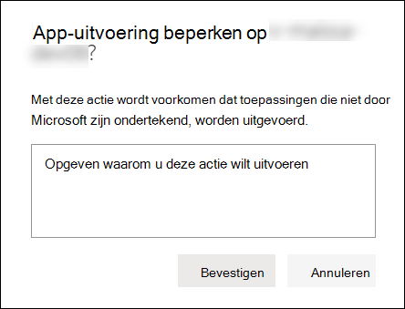
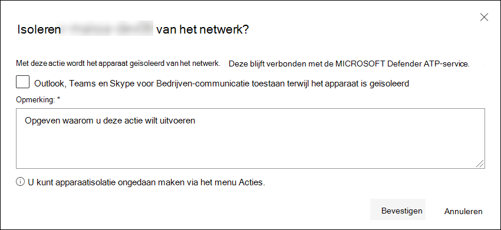

# Acties ondernemen op een apparaatTake response actions on a device

[!INCLUDE [Microsoft 365 Defender rebranding](../../includes/microsoft-defender.md)]

**Van toepassing op:****Applies to:**
- [Microsoft Defender voor EindpuntMicrosoft Defender for Endpoint](https://go.microsoft.com/fwlink/?linkid=2154037)

>Wil je Defender for Endpoint ervaren?Want to experience Defender for Endpoint? [Meld je aan voor een gratis proefperiode.Sign up for a free trial.](https://www.microsoft.com/microsoft-365/windows/microsoft-defender-atp?ocid=docs-wdatp-respondmachine-abovefoldlink) 

Reageer snel op gedetecteerde aanvallen door apparaten te isoleren of een onderzoekspakket te verzamelen.Quickly respond to detected attacks by isolating devices or collecting an investigation package. Nadat u actie hebt ondernomen op apparaten, kunt u de activiteitsgegevens controleren in het actiecentrum.After taking action on devices, you can check activity details on the Action center.

Antwoordacties worden boven aan een specifieke apparaatpagina uitgevoerd en omvatten:Response actions run along the top of a specific device page and include:

- Tags beherenManage tags
- Geautomatiseerd onderzoek startenInitiate Automated Investigation
- Live responssessie startenInitiate Live Response Session
- Onderzoekspakket verzamelenCollect investigation package
- Antivirusscan uitvoerenRun antivirus scan
- Het uitvoeren van apps beperkenRestrict app execution
- Apparaat isolerenIsolate device
- Contact opnemen met een risicodeskundigeConsult a threat expert
- ActiecentrumAction center

 U kunt apparaatpagina's vinden in een van de volgende weergaven:You can find device pages from any of the following views:

- **Dashboard beveiligingsbewerkingen** : selecteer een apparaatnaam op de kaart Apparaten met risico.**Security operations dashboard** - Select a device name from the Devices at risk card.
- **Waarschuwingswachtrij** : selecteer de apparaatnaam naast het apparaatpictogram in de waarschuwingswachtrij.**Alerts queue** - Select the device name beside the device icon from the alerts queue.
- **Lijst met apparaten** : selecteer de kop van de apparaatnaam in de lijst met apparaten.**Devices list** - Select the heading of the device name from the devices list.
- **Zoekvak** - Selecteer Apparaat in het vervolgkeuzemenu en voer de apparaatnaam in.**Search box** - Select Device from the drop-down menu and enter the device name.

>[!IMPORTANT]
> - Deze antwoordacties zijn alleen beschikbaar voor apparaten op Windows 10, versie 1703 of hoger.These response actions are only available for devices on Windows 10, version  1703 or later. 
> - Voor niet-Windows platforms zijn de responsmogelijkheden (zoals apparaatisolatie) afhankelijk van de mogelijkheden van derden.For non-Windows platforms, response capabilities (such as Device isolation) are dependent on the third-party capabilities.

## Tags beherenManage tags

Tags toevoegen of beheren om een logische groepsaffiliatie te maken.Add or manage tags to create a logical group affiliation. Apparaattags ondersteunen de juiste toewijzing van het netwerk, zodat u verschillende tags kunt koppelen om de context vast te leggen en dynamische lijstcreatie in te schakelen als onderdeel van een incident.Device tags support proper mapping of the network, enabling you to attach different tags to capture context and to enable dynamic list creation as part of an incident.

Zie Apparaattags maken en beheren voor meer informatie over [apparaattags.](machine-tags.md)For more information on device tagging, see [Create and manage device tags](machine-tags.md).

## Geautomatiseerd onderzoek startenInitiate Automated Investigation

U kunt indien nodig een nieuw geautomatiseerd onderzoek voor algemeen gebruik op het apparaat starten.You can start a new general purpose automated investigation on the device if needed. Terwijl een onderzoek wordt uitgevoerd, wordt elke andere waarschuwing die van het apparaat wordt gegenereerd, toegevoegd aan een lopend geautomatiseerd onderzoek totdat dat onderzoek is voltooid.While an investigation is running, any other alert generated from the device will be added to an ongoing Automated investigation until that investigation is completed. Bovendien, als dezelfde dreiging wordt gezien op andere apparaten, die apparaten worden toegevoegd aan het onderzoek.In addition, if the same threat is seen on other devices, those devices are added to the investigation.

Zie [Overzicht van geautomatiseerde onderzoeken](automated-investigations.md)voor meer informatie over geautomatiseerde onderzoeken .For more information on automated investigations, see [Overview of Automated investigations](automated-investigations.md).

## Live responssessie startenInitiate Live Response Session

Live response is een mogelijkheid die u onmiddellijk toegang geeft tot een apparaat met behulp van een externe shell-verbinding.Live response is a capability that gives you instantaneous access to a device by using a remote shell connection. Dit geeft u de bevoegdheid om diepgaand onderzoekswerk te doen en onmiddellijk actie te ondernemen om geïdentificeerde bedreigingen onmiddellijk in te dammen - realtime.This gives you the power to do in-depth investigative work and take immediate response actions to promptly contain identified threats — real time.

Live respons is ontworpen om onderzoeken te verbeteren door u in staat te stellen forensische gegevens te verzamelen, scripts uit te voeren, verdachte entiteiten te verzenden voor analyse, bedreigingen te verhelpen en proactief te jagen op opkomende bedreigingen.Live response is designed to enhance investigations by enabling you to collect forensic data, run scripts, send suspicious entities for analysis, remediate threats, and proactively hunt for emerging threats.

Zie Entiteiten onderzoeken op [apparaten die liverespons gebruiken voor](live-response.md)meer informatie over liverespons.For more information on live response, see [Investigate entities on devices using live response](live-response.md).

## Onderzoekspakket van apparaten verzamelenCollect investigation package from devices

Als onderdeel van het onderzoek- of reactieproces kunt u een onderzoekspakket ophalen van een apparaat.As part of the investigation or response process, you can collect an investigation package from a device. Door het onderzoekspakket te verzamelen, kunt u de huidige status van het apparaat identificeren en de tools en technieken die door de aanvaller worden gebruikt verder begrijpen.By collecting the investigation package, you can identify the current state of the device and further understand the tools and techniques used by the attacker.

Om het pakket (Zip-bestand) te downloaden en de gebeurtenissen op een apparaat te onderzoekenTo download the package (Zip file) and investigate the events that occurred on a device

1. Selecteer **Onderzoekspakket verzamelen** in de rij met antwoordacties boven aan de apparaatpagina.Select **Collect investigation package** from the row of response actions at the top of the device page.
2. Geef in het tekstvak op waarom u deze actie wilt uitvoeren.Specify in the text box why you want to perform this action. Selecteer **Bevestigen**.Select **Confirm**.
3. Het zip-bestand wordt gedownloadThe zip file will download

Alternatieve manier:Alternate way:

1. Selecteer **Actiecentrum** in het gedeelte reactieacties van de apparaatpagina.Select **Action center** from the response actions section of the device page.

    

3. Selecteer **pakketverzamelingspakket dat beschikbaar is** om het zip-bestand te downloaden in het actiecentrum fly-out.In the Action center fly-out, select **Package collection package available** to download the zip file.
  
    

Het pakket bevat de volgende mappen:The package contains the following folders:

| mapFolder | OmschrijvingDescription |
|:---|:---------|
|AutorunsAutoruns | Bevat een set bestanden die elk de inhoud van het register van een bekend automatisch startpunt (ASEP) vertegenwoordigen om de persistentie van de aanvaller op het apparaat te identificeren.Contains a set of files that each represent the content of the registry of a known auto start entry point (ASEP) to help identify attacker’s persistency on the device.    
<b>OPMERKING:</b> Als de registersleutel niet wordt gevonden, bevat het bestand het volgende bericht: "FOUT: het systeem kon de opgegeven registersleutel of -waarde niet vinden."<b>NOTE:</b> If the registry key is not found, the file will contain the following message: “ERROR: The system was unable to find the specified registry key or value.”
                                                                                                                                |
|Geïnstalleerde programma'sInstalled programs | Dit .CSV bestand bevat de lijst met geïnstalleerde programma's die kunnen helpen identificeren wat er momenteel op het apparaat is geïnstalleerd.This .CSV file contains the list of installed programs that can help identify what is currently installed on the device. Zie [Win32_Product class](https://go.microsoft.com/fwlink/?linkid=841509)voor meer informatie.For more information, see [Win32_Product class](https://go.microsoft.com/fwlink/?linkid=841509).                                                                                  |
|NetwerkverbindingenNetwork connections | Deze map bevat een set gegevenspunten met betrekking tot de verbindingsinformatie die kunnen helpen bij het identificeren van connectiviteit met verdachte URL's, de C-infrastructuur (Command and Control) van aanvallers (C&C), eventuele zijdelingse verplaatsing of externe verbindingen.This folder contains a set of data points related to the connectivity information which can help in identifying connectivity to suspicious URLs, attacker’s command and control (C&C) infrastructure, any lateral movement, or remote connections.   - ActiveNetConnections.txt : geeft protocolstatistieken en huidige TCP/IP-netwerkverbindingen weer.- ActiveNetConnections.txt – Displays protocol statistics and current TCP/IP network connections. Biedt de mogelijkheid om te zoeken naar verdachte connectiviteit die door een proces is gemaakt.Provides the ability to look for suspicious connectivity made by a process.    - Arp.txt : geeft de huidige ARP-cachetabellen (Address Resolution Protocol) weer voor alle interfaces.- Arp.txt – Displays the current address resolution protocol (ARP) cache tables for all interfaces.    ARP-cache kan extra hosts op een netwerk onthullen die zijn gecompromitteerd of verdachte systemen op het netwerk die mogelijk zijn gebruikt om een interne aanval uit te voeren.ARP cache can reveal additional hosts on a network that have been compromised or suspicious systems on the network that might have been used to run an internal attack.   - DnsCache.txt - Geeft de inhoud weer van de DNS-client resolver-cache, die zowel vermeldingen bevat die vooraf zijn geladen uit het lokale Hosts-bestand als alle recent verkregen bronrecords voor naamquery's die door de computer zijn opgelost.- DnsCache.txt - Displays the contents of the DNS client resolver cache, which includes both entries preloaded from the local Hosts file and any recently obtained resource records for name queries resolved by the computer. Dit kan helpen bij het identificeren van verdachte verbindingen.This can help in identifying suspicious connections.    - IpConfig.txt : geeft de volledige TCP/IP-configuratie voor alle adapters weer.- IpConfig.txt – Displays the full TCP/IP configuration for all adapters. Adapters kunnen fysieke interfaces vertegenwoordigen, zoals geïnstalleerde netwerkadapters of logische interfaces, zoals inbelverbindingen.Adapters can represent physical interfaces, such as installed network adapters, or logical interfaces, such as dial-up connections.    - FirewallExecutionLog.txt en pfirewall.log- FirewallExecutionLog.txt and pfirewall.log                                                                                  |
| Prefetch-bestandenPrefetch files| Windows Prefetch-bestanden zijn ontworpen om het opstartproces van de toepassing te versnellen.Windows Prefetch files are designed to speed up the application startup process. Het kan worden gebruikt om alle bestanden te volgen die onlangs in het systeem zijn gebruikt en sporen te vinden voor toepassingen die mogelijk zijn verwijderd, maar nog steeds te vinden zijn in de prefetch-bestandslijst.It can be used to track all the files recently used in the system and find traces for applications that might have been deleted but can still be found in the prefetch file list.    - Prefetch map – Bevat een kopie van de prefetch bestanden van `%SystemRoot%\Prefetch` .- Prefetch folder –  Contains a copy of the prefetch files from `%SystemRoot%\Prefetch`. OPMERKING: Het wordt aanbevolen om een prefetch-bestandsviewer te downloaden om de prefetch-bestanden te bekijken.NOTE: It is suggested to download a prefetch file viewer to view the prefetch files.    - PrefetchFilesList.txt - Bevat de lijst met alle gekopieerde bestanden die kunnen worden gebruikt om bij te houden of er kopieerfouten zijn opgetreden in de prefetch-map.- PrefetchFilesList.txt – Contains the list of all the copied files which can be used to track if there were any copy failures to the prefetch folder.                                                                                                      |
| ProcessenProcesses| Bevat een .CSV bestand met de actieve processen, dat de mogelijkheid biedt om de huidige processen te identificeren die op het apparaat worden uitgevoerd.Contains a .CSV file listing the running processes, which provides the ability to identify current processes running on the device. Dit kan handig zijn bij het identificeren van een verdacht proces en de status ervan.This can be useful when identifying a suspicious process and its state.                                                                                                                                                                                                       |
| Geplande takenScheduled tasks| Bevat een .CSV bestand met de geplande taken, dat kan worden gebruikt om routines te identificeren die automatisch worden uitgevoerd op een gekozen apparaat om te zoeken naar verdachte code die is ingesteld om automatisch te worden uitgevoerd.Contains a .CSV file listing the scheduled tasks, which can be used to identify routines performed automatically on a chosen device to look for suspicious code which was set to run automatically.                                                                                                                                                                                                      |
| Logboek van beveiligingsgebeurtenissenSecurity event log| Bevat het logboek met beveiligingsgebeurtenissen, dat records bevat van aanmeldings- of afmeldactiviteiten of andere beveiligingsgerelateerde gebeurtenissen die zijn opgegeven in het controlebeleid van het systeem.Contains the security event log, which contains records of login or logout activity, or other security-related events specified by the system's audit policy.   
<b>OPMERKING:</b> Open het gebeurtenislogboekbestand met logboek.<b>NOTE:</b> Open the event log file using Event viewer.
                                                                                    |
| ServicesServices| Bevat een .CSV bestand met services en hun statussen.Contains a .CSV file that lists services and their states.                                                                                      |
| Windows SMB-sessies (Server Message Block)Windows Server Message Block (SMB) sessions | Hier worden gedeelde toegang tot bestanden, printers en seriële poorten en diverse communicatie tussen knooppunten in een netwerk weergegeven.Lists shared access to files, printers, and serial ports and miscellaneous communications between nodes on a network. Dit kan helpen bij het identificeren van gegevensexfiltratie of zijdelingse beweging.This can help identify data exfiltration or lateral movement.    Bevat bestanden voor SMBInboundSessions en SMBOutboundSession.Contains files for SMBInboundSessions and SMBOutboundSession.    
<b>OPMERKING:</b> Als er geen sessies zijn (inkomend of uitgaand), krijgt u een tekstbestand waarin staat dat er geen SMB-sessies zijn gevonden.<b>NOTE:</b> If there are no sessions (inbound or outbound), you'll get a text file which tell you that there are no SMB sessions found.
                                                                                                                          |
| SysteeminformatieSystem Information| Bevat een SystemInformation.txt bestand met systeeminformatie zoals de versie van het besturingssysteem en netwerkkaarten.Contains a SystemInformation.txt file which lists system information such as OS version and network cards.                                                                                     |
| Tijdelijke mappenTemp Directories| Bevat een set tekstbestanden met de bestanden in %Temp% voor elke gebruiker in het systeem.Contains a set of text files that lists the files located in %Temp% for every user in the system.    Dit kan helpen om verdachte bestanden bij te houden die een aanvaller mogelijk op het systeem heeft laten vallen.This can help to track suspicious files that an attacker may have dropped on the system.    
<b>OPMERKING:</b> Als het bestand het volgende bericht bevat: "Het systeem kan het opgegeven pad niet vinden", betekent dit dat er geen tijdelijke map voor deze gebruiker is en mogelijk omdat de gebruiker zich niet heeft aanmelden bij het systeem.<b>NOTE:</b> If the file contains the following message: “The system cannot find the path specified”, it means that there is no temp directory for this user, and might be because the user didn’t log in to the system.
                                                                                                                                         |
| Gebruikers en groepenUsers and Groups| Hier vindt u een lijst met bestanden die elk een groep en de leden vertegenwoordigen.Provides a list of files that each represent a group and its members.                                                                                                                   |
|WdSupportLogsWdSupportLogs| Biedt de MpCmdRunLog.txt en MPSupportFiles.cabProvides the MpCmdRunLog.txt and MPSupportFiles.cab     
<b>OPMERKING:</b> Deze map wordt alleen gemaakt op Windows 10, versie 1709 of hoger met updatepakket van februari 2020 of recenter geïnstalleerd:<b>NOTE:</b> This folder will only be created on Windows 10, version 1709 or later with February 2020 update rollup or more recent installed:  Win10 1709 (RS3) Bouw 16299.1717 : [KB4537816](https://support.microsoft.com/en-us/help/4537816/windows-10-update-kb4537816)Win10 1709 (RS3) Build 16299.1717 : [KB4537816](https://support.microsoft.com/en-us/help/4537816/windows-10-update-kb4537816)   Win10 1803 (RS4) Bouw 17134.1345 : [KB4537795](https://support.microsoft.com/en-us/help/4537795/windows-10-update-kb4537795)Win10 1803 (RS4) Build 17134.1345 : [KB4537795](https://support.microsoft.com/en-us/help/4537795/windows-10-update-kb4537795)   Win10 1809 (RS5) Bouw 17763.1075 : [KB4537818](https://support.microsoft.com/en-us/help/4537818/windows-10-update-kb4537818)Win10 1809 (RS5) Build 17763.1075 : [KB4537818](https://support.microsoft.com/en-us/help/4537818/windows-10-update-kb4537818)   Win10 1903/1909 (19u1/19u2) Bouwt 18362.693 en 18363.693 : [KB4535996](https://support.microsoft.com/en-us/help/4535996/windows-10-update-kb4535996)Win10 1903/1909 (19h1/19h2) Builds 18362.693 and 18363.693 : [KB4535996](https://support.microsoft.com/en-us/help/4535996/windows-10-update-kb4535996) 
                                                                                                                    |
| CollectionSummaryReport.xlsCollectionSummaryReport.xls| Dit bestand is een samenvatting van de verzameling onderzoekspakketten, het bevat de lijst met gegevenspunten, de opdracht die wordt gebruikt om de gegevens te extraheren, de uitvoeringsstatus en de foutcode in geval van een fout.This file is a summary of the investigation package collection, it contains the list of data points, the command used to extract the data, the execution status, and the error code in case of failure. U kunt dit rapport gebruiken om bij te houden of het pakket alle verwachte gegevens bevat en om te bepalen of er fouten zijn opgetreden.You can use this report to track if the package includes all the expected data and identify if there were any errors. |

## Microsoft Defender Antivirus scannen uitvoeren op apparatenRun Microsoft Defender Antivirus scan on devices

Als onderdeel van het onderzoek- of reactieproces kunt u op afstand een antivirusscan starten om malware te identificeren en te verhelpen die mogelijk aanwezig is op een gecompromitteerd apparaat.As part of the investigation or response process, you can remotely initiate an antivirus scan to help identify and remediate malware that might be present on a compromised device.

>[!IMPORTANT]
>- Deze actie is beschikbaar voor apparaten op Windows 10, versie 1709 of hoger.This action is available for devices on Windows 10, version  1709 or later.
>- Een Microsoft Defender Antivirus (Microsoft Defender AV) scan kan naast andere antivirusoplossingen worden uitgevoerd, of Microsoft Defender AV nu de actieve antivirusoplossing is of niet.A Microsoft Defender Antivirus (Microsoft Defender AV) scan can run alongside other antivirus solutions, whether Microsoft Defender AV is the active antivirus solution or not. Microsoft Defender AV kan zich in de passieve modus bevinden.Microsoft Defender AV can be in Passive mode. Zie [compatibiliteit Microsoft Defender Antivirus](https://docs.microsoft.com/windows/security/threat-protection/microsoft-defender-antivirus/microsoft-defender-antivirus-compatibility.md)voor meer informatie.For more information, see [Microsoft Defender Antivirus compatibility](https://docs.microsoft.com/windows/security/threat-protection/microsoft-defender-antivirus/microsoft-defender-antivirus-compatibility.md).

Selecteer **het** scantype dat u wilt uitvoeren (snel of vol) en voeg een opmerking toe voordat u de scan bevestigt.One you have selected **Run antivirus scan**, select the scan type that you'd like to run (quick or full) and add a comment before confirming the scan.

Het actiecentrum toont de scaninformatie en de tijdlijn van het apparaat bevat een nieuwe gebeurtenis, die aangeeft dat er een scanactie op het apparaat is ingediend.The Action center will show the scan information and the device timeline will include a new event, reflecting that a scan action was submitted on the device. Microsoft Defender AV-waarschuwingen geven alle detecties weer die tijdens de scan zijn opgedoken.Microsoft Defender AV alerts will reflect any detections that surfaced during the scan.

>[!NOTE]
>Bij het activeren van een scan met behulp van Defender for Endpoint response action is de Microsoft Defender antivirus 'ScanAvgCPULoadFactor'-waarde nog steeds van toepassing en beperkt de CPU-impact van de scan.When triggering a scan using Defender for Endpoint response action, Microsoft Defender antivirus 'ScanAvgCPULoadFactor' value still applies and limits the CPU impact of the scan.  Als ScanAvgCPULoadFactor niet is geconfigureerd, is de standaardwaarde een limiet van 50% maximale CPU-belasting tijdens een scan.If ScanAvgCPULoadFactor is not configured, the default value is a limit of 50% maximum CPU load during a scan. 
>Zie [configure-advanced-scan-types-microsoft-defender-antivirus](https://docs.microsoft.com/windows/security/threat-protection/microsoft-defender-antivirus/configure-advanced-scan-types-microsoft-defender-antivirus)voor meer informatie.For more information, see [configure-advanced-scan-types-microsoft-defender-antivirus](https://docs.microsoft.com/windows/security/threat-protection/microsoft-defender-antivirus/configure-advanced-scan-types-microsoft-defender-antivirus).

## Het uitvoeren van apps beperkenRestrict app execution

Naast het bevatten van een aanval door het stoppen van schadelijke processen, kunt u ook een apparaat vergrendelen en voorkomen dat latere pogingen van mogelijk schadelijke programma's worden uitgevoerd.In addition to containing an attack by stopping malicious processes, you can also lock down a device and prevent subsequent attempts of potentially malicious programs from running.

>[!IMPORTANT]
> - Deze actie is beschikbaar voor apparaten op Windows 10, versie 1709 of hoger.This action is available for devices on Windows 10, version  1709 or later.
> - Deze functie is beschikbaar als uw organisatie Microsoft Defender Antivirus gebruikt.This feature is available if your organization uses Microsoft Defender Antivirus.
> - Deze actie moet voldoen aan de Windows Defender integriteitsbeleidsindelingen en ondertekeningsvereisten voor toepassingsbeheercode.This action needs to meet the Windows Defender Application Control code integrity policy formats and signing requirements. Zie [Code-integriteitsbeleidsindelingen en ondertekening](https://docs.microsoft.com/windows/device-security/device-guard/requirements-and-deployment-planning-guidelines-for-device-guard#code-integrity-policy-formats-and-signing)voor meer informatie.For more information, see [Code integrity policy formats and signing](https://docs.microsoft.com/windows/device-security/device-guard/requirements-and-deployment-planning-guidelines-for-device-guard#code-integrity-policy-formats-and-signing).

Als u wilt voorkomen dat een toepassing wordt uitgevoerd, wordt een code-integriteitsbeleid toegepast waarmee bestanden alleen kunnen worden uitgevoerd als ze zijn ondertekend door een door Microsoft uitgegeven certificaat.To restrict an application from running, a code integrity policy is applied that only allows files to run if they are signed by a Microsoft issued certificate. Deze methode van beperking kan helpen voorkomen dat een aanvaller gecompromitteerde apparaten bestuurt en verdere kwaadaardige activiteiten uitvoert.This method of restriction can help prevent an attacker from controlling compromised devices and performing further malicious activities.

>[!NOTE]
>U kunt de beperking van toepassingen op elk gewenst moment omkeren.You’ll be able to reverse the restriction of applications from running at any time. De knop op de apparaatpagina wordt gewijzigd in **App-beperkingen verwijderen** en vervolgens neemt u dezelfde stappen als het beperken van de uitvoering van apps.The button on the device page will change to say **Remove app restrictions**, and then you take the same steps as restricting app execution.

Zodra u **De uitvoering van de app beperken** op de apparaatpagina hebt geselecteerd, typt u een opmerking en selecteert u **Bevestigen**.Once you have selected **Restrict app execution** on the device page, type a comment and select **Confirm**. Het actiecentrum toont de scaninformatie en de tijdlijn van het apparaat bevat een nieuwe gebeurtenis.The Action center will show the scan information and the device timeline will include a new event.

**Melding over apparaatgebruiker**:**Notification on device user**: 
Wanneer een app is beperkt, wordt de volgende melding weergegeven om de gebruiker te informeren dat een app wordt beperkt tot uitvoeren:When an app is restricted, the following notification is displayed to inform the user that an app is being restricted from running:

## Apparaten isoleren van het netwerkIsolate devices from the network

Afhankelijk van de ernst van de aanval en de gevoeligheid van het apparaat, kunt u het apparaat isoleren van het netwerk.Depending on the severity of the attack and the sensitivity of the device, you might want to isolate the device from the network. Deze actie kan helpen voorkomen dat de aanvaller het gecompromitteerde apparaat bestuurt en verdere activiteiten uitvoert, zoals gegevensexfiltratie en zijdelingse beweging.This action can help prevent the attacker from controlling the compromised device and performing further activities such as data exfiltration and lateral movement.

>[!IMPORTANT]
>- Volledige isolatie is beschikbaar voor apparaten op Windows 10, versie 1703.Full isolation is available for devices on Windows 10, version 1703.
>- Selectieve isolatie is beschikbaar voor apparaten op Windows 10, versie 1709 of hoger.Selective isolation is available for devices on Windows 10, version 1709 or later.
>- Bij het isoleren van een apparaat zijn alleen bepaalde processen en bestemmingen toegestaan.When isolating a device, only certain processes and destinations are allowed. Daarom kunnen apparaten die zich achter een volledige VPN-tunnel bevinden, de Microsoft Defender for Endpoint-cloudservice niet bereiken nadat het apparaat is geïsoleerd.Therefore, devices that are behind a full VPN tunnel won't be able to reach the Microsoft Defender for Endpoint cloud service after the device is isolated. We raden u aan een VPN voor split-tunneling te gebruiken voor Microsoft Defender voor endpoint- en Microsoft Defender Antivirus cloudgebaseerd beveiligingsverkeer.We recommend using a split-tunneling VPN for Microsoft Defender for Endpoint and Microsoft Defender Antivirus cloud-based protection-related traffic.

Met deze functie voor apparaatisolatie wordt het gecompromitteerde apparaat losgekoppeld van het netwerk met behoud van de verbinding met de Defender for Endpoint-service, die het apparaat blijft bewaken.This device isolation feature disconnects the compromised device from the network while retaining connectivity to the Defender for Endpoint service, which continues to monitor the device.

Op Windows 10, versie 1709 of hoger hebt u extra controle over het netwerkisolatieniveau.On Windows 10, version 1709 or later, you'll have additional control over the network isolation level. U kunt er ook voor kiezen om Outlook-, Microsoft Teams- en Skype voor Bedrijven-connectiviteit in te schakelen (ook wel 'Selectieve isolatie' genoemd).You can also choose to enable Outlook, Microsoft Teams, and Skype for Business connectivity (a.k.a 'Selective Isolation').

>[!NOTE]
>U kunt het apparaat op elk gewenst moment opnieuw verbinden met het netwerk.You’ll be able to reconnect the device back to the network at any time. De knop op de apparaatpagina verandert om te zeggen **Loslaten uit isolatie** en vervolgens neemt u dezelfde stappen als het isoleren van het apparaat.The button on the device page will change to say **Release from isolation**, and then you take the same steps as isolating the device.

Zodra u **Apparaat isoleren** op de apparaatpagina hebt geselecteerd, typt u een opmerking en selecteert u **Bevestigen**.Once you have selected **Isolate device** on the device page, type a comment and select **Confirm**. Het actiecentrum toont de scaninformatie en de tijdlijn van het apparaat bevat een nieuwe gebeurtenis.The Action center will show the scan information and the device timeline will include a new event.

>[!NOTE]
>Het apparaat blijft verbonden met de Defender for Endpoint-service, zelfs als het is geïsoleerd van het netwerk.The device will remain connected to the Defender for Endpoint service even if it is isolated from the network. Als u ervoor hebt gekozen om Outlook en Skype voor Bedrijven communicatie in te schakelen, kunt u met de gebruiker communiceren terwijl het apparaat geïsoleerd is.If you've chosen to enable Outlook and Skype for Business communication, then you'll be able to communicate to the user while the device is isolated.

**Melding over apparaatgebruiker**:**Notification on device user**: 
Wanneer een apparaat wordt geïsoleerd, wordt de volgende melding weergegeven om de gebruiker te informeren dat het apparaat wordt geïsoleerd van het netwerk:When a device is being isolated, the following notification is displayed to inform the user that the device is being isolated from the network:

## Contact opnemen met een risicodeskundigeConsult a threat expert

U kunt een Microsoft-bedreigingsexpert raadplegen voor meer inzichten over een mogelijk gecompromitteerd apparaat of reeds gecompromitteerde apparaten.You can consult a Microsoft threat expert for more insights regarding a potentially compromised device or already compromised ones. Microsoft Threat Experts kunnen direct vanuit de Microsoft Defender-beveiligingscentrum worden ingeschakeld voor een tijdige en nauwkeurige reactie.Microsoft Threat Experts can be engaged directly from within the Microsoft Defender Security Center for timely and accurate response. Experts bieden niet alleen inzichten over een mogelijk gecompromitteerd apparaat, maar ook om complexe bedreigingen, gerichte aanvalsmeldingen die u ontvangt of als u meer informatie nodig hebt over de waarschuwingen of een context met bedreigingsinformatie die u op uw portaldashboard ziet, beter te begrijpen.Experts provide insights not just regarding a potentially compromised device, but also to better understand complex threats, targeted attack notifications that you get, or if you need more information about the alerts, or a threat intelligence context that you see on your portal dashboard.

Zie [Een Microsoft Threat Expert raadplegen](https://docs.microsoft.com/microsoft-365/security/defender-endpoint/configure-microsoft-threat-experts#consult-a-microsoft-threat-expert-about-suspicious-cybersecurity-activities-in-your-organization) voor meer informatie.See [Consult a Microsoft Threat Expert](https://docs.microsoft.com/microsoft-365/security/defender-endpoint/configure-microsoft-threat-experts#consult-a-microsoft-threat-expert-about-suspicious-cybersecurity-activities-in-your-organization) for details.

## Activiteitsdetails controleren in ActiecentrumCheck activity details in Action center

Het **actiecentrum** biedt informatie over acties die zijn uitgevoerd op een apparaat of bestand.The **Action center** provides information on actions that were taken on a device or file. U kunt de volgende details bekijken:You’ll be able to view the following details:

- Collectie onderzoekspakketInvestigation package collection
- AntivirusscanAntivirus scan
- App-beperkingApp restriction
- Isolatie van het apparaatDevice isolation

Alle andere gerelateerde details worden ook weergegeven, bijvoorbeeld indieningsdatum/-tijd, verzendende gebruiker en of de actie is geslaagd of mislukt.All other related details are also shown, for example, submission date/time, submitting user, and if the action succeeded or failed.

## Verwant onderwerpRelated topic
- [Acties ondernemen op een bestandTake response actions on a file](respond-file-alerts.md)
- [Onnauwkeurigheid meldenReport inaccuracy](https://docs.microsoft.com/microsoft-365/security/defender-endpoint/tvm-security-recommendation#report-inaccuracy)
