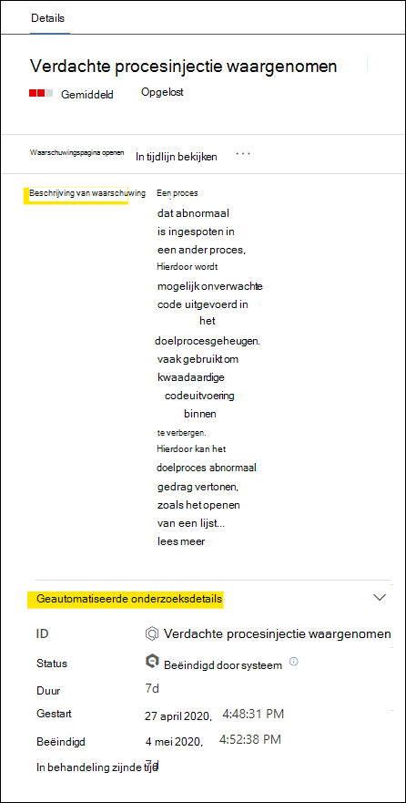
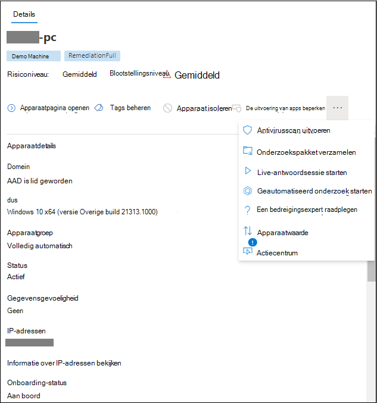

# Waarschuwingen controleren in Microsoft Defender voor EindpuntReview alerts in Microsoft Defender for Endpoint

[!INCLUDE [Microsoft 365 Defender rebranding](../../includes/microsoft-defender.md)]

**Van toepassing op:****Applies to:**
- [Microsoft Defender voor EindpuntMicrosoft Defender for Endpoint](https://go.microsoft.com/fwlink/?linkid=2154037)

>Wilt u Defender voor Eindpunt ervaren?Want to experience Defender for Endpoint? [Meld u aan voor een gratis proefabonnement.Sign up for a free trial.](https://www.microsoft.com/microsoft-365/windows/microsoft-defender-atp?ocid=docs-wdatp-managealerts-abovefoldlink)

De waarschuwingspagina in Microsoft Defender voor Eindpunt biedt volledige context voor de waarschuwing door aanvalssignalen en waarschuwingen met betrekking tot de geselecteerde waarschuwing te combineren om een gedetailleerd waarschuwingsverhaal te maken.The alert page in Microsoft Defender for Endpoint provides full context to the alert, by combining attack signals and alerts related to the selected alert, to construct a detailed alert story.

Maak snel een triage, onderzoek en onderneemt effectieve actie bij waarschuwingen die van invloed zijn op uw organisatie.Quickly triage, investigate, and take effective action on alerts that affect your organization. Begrijp waarom ze zijn geactiveerd en hun impact vanaf één locatie.Understand why they were triggered, and their impact from one location. Meer informatie in dit overzicht.Learn more in this overview.

> [!VIDEO https://www.microsoft.com/videoplayer/embed/RE4yiO5]

## Aan de slag met een waarschuwingGetting started with an alert

Als u de naam van een waarschuwing selecteert in Defender voor Eindpunt, wordt u op de waarschuwingspagina geplaatst.Selecting an alert's name in Defender for Endpoint will land you on its alert page. Op de waarschuwingspagina worden alle gegevens weergegeven in de context van de geselecteerde waarschuwing.On the alert page, all the information will be shown in context of the selected alert. Elke waarschuwingspagina bestaat uit 4 secties:Each alert page consists of 4 sections:

1. **De waarschuwingstitel** toont de naam van de waarschuwing en is er om u eraan te herinneren welke waarschuwing uw huidige onderzoek is gestart, ongeacht wat u op de pagina hebt geselecteerd.**The alert title** shows the alert's name and is there to remind you which alert started your current investigation regardless of what you have selected on the page.
2. [**Getroffen assets**](#review-affected-assets) bevat kaarten van apparaten en gebruikers die door deze waarschuwing worden beïnvloed en die klikbaar zijn voor meer informatie en acties.[**Affected assets**](#review-affected-assets) lists cards of devices and users affected by this alert that are clickable for further information and actions.
3. In **het waarschuwingsverhaal** worden alle entiteiten weergegeven die betrekking hebben op de waarschuwing, verbonden door een boomweergave.The **alert story** displays all entities related to the alert, interconnected by a tree view. De waarschuwing in de titel is de waarschuwing in focus wanneer u voor het eerst op de pagina van de geselecteerde waarschuwing komt.The alert in the title will be the one in focus when you first land on your selected alert's page. Entiteiten in het waarschuwingsverhaal kunnen worden uitgebreid en erop klikken om aanvullende informatie te verstrekken en de reactie te versnellen doordat u acties kunt uitvoeren in de context van de waarschuwingspagina.Entities in the alert story are expandable and clickable, to provide additional information and expedite response by allowing you to take actions right in the context of the alert page. Gebruik het waarschuwingsverhaal om uw onderzoek te starten.Use the alert story to start your investigation. Lees hoe u waarschuwingen [kunt onderzoeken in Microsoft Defender voor Eindpunt.](/microsoft-365/security/defender-endpoint/investigate-alerts)Learn how in [Investigate alerts in Microsoft Defender for Endpoint](/microsoft-365/security/defender-endpoint/investigate-alerts).
4. In **het detailvenster** worden eerst de details van de geselecteerde waarschuwing weergegeven, met details en acties met betrekking tot deze waarschuwing.The **details pane** will show the details of the selected alert at first, with details and actions related to this alert. Als u een van de getroffen activa of entiteiten in het waarschuwingsverhaal selecteert, wordt het detailvenster gewijzigd in contextuele informatie en acties voor het geselecteerde object.If you select any of the affected assets or entities in the alert story, the details pane will change to provide contextual information and actions for the selected object.

Noteer de detectiestatus voor uw waarschuwing.Note the detection status for your alert. 
- Voorkomen: de poging tot verdachte actie is vermeden.Prevented – The attempted suspicious action was avoided. Een bestand is bijvoorbeeld niet op schijf geschreven of uitgevoerd.For example, a file either wasn’t written to disk or executed.

- Geblokkeerd: verdacht gedrag is uitgevoerd en vervolgens geblokkeerd.Blocked – Suspicious behavior was executed and then blocked. Een proces is bijvoorbeeld uitgevoerd, maar omdat het vervolgens verdacht gedrag vertoonde, is het proces beëindigd.For example, a process was executed but because it subsequently exhibited suspicious behaviors, the process was terminated.

- Gedetecteerd: er is een aanval gedetecteerd en is mogelijk nog actief.Detected – An attack was detected and is possibly still active.

U kunt vervolgens ook de geautomatiseerde onderzoeksdetails *bekijken* in het detailvenster van uw waarschuwing, om te zien welke acties al zijn ondernomen en de beschrijving van de waarschuwing voor aanbevolen acties te lezen.You can then also review the *automated investigation details* in your alert's details pane, to see which actions were already taken, as well as reading the alert's description for recommended actions.

Andere informatie die beschikbaar is in het detailvenster wanneer de waarschuwing wordt geopend, omvat MITRE-technieken, bron en aanvullende contextuele details.Other information available in the details pane when the alert opens includes MITRE techniques, source, and additional contextual details.

## Beïnvloede activa controlerenReview affected assets

Als u een apparaat of een gebruikerskaart selecteert in de betreffende activasecties, schakelt u over naar de details van het apparaat of de gebruiker in het detailvenster.Selecting a device or a user card in the affected assets sections will switch to the details of the device or user in the details pane.

- **Voor apparaten** worden in het detailvenster gegevens over het apparaat zelf weergegeven, zoals Domein, Besturingssysteem en IP.**For devices**, the details pane will display information about the device itself, like Domain, Operating System, and IP. Actieve waarschuwingen en de aangemelde gebruikers op dat apparaat zijn ook beschikbaar.Active alerts and the logged on users on that device are also available. U kunt direct actie ondernemen door het apparaat te isoleren, de uitvoering van apps te beperken of een antivirusscan uit te voeren.You can take immediate action by isolating the device, restricting app execution, or running an antivirus scan. U kunt ook een onderzoekspakket verzamelen, een geautomatiseerd onderzoek starten of naar de apparaatpagina gaan om het te onderzoeken vanuit het oogpunt van het apparaat.Alternatively, you could collect an investigation package, initiate an automated investigation, or go to the device page to investigate from the device's point of view.

   

- **Voor gebruikers** worden in het detailvenster gedetailleerde gebruikersgegevens weergegeven, zoals de SAM-naam en de SID van de gebruiker, evenals aanmeldingstypen die door deze gebruiker zijn uitgevoerd en eventuele waarschuwingen en incidenten die hiermee verband houden.**For users**, the details pane will display detailed user information, such as the user's SAM name and SID, as well as logon types performed by this user and any alerts and incidents related to it. U kunt *Gebruikerspagina openen selecteren om* het onderzoek voort te zetten vanuit het standpunt van die gebruiker.You can select *Open user page* to continue the investigation from that user's point of view.

   

## Verwante onderwerpenRelated topics

- [De wachtrij voor incidenten weergeven en ordenenView and organize the incidents queue](view-incidents-queue.md)
- [Incidenten onderzoekenInvestigate incidents](investigate-incidents.md)
- [Incidenten beherenManage incidents](manage-incidents.md)
