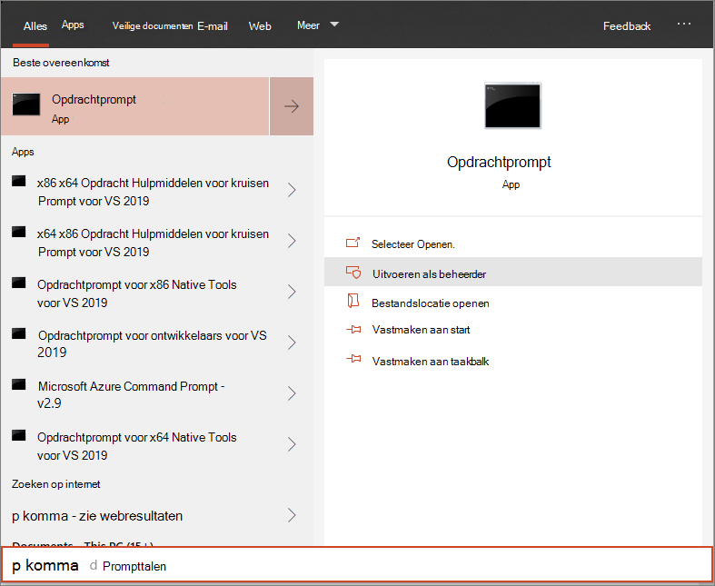

# <a name="run-a-detection-test-on-a-newly-onboarded-microsoft-defender-for-endpoint-device"></a><span data-ttu-id="7c780-104">Een detectietest uitvoeren op een nieuw ingebouwde Microsoft Defender voor eindpuntapparaat</span><span class="sxs-lookup"><span data-stu-id="7c780-104">Run a detection test on a newly onboarded Microsoft Defender for Endpoint device</span></span> 

[!INCLUDE [Microsoft 365 Defender rebranding](../../includes/microsoft-defender.md)]


<span data-ttu-id="7c780-105">**Van toepassing op:**</span><span class="sxs-lookup"><span data-stu-id="7c780-105">**Applies to:**</span></span>
- <span data-ttu-id="7c780-106">Ondersteunde Windows 10-versies</span><span class="sxs-lookup"><span data-stu-id="7c780-106">Supported Windows 10 versions</span></span>
- <span data-ttu-id="7c780-107">Windows Server 2012 R2</span><span class="sxs-lookup"><span data-stu-id="7c780-107">Windows Server 2012 R2</span></span>
- <span data-ttu-id="7c780-108">Windows Server 2016</span><span class="sxs-lookup"><span data-stu-id="7c780-108">Windows Server 2016</span></span>
- <span data-ttu-id="7c780-109">Windows Server, versie 1803</span><span class="sxs-lookup"><span data-stu-id="7c780-109">Windows Server, version 1803</span></span>
- <span data-ttu-id="7c780-110">Windows Server, 2019</span><span class="sxs-lookup"><span data-stu-id="7c780-110">Windows Server, 2019</span></span>
- [<span data-ttu-id="7c780-111">Microsoft Defender voor Endpoint</span><span class="sxs-lookup"><span data-stu-id="7c780-111">Microsoft Defender for Endpoint</span></span>](https://go.microsoft.com/fwlink/?linkid=2154037)
- [<span data-ttu-id="7c780-112">Microsoft 365 Defender</span><span class="sxs-lookup"><span data-stu-id="7c780-112">Microsoft 365 Defender</span></span>](https://go.microsoft.com/fwlink/?linkid=2118804)

> <span data-ttu-id="7c780-113">Wilt u Microsoft Defender voor Eindpunt ervaren?</span><span class="sxs-lookup"><span data-stu-id="7c780-113">Want to experience Microsoft Defender for Endpoint?</span></span> [<span data-ttu-id="7c780-114">Meld u aan voor een gratis proefabonnement.</span><span class="sxs-lookup"><span data-stu-id="7c780-114">Sign up for a free trial.</span></span>](https://www.microsoft.com/microsoft-365/windows/microsoft-defender-atp?ocid=docs-wdatp-exposedapis-abovefoldlink)

<span data-ttu-id="7c780-115">Voer het volgende PowerShell-script uit op een nieuw onboarded apparaat om te controleren of het correct rapporteert aan de Defender voor Eindpunt-service.</span><span class="sxs-lookup"><span data-stu-id="7c780-115">Run the following PowerShell script on a newly onboarded device to verify that it is properly reporting to the Defender for Endpoint service.</span></span>

1. <span data-ttu-id="7c780-116">Een map maken: 'C:\test-MDATP-test'.</span><span class="sxs-lookup"><span data-stu-id="7c780-116">Create a folder:  'C:\test-MDATP-test'.</span></span>
2. <span data-ttu-id="7c780-117">Open een opdrachtregelprompt met verhoogde opdrachtregel op het apparaat en voer het script uit:</span><span class="sxs-lookup"><span data-stu-id="7c780-117">Open an elevated command-line prompt on the device and run the script:</span></span>

   1. <span data-ttu-id="7c780-118">Ga naar **Start** en typ **cmd.**</span><span class="sxs-lookup"><span data-stu-id="7c780-118">Go to **Start** and type **cmd**.</span></span>

   1. <span data-ttu-id="7c780-119">Klik met de rechtermuisknop **op Opdrachtprompt** en selecteer **Uitvoeren als beheerder.**</span><span class="sxs-lookup"><span data-stu-id="7c780-119">Right-click **Command Prompt** and select **Run as administrator**.</span></span>

      

3. <span data-ttu-id="7c780-121">Kopieer en voer de volgende opdracht uit bij de prompt:</span><span class="sxs-lookup"><span data-stu-id="7c780-121">At the prompt, copy and run the following command:</span></span>

   ```powershell
   powershell.exe -NoExit -ExecutionPolicy Bypass -WindowStyle Hidden $ErrorActionPreference= 'silentlycontinue';(New-Object System.Net.WebClient).DownloadFile('http://127.0.0.1/1.exe', 'C:\\test-MDATP-test\\invoice.exe');Start-Process 'C:\\test-MDATP-test\\invoice.exe'
   ```

<span data-ttu-id="7c780-122">Het venster Opdrachtprompt wordt automatisch gesloten.</span><span class="sxs-lookup"><span data-stu-id="7c780-122">The Command Prompt window will close automatically.</span></span> <span data-ttu-id="7c780-123">Als dit is gelukt, wordt de detectietest gemarkeerd als voltooid en wordt binnen ongeveer 10 minuten een nieuwe waarschuwing weergegeven in de portal voor het onboarded-apparaat.</span><span class="sxs-lookup"><span data-stu-id="7c780-123">If successful, the detection test will be marked as completed and a new alert will appear in the portal for the onboarded device in approximately 10 minutes.</span></span>

## <a name="related-topics"></a><span data-ttu-id="7c780-124">Verwante onderwerpen</span><span class="sxs-lookup"><span data-stu-id="7c780-124">Related topics</span></span>
- [<span data-ttu-id="7c780-125">Onboard Windows 10-apparaten</span><span class="sxs-lookup"><span data-stu-id="7c780-125">Onboard Windows 10 devices</span></span>](configure-endpoints.md)
- [<span data-ttu-id="7c780-126">Onboard-servers</span><span class="sxs-lookup"><span data-stu-id="7c780-126">Onboard servers</span></span>](configure-server-endpoints.md)
- [<span data-ttu-id="7c780-127">Problemen met de onboarding van Microsoft Defender voor eindpunten oplossen</span><span class="sxs-lookup"><span data-stu-id="7c780-127">Troubleshoot Microsoft Defender for Endpoint onboarding issues</span></span>](https://docs.microsoft.com/microsoft-365/security/defender-endpoint/troubleshoot-onboarding)
