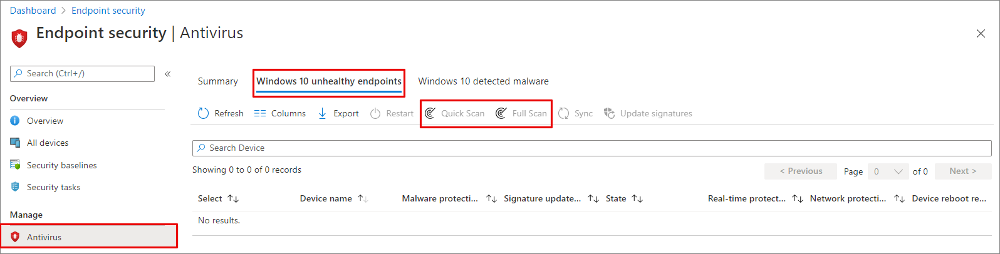

# <a name="configure-and-run-on-demand-microsoft-defender-antivirus-scans"></a>On-demand Microsoft Defender Antivirus scans configureren en uitvoeren

[!INCLUDE [Microsoft 365 Defender rebranding](../../includes/microsoft-defender.md)]

**Van toepassing op:**

- [Microsoft Defender voor Eindpunt](/microsoft-365/security/defender-endpoint/)

U kunt een scan op aanvraag uitvoeren op afzonderlijke eindpunten. Deze scans worden direct uitgevoerd en u kunt parameters voor de scan definiëren, zoals de locatie of het type.

## <a name="quick-scan-versus-full-scan"></a>Snelle scan versus volledige scan

Snel scannen bekijkt alle locaties waar malware kan zijn geregistreerd om te beginnen met het systeem, zoals registersleutels en bekende opstartmappen van Windows.

> [!IMPORTANT]
> Microsoft Defender Antivirus wordt uitgevoerd in de context van het [LocalSystem-account](/windows/win32/services/localsystem-account) bij het uitvoeren van een lokale scan. Voor netwerkscans wordt de context van het apparaataccount gebruikt. Als het domeinapparaataccount niet over de juiste machtigingen voor toegang tot het delen heeft, werkt de scan niet. Controleer of het apparaat machtigingen heeft voor het delen van het access-netwerk.

In combinatie met de [altijd-on-realtimebeveiligingsfunctie](configure-real-time-protection-microsoft-defender-antivirus.md)(die bestanden controleert wanneer ze worden geopend en gesloten en wanneer een gebruiker naar een map navigeert) biedt een snelle scan een sterke dekking voor malware die begint met het systeem en malware op kernelniveau.  

In de meeste gevallen is een snelle scan voldoende om malware te vinden die niet is opgehaald door realtime beveiliging.

Een volledige scan kan handig zijn voor eindpunten die een malware-bedreiging hebben gerapporteerd. De scan kan bepalen of er inactieve onderdelen zijn die een grondigere opruiming vereisen. Dit is ideaal als uw organisatie scans op aanvraag maakt.

> [!NOTE]
> Standaard worden snelle scans uitgevoerd op geïnstalleerde verwisselbare apparaten, zoals USB-stations.

## <a name="use-microsoft-endpoint-manager-to-run-a-scan"></a>Microsoft Endpoint Manager gebruiken om een scan uit te voeren

1. Ga naar het Microsoft Endpoint Manager-beheercentrum [https://endpoint.microsoft.com](https://endpoint.microsoft.com) () en meld u aan.
2. Kies **Endpoint Security**  >  **Antivirus**.
3. Selecteer in de lijst met tabbladen **windows 10 ongezonde eindpunten.**
4. Selecteer snel scannen of  Volledig scannen in de lijst met **acties.**

[](images/mem-antivirus-scan-on-demand.png#lightbox)

> [!TIP]
> Zie Antimalware- en firewalltaken voor meer informatie over het gebruik van Microsoft Endpoint Manager voor het uitvoeren van een scan: Een [on-demand scan uitvoeren.](/configmgr/protect/deploy-use/endpoint-antimalware-firewall#how-to-perform-an-on-demand-scan-of-computers)

## <a name="use-the-mpcmdrunexe-command-line-utility-to-run-a-scan"></a>Het hulpprogramma mpcmdrun.exe opdrachtregel gebruiken om een scan uit te voeren

Gebruik de volgende `-scan` parameter:

```console
mpcmdrun.exe -scan -scantype 1
```

Zie Het [hulpprogramma mpcmdrun.exe commandline gebruiken](command-line-arguments-microsoft-defender-antivirus.md)voor het configureren en beheren van Microsoft Defender Antivirus voor meer informatie over het gebruik van het hulpprogramma en aanvullende parameters, zoals het starten van een volledige scan of het definiëren van paden.

## <a name="use-microsoft-intune-to-run-a-scan"></a>Microsoft Intune gebruiken om een scan uit te voeren

1. Ga naar het Microsoft Endpoint Manager-beheercentrum [https://endpoint.microsoft.com](https://endpoint.microsoft.com) () en meld u aan.
2. Selecteer in de zijbalk **Apparaten > Alle apparaten** en kies het apparaat dat u wilt scannen.
3. Selecteer **... Meer**. Selecteer in de opties **Snel scannen** of **Volledig scannen.**

## <a name="use-the-windows-security-app-to-run-a-scan"></a>De Windows Security-app gebruiken om een scan uit te voeren

Zie [Een scan uitvoeren in de Windows Security-app](microsoft-defender-security-center-antivirus.md) voor instructies voor het uitvoeren van een scan op afzonderlijke eindpunten.

## <a name="use-powershell-cmdlets-to-run-a-scan"></a>PowerShell-cmdlets gebruiken om een scan uit te voeren

Gebruik de volgende cmdlet:

```PowerShell
Start-MpScan
```

Zie [PowerShell-cmdlets](use-powershell-cmdlets-microsoft-defender-antivirus.md) gebruiken om Microsoft Defender Antivirus- en [Defender-cmdlets](/powershell/module/defender/)te configureren en uit te voeren voor meer informatie over het gebruik van PowerShell met Microsoft Defender Antivirus.

## <a name="use-windows-management-instruction-wmi-to-run-a-scan"></a>Windows Management Instruction (WMI) gebruiken om een scan uit te voeren

Gebruik de [ **beginmethode** van](/previous-versions/windows/desktop/defender/start-msft-mpscan) de **MSFT_MpScan** klas.

Zie [WINDOWS Defender WMIv2 API's](/previous-versions/windows/desktop/defender/windows-defender-wmiv2-apis-portal) voor meer informatie over welke parameters zijn toegestaan.

## <a name="related-articles"></a>Verwante artikelen

- [Scanopties voor Microsoft Defender Antivirus configureren](configure-advanced-scan-types-microsoft-defender-antivirus.md)
- [Geplande Microsoft Defender Antivirus-scans configureren](scheduled-catch-up-scans-microsoft-defender-antivirus.md)
- [Microsoft Defender Antivirus in Windows 10](microsoft-defender-antivirus-in-windows-10.md)