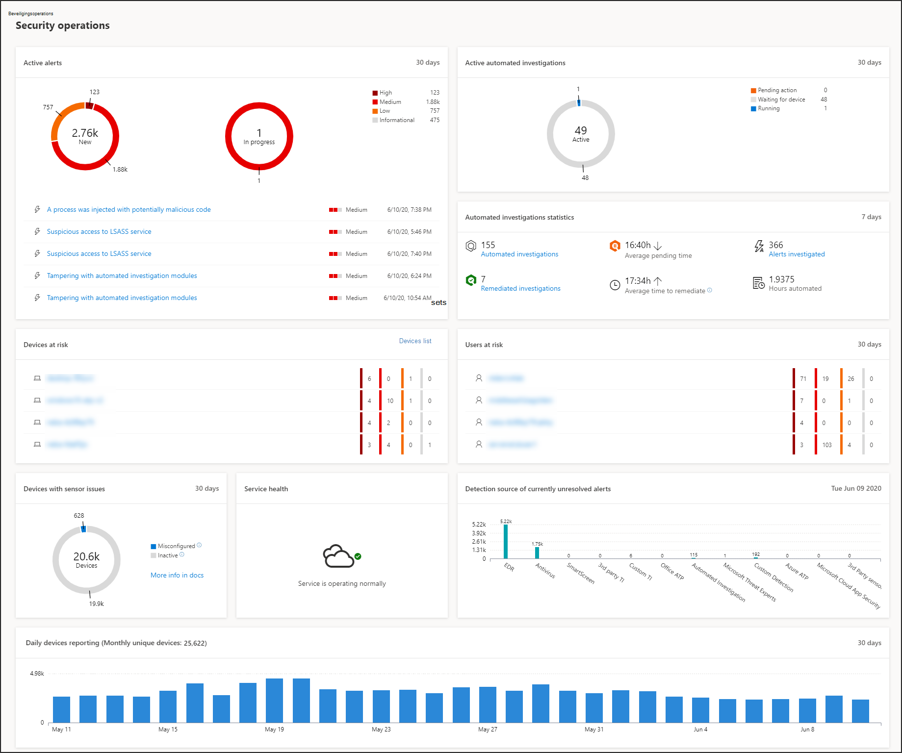
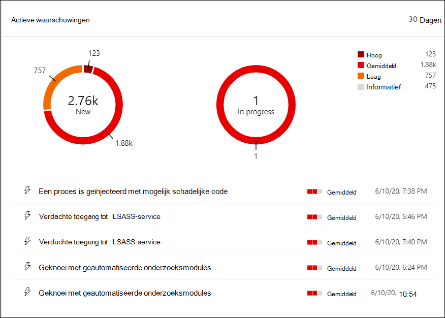
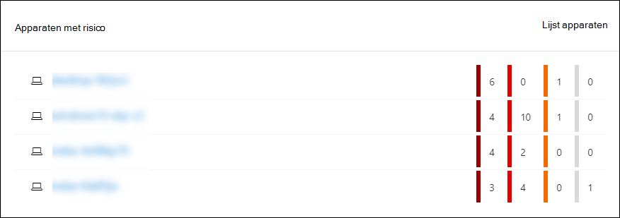
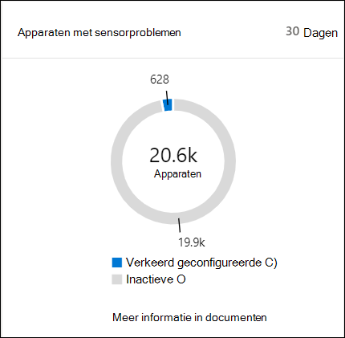
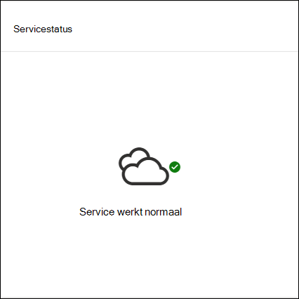
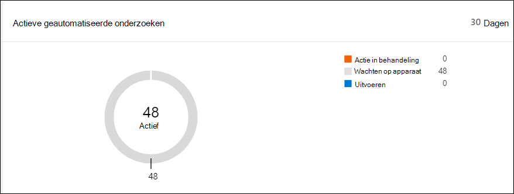
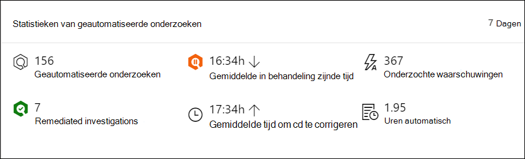
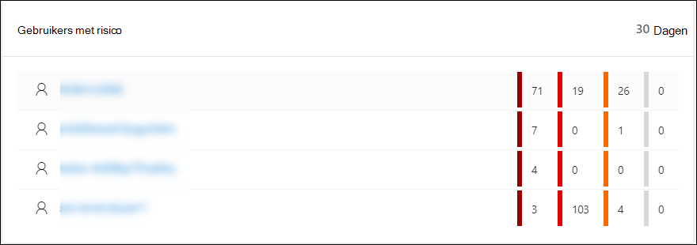

# Microsoft Defender-beveiligingscentrum Dashboard BeveiligingsbewerkingenMicrosoft Defender Security Center Security operations dashboard

[!INCLUDE [Microsoft 365 Defender rebranding](../../includes/microsoft-defender.md)]

**Van toepassing op:****Applies to:**
- [Microsoft Defender voor EindpuntMicrosoft Defender for Endpoint](https://go.microsoft.com/fwlink/?linkid=2154037)

>Wilt u Microsoft Defender voor Eindpunt ervaren?Want to experience Microsoft Defender for Endpoint? [Meld u aan voor een gratis proefabonnement.Sign up for a free trial.](https://www.microsoft.com/microsoft-365/windows/microsoft-defender-atp?ocid=docs-wdatp-secopsdashboard-abovefoldlink) 

In **het dashboard Beveiligingsbewerkingen** worden eindpuntdetectie en -respons functies opgedoken.The **Security operations dashboard** is where the endpoint detection and response capabilities are surfaced. Het biedt een overzicht op hoog niveau van waar detecties zijn gezien en markeert waar reactieacties nodig zijn.It provides a high level overview of where detections were seen and highlights where response actions are needed. 

In het dashboard ziet u een momentopname van:The dashboard displays a snapshot of:

- Actieve waarschuwingenActive alerts
- Apparaten met risicoDevices at risk
- SensortoestandSensor health
- ServicestatusService health
- Rapportage van dagelijkse apparatenDaily devices reporting
- Actieve geautomatiseerde onderzoekenActive automated investigations
- Statistieken van geautomatiseerde onderzoekenAutomated investigations statistics
- Gebruikers met risicoUsers at risk
- Verdachte activiteitenSuspicious activities

U kunt waarschuwingen en apparaten verkennen en onderzoeken om snel te bepalen of, waar en wanneer verdachte activiteiten hebben plaatsgevonden in uw netwerk om u te helpen de context te begrijpen waarin ze zich hebben voorgedaan.You can explore and investigate alerts and devices to quickly determine if, where, and when suspicious activities occurred in your network to help you understand the context they appeared in.

In het **dashboard Beveiligingsbewerkingen** ziet u samengevoegde gebeurtenissen om belangrijke gebeurtenissen of gedragingen op een apparaat te identificeren.From the **Security operations dashboard** you will see aggregated events to facilitate the identification of significant events or behaviors on a device. U kunt ook inzoomen op gedetailleerde gebeurtenissen en indicatoren op laag niveau.You can also drill down into granular events and low-level indicators.

Het bevat ook klikbare tegels die visuele aanwijzingen geven over de algehele status van uw organisatie.It also has clickable tiles that give visual cues on the overall health state of your organization. Elke tegel opent een gedetailleerde weergave van het bijbehorende overzicht.Each tile opens a detailed view of the corresponding overview.

## Actieve waarschuwingenActive alerts
U kunt het totale aantal actieve waarschuwingen van de afgelopen 30 dagen in uw netwerk bekijken via de tegel.You can view the overall number of active alerts from the last 30 days in your network from the tile. Waarschuwingen worden gegroepeerd in **Nieuw** en **In uitvoering.**Alerts are grouped into **New** and **In progress**.

Elke groep wordt verder gecategoriseerd in de bijbehorende ernst van de waarschuwing.Each group is further sub-categorized into their corresponding alert severity levels. Klik op het aantal waarschuwingen in elke waarschuwingsring om een gesorteerde weergave van de wachtrij van die categorie te zien (**Nieuw** of **In uitvoering**).Click the number of alerts inside each alert ring to see a sorted view of that category's queue (**New** or **In progress**).

Zie Overzicht waarschuwingen voor [meer informatie.](alerts-queue.md)For more information see, [Alerts overview](alerts-queue.md).

Elke rij bevat een waarschuwingscategorie en een korte beschrijving van de waarschuwing.Each row includes an alert severity category and a short description of the alert. U kunt op een waarschuwing klikken om de gedetailleerde weergave te bekijken.You can click an alert to see its detailed view. Zie Microsoft [Defender onderzoeken voor](investigate-alerts.md) eindpuntwaarschuwingen en waarschuwingenoverzicht voor meer [informatie.](alerts-queue.md)For more information see,  [Investigate Microsoft Defender for Endpoint alerts](investigate-alerts.md) and [Alerts overview](alerts-queue.md).

## Apparaten met risicoDevices at risk
Deze tegel toont een lijst met apparaten met het hoogste aantal actieve waarschuwingen.This tile shows you a list of devices with the highest number of active alerts. Het totale aantal waarschuwingen voor elk apparaat wordt weergegeven in een cirkel naast de naam van het apparaat en vervolgens verder gecategoriseerd op ernstsniveaus aan het einde van de tegel (plaats de muisaanwijzer op elke ernstbalk om het label te zien).The total number of alerts for each device is shown in a circle next to the device name, and then further categorized by severity levels at the far end of the tile (hover over each severity bar to see its label).

Klik op de naam van het apparaat om details over dat apparaat te zien.Click the name of the device to see details about that device. Zie Apparaten onderzoeken in de lijst [Microsoft Defender voor eindpuntapparaten](investigate-machines.md)voor meer informatie.For more information see, [Investigate devices in the Microsoft Defender for Endpoint Devices list](investigate-machines.md).

U kunt ook **boven** aan de tegel op De lijst Apparaten klikken om rechtstreeks naar de lijst Apparaten te **gaan,** gesorteerd op het aantal actieve waarschuwingen.You can also click **Devices list** at the top of the tile to go directly to the **Devices list**, sorted by the number of active alerts. Zie Apparaten onderzoeken in de lijst [Microsoft Defender voor eindpuntapparaten](investigate-machines.md)voor meer informatie.For more information see, [Investigate devices in the Microsoft Defender for Endpoint Devices list](investigate-machines.md).

## Apparaten met sensorproblemenDevices with sensor issues
De **tegel Apparaten met sensorproblemen** bevat informatie over de mogelijkheid van het afzonderlijke apparaat om sensorgegevens te verstrekken aan de Microsoft Defender voor Eindpunt-service.The **Devices with sensor issues** tile provides information on the individual device’s ability to provide sensor data to the Microsoft Defender for Endpoint service. Het rapport geeft aan hoeveel apparaten aandacht nodig hebben en helpt u bij het identificeren van problematische apparaten.It reports how many devices require attention and helps you identify problematic devices.

Er zijn twee statusindicatoren die informatie geven over het aantal apparaten dat niet correct rapporteert aan de service:There are two status indicators that provide information on the number of devices that are not reporting properly to the service:
- **Verkeerd geconfigureerd:** deze apparaten rapporteren mogelijk gedeeltelijk sensorgegevens aan de Microsoft Defender voor Eindpunt-service en hebben mogelijk configuratiefouten die moeten worden gecorrigeerd.**Misconfigured** – These devices might partially be reporting sensor data to the Microsoft Defender for Endpoint service and might have configuration errors that need to be corrected.
- **Inactief:** apparaten die de afgelopen maand meer dan zeven dagen zijn gestopt met rapporteren aan de Microsoft Defender for Endpoint-service.**Inactive** - Devices that have stopped reporting to the Microsoft Defender for Endpoint service for more than seven days in the past month.

Wanneer u op een van de groepen klikt, wordt u doorgestuurd naar de lijst met apparaten, gefilterd op basis van uw keuze.When you click any of the groups, you’ll be directed to devices list, filtered according to your choice. Zie Sensortoestand controleren [en](check-sensor-status.md) Apparaten onderzoeken voor meer [informatie.](investigate-machines.md)For more information, see [Check sensor state](check-sensor-status.md) and [Investigate devices](investigate-machines.md).

## ServicestatusService health
De **tegel Service** status informeert u of de service actief is of als er problemen zijn.The **Service health** tile informs you if the service is active or if there are issues.

Zie De service health van Microsoft Defender voor eindpunten controleren voor meer informatie over [de service-status.](service-status.md)For more information on the service health, see [Check the Microsoft Defender for Endpoint service health](service-status.md).

## Rapportage van dagelijkse apparatenDaily devices reporting
De **rapportagetegel Dagelijkse** apparaten toont een staafdiagram dat het aantal apparaten vertegenwoordigt dat dagelijks rapporteert in de afgelopen 30 dagen.The **Daily devices reporting** tile shows a bar graph that represents the number of devices reporting daily in the last 30 days. Plaats de muisaanwijzer op afzonderlijke balken in de grafiek om het exacte aantal apparaten te zien dat elke dag wordt gemeld.Hover over individual bars on the graph to see the exact number of devices reporting in each day.

## Actieve geautomatiseerde onderzoekenActive automated investigations
U kunt het totale aantal automatische onderzoeken van de afgelopen 30 dagen in uw netwerk bekijken via de tegel **Actieve automatische onderzoeken.**You can view the overall number of automated investigations from the last 30 days in your network from the **Active automated investigations** tile. Onderzoeken worden gegroepeerd in actie in **behandeling,** **wachten op apparaat** en **Uitvoeren.**Investigations are grouped into **Pending action**, **Waiting for device**, and **Running**.

## Statistieken van geautomatiseerde onderzoekenAutomated investigations statistics
Deze tegel bevat statistieken over geautomatiseerde onderzoeken in de afgelopen zeven dagen.This tile shows statistics related to automated investigations in the last seven days. Het toont het aantal voltooide onderzoeken, het aantal opgeloste onderzoeken, de gemiddelde in behandeling zijnde tijd die nodig is voor het starten van een onderzoek, de gemiddelde tijd die nodig is om een waarschuwing te corrigeren, het aantal onderzochte waarschuwingen en het aantal uren automatisering dat is opgeslagen in een normaal handmatig onderzoek.It shows the number of investigations completed, the number of successfully remediated investigations, the average pending time it takes for an investigation to be initiated, the average time it takes to remediate an alert, the number of alerts investigated, and the number of hours of automation saved from a typical manual investigation. 

U kunt klikken op Automatische **onderzoeken,** **opgeloste** onderzoeken en waarschuwingen  die zijn onderzocht om naar de pagina Onderzoeken te gaan, gefilterd op de juiste categorie. You can click on **Automated investigations**, **Remediated investigations**, and **Alerts investigated** to navigate to the **Investigations** page, filtered by the appropriate category. Op deze manier kunt u een gedetailleerde uitsplitsing van onderzoeken in de context zien.This lets you see a detailed breakdown of investigations in context.

## Gebruikers met risicoUsers at risk
De tegel toont een lijst met gebruikersaccounts met de meest actieve waarschuwingen en het aantal waarschuwingen dat wordt weergegeven op hoge, gemiddelde of lage waarschuwingen.The tile shows you a list of user accounts with the most active alerts and the number of alerts seen on high, medium, or low alerts. 

Klik op het gebruikersaccount voor meer informatie over het gebruikersaccount.Click the user account to see details about the user account. Zie Een gebruikersaccount [onderzoeken voor meer informatie.](investigate-user.md)For more information see [Investigate a user account](investigate-user.md).

>Wilt u Microsoft Defender voor Eindpunt ervaren?Want to experience Microsoft Defender for Endpoint? [Meld u aan voor een gratis proefabonnement.Sign up for a free trial.](https://www.microsoft.com/microsoft-365/windows/microsoft-defender-atp?ocid=docs-wdatp-secopsdashboard-belowfoldlink)

## Verwante onderwerpenRelated topics
- [De Microsoft Defender for Endpoint-portal begrijpenUnderstand the Microsoft Defender for Endpoint portal](use.md)
- [PortaloverzichtPortal overview](portal-overview.md)
- [Het dashboard Threat & Vulnerability Management weergevenView the Threat & Vulnerability Management dashboard](tvm-dashboard-insights.md)
- [Het dashboard Bedreigingsanalyse bekijken en aanbevolen mitigatieacties uitvoerenView the Threat analytics dashboard and take recommended mitigation actions](threat-analytics.md)
