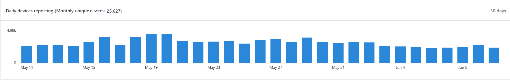

# Microsoft Defender-beveiligingscentrum Dashboard Beveiligingsbewerkingen

[!INCLUDE [Microsoft 365 Defender rebranding](../../includes/microsoft-defender.md)]

**Van toepassing op:**
- [Microsoft Defender voor Eindpunt](https://go.microsoft.com/fwlink/?linkid=2154037)

>Wilt u Microsoft Defender voor Eindpunt ervaren? [Meld u aan voor een gratis proefabonnement.](https://www.microsoft.com/microsoft-365/windows/microsoft-defender-atp?ocid=docs-wdatp-secopsdashboard-abovefoldlink) 

In **het dashboard Beveiligingsbewerkingen** worden eindpuntdetectie en -respons functies opgedoken. Het biedt een overzicht op hoog niveau van waar detecties zijn gezien en markeert waar reactieacties nodig zijn. 

In het dashboard ziet u een momentopname van:

- Actieve waarschuwingen
- Apparaten met risico
- Sensortoestand
- Servicestatus
- Rapportage van dagelijkse apparaten
- Actieve geautomatiseerde onderzoeken
- Statistieken van geautomatiseerde onderzoeken
- Gebruikers met risico
- Verdachte activiteiten

U kunt waarschuwingen en apparaten verkennen en onderzoeken om snel te bepalen of, waar en wanneer verdachte activiteiten hebben plaatsgevonden in uw netwerk om u te helpen de context te begrijpen waarin ze zich hebben voorgedaan.

In het **dashboard Beveiligingsbewerkingen** ziet u samengevoegde gebeurtenissen om belangrijke gebeurtenissen of gedragingen op een apparaat te identificeren. U kunt ook inzoomen op gedetailleerde gebeurtenissen en indicatoren op laag niveau.

Het bevat ook klikbare tegels die visuele aanwijzingen geven over de algehele status van uw organisatie. Elke tegel opent een gedetailleerde weergave van het bijbehorende overzicht.

## Actieve waarschuwingen
U kunt het totale aantal actieve waarschuwingen van de afgelopen 30 dagen in uw netwerk bekijken via de tegel. Waarschuwingen worden gegroepeerd in **Nieuw** en **In uitvoering.**

Elke groep wordt verder gecategoriseerd in de bijbehorende ernst van de waarschuwing. Klik op het aantal waarschuwingen in elke waarschuwingsring om een gesorteerde weergave van de wachtrij van die categorie te zien (**Nieuw** of **In uitvoering**).

Zie Overzicht waarschuwingen voor [meer informatie.](alerts-queue.md)

Elke rij bevat een waarschuwingscategorie en een korte beschrijving van de waarschuwing. U kunt op een waarschuwing klikken om de gedetailleerde weergave te bekijken. Zie Microsoft [Defender onderzoeken voor](investigate-alerts.md) eindpuntwaarschuwingen en waarschuwingenoverzicht voor meer [informatie.](alerts-queue.md)

## Apparaten met risico
Deze tegel toont een lijst met apparaten met het hoogste aantal actieve waarschuwingen. Het totale aantal waarschuwingen voor elk apparaat wordt weergegeven in een cirkel naast de naam van het apparaat en vervolgens verder gecategoriseerd op ernstsniveaus aan het einde van de tegel (plaats de muisaanwijzer op elke ernstbalk om het label te zien).

Klik op de naam van het apparaat om details over dat apparaat te zien. Zie Apparaten onderzoeken in de lijst [Microsoft Defender voor eindpuntapparaten](investigate-machines.md)voor meer informatie.

U kunt ook **boven** aan de tegel op De lijst Apparaten klikken om rechtstreeks naar de lijst Apparaten te **gaan,** gesorteerd op het aantal actieve waarschuwingen. Zie Apparaten onderzoeken in de lijst [Microsoft Defender voor eindpuntapparaten](investigate-machines.md)voor meer informatie.

## Apparaten met sensorproblemen
De **tegel Apparaten met sensorproblemen** bevat informatie over de mogelijkheid van het afzonderlijke apparaat om sensorgegevens te verstrekken aan de Microsoft Defender voor Eindpunt-service. Het rapport geeft aan hoeveel apparaten aandacht nodig hebben en helpt u bij het identificeren van problematische apparaten.

Er zijn twee statusindicatoren die informatie geven over het aantal apparaten dat niet correct rapporteert aan de service:
- **Verkeerd geconfigureerd:** deze apparaten rapporteren mogelijk gedeeltelijk sensorgegevens aan de Microsoft Defender voor Eindpunt-service en hebben mogelijk configuratiefouten die moeten worden gecorrigeerd.
- **Inactief:** apparaten die de afgelopen maand meer dan zeven dagen zijn gestopt met rapporteren aan de Microsoft Defender for Endpoint-service.

Wanneer u op een van de groepen klikt, wordt u doorgestuurd naar de lijst met apparaten, gefilterd op basis van uw keuze. Zie Sensortoestand controleren [en](check-sensor-status.md) Apparaten onderzoeken voor meer [informatie.](investigate-machines.md)

## Servicestatus
De **tegel Service** status informeert u of de service actief is of als er problemen zijn.

Zie De service health van Microsoft Defender voor eindpunten controleren voor meer informatie over [de service-status.](service-status.md)

## Rapportage van dagelijkse apparaten
De **rapportagetegel Dagelijkse** apparaten toont een staafdiagram dat het aantal apparaten vertegenwoordigt dat dagelijks rapporteert in de afgelopen 30 dagen. Plaats de muisaanwijzer op afzonderlijke balken in de grafiek om het exacte aantal apparaten te zien dat elke dag wordt gemeld.

## Actieve geautomatiseerde onderzoeken
U kunt het totale aantal automatische onderzoeken van de afgelopen 30 dagen in uw netwerk bekijken via de tegel **Actieve automatische onderzoeken.** Onderzoeken worden gegroepeerd in actie in **behandeling,** **wachten op apparaat** en **Uitvoeren.**

## Statistieken van geautomatiseerde onderzoeken
Deze tegel bevat statistieken over geautomatiseerde onderzoeken in de afgelopen zeven dagen. Het toont het aantal voltooide onderzoeken, het aantal opgeloste onderzoeken, de gemiddelde in behandeling zijnde tijd die nodig is voor het starten van een onderzoek, de gemiddelde tijd die nodig is om een waarschuwing te corrigeren, het aantal onderzochte waarschuwingen en het aantal uren automatisering dat is opgeslagen in een normaal handmatig onderzoek. 

U kunt klikken op Automatische **onderzoeken,** **opgeloste** onderzoeken en waarschuwingen  die zijn onderzocht om naar de pagina Onderzoeken te gaan, gefilterd op de juiste categorie.  Op deze manier kunt u een gedetailleerde uitsplitsing van onderzoeken in de context zien.

## Gebruikers met risico
De tegel toont een lijst met gebruikersaccounts met de meest actieve waarschuwingen en het aantal waarschuwingen dat wordt weergegeven op hoge, gemiddelde of lage waarschuwingen. 

Klik op het gebruikersaccount voor meer informatie over het gebruikersaccount. Zie Een gebruikersaccount [onderzoeken voor meer informatie.](investigate-user.md)

>Wilt u Microsoft Defender voor Eindpunt ervaren? [Meld u aan voor een gratis proefabonnement.](https://www.microsoft.com/microsoft-365/windows/microsoft-defender-atp?ocid=docs-wdatp-secopsdashboard-belowfoldlink)

## Verwante onderwerpen
- [De Microsoft Defender for Endpoint-portal begrijpen](use.md)
- [Portaloverzicht](portal-overview.md)
- [Het dashboard Threat & Vulnerability Management weergeven](tvm-dashboard-insights.md)
- [Het dashboard Bedreigingsanalyse bekijken en aanbevolen mitigatieacties uitvoeren](threat-analytics.md)
