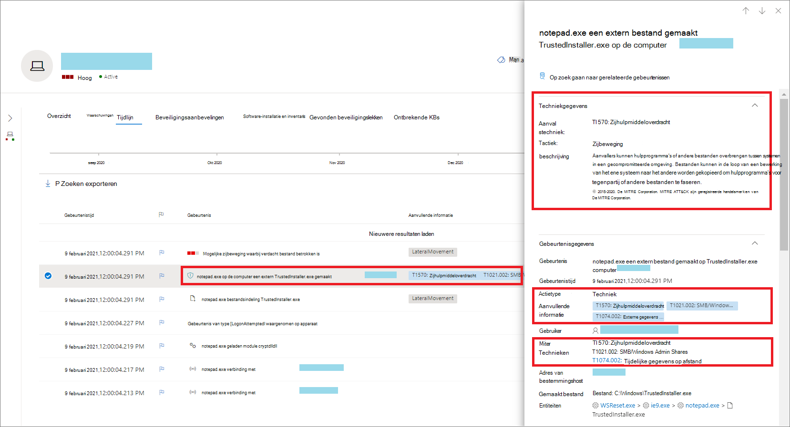
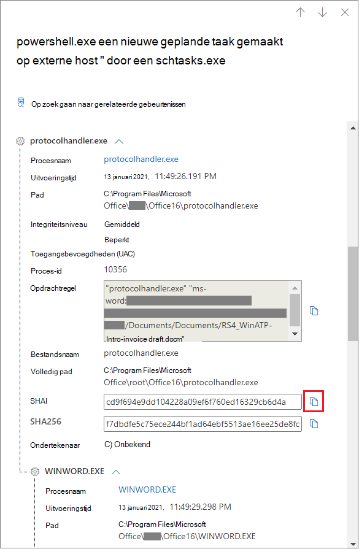
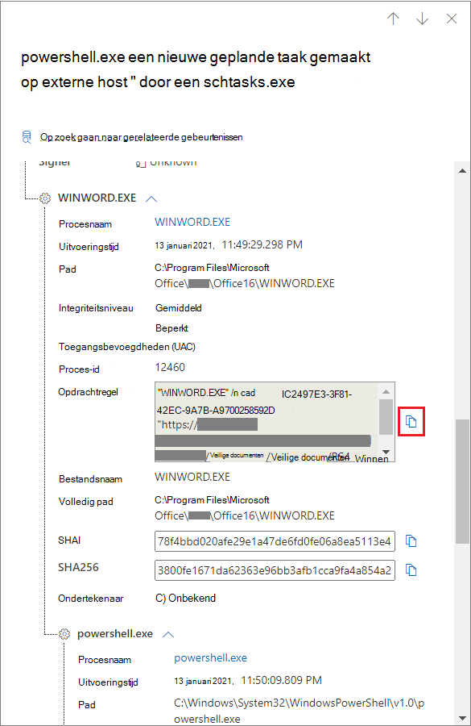
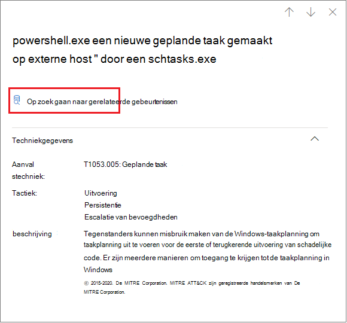
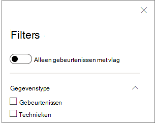

# Technieken in de tijdlijn van het apparaatTechniques in the device timeline

**Van toepassing op:****Applies to:**
- [Microsoft Defender voor EndpointMicrosoft Defender for Endpoint](https://go.microsoft.com/fwlink/p/?linkid=2154037)

U kunt meer inzicht krijgen in een onderzoek door de gebeurtenissen op een bepaald apparaat te analyseren.You can gain more insight in an investigation by analyzing the events that happened on a specific device. Selecteer eerst het apparaat van belang in de [lijst Apparaten.](machines-view-overview.md)First, select the device of interest from the [Devices list](machines-view-overview.md). Op de apparaatpagina kunt u het tabblad **Tijdlijn** selecteren om alle gebeurtenissen op het apparaat weer te geven.On the device page, you can select the **Timeline** tab to view all the events that occurred on the device.

## Technieken in de tijdlijn begrijpenUnderstand techniques in the timeline

>[!IMPORTANT]
>Sommige informatie heeft betrekking op een vooraf uitgebrachte productfunctie in een openbare preview die aanzienlijk kan worden gewijzigd voordat deze commercieel wordt uitgebracht.Some information relates to a prereleased product feature in public preview which may be substantially modified before it's commercially released. Microsoft geeft geen garantie, uitdrukkelijk of impliciet, met betrekking tot de informatie die hier wordt beschreven.Microsoft makes no warranties, express or implied, with respect to the information provided here.

In Microsoft Defender voor Eindpunt zijn **technieken** een extra gegevenstype in de tijdlijn van de gebeurtenis.In Microsoft Defender for Endpoint, **Techniques** are an additional data type in the event timeline. Technieken bieden meer inzicht in activiteiten die zijn gekoppeld aan [MITRE ATT-&CK-technieken](https://attack.mitre.org/) of subtechnieken.Techniques provide more insight on activities associated with [MITRE ATT&CK](https://attack.mitre.org/) techniques or sub-techniques. 

Deze functie vereenvoudigt de onderzoekservaring door analisten te helpen inzicht te krijgen in de activiteiten die op een apparaat zijn waargenomen.This feature simplifies the investigation experience by helping analysts understand the activities that were observed on a device. Analisten kunnen vervolgens besluiten om het verder te onderzoeken.Analysts can then decide to investigate further.

Voor een openbaar voorbeeld zijn technieken standaard beschikbaar en worden deze samen met gebeurtenissen weergegeven wanneer de tijdlijn van een apparaat wordt weergegeven.For public preview, Techniques are available by default and shown together with events when a device's timeline is viewed. 

Technieken zijn gemarkeerd met vetgedrukte tekst en worden weergegeven met een blauw pictogram aan de linkerkant.Techniques are highlighted in bold text and appear with a blue icon on the left. De bijbehorende MITRE ATT-&CK-id en -techniek worden ook weergegeven als tags onder Aanvullende informatie.The corresponding MITRE ATT&CK ID and technique name also appear as tags under Additional information. 

Zoek- en exportopties zijn ook beschikbaar voor Technieken.Search and Export options are also available for Techniques.

## Onderzoeken met behulp van het zijdeelvensterInvestigate using the side pane

Selecteer een techniek om het bijbehorende zijvenster te openen.Select a Technique to open its corresponding side pane. Hier ziet u aanvullende informatie en inzichten, zoals gerelateerde ATT-&CK-technieken, tactieken en beschrijvingen.Here you can see additional information and insights like related ATT&CK techniques, tactics, and descriptions. 

Selecteer de specifieke *aanvalstechniek om* de gerelateerde att-&CK-techniekpagina te openen, waar u meer informatie over kunt vinden.Select the specific *Attack technique* to open the related ATT&CK technique page where you can find more information about it.

U kunt de details van een entiteit kopiëren wanneer u een blauw pictogram aan de rechterkant ziet.You can copy an entity's details when you see a blue icon on the right. Als u bijvoorbeeld de SHA1 van een gerelateerd bestand wilt kopiëren, selecteert u het blauwe paginapictogram.For instance, to copy a related file's SHA1, select the blue page icon.

U kunt hetzelfde doen voor opdrachtlijnen.You can do the same for command lines.

## Gerelateerde gebeurtenissen onderzoekenInvestigate related events

Als u [geavanceerde jacht wilt gebruiken](advanced-hunting-overview.md) om gebeurtenissen te zoeken die betrekking hebben op de geselecteerde techniek, selecteert u **Opzoeken naar gerelateerde gebeurtenissen.**To use [advanced hunting](advanced-hunting-overview.md) to find events related to the selected Technique, select **Hunt for related events**. Dit leidt naar de geavanceerde pagina met een query om gebeurtenissen te zoeken die betrekking hebben op de techniek.This leads to the advanced hunting page with a query to find events related to the Technique.

>[!NOTE]
>Query's met **behulp** van de knop Zoeken naar gerelateerde gebeurtenissen in een zijvenster Techniek geven alle gebeurtenissen weer die betrekking hebben op de geïdentificeerde techniek, maar bevatten de techniek zelf niet in de queryresultaten.Querying using the **Hunt for related events** button from a Technique side pane displays all the events related to the identified technique but does not include the Technique itself in the query results.

## De tijdlijn van uw apparaat aanpassenCustomize your device timeline

Rechtsboven in de tijdlijn van het apparaat kunt u een datumbereik kiezen om het aantal gebeurtenissen en technieken in de tijdlijn te beperken.On the upper right-hand side of the device timeline, you can choose a date range to limit the number of events and techniques in the timeline. 

U kunt aanpassen welke kolommen u wilt laten zien.You can customize which columns to expose. U kunt ook filteren op gemarkeerde gebeurtenissen op gegevenstype of op gebeurtenisgroep.You can also filter for flagged events by data type or by event group.

### Kolommen kiezen om weer te gevenChoose columns to expose
U kunt kiezen welke kolommen u wilt weergeven in de tijdlijn door de knop **Kolommen kiezen te** selecteren.You can choose which columns to expose in the timeline by selecting the **Choose columns** button.

Hier kunt u selecteren welke gegevensset u wilt opnemen.From there you can select which information set to include.

### Filteren om alleen technieken of gebeurtenissen weer te gevenFilter to view techniques or events only

Als u alleen gebeurtenissen of technieken wilt weergeven, **selecteert** u Filters in de apparaattijdlijn en kiest u het gewenste gegevenstype dat u wilt weergeven.To view only either events or techniques, select **Filters** from the device timeline and choose your preferred Data type to view.

## Zie ookSee also
- [De lijst Apparaten weergeven en ordenenView and organize the Devices list](machines-view-overview.md)
- [Gebeurtenisvlaggen van Microsoft Defender voor eindpuntapparaatMicrosoft Defender for Endpoint device timeline event flags](device-timeline-event-flag.md) 

 
