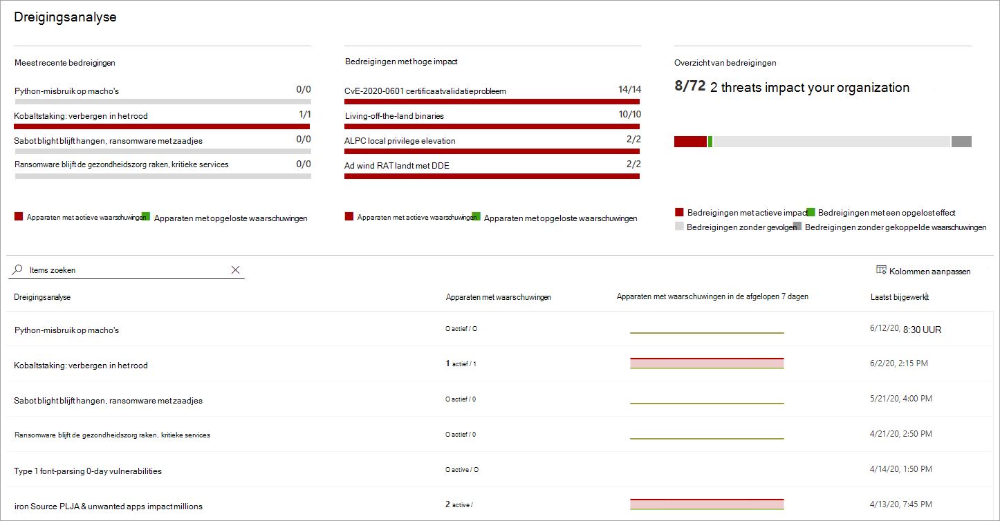

# Nieuwe bedreigingen bijhouden en beantwoorden met bedreigingsanalyseTrack and respond to emerging threats with threat analytics 

[!INCLUDE [Microsoft 365 Defender rebranding](../../includes/microsoft-defender.md)]

**Van toepassing op:****Applies to:**
- [Microsoft Defender voor EndpointMicrosoft Defender for Endpoint](https://go.microsoft.com/fwlink/?linkid=2154037)
- [Microsoft 365 DefenderMicrosoft 365 Defender](https://go.microsoft.com/fwlink/?linkid=2118804)

> Wilt u Microsoft Defender voor Eindpunt ervaren?Want to experience Microsoft Defender for Endpoint? [Meld u aan voor een gratis proefabonnement.Sign up for a free trial.](https://www.microsoft.com/microsoft-365/windows/microsoft-defender-atp?ocid=docs-wdatp-exposedapis-abovefoldlink)

Met geavanceerdere tegenstanders en nieuwe bedreigingen die regelmatig en regelmatig verschijnen, is het essentieel om snel te kunnen:With more sophisticated adversaries and new threats emerging frequently and prevalently, it's critical to be able to quickly:

- De impact van nieuwe bedreigingen beoordelenAssess the impact of new threats
- Uw tolerantie voor of blootstelling aan de bedreigingen controlerenReview your resilience against or exposure to the threats
- De acties identificeren die u kunt uitvoeren om de bedreigingen te stoppen of te bevattenIdentify the actions you can take to stop or contain the threats

Bedreigingsanalyse is een reeks rapporten van deskundige Microsoft-beveiligingsonderzoekers over de meest relevante bedreigingen, waaronder:Threat analytics is a set of reports from expert Microsoft security researchers covering the most relevant threats, including:

- Actieve bedreigingsacteurs en hun campagnesActive threat actors and their campaigns
- Populaire en nieuwe aanvalstechniekenPopular and new attack techniques
- Kritieke beveiligingslekkenCritical vulnerabilities
- Veelvoorkomende aanvalsoppervlakkenCommon attack surfaces
- Voorkomende malwarePrevalent malware

Elk rapport bevat een gedetailleerde analyse van een bedreiging en uitgebreide richtlijnen voor het beschermen tegen die bedreiging.Each report provides a detailed analysis of a threat and extensive guidance on how to defend against that threat. Het bevat ook gegevens uit uw netwerk, waarmee wordt aangegeven of de bedreiging actief is en of u over toepasselijke beveiliging beschikt.It also incorporates data from your network, indicating whether the threat is active and if you have applicable protections in place.

Bekijk deze korte video voor meer informatie over hoe u met bedreigingsanalyse de meest recente bedreigingen kunt bijhouden en stoppen.Watch this short video to learn more about how threat analytics can help you track the latest threats and stop them.

> [!VIDEO https://www.microsoft.com/en-us/videoplayer/embed/RE4bw1f]

## Het dashboard bedreigingsanalyse bekijkenView the threat analytics dashboard

Het dashboard bedreigingsanalyse is een goed uitgangspunt om naar de rapporten te gaan die het meest relevant zijn voor uw organisatie.The threat analytics dashboard is a great jump off point for getting to the reports that are most relevant to your organization. De bedreigingen worden in de volgende secties samengevat:It summarizes the threats in the following sections:

- **Meest recente bedreigingen:** bevat de meest recent gepubliceerde bedreigingsrapporten, samen met het aantal apparaten met actieve en opgeloste waarschuwingen.**Latest threats**—lists the most recently published threat reports, along with the number of devices with active and resolved alerts.
- **Bedreigingen met een hoge** impact : hier worden de bedreigingen vermeld die de grootste impact hebben gehad op de organisatie.**High-impact threats**—lists the threats that have had the highest impact to the organization. In deze sectie worden bedreigingen gerangeerd op het aantal apparaten met actieve waarschuwingen.This section ranks threats by the number of devices that have active alerts.
- **Overzicht van** bedreigingen: toont de algehele impact van bijgespoorde bedreigingen door het aantal bedreigingen met actieve en opgeloste waarschuwingen weer te geven.**Threat summary**—shows the overall impact of tracked threats by showing the number of threats with active and resolved alerts.

Selecteer een bedreiging in het dashboard om het rapport voor die bedreiging weer te geven.Select a threat from the dashboard to view the report for that threat.

## Een bedreigingsanalyserapport weergevenView a threat analytics report

Elk rapport voor bedreigingsanalyse bevat informatie in drie secties: **Overzicht,** **Analistrapport** en **Mitigaties.**Each threat analytics report provides information in three sections: **Overview**, **Analyst report**, and **Mitigations**.

### Overzicht: Snel inzicht krijgen in de bedreiging, de impact ervan beoordelen en verdedigingslinie bekijkenOverview: Quickly understand the threat, assess its impact, and review defenses

De **sectie** Overzicht bevat een voorbeeld van het gedetailleerde analistenrapport.The **Overview** section provides a preview of the detailed analyst report. Het bevat ook grafieken die de impact van de bedreiging voor uw organisatie en uw blootstelling markeren via verkeerd geconfigureerde en ongepatchte apparaten.It also provides charts that highlight the impact of the threat to your organization and your exposure through misconfigured and unpatched devices.

 _Overzicht sectie van een bedreigingsanalyserapport_
_Overview section of a threat analytics report_

#### De impact voor uw organisatie beoordelenAssess the impact to your organization
Elk rapport bevat grafieken die zijn ontworpen om informatie te verstrekken over de invloed van een bedreiging op de organisatie:Each report includes charts designed to provide information about the organizational impact of a threat:
- **Apparaten met waarschuwingen**: toont het huidige aantal verschillende apparaten dat door de bedreiging is beïnvloed.**Devices with alerts**—shows the current number of distinct devices that have been impacted by the threat. Een apparaat wordt gecategoriseerd als Actief als er  ten  minste één waarschuwing is gekoppeld aan die bedreiging en Opgelost als alle waarschuwingen die zijn gekoppeld aan de bedreiging op het apparaat zijn opgelost. A device is categorized as **Active** if there is at least one alert associated with that threat and **Resolved** if *all* alerts associated with the threat on the device have been resolved.
- **Apparaten met waarschuwingen in de tijd**: toont het aantal verschillende apparaten met **actieve** en **opgeloste** waarschuwingen in de tijd.**Devices with alerts over time**—shows the number of distinct devices with **Active** and **Resolved** alerts over time. Het aantal opgeloste waarschuwingen geeft aan hoe snel uw organisatie reageert op waarschuwingen die zijn gekoppeld aan een bedreiging.The number of resolved alerts indicates how quickly your organization responds to alerts associated with a threat. In het ideale kader moet de grafiek binnen enkele dagen waarschuwingen weergeven die zijn opgelost.Ideally, the chart should be showing alerts resolved within a few days.

#### Beveiligingsweerbaarheid en -houding controlerenReview security resilience and posture
Elk rapport bevat grafieken die een overzicht geven van hoe veerkrachtig uw organisatie is tegen een bepaalde bedreiging:Each report includes charts that provide an overview of how resilient your organization is against a given threat:
- **Beveiligingsconfiguratiestatus:** toont het aantal apparaten dat de aanbevolen beveiligingsinstellingen heeft toegepast om de bedreiging te beperken.**Security configuration status**—shows the number of devices that have applied the recommended security settings that can help mitigate the threat. Apparaten worden beschouwd **als Veilig** als ze alle _bijgespoorde_ instellingen hebben toegepast.Devices are considered **Secure** if they have applied _all_ the tracked settings.
- **Status van beveiligingspatches:** toont het aantal apparaten dat beveiligingsupdates of patches heeft toegepast waarmee beveiligingsproblemen worden aangepakt die door de bedreiging worden misbruikt.**Vulnerability patching status**—shows the number of devices that have applied security updates or patches that address vulnerabilities exploited by the threat.

### Analistrapport: Krijg inzicht van microsoft-beveiligingsonderzoekersAnalyst report: Get expert insight from Microsoft security researchers
Ga naar de **sectie Analistrapport** om de gedetailleerde expert write-up te lezen.Go to the **Analyst report** section to read through the detailed expert write-up. De meeste rapporten bevatten gedetailleerde beschrijvingen van aanvalsketens, waaronder tactieken en technieken die zijn toegesneden op het MITRE ATT&CK-framework, uitgebreide lijsten met aanbevelingen en krachtige richtlijnen voor het zoeken naar [bedreigingen.](advanced-hunting-overview.md)Most reports provide detailed descriptions of attack chains, including tactics and techniques mapped to the MITRE ATT&CK framework, exhaustive lists of recommendations, and powerful [threat hunting](advanced-hunting-overview.md) guidance.

[Meer informatie over het analistenrapportLearn more about the analyst report](threat-analytics-analyst-reports.md)

### Risicobeperking: Lijst met risico's en de status van uw apparaten controlerenMitigations: Review list of mitigations and the status of your devices
Bekijk in **de sectie Mitigaties** de lijst met specifieke actie-aanbevelingen die u kunnen helpen uw organisatieweerbaarheid tegen de bedreiging te vergroten.In the **Mitigations** section, review the list of specific actionable recommendations that can help you increase your organizational resilience against the threat. De lijst met bijgespoorde risico's bevat:The list of tracked mitigations includes:

- **Beveiligingsupdates**: implementatie van beveiligingsupdates of patches voor beveiligingsproblemen**Security updates**—deployment of security updates or patches for vulnerabilities
- **Microsoft Defender Antivirus-instellingen****Microsoft Defender Antivirus settings**
  - Versie van beveiligingsinformatieSecurity intelligence version
  - Beveiliging in de cloudCloud-delivered protection  
  - Potentieel ongewenste toepassingsbeveiliging (PUA)Potentially unwanted application (PUA) protection
  - Realtime beveiligingReal-time protection
 
Mitigatiegegevens in deze sectie bevatten gegevens van bedreigings- en kwetsbaarheidsbeheer, die ook gedetailleerde inzoomgegevens bevatten van verschillende koppelingen in het rapport.Mitigation information in this section incorporates data from [threat and vulnerability management](next-gen-threat-and-vuln-mgt.md), which also provides detailed drill-down information from various links in the report.

 _Risicoanalyse-sectie Mitigatie van een bedreigingsanalyserapport_
_Mitigations section of a threat analytics report_

## Aanvullende rapportdetails en -beperkingenAdditional report details and limitations
Houd bij het gebruik van de rapporten rekening met het volgende:When using the reports, keep the following in mind: 

- Gegevens hebben een bereik op basis van uw RBAC-bereik (Role-Based Access Control).Data is scoped based on your role-based access control (RBAC) scope. U ziet de status van apparaten in [groepen die u kunt openen.](machine-groups.md)You will see the status of devices in [groups that you can access](machine-groups.md).
- Grafieken geven alleen risico's weer die worden bijgespoord.Charts reflect only mitigations that are tracked. Controleer het rapportoverzicht op aanvullende risico's die niet in de grafieken worden weergegeven.Check the report overview for additional mitigations that are not shown in the charts.
- Risicobeperking garandeert geen volledige tolerantie.Mitigations don't guarantee complete resilience. De geleverde risico's weerspiegelen de best mogelijke acties die nodig zijn om de tolerantie te verbeteren.The provided mitigations reflect the best possible actions needed to improve resiliency.
- Apparaten worden geteld als 'niet beschikbaar' als ze geen gegevens naar de service hebben verzonden.Devices are counted as "unavailable" if they have not transmitted data to the service.
- Antivirusgerelateerde statistieken zijn gebaseerd op de antivirusinstellingen van Microsoft Defender.Antivirus-related statistics are based on Microsoft Defender Antivirus settings. Apparaten met antivirusoplossingen van derden kunnen worden weergegeven als 'blootgesteld'.Devices with third-party antivirus solutions can appear as "exposed".

## Verwante onderwerpenRelated topics
- [Proactief bedreigingen zoeken met geavanceerde jachtProactively find threats with advanced hunting](advanced-hunting-overview.md) 
- [De sectie Analistrapport begrijpenUnderstand the analyst report section](threat-analytics-analyst-reports.md)
- [Beveiligingszwakheden en blootstellingen beoordelen en oplossenAssess and resolve security weaknesses and exposures](next-gen-threat-and-vuln-mgt.md)