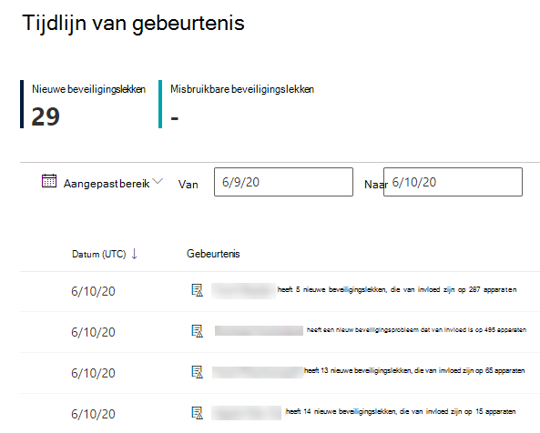

# Gebeurtenistijdlijn - bedreigings- en kwetsbaarheidsbeheer

[!INCLUDE [Microsoft 365 Defender rebranding](../../includes/microsoft-defender.md)]

**Van toepassing op:**
- [Microsoft Defender voor Endpoint](https://go.microsoft.com/fwlink/?linkid=2154037)
- [Microsoft 365 Defender](https://go.microsoft.com/fwlink/?linkid=2118804)

>Wilt u Microsoft Defender voor Eindpunt ervaren? [Meld u aan voor een gratis proefabonnement.](https://www.microsoft.com/microsoft-365/windows/microsoft-defender-atp?ocid=docs-wdatp-portaloverview-abovefoldlink)

Gebeurtenistijdlijn is een nieuwsfeed voor risico's waarmee u kunt interpreteren hoe risico's in de organisatie worden geïntroduceerd via nieuwe beveiligingslekken of exploits. U kunt gebeurtenissen bekijken die van invloed kunnen zijn op het risico van uw organisatie. U kunt bijvoorbeeld nieuwe beveiligingslekken vinden die zijn geïntroduceerd, beveiligingslekken die kunnen worden benut, misbruik maken dat is toegevoegd aan een exploitkit en meer.

Gebeurtenistijdlijn vertelt ook het verhaal van uw [blootstellingsscore](tvm-exposure-score.md) en [Microsoft Secure Score voor](tvm-microsoft-secure-score-devices.md) apparaten, zodat u de oorzaak van grote wijzigingen kunt bepalen. Gebeurtenissen kunnen van invloed zijn op uw apparaten of op uw score voor apparaten. Verminder de blootstelling door aan te pakken wat er moet worden gesaneerd op basis van de aanbevolen [beveiligingsaanbevelingen.](tvm-security-recommendation.md)

>[!TIP]
>Zie E-mailmeldingen voor kwetsbaarheid configureren in Microsoft Defender voor Eindpunt voor e-mailberichten over [nieuwe beveiligingsprobleemgebeurtenissen](configure-vulnerability-email-notifications.md)

## Naar de tijdlijnpagina van gebeurtenis navigeren

Er zijn ook drie toegangspunten uit het [dashboard bedreigings- en kwetsbaarheidsbeheer:](tvm-dashboard-insights.md)

- **Score voor organisatieblootstelling:** Plaats de muisaanwijzer op de gebeurtenispunten in de grafiek 'Blootstellingsscore in de tijd' en selecteer 'Alle gebeurtenissen van deze dag bekijken'. De gebeurtenissen vertegenwoordigen softwareproblemen.
- **Microsoft Secure Score for Devices:** Plaats de muisaanwijzer op de gebeurtenispunten in de grafiek 'Uw score voor apparaten in de tijd' en selecteer 'Alle gebeurtenissen vanaf deze dag bekijken'. De gebeurtenissen vertegenwoordigen nieuwe configuratiebeoordelingen.
- **Topgebeurtenissenkaart:** Selecteer 'Meer laten zien' onder aan de bovenste gebeurtenissentabel. Op de kaart worden de drie meest impactvolle gebeurtenissen in de afgelopen 7 dagen weergegeven. Impactvolle gebeurtenissen kunnen zijn als de gebeurtenis van invloed is op een groot aantal apparaten of als het een kritieke kwetsbaarheid is.

### Blootstellingsscore en Microsoft Secure Score voor apparatengrafieken

Plaats in het dashboard bedreigings- en kwetsbaarheidsbeheer de muisaanwijzer op de grafiek Blootstellingsscore om de belangrijkste beveiligingsleedgebeurtenissen van die dag te bekijken die van invloed waren op uw apparaten. Plaats de muisaanwijzer op de grafiek Microsoft Secure Score voor apparaten om nieuwe beveiligingsconfiguratiebeoordelingen weer te geven die van invloed zijn op uw score.

Als er geen gebeurtenissen zijn die van invloed zijn op uw apparaten of uw score voor apparaten, worden er geen gebeurtenissen weergegeven.

 
 

### Inzoomen op gebeurtenissen van die dag

Als **u Alle gebeurtenissen vanaf deze dag tonen selecteert,** gaat u naar de pagina Gebeurtenistijdlijn met een aangepast datumbereik voor die dag.

Selecteer **Aangepast bereik** om het datumbereik te wijzigen in een ander aangepast bereik of een vooraf ingesteld tijdsbereik.

## Overzicht van gebeurtenistijdlijn

Op de pagina Gebeurtenistijdlijn kunt u alle benodigde informatie over een gebeurtenis bekijken. 

Functies:

- Kolommen aanpassen
- Filteren op gebeurtenistype of percentage van beïnvloede apparaten
- 30, 50 of 100 items per pagina weergeven

De twee grote getallen boven aan de pagina geven het aantal nieuwe beveiligingslekken en exploiteerbare beveiligingslekken weer, niet gebeurtenissen. Sommige gebeurtenissen kunnen meerdere beveiligingslekken hebben en sommige beveiligingslekken kunnen meerdere gebeurtenissen hebben.

### Kolommen

- **Datum:** maand, dag, jaar
- **Gebeurtenis**: impactvolle gebeurtenis, inclusief onderdeel, type en aantal beïnvloede apparaten
- **Gerelateerd onderdeel**: software
- **Oorspronkelijk beïnvloedde apparaten:** het aantal en het percentage van de apparaten waarop deze gebeurtenis oorspronkelijk plaatsvond. U kunt ook filteren op het percentage van de oorspronkelijk beïnvloede apparaten, op het totale aantal apparaten.
- **Momenteel beïnvloedt apparaten:** het huidige aantal en het huidige percentage, van apparaten die deze gebeurtenis momenteel van invloed is. U kunt dit veld vinden door Kolommen **aanpassen te selecteren.**
- **Typen:** weerspiegelen gebeurtenissen met een tijdstempel die van invloed zijn op de score. Ze kunnen worden gefilterd.
    - Exploit toegevoegd aan een exploitkit
    - Exploit is geverifieerd
    - Nieuwe openbare exploit
    - Nieuw beveiligingsprobleem
    - Nieuwe configuratiebeoordeling
- **Scoretrend**: trend blootstellingsscore

### Pictogrammen

De volgende pictogrammen worden weergegeven naast gebeurtenissen:

-  Nieuwe openbare exploit
-  Nieuw beveiligingsprobleem is gepubliceerd
-  Exploit gevonden in exploit kit
-  Geverifieerde exploit

### Inzoomen op een specifieke gebeurtenis

Wanneer u een gebeurtenis selecteert, wordt er een flyout weergegeven met een lijst met de details en huidige CVE's die van invloed zijn op uw apparaten. U kunt meer CVE's weergeven of de gerelateerde aanbeveling bekijken.

Met de pijl onder 'scoretrend' kunt u bepalen of deze gebeurtenis de blootstellingsscore van uw organisatie mogelijk heeft verhoogd of verlaagd. Een hogere blootstellingsscore betekent dat apparaten kwetsbaarder zijn voor gebruik.

Selecteer van hier naar **gerelateerde beveiligingsaanbeveling** de aanbeveling weergeven die het nieuwe beveiligingsprobleem op de pagina met [beveiligingsaanbevelingen adresseert.](tvm-security-recommendation.md) Nadat u de beschrijvings- en kwetsbaarheidsdetails in de beveiligingsaanbeveling hebt gelezen, kunt u een herstelaanvraag indienen en de aanvraag bijhouden op de [herstelpagina.](tvm-remediation.md)  

## Tijdlijnen voor gebeurtenissen weergeven op softwarepagina's

Als u een softwarepagina wilt openen, selecteert u een gebeurtenis > selecteert u de naam van de hyperlinksoftware (zoals Visual Studio 2017) in de sectie 'Gerelateerd onderdeel' in de flyout. [Meer informatie over softwarepagina's](tvm-software-inventory.md#software-pages)

Er wordt een volledige pagina weergegeven met alle details van een specifieke software. Muis over de grafiek om de tijdlijn van gebeurtenissen voor die specifieke software te zien.

Navigeer naar het tabblad tijdlijn van de gebeurtenis om alle gebeurtenissen weer te geven die met die software te maken hebben. U kunt ook beveiligingsaanbevelingen, gevonden beveiligingsproblemen, geïnstalleerde apparaten en versiedistributie zien.

## Verwante onderwerpen

- [Overzicht van bedreigings- en kwetsbaarheidsbeheer](next-gen-threat-and-vuln-mgt.md)
- [Dashboard](tvm-dashboard-insights.md)
- [Blootstellingsscore](tvm-exposure-score.md)
- [Beveiligingsaanbevelingen](tvm-security-recommendation.md)
- [Beveiligingslekken herstellen](tvm-remediation.md)
- [Softwarevoorraad](tvm-software-inventory.md)

