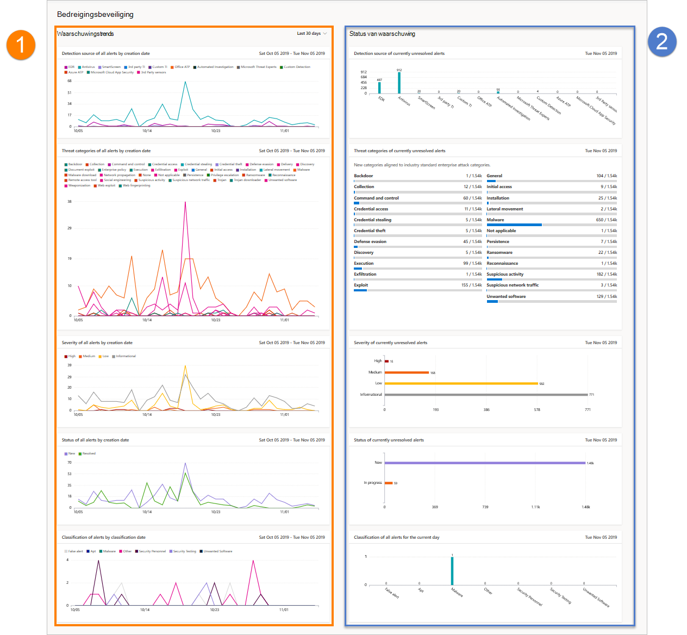

# Rapport bedreigingsbeveiliging in Microsoft Defender voor EindpuntThreat protection report in Microsoft Defender for Endpoint

[!INCLUDE [Microsoft 365 Defender rebranding](../../includes/microsoft-defender.md)]

**Van toepassing op:****Applies to:**
- [Microsoft Defender voor EndpointMicrosoft Defender for Endpoint](https://go.microsoft.com/fwlink/p/?linkid=2154037)
- [Microsoft 365 DefenderMicrosoft 365 Defender](https://go.microsoft.com/fwlink/?linkid=2118804)

> Wilt u Defender voor Eindpunt ervaren?Want to experience Defender for Endpoint? [Meld u aan voor een gratis proefabonnement.Sign up for a free trial.](https://www.microsoft.com/microsoft-365/windows/microsoft-defender-atp?ocid=docs-wdatp-pullalerts-abovefoldlink) 

Het rapport bedreigingsbeveiliging bevat informatie op hoog niveau over waarschuwingen die in uw organisatie worden gegenereerd.The threat protection report provides high-level information about alerts generated in your organization. Het rapport bevat trendgegevens met de detectiebronnen, categorieën, ernst, statussen, classificaties en de bepaling van waarschuwingen in de tijd.The report includes trending information showing the detection sources, categories, severities, statuses, classifications, and determinations of alerts across time.

Het dashboard is gestructureerd in twee secties:The dashboard is structured into two sections:

SectieSection | BeschrijvingDescription 
:---|:---
11 | Trends in waarschuwingenAlerts trends
22 | Overzicht van waarschuwingenAlert summary

## WaarschuwingstrendsAlert trends
Standaard worden in de waarschuwingstrends waarschuwingsgegevens weergegeven uit de periode van 30 dagen die eindigt op de laatste volledige dag.By default, the alert trends display alert information from the 30-day period ending in the latest full day. Als u meer inzicht wilt krijgen in trends in uw organisatie, kunt u de rapportageperiode aanpassen door de weergegeven periode aan te passen.To gain better perspective on trends occurring in your organization, you can fine-tune the reporting period by adjusting the time period shown. Als u de periode wilt aanpassen, selecteert u een tijdsbereik in de vervolgkeuzeopties:To adjust the time period, select a time range from the drop-down options:

- 30 dagen30 days
- 3 maanden3 months
- 6 maanden6 months
- AangepastCustom

>[!NOTE]
>Deze filters worden alleen toegepast op de sectie waarschuwingstrends.These filters are only applied on the alert trends section. Dit heeft geen invloed op de sectie Overzicht van waarschuwingen.It doesn't affect the alert summary section.

## Overzicht van waarschuwingenAlert summary
Terwijl de waarschuwingstrends trending waarschuwingsgegevens laten zien, worden in de overzichtsoverzicht van waarschuwingen waarschuwingsinformatie voor de huidige dag gegeven.While the alert trends shows trending alert information, the alert summary shows alert information scoped to the current day.

 Met het overzicht van waarschuwingen kunt u inzoomen op een bepaalde waarschuwingswachtrij waarbij het bijbehorende filter erop is toegepast.The alert summary allows you to drill down to a particular alert queue with the corresponding filter applied to it. Als u bijvoorbeeld op de EDR-balk in de kaart Detectiebronnen klikt, wordt de wachtrij voor waarschuwingen weergegeven met alleen waarschuwingen die zijn gegenereerd op basis van EDR-detecties.For example, clicking on the EDR bar in the Detection sources card will bring you the alerts queue with results showing only alerts generated from EDR detections. 

>[!NOTE]
>De gegevens die in de samenvattingssectie worden weergegeven, hebben een bereik van 180 dagen vóór de huidige datum.The data reflected in the summary section is scoped to 180 days prior to the current date. Als de datum van vandaag bijvoorbeeld 5 november 2019 is, worden in de gegevens in de samenvattingssectie getallen weergegeven die beginnen van 5 mei 2019 tot en met 5 november 2019.For example if today's date is November 5, 2019, the data on the summary section will reflect numbers starting from May 5, 2019 to November 5, 2019. 
> Het filter dat is toegepast op de sectie Trends, wordt niet toegepast op de samenvattingssectie.The filter applied on the trends section is not applied on the summary section. 

## WaarschuwingskenmerkenAlert attributes
Het rapport bestaat uit kaarten met de volgende waarschuwingskenmerken:The report is made up of cards that display the following alert attributes:

- **Detectiebronnen:** geeft informatie weer over de sensoren en detectietechnologieën die de gegevens bevatten die door Microsoft Defender voor Eindpunt worden gebruikt om waarschuwingen te activeren.**Detection sources**: shows information about the sensors and detection technologies that provide the data used by Microsoft Defender for Endpoint to trigger alerts.

- **Bedreigingscategorieën:** geeft de typen bedreigings- of aanvalsactiviteiten weer die waarschuwingen hebben geactiveerd, waarmee mogelijke focusgebieden voor uw beveiligingsbewerkingen worden aangegeven.**Threat categories**: shows the types of threat or attack activity that triggered alerts, indicating possible focus areas for your security operations.

- **Ernst:** geeft het ernstniveau van waarschuwingen weer, wat aangeeft wat de mogelijke gevolgen zijn van bedreigingen voor uw organisatie en het antwoordniveau dat nodig is om deze aan te pakken.**Severity**: shows the severity level of alerts, indicating the collective potential impact of threats to your organization and the level of response needed to address them.

- **Status:** geeft de resolutiestatus van waarschuwingen weer, waarmee de efficiëntie van uw handmatige waarschuwingsreacties en van geautomatiseerde herstel (indien ingeschakeld) wordt aangegeven.**Status**: shows the resolution status of alerts, indicating the efficiency of your manual alert responses and of automated remediation (if enabled). 

- **Classificatie &** bepaling: laat zien hoe u waarschuwingen hebt geclassificeerd bij resolutie, of u deze hebt geclassificeerd als werkelijke bedreigingen (echte waarschuwingen) of als onjuiste detecties (onwaar waarschuwingen).**Classification & determination**: shows how you have classified alerts upon resolution, whether you have classified them as actual threats (true alerts) or as incorrect detections (false alerts). Deze kaarten geven ook de bepaling van opgeloste waarschuwingen weer, wat extra inzicht geeft, zoals de typen werkelijke bedreigingen die zijn gevonden of de legitieme activiteiten die ten onrechte zijn gedetecteerd.These cards also show the determination of resolved alerts, providing additional insight like the types of actual threats found or the legitimate activities that were incorrectly detected.

 

## Gegevens filterenFilter data

Gebruik de meegeleverde filters om waarschuwingen met bepaalde kenmerken op te nemen of uit te sluiten.Use the provided filters to include or exclude alerts with certain attributes.

>[!NOTE]
>Deze filters zijn van **toepassing op alle** kaarten in het rapport.These filters apply to **all** the cards in the report.

Als u bijvoorbeeld alleen gegevens wilt weergeven over waarschuwingen met hoge ernst:For example, to show data about high-severity alerts only:

1. Selecteer **onder Filters > Ernst** de optie **Hoog**Under **Filters > Severity**, select **High**
2. Zorg ervoor dat alle andere opties onder **Ernst** worden uitgeschakeld.Ensure that all other options under **Severity** are deselected.
3. Selecteer **Toepassen.**Select **Apply**. 

## Verwant onderwerpRelated topic
- [Rapport apparaattoestand en nalevingDevice health and compliance report](machine-reports.md)
