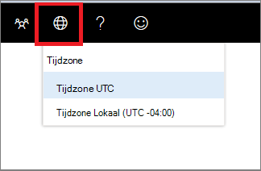

# Microsoft Defender-beveiligingscentrum tijdzone-instellingenMicrosoft Defender Security Center time zone settings

[!INCLUDE [Microsoft 365 Defender rebranding](../../includes/microsoft-defender.md)]

**Van toepassing op:****Applies to:**
- [Microsoft Defender voor EindpuntMicrosoft Defender for Endpoint](https://go.microsoft.com/fwlink/p/?linkid=2154037)

>Wilt u Microsoft Defender voor Eindpunt ervaren?Want to experience Microsoft Defender for Endpoint? [Meld u aan voor een gratis proefabonnement.Sign up for a free trial.](https://www.microsoft.com/microsoft-365/windows/microsoft-defender-atp?ocid=docs-wdatp-settings-abovefoldlink)

Gebruik het **pictogram Tijdzone-instellingen** in het menu  configureren en licentiegegevens weer te geven.Use the **Time zone** menu  to configure the time zone and view license information.

## Tijdzone-instellingenTime zone settings
Het tijdsaspect is belangrijk bij het beoordelen en analyseren van waargenomen en werkelijke cyberaanvallen.The aspect of time is important in the assessment and analysis of perceived and actual cyberattacks.

Cyberforensische onderzoeken zijn vaak afhankelijk van tijdstempels om de volgorde van gebeurtenissen samen te brengen.Cyberforensic investigations often rely on time stamps to piece together the sequence of events. Het is belangrijk dat uw systeem de juiste tijdzone-instellingen weerspiegelt.It’s important that your system reflects the correct time zone settings.

Microsoft Defender voor Eindpunt kan Coordinated Universal Time (UTC) of lokale tijd weergeven.Microsoft Defender for Endpoint can display either Coordinated Universal Time (UTC) or local time.

De huidige tijdzone-instelling wordt weergegeven in het menu Microsoft Defender voor eindpunt.Your current time zone setting is shown in the Microsoft Defender for Endpoint menu. U kunt de weergegeven tijdzone wijzigen in het **menu Tijdzone.**You can change the displayed time zone in the **Time zone** menu.

..

### UTC-tijdzoneUTC time zone
Microsoft Defender voor Eindpunt gebruikt standaard UTC-tijd.Microsoft Defender for Endpoint uses UTC time by default.

Als u de tijdzone van Microsoft Defender voor eindpunt instelt op UTC, worden alle systeemtijdstempels (waarschuwingen, gebeurtenissen en andere) weergegeven in UTC voor alle gebruikers.Setting the Microsoft Defender for Endpoint time zone to UTC will display all system timestamps (alerts, events, and others) in UTC for all users. Dit kan beveiligingsanalisten die op verschillende locaties over de hele wereld werken helpen om dezelfde tijdstempels te gebruiken tijdens het onderzoeken van gebeurtenissen.This can help security analysts working in different locations across the globe to use the same time stamps while investigating events.

### Lokale tijdzoneLocal time zone
U kunt ervoor kiezen om voor Microsoft Defender voor Eindpunt lokale tijdzone-instellingen te laten gebruiken.You can choose to have Microsoft Defender for Endpoint use local time zone settings. Alle waarschuwingen en gebeurtenissen worden weergegeven met uw lokale tijdzone.All alerts and events will be displayed using your local time zone.

De lokale tijdzone wordt overgenomen uit de regionale instellingen van uw apparaat.The local time zone is taken from your device’s regional settings. Als u uw regionale instellingen wijzigt, wordt ook de tijdzone van Microsoft Defender voor eindpunt gewijzigd.If you change your regional settings, the Microsoft Defender for Endpoint time zone will also change. Als u deze instelling kiest, worden de tijdstempels die worden weergegeven in Microsoft Defender voor Eindpunt, uitgelijnd op lokale tijd voor alle Gebruikers van Microsoft Defender voor Eindpunten.Choosing this setting means that the timestamps displayed in Microsoft Defender for Endpoint will be aligned to local time for all Microsoft Defender for Endpoint users. Analisten die zich op verschillende globale locaties bevinden, zien nu de waarschuwingen van Microsoft Defender voor eindpunten op basis van hun landinstellingen.Analysts located in different global locations will now see the Microsoft Defender for Endpoint alerts according to their regional settings.

Het gebruik van lokale tijd kan handig zijn als de analisten zich op één locatie bevinden.Choosing to use local time can be useful if the analysts are located in a single location. In dit geval is het mogelijk gemakkelijker om gebeurtenissen te correleren met lokale tijd, bijvoorbeeld wanneer een lokale gebruiker op een verdachte e-mailkoppeling heeft geklikt.In this case it might be easier to correlate events to local time, for example – when a local user clicked on a suspicious email link.

### De tijdzone instellenSet the time zone
De tijdzone van Microsoft Defender voor eindpunt is standaard ingesteld op UTC.The Microsoft Defender for Endpoint time zone is set by default to UTC.
Als u de tijdzone instelt, worden ook de tijden voor alle Weergaven van Microsoft Defender voor eindpunten gewijzigd.Setting the time zone also changes the times for all Microsoft Defender for Endpoint views.
De tijdzone instellen:To set the time zone:

1. Klik op **het pictogram Tijdzonemenu**  .Click the **Time zone** menu .
2. Selecteer de **timezone UTC-indicator.**Select the **Timezone UTC** indicator.
3. Selecteer **Timezone UTC** of uw lokale tijdzone, bijvoorbeeld -7:00.Select **Timezone UTC** or your local time zone, for example -7:00.

### Regionale instellingenRegional settings
Als u verschillende datumindelingen wilt toepassen voor Microsoft Defender voor Eindpunt, gebruikt u landinstellingen voor Internet Explorer (IE) en Microsoft Edge (Edge).To apply different date formats for Microsoft Defender for Endpoint, use regional settings for Internet Explorer (IE) and Microsoft Edge (Edge). Als u een andere browser gebruikt, zoals Google Chrome, volgt u de vereiste stappen om de tijd- en datuminstellingen voor die browser te wijzigen.If you're using another browser such as Google Chrome, follow the required steps to change the time and date settings for that browser. 

**Internet Explorer (IE) en Microsoft Edge****Internet Explorer (IE) and Microsoft Edge**

IE en Microsoft Edge de **regio-instellingen** gebruiken die zijn geconfigureerd in de optie **Klokken, Taal** en Regio in het configuratiescherm.IE and Microsoft Edge use the **Region** settings configured in the **Clocks, Language, and Region** option in the Control panel. 

#### Bekende problemen met regionale indelingenKnown issues with regional formats

**Datum- en tijdnotaties****Date and time formats** 
Er zijn enkele bekende problemen met de tijd- en datumnotatie.There are some known issues with the time and date formats. Als u uw regionale instellingen configureert op iets anders dan de ondersteunde indelingen, is het mogelijk dat de portal uw instellingen niet correct wedt.If you configure your regional settings to anything other than the supported formats, the portal may not correctly reflect your settings.

De volgende datum- en tijdnotaties worden ondersteund:The following date and time formats are supported:
- Datumnotatie MM/dd/yyyyDate format MM/dd/yyyy
- Datumnotatie dd/MM/yyyyDate format dd/MM/yyyy
- Tijdnotatie hh:mm:ss (12 uursnotatie)Time format hh:mm:ss (12 hour format)

De volgende datum- en tijdindelingen worden momenteel niet ondersteund:The following date and time formats are currently not supported:
- Datumnotatie yyyy-MM-ddDate format yyyy-MM-dd
- Datumnotatie dd-MMM-yyDate format dd-MMM-yy
- Datumnotatie dd/MM/yyDate format dd/MM/yy
- Datumnotatie MM/dd/yyDate format MM/dd/yy
- Datumnotatie met yy.Date format with yy. Toont alleen yyyy.Will only show yyyy.
- Tijdnotatie HH:mm:ss (24 uursnotatie)Time format HH:mm:ss (24 hour format)

**Decimaal symbool dat wordt gebruikt in getallen****Decimal symbol used in numbers** 
Het gebruikte decimale symbool is altijd een punt,  zelfs als een komma is geselecteerd in de instellingen voor de notatie Getallen in **regio-instellingen.**Decimal symbol used is always a dot, even if a comma is selected in  the **Numbers** format settings in **Region** settings. 15,5K wordt bijvoorbeeld weergegeven als 15,5K.For example, 15,5K is displayed as 15.5K.

