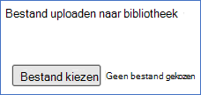
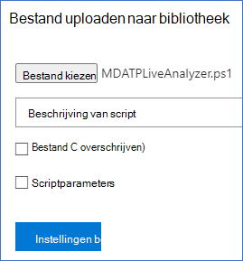

# <a name="collect-support-logs-in-microsoft-defender-for-endpoint-using-live-response"></a><span data-ttu-id="d9ae1-104">Ondersteuningslogboeken verzamelen in Microsoft Defender voor Eindpunt met livereactie</span><span class="sxs-lookup"><span data-stu-id="d9ae1-104">Collect support logs in Microsoft Defender for Endpoint using live response</span></span> 


<span data-ttu-id="d9ae1-105">**Van toepassing op:**</span><span class="sxs-lookup"><span data-stu-id="d9ae1-105">**Applies to:**</span></span>
- [<span data-ttu-id="d9ae1-106">Microsoft Defender voor Eindpunt</span><span class="sxs-lookup"><span data-stu-id="d9ae1-106">Microsoft Defender for Endpoint</span></span>](https://go.microsoft.com/fwlink/p/?linkid=2154037)
- [<span data-ttu-id="d9ae1-107">Microsoft 365 Defender</span><span class="sxs-lookup"><span data-stu-id="d9ae1-107">Microsoft 365 Defender</span></span>](https://go.microsoft.com/fwlink/?linkid=2118804)

> <span data-ttu-id="d9ae1-108">Wilt u Defender voor Eindpunt ervaren?</span><span class="sxs-lookup"><span data-stu-id="d9ae1-108">Want to experience Defender for Endpoint?</span></span> [<span data-ttu-id="d9ae1-109">Meld u aan voor een gratis proefabonnement.</span><span class="sxs-lookup"><span data-stu-id="d9ae1-109">Sign up for a free trial.</span></span>](https://www.microsoft.com/microsoft-365/windows/microsoft-defender-atp?ocid=docs-wdatp-pullalerts-abovefoldlink) 


<span data-ttu-id="d9ae1-110">Wanneer u contact op wilt nemen met de ondersteuning, wordt u mogelijk gevraagd om het uitvoerpakket van het hulpprogramma Microsoft Defender voor Endpoint Client Analyzer op te geven.</span><span class="sxs-lookup"><span data-stu-id="d9ae1-110">When contacting support, you may be asked to provide the output package of the Microsoft Defender for Endpoint Client Analyzer tool.</span></span>

<span data-ttu-id="d9ae1-111">In dit onderwerp vindt u instructies voor het uitvoeren van het hulpprogramma via Live Response.</span><span class="sxs-lookup"><span data-stu-id="d9ae1-111">This topic provides instructions on how to run the tool via Live Response.</span></span>

1. <span data-ttu-id="d9ae1-112">Het juiste script downloaden</span><span class="sxs-lookup"><span data-stu-id="d9ae1-112">Download the appropriate script</span></span>
    * <span data-ttu-id="d9ae1-113">Microsoft Defender for Endpoint client sensor logs only: [LiveAnalyzer.ps1 script](https://aka.ms/MDELiveAnalyzer).</span><span class="sxs-lookup"><span data-stu-id="d9ae1-113">Microsoft Defender for Endpoint client sensor logs only: [LiveAnalyzer.ps1 script](https://aka.ms/MDELiveAnalyzer).</span></span>
      - <span data-ttu-id="d9ae1-114">Geschatte grootte van het resultaatpakket: ~100 Kb</span><span class="sxs-lookup"><span data-stu-id="d9ae1-114">Result package approximate size: ~100Kb</span></span> 
    *  <span data-ttu-id="d9ae1-115">Microsoft Defender for Endpoint client sensor and Antivirus logs: [LiveAnalyzer+MDAV.ps1 script](https://aka.ms/MDELiveAnalyzerAV).</span><span class="sxs-lookup"><span data-stu-id="d9ae1-115">Microsoft Defender for Endpoint client sensor and Antivirus logs: [LiveAnalyzer+MDAV.ps1 script](https://aka.ms/MDELiveAnalyzerAV).</span></span>
       - <span data-ttu-id="d9ae1-116">Geschatte grootte van het resultaatpakket: ~10 Mb</span><span class="sxs-lookup"><span data-stu-id="d9ae1-116">Result package approximate size: ~10Mb</span></span> 
 
2.  <span data-ttu-id="d9ae1-117">Start een [Live Response-sessie](live-response.md#initiate-a-live-response-session-on-a-device) op de computer die u moet onderzoeken.</span><span class="sxs-lookup"><span data-stu-id="d9ae1-117">Initiate a [Live Response session](live-response.md#initiate-a-live-response-session-on-a-device) on the machine you need to investigate.</span></span>

3.  <span data-ttu-id="d9ae1-118">Selecteer **Bestand uploaden naar bibliotheek**.</span><span class="sxs-lookup"><span data-stu-id="d9ae1-118">Select **Upload file to library**.</span></span>

    

4. <span data-ttu-id="d9ae1-120">Selecteer **Bestand kiezen.**</span><span class="sxs-lookup"><span data-stu-id="d9ae1-120">Select **Choose file**.</span></span>

    

5. <span data-ttu-id="d9ae1-122">Selecteer het gedownloade bestand met de MDELiveAnalyzer.ps1 klik op **Bevestigen**</span><span class="sxs-lookup"><span data-stu-id="d9ae1-122">Select the downloaded file named MDELiveAnalyzer.ps1 and then click on **Confirm**</span></span>


   


6. <span data-ttu-id="d9ae1-124">Terwijl u nog in de LiveResponse-sessie zit, gebruikt u de onderstaande opdrachten om de analyzer uit te voeren en het resultaatbestand te verzamelen:</span><span class="sxs-lookup"><span data-stu-id="d9ae1-124">While still in the LiveResponse session, use the commands below to run the analyzer and collect the result file:</span></span>

    ```console
    Run MDELiveAnalyzer.ps1
    GetFile "C:\ProgramData\Microsoft\Windows Defender Advanced Threat Protection\Downloads\MDEClientAnalyzerResult.zip" -auto
    ```

    <span data-ttu-id="d9ae1-125">[](images/analyzer-commands.png#lightbox)</span><span class="sxs-lookup"><span data-stu-id="d9ae1-125">[  ](images/analyzer-commands.png#lightbox)</span></span>


>[!NOTE]
> - <span data-ttu-id="d9ae1-126">De nieuwste preview-versie van MDEClientAnalyzer kan hier worden gedownload: [https://aka.ms/Betamdeanalyzer](https://aka.ms/Betamdeanalyzer) .</span><span class="sxs-lookup"><span data-stu-id="d9ae1-126">The latest preview version of MDEClientAnalyzer can be downloaded here: [https://aka.ms/Betamdeanalyzer](https://aka.ms/Betamdeanalyzer).</span></span>
> 
> - <span data-ttu-id="d9ae1-127">Het LiveAnalyzer-script downloadt het probleemoplossingspakket op de doelmachine van: https://mdatpclientanalyzer.blob.core.windows.net .</span><span class="sxs-lookup"><span data-stu-id="d9ae1-127">The LiveAnalyzer script downloads the troubleshooting package on the destination machine from: https://mdatpclientanalyzer.blob.core.windows.net.</span></span>
> 
>   <span data-ttu-id="d9ae1-128">Als u niet kunt toestaan dat de computer de bovenstaande URL bereikt, uploadt u MDEClientAnalyzerPreview.zip bestand naar de bibliotheek voordat u het LiveAnalyzer-script uit te voeren:</span><span class="sxs-lookup"><span data-stu-id="d9ae1-128">If you cannot allow the machine to reach the above URL, then upload MDEClientAnalyzerPreview.zip file to the library before running the LiveAnalyzer script:</span></span>
>
>   ```console
>   PutFile MDEClientAnalyzerPreview.zip -overwrite
>   Run MDELiveAnalyzer.ps1
>   GetFile "C:\ProgramData\Microsoft\Windows Defender Advanced Threat Protection\Downloads\MDEClientAnalyzerResult.zip" -auto
>   ```
> 
> - <span data-ttu-id="d9ae1-129">Zie Clientconnectiviteit verifiëren met Microsoft Defender voor [endpoint-service-URL's](configure-proxy-internet.md#verify-client-connectivity-to-microsoft-defender-for-endpoint-service-urls)voor meer informatie over het lokaal verzamelen van gegevens op een computer voor het geval de computer niet communiceert met Microsoft Defender voor endpoint-cloudservices of niet wordt weergegeven in de Microsoft Defender for Endpoint-portal zoals verwacht.</span><span class="sxs-lookup"><span data-stu-id="d9ae1-129">For more information on gathering data locally on a machine in case the machine isn't communicating with Microsoft Defender for Endpoint cloud services, or does not appear in Microsoft Defender for Endpoint portal as expected, see [Verify client connectivity to Microsoft Defender for Endpoint service URLs](configure-proxy-internet.md#verify-client-connectivity-to-microsoft-defender-for-endpoint-service-urls).</span></span>
