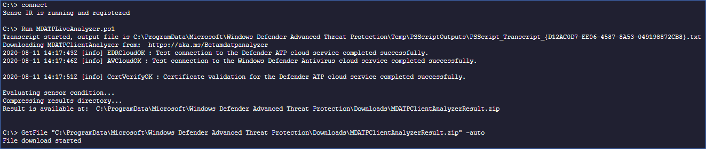

# <a name="collect-support-logs-in-microsoft-defender-for-endpoint-using-live-response"></a>Ondersteuningslogboeken verzamelen in Microsoft Defender voor Eindpunt met livereactie 


**Van toepassing op:**
- [Microsoft Defender voor Endpoint](https://go.microsoft.com/fwlink/p/?linkid=2146631)
- [Microsoft 365 Defender](https://go.microsoft.com/fwlink/?linkid=2118804)

> Wilt u Defender voor Eindpunt ervaren? [Meld u aan voor een gratis proefabonnement.](https://www.microsoft.com/microsoft-365/windows/microsoft-defender-atp?ocid=docs-wdatp-pullalerts-abovefoldlink) 


Wanneer u contact op wilt nemen met de ondersteuning, wordt u mogelijk gevraagd om het uitvoerpakket van het hulpprogramma Microsoft Defender voor Endpoint Client Analyzer op te geven.

In dit onderwerp vindt u instructies voor het uitvoeren van het hulpprogramma via Live Response.

1. Het juiste script downloaden
    * Microsoft Defender for Endpoint client sensor logs only: [LiveAnalyzer.ps1 script](https://aka.ms/MDELiveAnalyzer).
      - Geschatte grootte van het resultaatpakket: ~100 Kb 
    *  Microsoft Defender for Endpoint client sensor and Antivirus logs: [LiveAnalyzer+MDAV.ps1 script](https://aka.ms/MDELiveAnalyzerAV).
       - Geschatte grootte van het resultaatpakket: ~10 Mb 
 
2.  Start een [Live Response-sessie](live-response.md#initiate-a-live-response-session-on-a-device) op de computer die u moet onderzoeken.

3.  Selecteer **Bestand uploaden naar bibliotheek**.

    

4. Selecteer **Bestand kiezen.**

    

5. Selecteer het gedownloade bestand met de MDELiveAnalyzer.ps1 klik op **Bevestigen**


   


6. Terwijl u nog in de LiveResponse-sessie zit, gebruikt u de onderstaande opdrachten om de analyzer uit te voeren en het resultaatbestand te verzamelen:

    ```console
    Run MDELiveAnalyzer.ps1
    GetFile "C:\ProgramData\Microsoft\Windows Defender Advanced Threat Protection\Downloads\MDEClientAnalyzerResult.zip" -auto
    ```

    


>[!NOTE]
> - De nieuwste preview-versie van MDEClientAnalyzer kan hier worden gedownload: [https://aka.ms/Betamdeanalyzer](https://aka.ms/Betamdeanalyzer) .
> 
> - Het LiveAnalyzer-script downloadt het probleemoplossingspakket op de doelmachine van: https://mdatpclientanalyzer.blob.core.windows.net .
> 
>   Als u niet kunt toestaan dat de computer de bovenstaande URL bereikt, uploadt u MDEClientAnalyzerPreview.zip bestand naar de bibliotheek voordat u het LiveAnalyzer-script uit te voeren:
>
>   ```console
>   PutFile MDEClientAnalyzerPreview.zip -overwrite
>   Run MDELiveAnalyzer.ps1
>   GetFile "C:\ProgramData\Microsoft\Windows Defender Advanced Threat Protection\Downloads\MDEClientAnalyzerResult.zip" -auto
>   ```
> 
> - Zie Clientconnectiviteit verifiëren met Microsoft Defender voor [endpoint-service-URL's](configure-proxy-internet.md#verify-client-connectivity-to-microsoft-defender-atp-service-urls)voor meer informatie over het lokaal verzamelen van gegevens op een computer voor het geval de computer niet communiceert met Microsoft Defender voor endpoint-cloudservices of niet wordt weergegeven in de Microsoft Defender for Endpoint-portal zoals verwacht.
