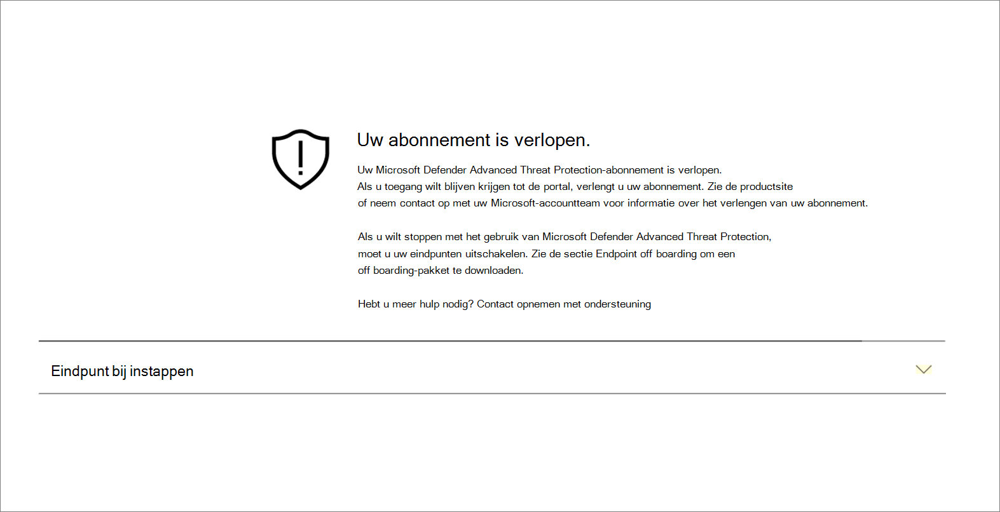

# Problemen met abonnementen en portaltoegang oplossenTroubleshoot subscription and portal access issues

[!INCLUDE [Microsoft 365 Defender rebranding](../../includes/microsoft-defender.md)]

**Van toepassing op:****Applies to:**
- [Microsoft Defender voor EndpointMicrosoft Defender for Endpoint](https://go.microsoft.com/fwlink/p/?linkid=2154037)
- [Microsoft 365 DefenderMicrosoft 365 Defender](https://go.microsoft.com/fwlink/?linkid=2118804)

>Wilt u Microsoft Defender voor Eindpunt ervaren?Want to experience Microsoft Defender for Endpoint? [Meld u aan voor een gratis proefabonnement.Sign up for a free trial.](https://www.microsoft.com/microsoft-365/windows/microsoft-defender-atp?ocid=docs-wdatp-troublshootonboarding-abovefoldlink)

Op deze pagina vindt u gedetailleerde stappen om problemen op te lossen die kunnen optreden bij het instellen van uw Microsoft Defender voor Eindpunt-service.This page provides detailed steps to troubleshoot issues that might occur when setting up your Microsoft Defender for Endpoint service.

Als u een foutbericht ontvangt, geeft het Microsoft Defender-beveiligingscentrum een gedetailleerde uitleg over wat het probleem is en worden relevante koppelingen verstrekt.If you receive an error message, Microsoft Defender Security Center will provide a detailed explanation on what the issue is and relevant links will be supplied.

## Geen abonnementen gevondenNo subscriptions found

Als u tijdens het openen van  het Microsoft Defender-beveiligingscentrum een bericht krijgt dat er geen abonnementen zijn gevonden, betekent dit dat de Azure Active Directory (Azure AD) die wordt gebruikt om zich aan te melden bij de gebruiker bij de portal, geen Microsoft Defender voor Eindpunt-licentie heeft.If while accessing Microsoft Defender Security Center you get a **No subscriptions found** message, it means the Azure Active Directory (Azure AD) used to log in the user to the portal, does not have a Microsoft Defender for Endpoint license.

Mogelijke redenen:Potential reasons:
- De Windows E5- en Office E5-licenties zijn afzonderlijke licenties.The Windows E5 and Office E5 licenses are separate licenses.
- De licentie is aangeschaft, maar niet ingericht voor dit Azure AD-exemplaar.The license was purchased but not provisioned to this Azure AD instance.
    - Het kan een probleem zijn met het inrichten van licenties.It could be a license provisioning issue.
    - Het kan zijn dat u de licentie per ongeluk hebt ingericht op een andere Microsoft Azure AD dan de licentie die voor verificatie in de service wordt gebruikt.It could be you inadvertently provisioned the license to a different Microsoft Azure AD than the one used for authentication into the service.

In beide gevallen moet u contact opnemen met microsoft-ondersteuning bij algemene ondersteuning van Microsoft Defender voor [endpoint-](https://support.microsoft.com/getsupport?wf=0&tenant=ClassicCommercial&oaspworkflow=start_1.0.0.0&locale=en-us&supportregion=en-us&pesid=16055&ccsid=636419533611396913) of [volumelicentieondersteuning.](https://www.microsoft.com/licensing/servicecenter/Help/Contact.aspx)For both cases, you should contact Microsoft support at [General Microsoft Defender for Endpoint Support](https://support.microsoft.com/getsupport?wf=0&tenant=ClassicCommercial&oaspworkflow=start_1.0.0.0&locale=en-us&supportregion=en-us&pesid=16055&ccsid=636419533611396913) or [Volume license support](https://www.microsoft.com/licensing/servicecenter/Help/Contact.aspx).

## Uw abonnement is verlopenYour subscription has expired

Als u tijdens het openen van het Microsoft Defender-beveiligingscentrum een bericht krijgt **dat** uw abonnement is verlopen, is uw onlineserviceabonnement verlopen.If while accessing Microsoft Defender Security Center you get a **Your subscription has expired** message, your online service subscription has expired. Microsoft Defender for Endpoint-abonnement heeft, net als elk ander onlineserviceabonnement, een vervaldatum.Microsoft Defender for Endpoint subscription, like any other online service subscription, has an expiration date. 

U kunt ervoor kiezen om de licentie op elk moment te verlengen of uit te breiden.You can choose to renew or extend the license at any point in time. Bij toegang tot de portal  na de vervaldatum wordt een bericht van uw abonnement dat is verlopen, weergegeven met een optie om het offboarding-pakket van het apparaat te downloaden, mocht u ervoor kiezen om de licentie niet te verlengen.When accessing the portal after the expiration date a **Your subscription has expired** message will be presented with an option to download the device offboarding package, should you choose to not renew the license.

> [!NOTE]
> Om veiligheidsredenen verloopt het pakket dat wordt gebruikt voor Offboard-apparaten 30 dagen na de datum waarop het is gedownload.For security reasons, the package used to Offboard devices will expire 30 days after the date it was downloaded. Verlopen offboarding-pakketten die naar een apparaat zijn verzonden, worden geweigerd.Expired offboarding packages sent to a device will be rejected. Wanneer u een offboarding-pakket downloadt, wordt u op de hoogte gesteld van de vervaldatum van de pakketten en wordt het ook opgenomen in de pakketnaam.When downloading an offboarding package you will be notified of the packages expiry date and it will also be included in the package name.

## U bent niet gemachtigd om toegang te krijgen tot de portalYou are not authorized to access the portal

Als u een U bent niet gemachtigd om toegang te krijgen tot de **portal,** moet u er rekening mee houden dat Microsoft Defender voor Eindpunt een beveiligingscontrole, incidentonderzoek en antwoordproduct is en dat de toegang tot de portal daarom wordt beperkt en gecontroleerd door de gebruiker.If you receive a **You are not authorized to access the portal**, be aware that Microsoft Defender for Endpoint is a security monitoring, incident investigation and response product, and as such, access to it is restricted and controlled by the user.
Zie Gebruikerstoegang toewijzen [**aan de portal voor meer informatie.**](https://docs.microsoft.com/windows/threat-protection/windows-defender-atp/assign-portal-access-windows-defender-advanced-threat-protection)For more information, see, [**Assign user access to the portal**](https://docs.microsoft.com/windows/threat-protection/windows-defender-atp/assign-portal-access-windows-defender-advanced-threat-protection).

## Gegevens zijn momenteel niet beschikbaar in sommige secties van de portalData currently isn't available on some sections of the portal
Als in het portaldashboard en andere secties een foutbericht wordt weergegeven, zoals 'Gegevens zijn momenteel niet beschikbaar':If the portal dashboard and other sections show an error message such as "Data currently isn't available":

U moet de subdomeinen en `securitycenter.windows.com` alle subdomeinen daar onder toestaan.You'll need to allow the `securitycenter.windows.com` and all subdomains under it. Bijvoorbeeld `*.securitycenter.windows.com`.For example, `*.securitycenter.windows.com`.

## Problemen met portalcommunicatiePortal communication issues
Als u problemen ondervindt met toegang tot de portal, ontbrekende gegevens of beperkte toegang tot gedeelten van de portal, moet u controleren of de volgende URL's zijn toegestaan en worden geopend voor communicatie.If you encounter issues with accessing the portal, missing data, or restricted access to portions of the portal, you'll need to verify that the following URLs are allowed and open for communication.

- `*.blob.core.windows.net`
- `crl.microsoft.com`
- `https://*.microsoftonline-p.com`
- `https://*.securitycenter.windows.com` 
- `https://automatediracs-eus-prd.securitycenter.windows.com`
- `https://login.microsoftonline.com`
- `https://login.windows.net`
- `https://onboardingpackagescusprd.blob.core.windows.net`
- `https://secure.aadcdn.microsoftonline-p.com` 
- `https://securitycenter.windows.com` 
- `https://static2.sharepointonline.com` 

