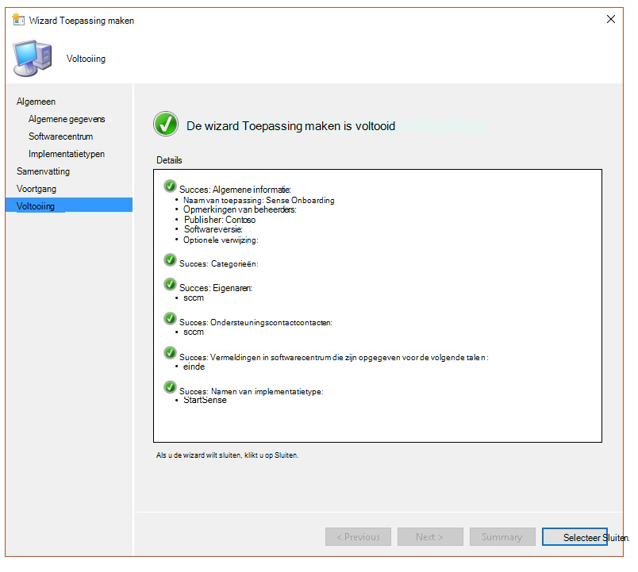

# <a name="troubleshoot-microsoft-defender-for-endpoint-onboarding-issues"></a><span data-ttu-id="1ae48-104">Problemen met de onboarding van Microsoft Defender voor eindpunten oplossen</span><span class="sxs-lookup"><span data-stu-id="1ae48-104">Troubleshoot Microsoft Defender for Endpoint onboarding issues</span></span>

[!INCLUDE [Microsoft 365 Defender rebranding](../../includes/microsoft-defender.md)]


<span data-ttu-id="1ae48-105">**Van toepassing op:**</span><span class="sxs-lookup"><span data-stu-id="1ae48-105">**Applies to:**</span></span>

- [<span data-ttu-id="1ae48-106">Microsoft Defender voor Eindpunt</span><span class="sxs-lookup"><span data-stu-id="1ae48-106">Microsoft Defender for Endpoint</span></span>](https://go.microsoft.com/fwlink/?linkid=2154037)
- <span data-ttu-id="1ae48-107">Windows Server 2012 R2</span><span class="sxs-lookup"><span data-stu-id="1ae48-107">Windows Server 2012 R2</span></span>
- <span data-ttu-id="1ae48-108">Windows Server 2016</span><span class="sxs-lookup"><span data-stu-id="1ae48-108">Windows Server 2016</span></span>
- [<span data-ttu-id="1ae48-109">Microsoft 365 Defender</span><span class="sxs-lookup"><span data-stu-id="1ae48-109">Microsoft 365 Defender</span></span>](https://go.microsoft.com/fwlink/?linkid=2118804)

> <span data-ttu-id="1ae48-110">Wilt u Defender voor Eindpunt ervaren?</span><span class="sxs-lookup"><span data-stu-id="1ae48-110">Want to experience Defender for Endpoint?</span></span> [<span data-ttu-id="1ae48-111">Meld u aan voor een gratis proefabonnement.</span><span class="sxs-lookup"><span data-stu-id="1ae48-111">Sign up for a free trial.</span></span>](https://www.microsoft.com/microsoft-365/windows/microsoft-defender-atp?ocid=docs-wdatp-pullalerts-abovefoldlink) 

<span data-ttu-id="1ae48-112">Mogelijk moet u het onboardingproces van Microsoft Defender voor eindpunten oplossen als u problemen ondervindt.</span><span class="sxs-lookup"><span data-stu-id="1ae48-112">You might need to troubleshoot the Microsoft Defender for Endpoint onboarding process if you encounter issues.</span></span>
<span data-ttu-id="1ae48-113">Op deze pagina vindt u gedetailleerde stappen om problemen met onboarding op te lossen die kunnen optreden bij de implementatie met een van de implementatiehulpmiddelen en veelvoorkomende fouten die op de apparaten kunnen optreden.</span><span class="sxs-lookup"><span data-stu-id="1ae48-113">This page provides detailed steps to troubleshoot onboarding issues that might occur when deploying with one of the deployment tools and common errors that might occur on the devices.</span></span>

## <a name="troubleshoot-issues-with-onboarding-tools"></a><span data-ttu-id="1ae48-114">Problemen met onboarding-hulpprogramma's oplossen</span><span class="sxs-lookup"><span data-stu-id="1ae48-114">Troubleshoot issues with onboarding tools</span></span>

<span data-ttu-id="1ae48-115">Als u het onboardingproces hebt voltooid en [](investigate-machines.md) apparaten na een uur niet in de lijst Apparaten ziet, kan dit een onboarding- of verbindingsprobleem aangeven.</span><span class="sxs-lookup"><span data-stu-id="1ae48-115">If you have completed the onboarding process and don't see devices in the [Devices list](investigate-machines.md) after an hour, it might indicate an onboarding or connectivity problem.</span></span>

### <a name="troubleshoot-onboarding-when-deploying-with-group-policy"></a><span data-ttu-id="1ae48-116">Problemen met onboarding oplossen bij het implementeren met groepsbeleid</span><span class="sxs-lookup"><span data-stu-id="1ae48-116">Troubleshoot onboarding when deploying with Group Policy</span></span>

<span data-ttu-id="1ae48-117">Implementatie met groepsbeleid wordt uitgevoerd door het onboarding-script uit te voeren op de apparaten.</span><span class="sxs-lookup"><span data-stu-id="1ae48-117">Deployment with Group Policy is done by running the onboarding script on the devices.</span></span> <span data-ttu-id="1ae48-118">De console Groepsbeleid geeft niet aan of de implementatie is geslaagd of niet.</span><span class="sxs-lookup"><span data-stu-id="1ae48-118">The Group Policy console does not indicate if the deployment has succeeded or not.</span></span>

<span data-ttu-id="1ae48-119">Als u het onboardingproces hebt voltooid en [](investigate-machines.md) na een uur geen apparaten in de lijst Apparaten ziet, kunt u de uitvoer van het script op de apparaten controleren.</span><span class="sxs-lookup"><span data-stu-id="1ae48-119">If you have completed the onboarding process and don't see devices in the [Devices list](investigate-machines.md) after an hour, you can check the output of the script on the devices.</span></span> <span data-ttu-id="1ae48-120">Zie Problemen met [onboarding oplossen bij het implementeren met een script voor meer informatie.](#troubleshoot-onboarding-when-deploying-with-a-script)</span><span class="sxs-lookup"><span data-stu-id="1ae48-120">For more information, see [Troubleshoot onboarding when deploying with a script](#troubleshoot-onboarding-when-deploying-with-a-script).</span></span>

<span data-ttu-id="1ae48-121">Zie Problemen met [onboarding](#troubleshoot-onboarding-issues-on-the-device) op de apparaten oplossen voor extra fouten die kunnen optreden als het script is voltooid.</span><span class="sxs-lookup"><span data-stu-id="1ae48-121">If the script completes successfully, see [Troubleshoot onboarding issues on the devices](#troubleshoot-onboarding-issues-on-the-device) for additional errors that might occur.</span></span>

### <a name="troubleshoot-onboarding-issues-when-deploying-with-microsoft-endpoint-configuration-manager"></a><span data-ttu-id="1ae48-122">Problemen met onboarding oplossen bij implementatie met Microsoft Endpoint Configuration Manager</span><span class="sxs-lookup"><span data-stu-id="1ae48-122">Troubleshoot onboarding issues when deploying with Microsoft Endpoint Configuration Manager</span></span>

<span data-ttu-id="1ae48-123">Wanneer u apparaten onboardt met de volgende versies van Configuration Manager:</span><span class="sxs-lookup"><span data-stu-id="1ae48-123">When onboarding devices using the following versions of Configuration Manager:</span></span>

- <span data-ttu-id="1ae48-124">Microsoft Endpoint Configuration Manager</span><span class="sxs-lookup"><span data-stu-id="1ae48-124">Microsoft Endpoint Configuration Manager</span></span>
- <span data-ttu-id="1ae48-125">System Center 2012 Configuration Manager</span><span class="sxs-lookup"><span data-stu-id="1ae48-125">System Center 2012 Configuration Manager</span></span>
- <span data-ttu-id="1ae48-126">System Center 2012 R2 Configuration Manager</span><span class="sxs-lookup"><span data-stu-id="1ae48-126">System Center 2012 R2 Configuration Manager</span></span>

<span data-ttu-id="1ae48-127">Implementatie met de hierboven genoemde versies van Configuration Manager wordt uitgevoerd door het onboarding-script op de apparaten uit te voeren.</span><span class="sxs-lookup"><span data-stu-id="1ae48-127">Deployment with the above-mentioned versions of Configuration Manager is done by running the onboarding script on the devices.</span></span> <span data-ttu-id="1ae48-128">U kunt de implementatie bijhouden in de Configuration Manager-console.</span><span class="sxs-lookup"><span data-stu-id="1ae48-128">You can track the deployment in the Configuration Manager Console.</span></span>

<span data-ttu-id="1ae48-129">Als de implementatie mislukt, kunt u de uitvoer van het script op de apparaten controleren.</span><span class="sxs-lookup"><span data-stu-id="1ae48-129">If the deployment fails, you can check the output of the script on the devices.</span></span>

<span data-ttu-id="1ae48-130">Als de onboarding is voltooid, maar de  apparaten na een uur niet worden weergegeven in de lijst Apparaten, zie Problemen met [onboarding](#troubleshoot-onboarding-issues-on-the-device) op het apparaat oplossen voor extra fouten die kunnen optreden.</span><span class="sxs-lookup"><span data-stu-id="1ae48-130">If the onboarding completed successfully but the devices are not showing up in the **Devices list** after an hour, see [Troubleshoot onboarding issues on the device](#troubleshoot-onboarding-issues-on-the-device) for additional errors that might occur.</span></span>

### <a name="troubleshoot-onboarding-when-deploying-with-a-script"></a><span data-ttu-id="1ae48-131">Problemen met onboarding oplossen bij het implementeren met een script</span><span class="sxs-lookup"><span data-stu-id="1ae48-131">Troubleshoot onboarding when deploying with a script</span></span>

<span data-ttu-id="1ae48-132">**Controleer het resultaat van het script op het apparaat:**</span><span class="sxs-lookup"><span data-stu-id="1ae48-132">**Check the result of the script on the device:**</span></span>

1. <span data-ttu-id="1ae48-133">Klik **op Start,** typ **Gebeurtenisviewer** en druk op **Enter.**</span><span class="sxs-lookup"><span data-stu-id="1ae48-133">Click **Start**, type **Event Viewer**, and press **Enter**.</span></span>

2. <span data-ttu-id="1ae48-134">Ga naar **Windows Logs**  >  **Application**.</span><span class="sxs-lookup"><span data-stu-id="1ae48-134">Go to **Windows Logs** > **Application**.</span></span>

3. <span data-ttu-id="1ae48-135">Zoek naar een gebeurtenis uit **WDATPOnboarding-gebeurtenisbron.**</span><span class="sxs-lookup"><span data-stu-id="1ae48-135">Look for an event from **WDATPOnboarding** event source.</span></span>

<span data-ttu-id="1ae48-136">Als het script mislukt en de gebeurtenis een fout is, kunt u de gebeurtenis-id in de volgende tabel controleren om het probleem op te lossen.</span><span class="sxs-lookup"><span data-stu-id="1ae48-136">If the script fails and the event is an error, you can check the event ID in the following table to help you troubleshoot the issue.</span></span>

> [!NOTE]
> <span data-ttu-id="1ae48-137">De volgende gebeurtenis-ID's zijn alleen specifiek voor het onboarding-script.</span><span class="sxs-lookup"><span data-stu-id="1ae48-137">The following event IDs are specific to the onboarding script only.</span></span>

<span data-ttu-id="1ae48-138">Gebeurtenis-id</span><span class="sxs-lookup"><span data-stu-id="1ae48-138">Event ID</span></span> | <span data-ttu-id="1ae48-139">Fouttype</span><span class="sxs-lookup"><span data-stu-id="1ae48-139">Error Type</span></span> | <span data-ttu-id="1ae48-140">Oplossingsstappen</span><span class="sxs-lookup"><span data-stu-id="1ae48-140">Resolution steps</span></span>
:---:|:---|:---
 `5` | <span data-ttu-id="1ae48-141">Offboarding-gegevens zijn gevonden, maar kunnen niet worden verwijderd</span><span class="sxs-lookup"><span data-stu-id="1ae48-141">Offboarding data was found but couldn't be deleted</span></span> | <span data-ttu-id="1ae48-142">Controleer de machtigingen in het register, met name</span><span class="sxs-lookup"><span data-stu-id="1ae48-142">Check the permissions on the registry, specifically</span></span><br> <span data-ttu-id="1ae48-143">`HKLM\SOFTWARE\Policies\Microsoft\Windows Advanced Threat Protection`.</span><span class="sxs-lookup"><span data-stu-id="1ae48-143">`HKLM\SOFTWARE\Policies\Microsoft\Windows Advanced Threat Protection`.</span></span>
`10` | <span data-ttu-id="1ae48-144">Onboarding-gegevens kunnen niet worden geschreven naar het register</span><span class="sxs-lookup"><span data-stu-id="1ae48-144">Onboarding data couldn't be written to registry</span></span> |  <span data-ttu-id="1ae48-145">Controleer de machtigingen in het register, met name</span><span class="sxs-lookup"><span data-stu-id="1ae48-145">Check the permissions on the registry, specifically</span></span><br> <span data-ttu-id="1ae48-146">`HKLM\SOFTWARE\Policies\Microsoft\Windows Advanced Threat Protection`.</span><span class="sxs-lookup"><span data-stu-id="1ae48-146">`HKLM\SOFTWARE\Policies\Microsoft\Windows Advanced Threat Protection`.</span></span><br><span data-ttu-id="1ae48-147">Controleer of het script is uitgevoerd als beheerder.</span><span class="sxs-lookup"><span data-stu-id="1ae48-147">Verify that the script has been run as an administrator.</span></span>
`15` |  <span data-ttu-id="1ae48-148">De SENSE-service kan niet worden begonnen</span><span class="sxs-lookup"><span data-stu-id="1ae48-148">Failed to start SENSE service</span></span> |<span data-ttu-id="1ae48-149">Controleer de servicetoestand `sc query sense` (opdracht).</span><span class="sxs-lookup"><span data-stu-id="1ae48-149">Check the service health (`sc query sense` command).</span></span> <span data-ttu-id="1ae48-150">Zorg ervoor dat het script zich niet in een tussenliggende toestand *('Pending_Stopped'*, *'Pending_Running'*) en probeer het script opnieuw uit te voeren (met beheerdersrechten).</span><span class="sxs-lookup"><span data-stu-id="1ae48-150">Make sure it's not in an intermediate state (*'Pending_Stopped'*, *'Pending_Running'*) and try to run the script again (with administrator rights).</span></span> <br> <br> <span data-ttu-id="1ae48-151">Als op het apparaat Windows 10 wordt uitgevoerd, wordt versie 1607 en het uitvoeren van de opdracht als retourneert, start u `sc query sense` het apparaat opnieuw `START_PENDING` op.</span><span class="sxs-lookup"><span data-stu-id="1ae48-151">If the device is running Windows 10, version 1607 and running the command `sc query sense` returns `START_PENDING`, reboot the device.</span></span> <span data-ttu-id="1ae48-152">Als het opnieuw opstarten van het apparaat het probleem niet aanpakt, upgradet u naar KB4015217 en probeert u opnieuw onboarding uit te voeren.</span><span class="sxs-lookup"><span data-stu-id="1ae48-152">If rebooting the device doesn't address the issue, upgrade to KB4015217 and try onboarding again.</span></span>
`15` | <span data-ttu-id="1ae48-153">De SENSE-service kan niet worden begonnen</span><span class="sxs-lookup"><span data-stu-id="1ae48-153">Failed to start SENSE service</span></span> | <span data-ttu-id="1ae48-154">Als het bericht van de fout is: Systeemfout 577 of fout 1058 is opgetreden, moet u het Microsoft Defender Antivirus ELAM-stuurprogramma inschakelen, zie Ervoor zorgen dat [Microsoft Defender Antivirus](#ensure-that-microsoft-defender-antivirus-is-not-disabled-by-a-policy) niet is uitgeschakeld door een beleid voor instructies.</span><span class="sxs-lookup"><span data-stu-id="1ae48-154">If the message of the error is: System error 577  or error 1058 has occurred, you need to enable the Microsoft Defender Antivirus ELAM driver, see [Ensure that Microsoft Defender Antivirus is not disabled by a policy](#ensure-that-microsoft-defender-antivirus-is-not-disabled-by-a-policy) for instructions.</span></span>
`30` |  <span data-ttu-id="1ae48-155">Het script kan niet wachten totdat de service wordt uitgevoerd</span><span class="sxs-lookup"><span data-stu-id="1ae48-155">The script failed to wait for the service to start running</span></span> | <span data-ttu-id="1ae48-156">De service kan meer tijd hebben genomen om te starten of heeft fouten ondervonden tijdens het starten.</span><span class="sxs-lookup"><span data-stu-id="1ae48-156">The service could have taken more time to start or has encountered errors while trying to start.</span></span> <span data-ttu-id="1ae48-157">Zie Gebeurtenissen en fouten controleren met behulp van [Gebeurtenisviewer](event-error-codes.md)voor meer informatie over gebeurtenissen en fouten met betrekking tot SENSE.</span><span class="sxs-lookup"><span data-stu-id="1ae48-157">For more information on events and errors related to SENSE, see [Review events and errors using Event viewer](event-error-codes.md).</span></span>
`35` |  <span data-ttu-id="1ae48-158">Het script heeft de benodigde registerwaarde voor onboardingstatus niet gevonden</span><span class="sxs-lookup"><span data-stu-id="1ae48-158">The script failed to find needed onboarding status registry value</span></span> | <span data-ttu-id="1ae48-159">Wanneer de SENSE-service voor het eerst wordt gestart, wordt de onboarding-status naar de registerlocatie</span><span class="sxs-lookup"><span data-stu-id="1ae48-159">When the SENSE service starts for the first time, it writes onboarding status to the registry location</span></span><br><span data-ttu-id="1ae48-160">`HKLM\SOFTWARE\Microsoft\Windows Advanced Threat Protection\Status`.</span><span class="sxs-lookup"><span data-stu-id="1ae48-160">`HKLM\SOFTWARE\Microsoft\Windows Advanced Threat Protection\Status`.</span></span><br> <span data-ttu-id="1ae48-161">Het script kon het na enkele seconden niet vinden.</span><span class="sxs-lookup"><span data-stu-id="1ae48-161">The script failed to find it after several seconds.</span></span> <span data-ttu-id="1ae48-162">U kunt deze handmatig testen en controleren of deze er is.</span><span class="sxs-lookup"><span data-stu-id="1ae48-162">You can manually test it and check if it's there.</span></span> <span data-ttu-id="1ae48-163">Zie Gebeurtenissen en fouten controleren met behulp van [Gebeurtenisviewer](event-error-codes.md)voor meer informatie over gebeurtenissen en fouten met betrekking tot SENSE.</span><span class="sxs-lookup"><span data-stu-id="1ae48-163">For more information on events and errors related to SENSE, see [Review events and errors using Event viewer](event-error-codes.md).</span></span>
`40` | <span data-ttu-id="1ae48-164">De status van de SENSE-service onboarding is niet ingesteld op **1**</span><span class="sxs-lookup"><span data-stu-id="1ae48-164">SENSE service onboarding status is not set to **1**</span></span> | <span data-ttu-id="1ae48-165">De SENSE-service is niet goed aan boord gekomen.</span><span class="sxs-lookup"><span data-stu-id="1ae48-165">The SENSE service has failed to onboard properly.</span></span> <span data-ttu-id="1ae48-166">Zie Gebeurtenissen en fouten controleren met behulp van [Gebeurtenisviewer](event-error-codes.md)voor meer informatie over gebeurtenissen en fouten met betrekking tot SENSE.</span><span class="sxs-lookup"><span data-stu-id="1ae48-166">For more information on events and errors related to SENSE, see [Review events and errors using Event viewer](event-error-codes.md).</span></span>
`65` | <span data-ttu-id="1ae48-167">Onvoldoende bevoegdheden</span><span class="sxs-lookup"><span data-stu-id="1ae48-167">Insufficient privileges</span></span>| <span data-ttu-id="1ae48-168">Voer het script opnieuw uit met beheerdersbevoegdheden.</span><span class="sxs-lookup"><span data-stu-id="1ae48-168">Run the script again with administrator privileges.</span></span>

### <a name="troubleshoot-onboarding-issues-using-microsoft-intune"></a><span data-ttu-id="1ae48-169">Problemen met onboarding oplossen met Microsoft Intune</span><span class="sxs-lookup"><span data-stu-id="1ae48-169">Troubleshoot onboarding issues using Microsoft Intune</span></span>

<span data-ttu-id="1ae48-170">U kunt Microsoft Intune gebruiken om foutcodes te controleren en de oorzaak van het probleem op te lossen.</span><span class="sxs-lookup"><span data-stu-id="1ae48-170">You can use Microsoft Intune to check error codes and attempt to troubleshoot the cause of the issue.</span></span>

<span data-ttu-id="1ae48-171">Als u beleidsregels hebt geconfigureerd in Intune en deze niet worden doorgegeven op apparaten, moet u mogelijk automatische MDM-registratie configureren.</span><span class="sxs-lookup"><span data-stu-id="1ae48-171">If you have configured policies in Intune and they are not propagated on devices, you might need to configure automatic MDM enrollment.</span></span>

<span data-ttu-id="1ae48-172">Gebruik de volgende tabellen om de mogelijke oorzaken van problemen tijdens onboarding te begrijpen:</span><span class="sxs-lookup"><span data-stu-id="1ae48-172">Use the following tables to understand the possible causes of issues while onboarding:</span></span>

- <span data-ttu-id="1ae48-173">Microsoft Intune-foutcodes en OMA-URIs tabel</span><span class="sxs-lookup"><span data-stu-id="1ae48-173">Microsoft Intune error codes and OMA-URIs table</span></span>
- <span data-ttu-id="1ae48-174">Bekende problemen met niet-nalevingstabel</span><span class="sxs-lookup"><span data-stu-id="1ae48-174">Known issues with non-compliance table</span></span>
- <span data-ttu-id="1ae48-175">MDM-gebeurtenislogboekentabel (Mobile Device Management)</span><span class="sxs-lookup"><span data-stu-id="1ae48-175">Mobile Device Management (MDM) event logs table</span></span>

<span data-ttu-id="1ae48-176">Als geen van de gebeurtenislogboeken en probleemoplossingsstappen  werkt, downloadt u het lokale script in de sectie Apparaatbeheer van de portal en voer deze uit in een verhoogde opdrachtprompt.</span><span class="sxs-lookup"><span data-stu-id="1ae48-176">If none of the event logs and troubleshooting steps work, download the Local script from the **Device management** section of the portal, and run it in an elevated command prompt.</span></span>

#### <a name="microsoft-intune-error-codes-and-oma-uris"></a><span data-ttu-id="1ae48-177">Microsoft Intune-foutcodes en -OMA-URIs</span><span class="sxs-lookup"><span data-stu-id="1ae48-177">Microsoft Intune error codes and OMA-URIs</span></span>

<span data-ttu-id="1ae48-178">Foutcode Hex</span><span class="sxs-lookup"><span data-stu-id="1ae48-178">Error Code Hex</span></span> | <span data-ttu-id="1ae48-179">Foutcode dec</span><span class="sxs-lookup"><span data-stu-id="1ae48-179">Error Code Dec</span></span> | <span data-ttu-id="1ae48-180">Foutbeschrijving</span><span class="sxs-lookup"><span data-stu-id="1ae48-180">Error Description</span></span> | <span data-ttu-id="1ae48-181">OMA-URI</span><span class="sxs-lookup"><span data-stu-id="1ae48-181">OMA-URI</span></span> | <span data-ttu-id="1ae48-182">Mogelijke stappen voor oorzaak en probleemoplossing</span><span class="sxs-lookup"><span data-stu-id="1ae48-182">Possible cause and troubleshooting steps</span></span>
:---:|:---|:---|:---|:---
<span data-ttu-id="1ae48-183">0x87D1FDE8</span><span class="sxs-lookup"><span data-stu-id="1ae48-183">0x87D1FDE8</span></span> | <span data-ttu-id="1ae48-184">-2016281112</span><span class="sxs-lookup"><span data-stu-id="1ae48-184">-2016281112</span></span> | <span data-ttu-id="1ae48-185">Herstel is mislukt</span><span class="sxs-lookup"><span data-stu-id="1ae48-185">Remediation failed</span></span> | <span data-ttu-id="1ae48-186">Onboarding</span><span class="sxs-lookup"><span data-stu-id="1ae48-186">Onboarding</span></span> <br> <span data-ttu-id="1ae48-187">Offboarding</span><span class="sxs-lookup"><span data-stu-id="1ae48-187">Offboarding</span></span> | <span data-ttu-id="1ae48-188">**Mogelijke oorzaak:** Onboarding of offboarding is mislukt op een verkeerde blob: verkeerde handtekening of ontbrekende velden PreviousOrgIds.</span><span class="sxs-lookup"><span data-stu-id="1ae48-188">**Possible cause:** Onboarding or offboarding failed on a wrong blob: wrong signature or missing PreviousOrgIds fields.</span></span> <br><br> <span data-ttu-id="1ae48-189">**Stappen voor het oplossen van problemen:**</span><span class="sxs-lookup"><span data-stu-id="1ae48-189">**Troubleshooting steps:**</span></span> <br> <span data-ttu-id="1ae48-190">Controleer de gebeurtenis-ID's in de [onboarding-fouten van agentweergave in de sectie apparaatgebeurtenislogboek.](#view-agent-onboarding-errors-in-the-device-event-log)</span><span class="sxs-lookup"><span data-stu-id="1ae48-190">Check the event IDs in the [View agent onboarding errors in the device event log](#view-agent-onboarding-errors-in-the-device-event-log) section.</span></span> <br><br> <span data-ttu-id="1ae48-191">Controleer de MDM-gebeurtenislogboeken in de volgende tabel of volg de instructies in [MDM-fouten diagnosticeren in Windows 10](https://docs.microsoft.com/windows/client-management/mdm/diagnose-mdm-failures-in-windows-10).</span><span class="sxs-lookup"><span data-stu-id="1ae48-191">Check the MDM event logs in the following table or follow the instructions in [Diagnose MDM failures in Windows 10](https://docs.microsoft.com/windows/client-management/mdm/diagnose-mdm-failures-in-windows-10).</span></span>
 | | | | <span data-ttu-id="1ae48-192">Onboarding</span><span class="sxs-lookup"><span data-stu-id="1ae48-192">Onboarding</span></span> <br> <span data-ttu-id="1ae48-193">Offboarding</span><span class="sxs-lookup"><span data-stu-id="1ae48-193">Offboarding</span></span> <br> <span data-ttu-id="1ae48-194">SampleSharing</span><span class="sxs-lookup"><span data-stu-id="1ae48-194">SampleSharing</span></span> | <span data-ttu-id="1ae48-195">**Mogelijke oorzaak:** Microsoft Defender for Endpoint Policy registry key is not exist or the OMA DM client doesn't have permissions to write to it.</span><span class="sxs-lookup"><span data-stu-id="1ae48-195">**Possible cause:** Microsoft Defender for Endpoint Policy registry key does not exist or the OMA DM client doesn't have permissions to write to it.</span></span> <br><br> <span data-ttu-id="1ae48-196">**Stappen voor het oplossen van problemen:** Controleer of de volgende registersleutel bestaat: `HKEY_LOCAL_MACHINE\SOFTWARE\Policies\Microsoft\Windows Advanced Threat Protection`</span><span class="sxs-lookup"><span data-stu-id="1ae48-196">**Troubleshooting steps:** Ensure that the following registry key exists: `HKEY_LOCAL_MACHINE\SOFTWARE\Policies\Microsoft\Windows Advanced Threat Protection`</span></span> <br> <br> <span data-ttu-id="1ae48-197">Als deze niet bestaat, opent u een verhoogde opdracht en voegt u de sleutel toe.</span><span class="sxs-lookup"><span data-stu-id="1ae48-197">If it doesn't exist, open an elevated command and add the key.</span></span>
 | | | | <span data-ttu-id="1ae48-198">SenseIsRunning</span><span class="sxs-lookup"><span data-stu-id="1ae48-198">SenseIsRunning</span></span> <br> <span data-ttu-id="1ae48-199">OnboardingState</span><span class="sxs-lookup"><span data-stu-id="1ae48-199">OnboardingState</span></span> <br> <span data-ttu-id="1ae48-200">OrgId</span><span class="sxs-lookup"><span data-stu-id="1ae48-200">OrgId</span></span> |  <span data-ttu-id="1ae48-201">**Mogelijke oorzaak:** Een poging om te corrigeren met de eigenschap Alleen-lezen.</span><span class="sxs-lookup"><span data-stu-id="1ae48-201">**Possible cause:** An attempt to remediate by read-only property.</span></span> <span data-ttu-id="1ae48-202">Onboarding is mislukt.</span><span class="sxs-lookup"><span data-stu-id="1ae48-202">Onboarding has failed.</span></span> <br><br> <span data-ttu-id="1ae48-203">**Stappen voor het oplossen van problemen:** Bekijk de stappen voor het oplossen van problemen met [onboarding op het apparaat.](#troubleshoot-onboarding-issues-on-the-device)</span><span class="sxs-lookup"><span data-stu-id="1ae48-203">**Troubleshooting steps:** Check the troubleshooting steps in [Troubleshoot onboarding issues on the device](#troubleshoot-onboarding-issues-on-the-device).</span></span> <br><br> <span data-ttu-id="1ae48-204">Controleer de MDM-gebeurtenislogboeken in de volgende tabel of volg de instructies in [MDM-fouten diagnosticeren in Windows 10](https://docs.microsoft.com/windows/client-management/mdm/diagnose-mdm-failures-in-windows-10).</span><span class="sxs-lookup"><span data-stu-id="1ae48-204">Check the MDM event logs in the following table or follow the instructions in [Diagnose MDM failures in Windows 10](https://docs.microsoft.com/windows/client-management/mdm/diagnose-mdm-failures-in-windows-10).</span></span>
 | | | | <span data-ttu-id="1ae48-205">Alles</span><span class="sxs-lookup"><span data-stu-id="1ae48-205">All</span></span> | <span data-ttu-id="1ae48-206">**Mogelijke oorzaak:** Probeer Microsoft Defender voor Eindpunt te implementeren op niet-ondersteunde SKU/Platform, met name Holografische SKU.</span><span class="sxs-lookup"><span data-stu-id="1ae48-206">**Possible cause:** Attempt to deploy Microsoft Defender for Endpoint on non-supported SKU/Platform, particularly Holographic SKU.</span></span> <br><br> <span data-ttu-id="1ae48-207">Momenteel ondersteunde platforms:</span><span class="sxs-lookup"><span data-stu-id="1ae48-207">Currently supported platforms:</span></span><br> <span data-ttu-id="1ae48-208">Enterprise, Education en Professional.</span><span class="sxs-lookup"><span data-stu-id="1ae48-208">Enterprise, Education, and Professional.</span></span><br> <span data-ttu-id="1ae48-209">Server wordt niet ondersteund.</span><span class="sxs-lookup"><span data-stu-id="1ae48-209">Server is not supported.</span></span>
 <span data-ttu-id="1ae48-210">0x87D101A9</span><span class="sxs-lookup"><span data-stu-id="1ae48-210">0x87D101A9</span></span> | <span data-ttu-id="1ae48-211">-2016345687</span><span class="sxs-lookup"><span data-stu-id="1ae48-211">-2016345687</span></span> |<span data-ttu-id="1ae48-212">SyncML(425): De aangevraagde opdracht is mislukt omdat de afzender niet over voldoende toegangsbeheermachtigingen (ACL) voor de geadresseerde heeft.</span><span class="sxs-lookup"><span data-stu-id="1ae48-212">SyncML(425): The requested command failed because the sender does not have adequate access control permissions (ACL) on the recipient.</span></span> | <span data-ttu-id="1ae48-213">Alles</span><span class="sxs-lookup"><span data-stu-id="1ae48-213">All</span></span> |  <span data-ttu-id="1ae48-214">**Mogelijke oorzaak:** Probeer Microsoft Defender voor Eindpunt te implementeren op niet-ondersteunde SKU/Platform, met name Holografische SKU.</span><span class="sxs-lookup"><span data-stu-id="1ae48-214">**Possible cause:** Attempt to deploy Microsoft Defender for Endpoint on non-supported SKU/Platform, particularly Holographic SKU.</span></span><br><br> <span data-ttu-id="1ae48-215">Momenteel ondersteunde platforms:</span><span class="sxs-lookup"><span data-stu-id="1ae48-215">Currently supported platforms:</span></span><br>  <span data-ttu-id="1ae48-216">Enterprise, Education en Professional.</span><span class="sxs-lookup"><span data-stu-id="1ae48-216">Enterprise, Education, and Professional.</span></span>

#### <a name="known-issues-with-non-compliance"></a><span data-ttu-id="1ae48-217">Bekende problemen met niet-naleving</span><span class="sxs-lookup"><span data-stu-id="1ae48-217">Known issues with non-compliance</span></span>

<span data-ttu-id="1ae48-218">De volgende tabel bevat informatie over problemen met niet-naleving en hoe u de problemen kunt oplossen.</span><span class="sxs-lookup"><span data-stu-id="1ae48-218">The following table provides information on issues with non-compliance and how you can address the issues.</span></span>

<span data-ttu-id="1ae48-219">Case</span><span class="sxs-lookup"><span data-stu-id="1ae48-219">Case</span></span> | <span data-ttu-id="1ae48-220">Symptomen</span><span class="sxs-lookup"><span data-stu-id="1ae48-220">Symptoms</span></span> | <span data-ttu-id="1ae48-221">Mogelijke stappen voor oorzaak en probleemoplossing</span><span class="sxs-lookup"><span data-stu-id="1ae48-221">Possible cause and troubleshooting steps</span></span>
:---:|:---|:---
 `1` | <span data-ttu-id="1ae48-222">Apparaat voldoet aan de vereisten van SenseIsRunning OMA-URI.</span><span class="sxs-lookup"><span data-stu-id="1ae48-222">Device is compliant by SenseIsRunning OMA-URI.</span></span> <span data-ttu-id="1ae48-223">Maar is niet compatibel met OrgId, Onboarding en OnboardingState OMA-URIs.</span><span class="sxs-lookup"><span data-stu-id="1ae48-223">But is non-compliant by OrgId, Onboarding and OnboardingState OMA-URIs.</span></span> | <span data-ttu-id="1ae48-224">**Mogelijke oorzaak:** Controleer of de gebruiker OOBE heeft doorgegeven na de installatie of upgrade van Windows.</span><span class="sxs-lookup"><span data-stu-id="1ae48-224">**Possible cause:** Check that user passed OOBE after Windows installation or upgrade.</span></span> <span data-ttu-id="1ae48-225">Tijdens OOBE-onboarding kan niet worden voltooid, maar SENSE wordt al uitgevoerd.</span><span class="sxs-lookup"><span data-stu-id="1ae48-225">During OOBE onboarding couldn't be completed but SENSE is running already.</span></span><br><br> <span data-ttu-id="1ae48-226">**Stappen voor het oplossen van problemen:** Wacht totdat OOBE is voltooid.</span><span class="sxs-lookup"><span data-stu-id="1ae48-226">**Troubleshooting steps:** Wait for OOBE to complete.</span></span>
 `2` |  <span data-ttu-id="1ae48-227">Apparaat voldoet aan de vereisten van OrgId, Onboarding en OnboardingState OMA-URIs, maar is niet compatibel door SenseIsRunning OMA-URI.</span><span class="sxs-lookup"><span data-stu-id="1ae48-227">Device is compliant by OrgId, Onboarding, and OnboardingState OMA-URIs, but is non-compliant by SenseIsRunning OMA-URI.</span></span> |  <span data-ttu-id="1ae48-228">**Mogelijke oorzaak:** Het opstarttype van de service is ingesteld als 'Vertraagde start'.</span><span class="sxs-lookup"><span data-stu-id="1ae48-228">**Possible cause:** Sense service's startup type is set as "Delayed Start".</span></span> <span data-ttu-id="1ae48-229">Soms veroorzaakt dit dat de Microsoft Intune-server het apparaat meldt als niet-compatibel door SenseIsRunning wanneer de DM-sessie plaatsvindt bij het starten van het systeem.</span><span class="sxs-lookup"><span data-stu-id="1ae48-229">Sometimes this causes the Microsoft Intune server to report the device as non-compliant by SenseIsRunning when DM session occurs on system start.</span></span> <br><br> <span data-ttu-id="1ae48-230">**Stappen voor het oplossen van problemen:** Het probleem moet automatisch binnen 24 uur zijn opgelost.</span><span class="sxs-lookup"><span data-stu-id="1ae48-230">**Troubleshooting steps:** The issue should automatically be fixed within 24 hours.</span></span>
 `3` | <span data-ttu-id="1ae48-231">Apparaat voldoet niet</span><span class="sxs-lookup"><span data-stu-id="1ae48-231">Device is non-compliant</span></span> | <span data-ttu-id="1ae48-232">**Stappen voor het oplossen van problemen:** Zorg ervoor dat onboarding- en offboarding-beleid niet tegelijkertijd op hetzelfde apparaat wordt geïmplementeerd.</span><span class="sxs-lookup"><span data-stu-id="1ae48-232">**Troubleshooting steps:** Ensure that Onboarding and Offboarding policies are not deployed on the same device at same time.</span></span>

#### <a name="mobile-device-management-mdm-event-logs"></a><span data-ttu-id="1ae48-233">MDM-gebeurtenislogboeken (Mobile Device Management)</span><span class="sxs-lookup"><span data-stu-id="1ae48-233">Mobile Device Management (MDM) event logs</span></span>

<span data-ttu-id="1ae48-234">Bekijk de MDM-gebeurtenislogboeken om problemen op te lossen die zich tijdens onboarding kunnen voordoen:</span><span class="sxs-lookup"><span data-stu-id="1ae48-234">View the MDM event logs to troubleshoot issues that might arise during onboarding:</span></span>

<span data-ttu-id="1ae48-235">Logboeknaam: Microsoft\Windows\DeviceManagement-EnterpriseDiagnostics-Provider</span><span class="sxs-lookup"><span data-stu-id="1ae48-235">Log name: Microsoft\Windows\DeviceManagement-EnterpriseDiagnostics-Provider</span></span>

<span data-ttu-id="1ae48-236">Kanaalnaam: Beheerder</span><span class="sxs-lookup"><span data-stu-id="1ae48-236">Channel name: Admin</span></span>

<span data-ttu-id="1ae48-237">ID</span><span class="sxs-lookup"><span data-stu-id="1ae48-237">ID</span></span> | <span data-ttu-id="1ae48-238">Ernst</span><span class="sxs-lookup"><span data-stu-id="1ae48-238">Severity</span></span> | <span data-ttu-id="1ae48-239">Gebeurtenisbeschrijving</span><span class="sxs-lookup"><span data-stu-id="1ae48-239">Event description</span></span> | <span data-ttu-id="1ae48-240">Stappen voor probleemoplossing</span><span class="sxs-lookup"><span data-stu-id="1ae48-240">Troubleshooting steps</span></span>
:---|:---|:---|:---
<span data-ttu-id="1ae48-241">1819</span><span class="sxs-lookup"><span data-stu-id="1ae48-241">1819</span></span> | <span data-ttu-id="1ae48-242">Error</span><span class="sxs-lookup"><span data-stu-id="1ae48-242">Error</span></span> | <span data-ttu-id="1ae48-243">Microsoft Defender voor eindpunt CSP: kan de waarde van knooppunt niet instellen.</span><span class="sxs-lookup"><span data-stu-id="1ae48-243">Microsoft Defender for Endpoint CSP: Failed to Set Node's Value.</span></span> <span data-ttu-id="1ae48-244">NodeId: (%1), TokenName: (%2), Resultaat: (%3).</span><span class="sxs-lookup"><span data-stu-id="1ae48-244">NodeId: (%1), TokenName: (%2), Result: (%3).</span></span> | <span data-ttu-id="1ae48-245">Download de [cumulatieve update voor Windows 10, 1607](https://go.microsoft.com/fwlink/?linkid=829760).</span><span class="sxs-lookup"><span data-stu-id="1ae48-245">Download the [Cumulative Update for Windows 10, 1607](https://go.microsoft.com/fwlink/?linkid=829760).</span></span>

## <a name="troubleshoot-onboarding-issues-on-the-device"></a><span data-ttu-id="1ae48-246">Problemen met onboarding op het apparaat oplossen</span><span class="sxs-lookup"><span data-stu-id="1ae48-246">Troubleshoot onboarding issues on the device</span></span>

<span data-ttu-id="1ae48-247">Als de gebruikte implementatiehulpmiddelen geen fout in het onboardingproces aangeven, maar apparaten nog steeds niet binnen een uur in de lijst met apparaten worden weergegeven, gaat u door de volgende verificatieonderwerpen om te controleren of er een fout is opgetreden bij de Microsoft Defender voor Eindpunt-agent.</span><span class="sxs-lookup"><span data-stu-id="1ae48-247">If the deployment tools used does not indicate an error in the onboarding process, but devices are still not appearing in the devices list in an hour, go through the following verification topics to check if an error occurred with the Microsoft Defender for Endpoint agent.</span></span>

- [<span data-ttu-id="1ae48-248">Fouten bij het onboarden van agent weergeven in het gebeurtenislogboek van het apparaat</span><span class="sxs-lookup"><span data-stu-id="1ae48-248">View agent onboarding errors in the device event log</span></span>](#view-agent-onboarding-errors-in-the-device-event-log)
- [<span data-ttu-id="1ae48-249">Controleren of de diagnostische gegevensservice is ingeschakeld</span><span class="sxs-lookup"><span data-stu-id="1ae48-249">Ensure the diagnostic data service is enabled</span></span>](#ensure-the-diagnostics-service-is-enabled)
- [<span data-ttu-id="1ae48-250">Controleren of de service is ingesteld op starten</span><span class="sxs-lookup"><span data-stu-id="1ae48-250">Ensure the service is set to start</span></span>](#ensure-the-service-is-set-to-start)
- [<span data-ttu-id="1ae48-251">Controleer of het apparaat een internetverbinding heeft</span><span class="sxs-lookup"><span data-stu-id="1ae48-251">Ensure the device has an Internet connection</span></span>](#ensure-the-device-has-an-internet-connection)
- [<span data-ttu-id="1ae48-252">Ervoor zorgen dat Microsoft Defender Antivirus niet is uitgeschakeld door een beleid</span><span class="sxs-lookup"><span data-stu-id="1ae48-252">Ensure that Microsoft Defender Antivirus is not disabled by a policy</span></span>](#ensure-that-microsoft-defender-antivirus-is-not-disabled-by-a-policy)

### <a name="view-agent-onboarding-errors-in-the-device-event-log"></a><span data-ttu-id="1ae48-253">Fouten bij het onboarden van agent weergeven in het gebeurtenislogboek van het apparaat</span><span class="sxs-lookup"><span data-stu-id="1ae48-253">View agent onboarding errors in the device event log</span></span>

1. <span data-ttu-id="1ae48-254">Klik **op Start,** typ **Gebeurtenisviewer** en druk op **Enter.**</span><span class="sxs-lookup"><span data-stu-id="1ae48-254">Click **Start**, type **Event Viewer**, and press **Enter**.</span></span>

2. <span data-ttu-id="1ae48-255">Vouw in **het deelvenster Gebeurtenisviewer (lokaal)** **toepassingen en serviceslogboeken**  >  **microsoft**  >  **Windows**  >  **SENSE uit.**</span><span class="sxs-lookup"><span data-stu-id="1ae48-255">In the **Event Viewer (Local)** pane, expand **Applications and Services Logs** > **Microsoft** > **Windows** > **SENSE**.</span></span>

   > [!NOTE]
   > <span data-ttu-id="1ae48-256">SENSE is de interne naam die wordt gebruikt om te verwijzen naar de gedrags sensor die Microsoft Defender voor Eindpunt aandreed.</span><span class="sxs-lookup"><span data-stu-id="1ae48-256">SENSE is the internal name used to refer to the behavioral sensor that powers Microsoft Defender for Endpoint.</span></span>

3. <span data-ttu-id="1ae48-257">Selecteer **Operationeel** om het logboek te laden.</span><span class="sxs-lookup"><span data-stu-id="1ae48-257">Select **Operational** to load the log.</span></span>

4. <span data-ttu-id="1ae48-258">Klik in **het** deelvenster Actie op **Huidig logboek filteren.**</span><span class="sxs-lookup"><span data-stu-id="1ae48-258">In the **Action** pane, click **Filter Current log**.</span></span>

5. <span data-ttu-id="1ae48-259">Klik op **het** tabblad Filter onder **Gebeurtenisniveau op** **Kritiek,** **Waarschuwing** en **Fout** en klik op **OK.**</span><span class="sxs-lookup"><span data-stu-id="1ae48-259">On the **Filter** tab, under **Event level:** select **Critical**, **Warning**, and **Error**, and click **OK**.</span></span>

   

6. <span data-ttu-id="1ae48-261">Gebeurtenissen die problemen kunnen aangeven, worden weergegeven in het **deelvenster** Operationeel.</span><span class="sxs-lookup"><span data-stu-id="1ae48-261">Events which can indicate issues will appear in the **Operational** pane.</span></span> <span data-ttu-id="1ae48-262">U kunt proberen deze problemen op te lossen op basis van de oplossingen in de volgende tabel:</span><span class="sxs-lookup"><span data-stu-id="1ae48-262">You can attempt to troubleshoot them based on the solutions in the following table:</span></span>

<span data-ttu-id="1ae48-263">Gebeurtenis-id</span><span class="sxs-lookup"><span data-stu-id="1ae48-263">Event ID</span></span> | <span data-ttu-id="1ae48-264">Bericht</span><span class="sxs-lookup"><span data-stu-id="1ae48-264">Message</span></span> | <span data-ttu-id="1ae48-265">Oplossingsstappen</span><span class="sxs-lookup"><span data-stu-id="1ae48-265">Resolution steps</span></span>
:---:|:---|:---
 `5` | <span data-ttu-id="1ae48-266">Microsoft Defender for Endpoint-service kan geen verbinding maken met de server bij _variabele_</span><span class="sxs-lookup"><span data-stu-id="1ae48-266">Microsoft Defender for Endpoint service failed to connect to the server at _variable_</span></span> | <span data-ttu-id="1ae48-267">[Controleer of het apparaat internettoegang heeft.](#ensure-the-device-has-an-internet-connection)</span><span class="sxs-lookup"><span data-stu-id="1ae48-267">[Ensure the device has Internet access](#ensure-the-device-has-an-internet-connection).</span></span>
 `6` | <span data-ttu-id="1ae48-268">Microsoft Defender voor Endpoint-service is niet onboarded en er zijn geen onboarding-parameters gevonden.</span><span class="sxs-lookup"><span data-stu-id="1ae48-268">Microsoft Defender for Endpoint service is not onboarded and no onboarding parameters were found.</span></span> <span data-ttu-id="1ae48-269">Foutcode: _variabele_</span><span class="sxs-lookup"><span data-stu-id="1ae48-269">Failure code: _variable_</span></span> | <span data-ttu-id="1ae48-270">[Voer het onboarding-script opnieuw uit.](configure-endpoints-script.md)</span><span class="sxs-lookup"><span data-stu-id="1ae48-270">[Run the onboarding script again](configure-endpoints-script.md).</span></span>
 `7` | <span data-ttu-id="1ae48-271">Microsoft Defender voor Endpoint-service kan de onboarding-parameters niet lezen.</span><span class="sxs-lookup"><span data-stu-id="1ae48-271">Microsoft Defender for Endpoint service failed to read the onboarding parameters.</span></span> <span data-ttu-id="1ae48-272">Foutcode: _variabele_</span><span class="sxs-lookup"><span data-stu-id="1ae48-272">Failure code: _variable_</span></span> | <span data-ttu-id="1ae48-273">[Controleer of het apparaat internettoegang heeft](#ensure-the-device-has-an-internet-connection)en voer vervolgens het hele onboardingproces opnieuw uit.</span><span class="sxs-lookup"><span data-stu-id="1ae48-273">[Ensure the device has Internet access](#ensure-the-device-has-an-internet-connection), then run the entire onboarding process again.</span></span>
 `9` | <span data-ttu-id="1ae48-274">Het begintype van de Microsoft Defender voor Eindpunt-service is niet gewijzigd.</span><span class="sxs-lookup"><span data-stu-id="1ae48-274">Microsoft Defender for Endpoint service failed to change its start type.</span></span> <span data-ttu-id="1ae48-275">Foutcode: variabele</span><span class="sxs-lookup"><span data-stu-id="1ae48-275">Failure code: variable</span></span> | <span data-ttu-id="1ae48-276">Als de gebeurtenis is gebeurd tijdens onboarding, start u het onboarding-script opnieuw op en probeert u het opnieuw uit te voeren.</span><span class="sxs-lookup"><span data-stu-id="1ae48-276">If the event happened during onboarding, reboot and re-attempt running the onboarding script.</span></span> <span data-ttu-id="1ae48-277">Zie Het [onboarding-script opnieuw uitvoeren](configure-endpoints-script.md)voor meer informatie.</span><span class="sxs-lookup"><span data-stu-id="1ae48-277">For more information, see [Run the onboarding script again](configure-endpoints-script.md).</span></span> <br><br><span data-ttu-id="1ae48-278">Als de gebeurtenis is gebeurd tijdens het offboarden, neem dan contact op met de ondersteuning.</span><span class="sxs-lookup"><span data-stu-id="1ae48-278">If the event happened during offboarding, contact support.</span></span>
`10` | <span data-ttu-id="1ae48-279">Microsoft Defender voor Endpoint-service kan de onboarding-informatie niet blijven gebruiken.</span><span class="sxs-lookup"><span data-stu-id="1ae48-279">Microsoft Defender for Endpoint service failed to persist the onboarding information.</span></span> <span data-ttu-id="1ae48-280">Foutcode: variabele</span><span class="sxs-lookup"><span data-stu-id="1ae48-280">Failure code: variable</span></span> | <span data-ttu-id="1ae48-281">Als de gebeurtenis is gebeurd tijdens onboarding, probeert u het onboarding-script opnieuw uit te voeren.</span><span class="sxs-lookup"><span data-stu-id="1ae48-281">If the event happened during onboarding, re-attempt running the onboarding script.</span></span> <span data-ttu-id="1ae48-282">Zie Het [onboarding-script opnieuw uitvoeren](configure-endpoints-script.md)voor meer informatie.</span><span class="sxs-lookup"><span data-stu-id="1ae48-282">For more information, see [Run the onboarding script again](configure-endpoints-script.md).</span></span> <br><br><span data-ttu-id="1ae48-283">Als het probleem zich blijft voordoen, neem dan contact op met de ondersteuning.</span><span class="sxs-lookup"><span data-stu-id="1ae48-283">If the problem persists, contact support.</span></span>
`15` | <span data-ttu-id="1ae48-284">Microsoft Defender voor Eindpunt kan opdrachtkanaal niet starten met URL: _variabele_</span><span class="sxs-lookup"><span data-stu-id="1ae48-284">Microsoft Defender for Endpoint cannot start command channel with URL: _variable_</span></span> | <span data-ttu-id="1ae48-285">[Controleer of het apparaat internettoegang heeft.](#ensure-the-device-has-an-internet-connection)</span><span class="sxs-lookup"><span data-stu-id="1ae48-285">[Ensure the device has Internet access](#ensure-the-device-has-an-internet-connection).</span></span>
`17` | <span data-ttu-id="1ae48-286">Microsoft Defender voor Endpoint-service kan de verbonden gebruikerservaringen en telemetrieservicelocatie niet wijzigen.</span><span class="sxs-lookup"><span data-stu-id="1ae48-286">Microsoft Defender for Endpoint service failed to change the Connected User Experiences and Telemetry service location.</span></span> <span data-ttu-id="1ae48-287">Foutcode: variabele</span><span class="sxs-lookup"><span data-stu-id="1ae48-287">Failure code: variable</span></span> | <span data-ttu-id="1ae48-288">[Voer het onboarding-script opnieuw uit.](configure-endpoints-script.md)</span><span class="sxs-lookup"><span data-stu-id="1ae48-288">[Run the onboarding script again](configure-endpoints-script.md).</span></span> <span data-ttu-id="1ae48-289">Als het probleem zich blijft voordoen, neem dan contact op met de ondersteuning.</span><span class="sxs-lookup"><span data-stu-id="1ae48-289">If the problem persists, contact support.</span></span>
`25` | <span data-ttu-id="1ae48-290">De statusstatus van het register is niet opnieuw ingesteld door de Microsoft Defender voor eindpuntservice.</span><span class="sxs-lookup"><span data-stu-id="1ae48-290">Microsoft Defender for Endpoint service failed to reset health status in the registry.</span></span> <span data-ttu-id="1ae48-291">Foutcode: _variabele_</span><span class="sxs-lookup"><span data-stu-id="1ae48-291">Failure code: _variable_</span></span> | <span data-ttu-id="1ae48-292">Neem contact op met ondersteuning.</span><span class="sxs-lookup"><span data-stu-id="1ae48-292">Contact support.</span></span>
`27` | <span data-ttu-id="1ae48-293">De modus Microsoft Defender voor eindpunt is niet ingeschakeld in Windows Defender.</span><span class="sxs-lookup"><span data-stu-id="1ae48-293">Failed to enable Microsoft Defender for Endpoint mode in Windows Defender.</span></span> <span data-ttu-id="1ae48-294">Onboarding is mislukt.</span><span class="sxs-lookup"><span data-stu-id="1ae48-294">Onboarding process failed.</span></span> <span data-ttu-id="1ae48-295">Foutcode: variabele</span><span class="sxs-lookup"><span data-stu-id="1ae48-295">Failure code: variable</span></span> | <span data-ttu-id="1ae48-296">Neem contact op met ondersteuning.</span><span class="sxs-lookup"><span data-stu-id="1ae48-296">Contact support.</span></span>
`29` | <span data-ttu-id="1ae48-297">Kan de offboarding-parameters niet lezen.</span><span class="sxs-lookup"><span data-stu-id="1ae48-297">Failed to read the offboarding parameters.</span></span> <span data-ttu-id="1ae48-298">Fouttype: %1, Foutcode: %2, Beschrijving: %3</span><span class="sxs-lookup"><span data-stu-id="1ae48-298">Error type: %1, Error code: %2, Description: %3</span></span> | <span data-ttu-id="1ae48-299">Controleer of het apparaat internettoegang heeft en voer vervolgens het hele offboarding-proces opnieuw uit.</span><span class="sxs-lookup"><span data-stu-id="1ae48-299">Ensure the device has Internet access, then run the entire offboarding process again.</span></span>
`30` | <span data-ttu-id="1ae48-300">Kan de modus $(build.sense.productDisplayName) niet uitschakelen in Microsoft Defender voor Eindpunt.</span><span class="sxs-lookup"><span data-stu-id="1ae48-300">Failed to disable $(build.sense.productDisplayName) mode in Microsoft Defender for Endpoint.</span></span> <span data-ttu-id="1ae48-301">Foutcode: %1</span><span class="sxs-lookup"><span data-stu-id="1ae48-301">Failure code: %1</span></span> | <span data-ttu-id="1ae48-302">Neem contact op met ondersteuning.</span><span class="sxs-lookup"><span data-stu-id="1ae48-302">Contact support.</span></span>
`32` | <span data-ttu-id="1ae48-303">De service $(build.sense.productDisplayName) heeft niet gevraagd om zichzelf te stoppen na het offboarden.</span><span class="sxs-lookup"><span data-stu-id="1ae48-303">$(build.sense.productDisplayName) service failed to request to stop itself after offboarding process.</span></span> <span data-ttu-id="1ae48-304">Foutcode: %1</span><span class="sxs-lookup"><span data-stu-id="1ae48-304">Failure code: %1</span></span> | <span data-ttu-id="1ae48-305">Controleer of het begintype van de service handmatig is en start het apparaat opnieuw op.</span><span class="sxs-lookup"><span data-stu-id="1ae48-305">Verify that the service start type is manual and reboot the device.</span></span>
`55` | <span data-ttu-id="1ae48-306">Kan de autologger Secure ETW niet maken.</span><span class="sxs-lookup"><span data-stu-id="1ae48-306">Failed to create the Secure ETW autologger.</span></span> <span data-ttu-id="1ae48-307">Foutcode: %1</span><span class="sxs-lookup"><span data-stu-id="1ae48-307">Failure code: %1</span></span> | <span data-ttu-id="1ae48-308">Start het apparaat opnieuw op.</span><span class="sxs-lookup"><span data-stu-id="1ae48-308">Reboot the device.</span></span>
`63` | <span data-ttu-id="1ae48-309">Het begintype van een externe service bijwerken.</span><span class="sxs-lookup"><span data-stu-id="1ae48-309">Updating the start type of external service.</span></span> <span data-ttu-id="1ae48-310">Naam: %1, werkelijke begintype: %2, verwacht begintype: %3, exitcode: %4</span><span class="sxs-lookup"><span data-stu-id="1ae48-310">Name: %1, actual start type: %2, expected start type: %3, exit code: %4</span></span> | <span data-ttu-id="1ae48-311">Bepaal wat de oorzaak is van wijzigingen in het begintype van de vermelde service.</span><span class="sxs-lookup"><span data-stu-id="1ae48-311">Identify what is causing changes in start type of mentioned service.</span></span> <span data-ttu-id="1ae48-312">Als de exitcode niet 0 is, moet u het begintype handmatig herstellen op het verwachte begintype.</span><span class="sxs-lookup"><span data-stu-id="1ae48-312">If the exit code is not 0, fix the start type manually to expected start type.</span></span>
`64` | <span data-ttu-id="1ae48-313">Externe service starten gestopt.</span><span class="sxs-lookup"><span data-stu-id="1ae48-313">Starting stopped external service.</span></span> <span data-ttu-id="1ae48-314">Naam: %1, exitcode: %2</span><span class="sxs-lookup"><span data-stu-id="1ae48-314">Name: %1, exit code: %2</span></span> | <span data-ttu-id="1ae48-315">Neem contact op met de ondersteuning als de gebeurtenis opnieuw wordt weergegeven.</span><span class="sxs-lookup"><span data-stu-id="1ae48-315">Contact support if the event keeps re-appearing.</span></span>
`68` | <span data-ttu-id="1ae48-316">Het begintype van de service is onverwacht.</span><span class="sxs-lookup"><span data-stu-id="1ae48-316">The start type of the service is unexpected.</span></span> <span data-ttu-id="1ae48-317">Servicenaam: %1, werkelijke begintype: %2, verwacht begintype: %3</span><span class="sxs-lookup"><span data-stu-id="1ae48-317">Service name: %1, actual start type: %2, expected start type: %3</span></span> | <span data-ttu-id="1ae48-318">Bepaal wat de oorzaak is van wijzigingen in het begintype.</span><span class="sxs-lookup"><span data-stu-id="1ae48-318">Identify what is causing changes in start type.</span></span> <span data-ttu-id="1ae48-319">Fix mentioned service start type.</span><span class="sxs-lookup"><span data-stu-id="1ae48-319">Fix mentioned service start type.</span></span>
`69` | <span data-ttu-id="1ae48-320">De service wordt gestopt.</span><span class="sxs-lookup"><span data-stu-id="1ae48-320">The service is stopped.</span></span> <span data-ttu-id="1ae48-321">Servicenaam: %1</span><span class="sxs-lookup"><span data-stu-id="1ae48-321">Service name: %1</span></span> | <span data-ttu-id="1ae48-322">Start de vermelde service.</span><span class="sxs-lookup"><span data-stu-id="1ae48-322">Start the mentioned service.</span></span> <span data-ttu-id="1ae48-323">Neem contact op met de ondersteuning als deze zich blijft voordoen.</span><span class="sxs-lookup"><span data-stu-id="1ae48-323">Contact support if persists.</span></span>

<br />

<span data-ttu-id="1ae48-324">Er zijn extra onderdelen op het apparaat waar de Microsoft Defender voor Eindpunt-agent van afhankelijk is om goed te kunnen werken.</span><span class="sxs-lookup"><span data-stu-id="1ae48-324">There are additional components on the device that the Microsoft Defender for Endpoint agent depends on to function properly.</span></span> <span data-ttu-id="1ae48-325">Als er geen onboardinggerelateerde fouten zijn in het gebeurtenislogboek van microsoft Defender voor eindpuntagent, gaat u verder met de volgende stappen om ervoor te zorgen dat de aanvullende onderdelen correct zijn geconfigureerd.</span><span class="sxs-lookup"><span data-stu-id="1ae48-325">If there are no onboarding related errors in the Microsoft Defender for Endpoint agent event log, proceed with the following steps to ensure that the additional components are configured correctly.</span></span>

<span id="ensure-the-diagnostics-service-is-enabled" />

### <a name="ensure-the-diagnostic-data-service-is-enabled"></a><span data-ttu-id="1ae48-326">Controleren of de diagnostische gegevensservice is ingeschakeld</span><span class="sxs-lookup"><span data-stu-id="1ae48-326">Ensure the diagnostic data service is enabled</span></span>

<span data-ttu-id="1ae48-327">Als de apparaten niet correct rapporteren, moet u mogelijk controleren of de diagnostische gegevensservice van Windows 10 is ingesteld op automatisch starten en wordt uitgevoerd op het apparaat.</span><span class="sxs-lookup"><span data-stu-id="1ae48-327">If the devices aren't reporting correctly, you might need to check that the Windows 10 diagnostic data service is set to automatically start and is running on the device.</span></span> <span data-ttu-id="1ae48-328">De service is mogelijk uitgeschakeld door andere programma's of wijzigingen in de gebruikersconfiguratie.</span><span class="sxs-lookup"><span data-stu-id="1ae48-328">The service might have been disabled by other programs or user configuration changes.</span></span>

<span data-ttu-id="1ae48-329">Controleer eerst of de service is ingesteld op automatisch starten wanneer Windows wordt gestart. Controleer vervolgens of de service momenteel actief is (en start de service als dat niet zo is).</span><span class="sxs-lookup"><span data-stu-id="1ae48-329">First, you should check that the service is set to start automatically when Windows starts, then you should check that the service is currently running (and start it if it isn't).</span></span>

### <a name="ensure-the-service-is-set-to-start"></a><span data-ttu-id="1ae48-330">Controleren of de service is ingesteld op starten</span><span class="sxs-lookup"><span data-stu-id="1ae48-330">Ensure the service is set to start</span></span>

<span data-ttu-id="1ae48-331">**Gebruik de opdrachtregel om het opstarttype van de diagnostische gegevensservice voor Windows 10 te controleren:**</span><span class="sxs-lookup"><span data-stu-id="1ae48-331">**Use the command line to check the Windows 10 diagnostic data service startup type**:</span></span>

1. <span data-ttu-id="1ae48-332">Open een opdrachtregelprompt met verhoogde opdrachtregel op het apparaat:</span><span class="sxs-lookup"><span data-stu-id="1ae48-332">Open an elevated command-line prompt on the device:</span></span>

   <span data-ttu-id="1ae48-333">a.</span><span class="sxs-lookup"><span data-stu-id="1ae48-333">a.</span></span> <span data-ttu-id="1ae48-334">Klik **op Start,** typ **cmd** en druk op **Enter.**</span><span class="sxs-lookup"><span data-stu-id="1ae48-334">Click **Start**, type **cmd**, and press **Enter**.</span></span>

   <span data-ttu-id="1ae48-335">b.</span><span class="sxs-lookup"><span data-stu-id="1ae48-335">b.</span></span> <span data-ttu-id="1ae48-336">Klik met de rechtermuisknop **op Opdrachtprompt** en selecteer **Uitvoeren als beheerder.**</span><span class="sxs-lookup"><span data-stu-id="1ae48-336">Right-click **Command prompt** and select **Run as administrator**.</span></span>

2. <span data-ttu-id="1ae48-337">Voer de volgende opdracht in en druk op **Enter:**</span><span class="sxs-lookup"><span data-stu-id="1ae48-337">Enter the following command, and press **Enter**:</span></span>

   ```text
   sc qc diagtrack
   ```

   <span data-ttu-id="1ae48-338">Als de service is ingeschakeld, ziet het resultaat eruit als de volgende schermafbeelding:</span><span class="sxs-lookup"><span data-stu-id="1ae48-338">If the service is enabled, then the result should look like the following screenshot:</span></span>

   

   <span data-ttu-id="1ae48-340">Als de service niet is ingesteld op , moet u instellen dat de `START_TYPE` `AUTO_START` service automatisch wordt start.</span><span class="sxs-lookup"><span data-stu-id="1ae48-340">If the `START_TYPE` is not set to `AUTO_START`, then you'll need to set the service to automatically start.</span></span>

<span data-ttu-id="1ae48-341">**Gebruik de opdrachtregel om de diagnostische gegevensservice van Windows 10 in te stellen om automatisch te starten:**</span><span class="sxs-lookup"><span data-stu-id="1ae48-341">**Use the command line to set the Windows 10 diagnostic data service to automatically start:**</span></span>

1. <span data-ttu-id="1ae48-342">Open een opdrachtregelprompt met verhoogde opdrachtregel op het apparaat:</span><span class="sxs-lookup"><span data-stu-id="1ae48-342">Open an elevated command-line prompt on the device:</span></span>

   <span data-ttu-id="1ae48-343">a.</span><span class="sxs-lookup"><span data-stu-id="1ae48-343">a.</span></span> <span data-ttu-id="1ae48-344">Klik **op Start,** typ **cmd** en druk op **Enter.**</span><span class="sxs-lookup"><span data-stu-id="1ae48-344">Click **Start**, type **cmd**, and press **Enter**.</span></span>

   <span data-ttu-id="1ae48-345">b.</span><span class="sxs-lookup"><span data-stu-id="1ae48-345">b.</span></span> <span data-ttu-id="1ae48-346">Klik met de rechtermuisknop **op Opdrachtprompt** en selecteer **Uitvoeren als beheerder.**</span><span class="sxs-lookup"><span data-stu-id="1ae48-346">Right-click **Command prompt** and select **Run as administrator**.</span></span>

2. <span data-ttu-id="1ae48-347">Voer de volgende opdracht in en druk op **Enter:**</span><span class="sxs-lookup"><span data-stu-id="1ae48-347">Enter the following command, and press **Enter**:</span></span>

   ```text
   sc config diagtrack start=auto
   ```

3. <span data-ttu-id="1ae48-348">Er wordt een succesbericht weergegeven.</span><span class="sxs-lookup"><span data-stu-id="1ae48-348">A success message is displayed.</span></span> <span data-ttu-id="1ae48-349">Controleer de wijziging door de volgende opdracht in te voeren en druk op **Enter:**</span><span class="sxs-lookup"><span data-stu-id="1ae48-349">Verify the change by entering the following command, and press **Enter**:</span></span>

   ```text
   sc qc diagtrack
   ```

4. <span data-ttu-id="1ae48-350">Start de service.</span><span class="sxs-lookup"><span data-stu-id="1ae48-350">Start the service.</span></span>

   <span data-ttu-id="1ae48-351">a.</span><span class="sxs-lookup"><span data-stu-id="1ae48-351">a.</span></span> <span data-ttu-id="1ae48-352">Typ in de opdrachtprompt de volgende opdracht en druk op **Enter:**</span><span class="sxs-lookup"><span data-stu-id="1ae48-352">In the command prompt, type the following command and press **Enter**:</span></span>

   ```text
   sc start diagtrack
   ```

### <a name="ensure-the-device-has-an-internet-connection"></a><span data-ttu-id="1ae48-353">Controleer of het apparaat een internetverbinding heeft</span><span class="sxs-lookup"><span data-stu-id="1ae48-353">Ensure the device has an Internet connection</span></span>

<span data-ttu-id="1ae48-354">Voor de Microsoft Defender voor eindpunten-sensor moet Microsoft Windows HTTP (WinHTTP) sensorgegevens rapporteren en communiceren met de Microsoft Defender voor Eindpunt-service.</span><span class="sxs-lookup"><span data-stu-id="1ae48-354">The Microsoft Defender for Endpoint sensor requires Microsoft Windows HTTP (WinHTTP) to report sensor data and communicate with the Microsoft Defender for Endpoint service.</span></span>

<span data-ttu-id="1ae48-355">WinHTTP is onafhankelijk van de instellingen voor internetbrowsersproxy en andere contexttoepassingen van gebruikers en moet de proxyservers kunnen detecteren die beschikbaar zijn in uw specifieke omgeving.</span><span class="sxs-lookup"><span data-stu-id="1ae48-355">WinHTTP is independent of the Internet browsing proxy settings and other user context applications and must be able to detect the proxy servers that are available in your particular environment.</span></span>

<span data-ttu-id="1ae48-356">Als u ervoor wilt zorgen dat de sensor serviceconnectiviteit heeft, volgt u de stappen die worden beschreven in het onderwerp Clientconnectiviteit verifiëren met [Microsoft Defender voor endpoint-service-URL's.](configure-proxy-internet.md#verify-client-connectivity-to-microsoft-defender-for-endpoint-service-urls)</span><span class="sxs-lookup"><span data-stu-id="1ae48-356">To ensure that sensor has service connectivity, follow the steps described in the [Verify client connectivity to Microsoft Defender for Endpoint service URLs](configure-proxy-internet.md#verify-client-connectivity-to-microsoft-defender-for-endpoint-service-urls) topic.</span></span>

<span data-ttu-id="1ae48-357">Als de verificatie mislukt en uw omgeving een proxy gebruikt om verbinding te maken met internet, volgt u de stappen die worden beschreven in het onderwerp Instellingen voor proxy- en [internetverbinding](configure-proxy-internet.md) configureren.</span><span class="sxs-lookup"><span data-stu-id="1ae48-357">If the verification fails and your environment is using a proxy to connect to the Internet, then follow the steps described in [Configure proxy and Internet connectivity settings](configure-proxy-internet.md) topic.</span></span>

### <a name="ensure-that-microsoft-defender-antivirus-is-not-disabled-by-a-policy"></a><span data-ttu-id="1ae48-358">Ervoor zorgen dat Microsoft Defender Antivirus niet is uitgeschakeld door een beleid</span><span class="sxs-lookup"><span data-stu-id="1ae48-358">Ensure that Microsoft Defender Antivirus is not disabled by a policy</span></span>

> [!IMPORTANT]
> <span data-ttu-id="1ae48-359">Het volgende geldt alleen  voor apparaten die de update van augustus 2020 (versie 4.18.2007.8) nog niet hebben ontvangen voor Microsoft Defender Antivirus.</span><span class="sxs-lookup"><span data-stu-id="1ae48-359">The following only applies to devices that have **not** yet received the August 2020 (version 4.18.2007.8) update to Microsoft Defender Antivirus.</span></span>
>
> <span data-ttu-id="1ae48-360">De update zorgt ervoor dat Microsoft Defender Antivirus niet kan worden uitgeschakeld op clientapparaten via systeembeleid.</span><span class="sxs-lookup"><span data-stu-id="1ae48-360">The update ensures that Microsoft Defender Antivirus cannot be turned off on client devices via system policy.</span></span>

<span data-ttu-id="1ae48-361">**Probleem:** De Microsoft Defender voor Eindpunt-service start niet na onboarding.</span><span class="sxs-lookup"><span data-stu-id="1ae48-361">**Problem**: The Microsoft Defender for Endpoint service does not start after onboarding.</span></span>

<span data-ttu-id="1ae48-362">**Symptoom:** Onboarding is voltooid, maar u ziet fout 577 of fout 1058 bij het starten van de service.</span><span class="sxs-lookup"><span data-stu-id="1ae48-362">**Symptom**: Onboarding successfully completes, but you see error 577 or error 1058 when trying to start the service.</span></span>

<span data-ttu-id="1ae48-363">**Oplossing:** Als op uw apparaten een antimalwareclient van derden wordt uitgevoerd, moet het ELAM-stuurprogramma (Early Launch Antimalware) van Microsoft Defender for Endpoint worden ingeschakeld.</span><span class="sxs-lookup"><span data-stu-id="1ae48-363">**Solution**: If your devices are running a third-party antimalware client, the Microsoft Defender for Endpoint agent needs the Early Launch Antimalware (ELAM) driver to be enabled.</span></span> <span data-ttu-id="1ae48-364">U moet ervoor zorgen dat het niet is uitgeschakeld door een systeembeleid.</span><span class="sxs-lookup"><span data-stu-id="1ae48-364">You must ensure that it's not turned off by a system policy.</span></span>

- <span data-ttu-id="1ae48-365">Afhankelijk van het hulpprogramma dat u gebruikt om beleid te implementeren, moet u controleren of het volgende Windows Defender-beleid is geweken:</span><span class="sxs-lookup"><span data-stu-id="1ae48-365">Depending on the tool that you use to implement policies, you'll need to verify that the following Windows Defender policies are cleared:</span></span>

  - <span data-ttu-id="1ae48-366">DisableAntiSpyware</span><span class="sxs-lookup"><span data-stu-id="1ae48-366">DisableAntiSpyware</span></span>
  - <span data-ttu-id="1ae48-367">DisableAntiVirus</span><span class="sxs-lookup"><span data-stu-id="1ae48-367">DisableAntiVirus</span></span>

  <span data-ttu-id="1ae48-368">In groepsbeleid mogen er bijvoorbeeld geen vermeldingen zijn, zoals de volgende waarden:</span><span class="sxs-lookup"><span data-stu-id="1ae48-368">For example, in Group Policy there should be no entries such as the following values:</span></span>

  - `<Key Path="SOFTWARE\Policies\Microsoft\Windows Defender"><KeyValue Value="0" ValueKind="DWord" Name="DisableAntiSpyware"/></Key>`
  - `<Key Path="SOFTWARE\Policies\Microsoft\Windows Defender"><KeyValue Value="0" ValueKind="DWord" Name="DisableAntiVirus"/></Key>`

> [!IMPORTANT]
> <span data-ttu-id="1ae48-369">De instelling wordt stopgezet en wordt genegeerd op alle clientapparaten, vanaf de update van augustus `disableAntiSpyware` 2020 (versie 4.18.2007.8) naar Microsoft Defender Antivirus.</span><span class="sxs-lookup"><span data-stu-id="1ae48-369">The `disableAntiSpyware` setting is discontinued and will be ignored on all client devices, as of the August 2020 (version 4.18.2007.8) update to Microsoft Defender Antivirus.</span></span>

- <span data-ttu-id="1ae48-370">Na het wissen van het beleid, kunt u de onboarding-stappen opnieuw uitvoeren.</span><span class="sxs-lookup"><span data-stu-id="1ae48-370">After clearing the policy, run the onboarding steps again.</span></span>

- <span data-ttu-id="1ae48-371">U kunt ook de vorige registersleutelwaarden controleren om te controleren of het beleid is uitgeschakeld door de registersleutel te `HKEY_LOCAL_MACHINE\SOFTWARE\Policies\Microsoft\Windows Defender` openen.</span><span class="sxs-lookup"><span data-stu-id="1ae48-371">You can also check the previous registry key values to verify that the policy is disabled, by opening the registry key `HKEY_LOCAL_MACHINE\SOFTWARE\Policies\Microsoft\Windows Defender`.</span></span>

    

   > [!NOTE]
   > <span data-ttu-id="1ae48-373">Alle Windows Defender-services (wdboot, wdfilter, wdnisdrv, wdnissvc en windefend) moeten hun standaardtoestand hebben.</span><span class="sxs-lookup"><span data-stu-id="1ae48-373">All Windows Defender services (wdboot, wdfilter, wdnisdrv, wdnissvc, and windefend) should be in their default state.</span></span> <span data-ttu-id="1ae48-374">Het wijzigen van het opstarten van deze services wordt niet ondersteund en kan u dwingen uw systeem opnieuw te maken.</span><span class="sxs-lookup"><span data-stu-id="1ae48-374">Changing the startup of these services is unsupported and may force you to reimage your system.</span></span>
   >
   > <span data-ttu-id="1ae48-375">Voorbeeld van standaardconfiguraties voor WdBoot en WdFilter:</span><span class="sxs-lookup"><span data-stu-id="1ae48-375">Example default configurations for WdBoot and WdFilter:</span></span>
   > - `<Key Path="SYSTEM\CurrentControlSet\Services\WdBoot"><KeyValue Value="0" ValueKind="DWord" Name="Start"/></Key>`
   > - `<Key Path="SYSTEM\CurrentControlSet\Services\WdFilter"><KeyValue Value="0" ValueKind="DWord" Name="Start"/></Key>`

## <a name="troubleshoot-onboarding-issues-on-a-server"></a><span data-ttu-id="1ae48-376">Problemen met onboarding op een server oplossen</span><span class="sxs-lookup"><span data-stu-id="1ae48-376">Troubleshoot onboarding issues on a server</span></span>

<span data-ttu-id="1ae48-377">Als u problemen ondervindt tijdens het onboarden van een server, gaat u door de volgende verificatiestappen om mogelijke problemen op te lossen.</span><span class="sxs-lookup"><span data-stu-id="1ae48-377">If you encounter issues while onboarding a server, go through the following verification steps to address possible issues.</span></span>

- [<span data-ttu-id="1ae48-378">Controleer of Microsoft Monitoring Agent (MMA) is geïnstalleerd en geconfigureerd voor het rapporteren van sensorgegevens aan de service</span><span class="sxs-lookup"><span data-stu-id="1ae48-378">Ensure Microsoft Monitoring Agent (MMA) is installed and configured to report sensor data to the service</span></span>](configure-server-endpoints.md)
- [<span data-ttu-id="1ae48-379">Controleer of de serverproxy- en internetverbindingsinstellingen correct zijn geconfigureerd</span><span class="sxs-lookup"><span data-stu-id="1ae48-379">Ensure that the server proxy and Internet connectivity settings are configured properly</span></span>](configure-server-endpoints.md)

<span data-ttu-id="1ae48-380">Mogelijk moet u het volgende controleren:</span><span class="sxs-lookup"><span data-stu-id="1ae48-380">You might also need to check the following:</span></span>

- <span data-ttu-id="1ae48-381">Controleer of er een Microsoft Defender voor eindpuntservice wordt uitgevoerd op het tabblad **Processen** in **Taakbeheer.**</span><span class="sxs-lookup"><span data-stu-id="1ae48-381">Check that there is a Microsoft Defender for Endpoint Service running in the **Processes** tab in **Task Manager**.</span></span> <span data-ttu-id="1ae48-382">Bijvoorbeeld:</span><span class="sxs-lookup"><span data-stu-id="1ae48-382">For example:</span></span>

    

- <span data-ttu-id="1ae48-384">Controleer **Event Viewer** Applications and Services  >  **Logs** Operation Manager  >  **om** te zien of er fouten zijn.</span><span class="sxs-lookup"><span data-stu-id="1ae48-384">Check **Event Viewer** > **Applications and Services Logs** > **Operation Manager** to see if there are any errors.</span></span>

- <span data-ttu-id="1ae48-385">Controleer **in Services** of de Microsoft Monitoring **Agent** wordt uitgevoerd op de server.</span><span class="sxs-lookup"><span data-stu-id="1ae48-385">In **Services**, check if the **Microsoft Monitoring Agent** is running on the server.</span></span> <span data-ttu-id="1ae48-386">Bijvoorbeeld:</span><span class="sxs-lookup"><span data-stu-id="1ae48-386">For example,</span></span>

    

- <span data-ttu-id="1ae48-388">Controleer **in Microsoft Monitoring Agent** Azure Log Analytics  >  **(OMS)** de werkruimten en controleer of de status wordt uitgevoerd.</span><span class="sxs-lookup"><span data-stu-id="1ae48-388">In **Microsoft Monitoring Agent** > **Azure Log Analytics (OMS)**, check the Workspaces and verify that the status is running.</span></span>

    

- <span data-ttu-id="1ae48-390">Controleer of apparaten worden weergegeven in de lijst **Apparaten** in de portal.</span><span class="sxs-lookup"><span data-stu-id="1ae48-390">Check to see that devices are reflected in the **Devices list** in the portal.</span></span>

## <a name="confirming-onboarding-of-newly-built-devices"></a><span data-ttu-id="1ae48-391">Onboarding van nieuw gebouwde apparaten bevestigen</span><span class="sxs-lookup"><span data-stu-id="1ae48-391">Confirming onboarding of newly built devices</span></span>

<span data-ttu-id="1ae48-392">Het kan zijn dat onboarding wordt geïmplementeerd op een nieuw gebouwd apparaat, maar niet is voltooid.</span><span class="sxs-lookup"><span data-stu-id="1ae48-392">There may be instances when onboarding is deployed on a newly built device but not completed.</span></span>

<span data-ttu-id="1ae48-393">De onderstaande stappen geven richtlijnen voor het volgende scenario:</span><span class="sxs-lookup"><span data-stu-id="1ae48-393">The steps below provide guidance for the following scenario:</span></span>

- <span data-ttu-id="1ae48-394">Onboarding-pakket wordt geïmplementeerd op nieuw gebouwde apparaten</span><span class="sxs-lookup"><span data-stu-id="1ae48-394">Onboarding package is deployed to newly built devices</span></span>
- <span data-ttu-id="1ae48-395">Sensor start niet omdat de out-of-box-ervaring (OOBE) of de eerste aanmelding van de gebruiker niet is voltooid</span><span class="sxs-lookup"><span data-stu-id="1ae48-395">Sensor does not start because the Out-of-box experience (OOBE) or first user logon has not been completed</span></span>
- <span data-ttu-id="1ae48-396">Apparaat is uitgeschakeld of opnieuw gestart voordat de eindgebruiker een eerste aanmelding uitvoert</span><span class="sxs-lookup"><span data-stu-id="1ae48-396">Device is turned off or restarted before the end user performs a first logon</span></span>
- <span data-ttu-id="1ae48-397">In dit scenario start de SENSE-service niet automatisch, ook al is onboarding-pakket geïmplementeerd</span><span class="sxs-lookup"><span data-stu-id="1ae48-397">In this scenario, the SENSE service will not start automatically even though onboarding package was deployed</span></span>

> [!NOTE]
> <span data-ttu-id="1ae48-398">De volgende stappen zijn alleen relevant wanneer u Microsoft Endpoint Configuration Manager gebruikt.</span><span class="sxs-lookup"><span data-stu-id="1ae48-398">The following steps are only relevant when using Microsoft Endpoint Configuration Manager.</span></span> <span data-ttu-id="1ae48-399">Zie [Microsoft Defender for Endpoint](https://docs.microsoft.com/mem/configmgr/protect/deploy-use/windows-defender-advanced-threat-protection)voor meer informatie over onboarding met Microsoft Endpoint Configuration Manager.</span><span class="sxs-lookup"><span data-stu-id="1ae48-399">For more details about onboarding using Microsoft Endpoint Configuration Manager, see [Microsoft Defender for Endpoint](https://docs.microsoft.com/mem/configmgr/protect/deploy-use/windows-defender-advanced-threat-protection).</span></span>

1. <span data-ttu-id="1ae48-400">Een toepassing maken in Microsoft Endpoint Configuration Manager.</span><span class="sxs-lookup"><span data-stu-id="1ae48-400">Create an application in Microsoft Endpoint Configuration Manager.</span></span>

    

2. <span data-ttu-id="1ae48-402">Selecteer **Handmatig de toepassingsgegevens opgeven.**</span><span class="sxs-lookup"><span data-stu-id="1ae48-402">Select **Manually specify the application information**.</span></span>

    

3. <span data-ttu-id="1ae48-404">Geef informatie op over de toepassing en **selecteer** volgende .</span><span class="sxs-lookup"><span data-stu-id="1ae48-404">Specify information about the application, then select **Next**.</span></span>

    

4. <span data-ttu-id="1ae48-406">Geef informatie op over het softwarecentrum en **selecteer** Volgende.</span><span class="sxs-lookup"><span data-stu-id="1ae48-406">Specify information about the software center, then select **Next**.</span></span>

    

5. <span data-ttu-id="1ae48-408">Selecteer toevoegen in **implementatietypen.** </span><span class="sxs-lookup"><span data-stu-id="1ae48-408">In **Deployment types** select **Add**.</span></span>

    

6. <span data-ttu-id="1ae48-410">Selecteer **Handmatig de gegevens van het implementatietype opgeven** en selecteer vervolgens **Volgende.**</span><span class="sxs-lookup"><span data-stu-id="1ae48-410">Select **Manually specify the deployment type information**, then select **Next**.</span></span>

    

7. <span data-ttu-id="1ae48-412">Geef informatie op over het implementatietype en **selecteer** Volgende.</span><span class="sxs-lookup"><span data-stu-id="1ae48-412">Specify information about the deployment type, then select **Next**.</span></span>

    

8. <span data-ttu-id="1ae48-414">Geef **in het programma**  >  **Inhoudsinstallatie** de opdracht op: `net start sense` .</span><span class="sxs-lookup"><span data-stu-id="1ae48-414">In **Content** > **Installation program** specify the command: `net start sense`.</span></span>

    

9. <span data-ttu-id="1ae48-416">Selecteer **in detectiemethode** **Regels configureren om de aanwezigheid** van dit implementatietype te detecteren en selecteer vervolgens Component **toevoegen.**</span><span class="sxs-lookup"><span data-stu-id="1ae48-416">In **Detection method**, select **Configure rules to detect the presence of this deployment type**, then select **Add Clause**.</span></span>

    

10. <span data-ttu-id="1ae48-418">Geef de volgende detectieregeldetails op en selecteer **OK:**</span><span class="sxs-lookup"><span data-stu-id="1ae48-418">Specify the following detection rule details, then select **OK**:</span></span>

    

11. <span data-ttu-id="1ae48-420">Selecteer volgende in **detectiemethode.** </span><span class="sxs-lookup"><span data-stu-id="1ae48-420">In **Detection method** select **Next**.</span></span>

    

12. <span data-ttu-id="1ae48-422">Geef **in Gebruikerservaring** de volgende informatie op en selecteer **Volgende:**</span><span class="sxs-lookup"><span data-stu-id="1ae48-422">In **User Experience**, specify the following information, then select **Next**:</span></span>

    

13. <span data-ttu-id="1ae48-424">Selecteer **Volgende** in **Vereisten.**</span><span class="sxs-lookup"><span data-stu-id="1ae48-424">In **Requirements**, select **Next**.</span></span>

    

14. <span data-ttu-id="1ae48-426">Selecteer Volgende in **Afhankelijkheden.** </span><span class="sxs-lookup"><span data-stu-id="1ae48-426">In **Dependencies**, select **Next**.</span></span>

    

15. <span data-ttu-id="1ae48-428">Selecteer **Volgende** in **Samenvatting.**</span><span class="sxs-lookup"><span data-stu-id="1ae48-428">In **Summary**, select **Next**.</span></span>

    

16. <span data-ttu-id="1ae48-430">Selecteer **In Voltooiing** de optie **Sluiten.**</span><span class="sxs-lookup"><span data-stu-id="1ae48-430">In **Completion**, select **Close**.</span></span>

    

17. <span data-ttu-id="1ae48-432">Selecteer volgende in **implementatietypen.** </span><span class="sxs-lookup"><span data-stu-id="1ae48-432">In **Deployment types**, select **Next**.</span></span>

    

18. <span data-ttu-id="1ae48-434">Selecteer **Volgende** in **Samenvatting.**</span><span class="sxs-lookup"><span data-stu-id="1ae48-434">In **Summary**, select **Next**.</span></span>

    

    <span data-ttu-id="1ae48-436">De status wordt vervolgens weergegeven: Afbeelding van Configuratiebeheer van </span><span class="sxs-lookup"><span data-stu-id="1ae48-436">The status is then displayed: </span></span>

19. <span data-ttu-id="1ae48-437">Selecteer **In Voltooiing** de optie **Sluiten.**</span><span class="sxs-lookup"><span data-stu-id="1ae48-437">In **Completion**, select **Close**.</span></span>

    

20. <span data-ttu-id="1ae48-439">U kunt de toepassing nu implementeren door met de rechtermuisknop op de app te klikken en **Implementeren te selecteren.**</span><span class="sxs-lookup"><span data-stu-id="1ae48-439">You can now deploy the application by right-clicking the app and selecting **Deploy**.</span></span>

    

21. <span data-ttu-id="1ae48-441">Selecteer **in Algemeen** automatisch inhoud **distribueren voor afhankelijkheden** en **Bladeren.**</span><span class="sxs-lookup"><span data-stu-id="1ae48-441">In **General** select **Automatically distribute content for dependencies** and **Browse**.</span></span>

    

22. <span data-ttu-id="1ae48-443">Selecteer **volgende** in **Inhoud.**</span><span class="sxs-lookup"><span data-stu-id="1ae48-443">In **Content** select **Next**.</span></span>

    

23. <span data-ttu-id="1ae48-445">Selecteer **volgende in implementatie-instellingen.** </span><span class="sxs-lookup"><span data-stu-id="1ae48-445">In **Deployment settings**, select **Next**.</span></span>

    

24. <span data-ttu-id="1ae48-447">Selecteer **in Planning** zo snel mogelijk na de beschikbare **tijd** de optie **Volgende.**</span><span class="sxs-lookup"><span data-stu-id="1ae48-447">In **Scheduling** select **As soon as possible after the available time**, then select **Next**.</span></span>

    

25. <span data-ttu-id="1ae48-449">Selecteer **in Gebruikerservaring** de optie Wijzigingen uitvoeren bij deadline of tijdens een **onderhoudsvenster (moet** opnieuw worden gestart) en selecteer **vervolgens Volgende**.</span><span class="sxs-lookup"><span data-stu-id="1ae48-449">In **User experience**, select **Commit changes at deadline or during a maintenance window (requires restarts)**, then select **Next**.</span></span>

    

26. <span data-ttu-id="1ae48-451">Selecteer **volgende** in **Waarschuwingen.**</span><span class="sxs-lookup"><span data-stu-id="1ae48-451">In **Alerts** select **Next**.</span></span>

    

27. <span data-ttu-id="1ae48-453">Selecteer **Volgende** in **Samenvatting.**</span><span class="sxs-lookup"><span data-stu-id="1ae48-453">In **Summary**, select **Next**.</span></span>

    

    <span data-ttu-id="1ae48-455">De status wordt vervolgens weergegeven Afbeelding van configuratie van </span><span class="sxs-lookup"><span data-stu-id="1ae48-455">The status is then displayed </span></span>

28. <span data-ttu-id="1ae48-456">Selecteer **In Voltooiing** de optie **Sluiten.**</span><span class="sxs-lookup"><span data-stu-id="1ae48-456">In **Completion**, select **Close**.</span></span>

    


## <a name="related-topics"></a><span data-ttu-id="1ae48-458">Verwante onderwerpen</span><span class="sxs-lookup"><span data-stu-id="1ae48-458">Related topics</span></span>

- [<span data-ttu-id="1ae48-459">Problemen met Microsoft Defender voor Eindpunt oplossen</span><span class="sxs-lookup"><span data-stu-id="1ae48-459">Troubleshoot Microsoft Defender for Endpoint</span></span>](troubleshoot-mdatp.md)
- [<span data-ttu-id="1ae48-460">Onboard-apparaten</span><span class="sxs-lookup"><span data-stu-id="1ae48-460">Onboard devices</span></span>](onboard-configure.md)
- [<span data-ttu-id="1ae48-461">Instellingen voor apparaatproxy en internetverbinding configureren</span><span class="sxs-lookup"><span data-stu-id="1ae48-461">Configure device proxy and Internet connectivity settings</span></span>](configure-proxy-internet.md)
