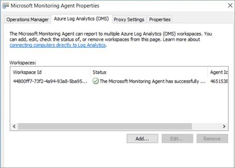
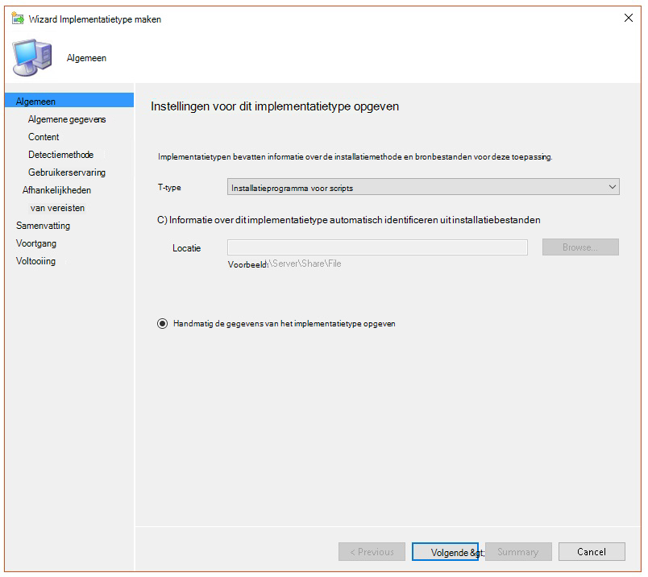
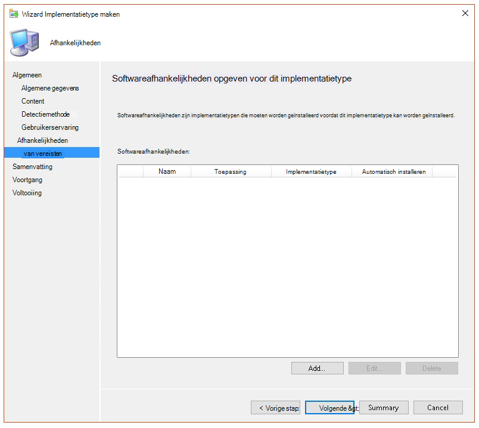
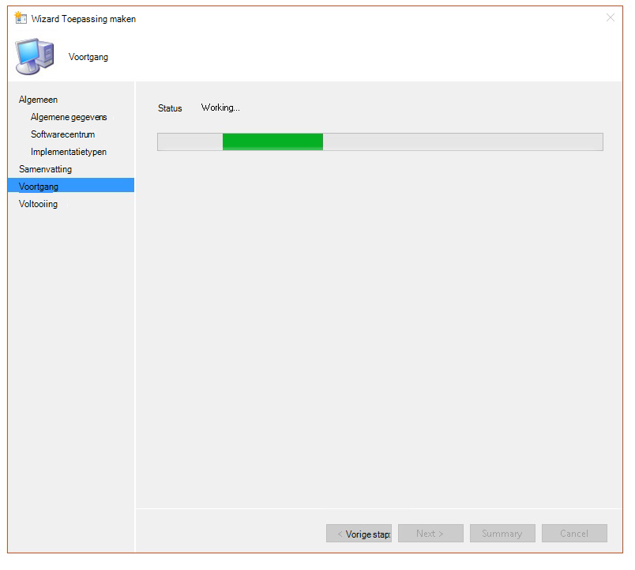
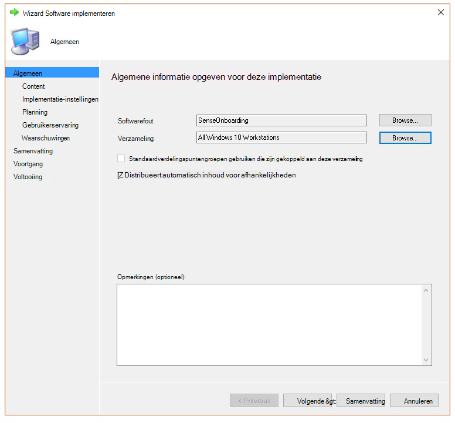

# <a name="troubleshoot-microsoft-defender-for-endpoint-onboarding-issues"></a>Problemen met de onboarding van Microsoft Defender voor eindpunten oplossen

[!INCLUDE [Microsoft 365 Defender rebranding](../../includes/microsoft-defender.md)]


**Van toepassing op:**

- [Microsoft Defender voor Eindpunt](https://go.microsoft.com/fwlink/?linkid=2154037)
- Windows Server 2012 R2
- Windows Server 2016
- [Microsoft 365 Defender](https://go.microsoft.com/fwlink/?linkid=2118804)

> Wilt u Defender voor Eindpunt ervaren? [Meld u aan voor een gratis proefversie.](https://www.microsoft.com/microsoft-365/windows/microsoft-defender-atp?ocid=docs-wdatp-pullalerts-abovefoldlink) 

Mogelijk moet u het onboardingproces van Microsoft Defender voor eindpunten oplossen als u problemen ondervindt.
Op deze pagina vindt u gedetailleerde stappen om problemen met onboarding op te lossen die kunnen optreden bij de implementatie met een van de implementatiehulpmiddelen en veelvoorkomende fouten die op de apparaten kunnen optreden.

## <a name="troubleshoot-issues-with-onboarding-tools"></a>Problemen met onboarding-hulpprogramma's oplossen

Als u het onboardingproces hebt voltooid en [](investigate-machines.md) apparaten na een uur niet in de lijst Apparaten ziet, kan dit een onboarding- of verbindingsprobleem aangeven.

### <a name="troubleshoot-onboarding-when-deploying-with-group-policy"></a>Problemen met onboarding oplossen bij het implementeren met groepsbeleid

Implementatie met groepsbeleid wordt uitgevoerd door het onboarding-script uit te voeren op de apparaten. De console Groepsbeleid geeft niet aan of de implementatie is geslaagd of niet.

Als u het onboardingproces hebt voltooid en [](investigate-machines.md) na een uur geen apparaten in de lijst Apparaten ziet, kunt u de uitvoer van het script op de apparaten controleren. Zie Problemen met [onboarding oplossen bij het implementeren met een script voor meer informatie.](#troubleshoot-onboarding-when-deploying-with-a-script)

Zie Problemen met [onboarding](#troubleshoot-onboarding-issues-on-the-device) op de apparaten oplossen voor extra fouten die kunnen optreden als het script is voltooid.

### <a name="troubleshoot-onboarding-issues-when-deploying-with-microsoft-endpoint-configuration-manager"></a>Problemen met onboarding oplossen bij het implementeren met Microsoft Endpoint Configuration Manager

Wanneer u apparaten onboardt met de volgende versies van Configuration Manager:

- Microsoft Endpoint Configuration Manager
- System Center 2012 Configuration Manager
- System Center 2012 R2 Configuration Manager

Implementatie met de hierboven genoemde versies van Configuration Manager wordt uitgevoerd door het onboarding-script op de apparaten uit te voeren. U kunt de implementatie bijhouden in de Configuration Manager-console.

Als de implementatie mislukt, kunt u de uitvoer van het script op de apparaten controleren.

Als de onboarding is voltooid, maar de  apparaten na een uur niet worden weergegeven in de lijst Apparaten, zie Problemen met [onboarding](#troubleshoot-onboarding-issues-on-the-device) op het apparaat oplossen voor extra fouten die kunnen optreden.

### <a name="troubleshoot-onboarding-when-deploying-with-a-script"></a>Problemen met onboarding oplossen bij het implementeren met een script

**Controleer het resultaat van het script op het apparaat:**

1. Klik **op Start,** typ **Gebeurtenisviewer** en druk op **Enter.**

2. Ga naar **Windows**  >  **Logboektoepassing.**

3. Zoek naar een gebeurtenis uit **WDATPOnboarding-gebeurtenisbron.**

Als het script mislukt en de gebeurtenis een fout is, kunt u de gebeurtenis-id in de volgende tabel controleren om het probleem op te lossen.

> [!NOTE]
> De volgende gebeurtenis-ID's zijn alleen specifiek voor het onboarding-script.

Gebeurtenis-id | Fouttype | Oplossingsstappen
:---:|:---|:---
 `5` | Offboarding-gegevens zijn gevonden, maar kunnen niet worden verwijderd | Controleer de machtigingen in het register, met name<br> `HKLM\SOFTWARE\Policies\Microsoft\Windows Advanced Threat Protection`.
`10` | Onboarding-gegevens kunnen niet worden geschreven naar het register |  Controleer de machtigingen in het register, met name<br> `HKLM\SOFTWARE\Policies\Microsoft\Windows Advanced Threat Protection`.<br>Controleer of het script is uitgevoerd als beheerder.
`15` |  De SENSE-service kan niet worden begonnen |Controleer de servicetoestand `sc query sense` (opdracht). Zorg ervoor dat het script zich niet in een tussenliggende toestand *('Pending_Stopped'*, *'Pending_Running'*) en probeer het script opnieuw uit te voeren (met beheerdersrechten). <br> <br> Als het apparaat wordt uitgevoerd Windows 10, wordt versie 1607 en het uitvoeren van de opdracht `sc query sense` als retourneert , start u het apparaat opnieuw `START_PENDING` op. Als het opnieuw opstarten van het apparaat het probleem niet aanpakt, upgradet u naar KB4015217 en probeert u opnieuw onboarding uit te voeren.
`15` | De SENSE-service kan niet worden begonnen | Als het bericht van de fout is: Systeemfout 577 of fout 1058 is opgetreden, moet u het elam-stuurprogramma Microsoft Defender Antivirus inschakelen, zie Controleren of [Microsoft Defender Antivirus](#ensure-that-microsoft-defender-antivirus-is-not-disabled-by-a-policy) niet is uitgeschakeld door een beleid voor instructies.
`30` |  Het script kan niet wachten totdat de service wordt uitgevoerd | De service kan meer tijd hebben genomen om te starten of heeft fouten ondervonden tijdens het starten. Zie Gebeurtenissen en fouten controleren met behulp van [Gebeurtenisviewer](event-error-codes.md)voor meer informatie over gebeurtenissen en fouten met betrekking tot SENSE.
`35` |  Het script heeft de benodigde registerwaarde voor onboardingstatus niet gevonden | Wanneer de SENSE-service voor het eerst wordt gestart, wordt de onboarding-status naar de registerlocatie<br>`HKLM\SOFTWARE\Microsoft\Windows Advanced Threat Protection\Status`.<br> Het script kon het na enkele seconden niet vinden. U kunt deze handmatig testen en controleren of deze er is. Zie Gebeurtenissen en fouten controleren met behulp van [Gebeurtenisviewer](event-error-codes.md)voor meer informatie over gebeurtenissen en fouten met betrekking tot SENSE.
`40` | De status van de SENSE-service onboarding is niet ingesteld op **1** | De SENSE-service is niet goed aan boord gekomen. Zie Gebeurtenissen en fouten controleren met behulp van [Gebeurtenisviewer](event-error-codes.md)voor meer informatie over gebeurtenissen en fouten met betrekking tot SENSE.
`65` | Onvoldoende bevoegdheden| Voer het script opnieuw uit met beheerdersbevoegdheden.

### <a name="troubleshoot-onboarding-issues-using-microsoft-intune"></a>Problemen met onboarding oplossen met Microsoft Intune

U kunt Microsoft Intune om foutcodes te controleren en de oorzaak van het probleem op te lossen.

Als u beleidsregels hebt geconfigureerd in Intune en deze niet worden doorgegeven op apparaten, moet u mogelijk automatische MDM-registratie configureren.

Gebruik de volgende tabellen om de mogelijke oorzaken van problemen tijdens onboarding te begrijpen:

- Microsoft Intune foutcodes en OMA-URIs tabel
- Bekende problemen met niet-nalevingstabel
- MDM-gebeurtenislogboekentabel (Mobile Device Management)

Als geen van de gebeurtenislogboeken en probleemoplossingsstappen  werkt, downloadt u het lokale script in de sectie Apparaatbeheer van de portal en voer deze uit in een verhoogde opdrachtprompt.

#### <a name="microsoft-intune-error-codes-and-oma-uris"></a>Microsoft Intune foutcodes en OMA-URIs

Foutcode Hex | Foutcode dec | Foutbeschrijving | OMA-URI | Mogelijke stappen voor oorzaak en probleemoplossing
:---:|:---|:---|:---|:---
0x87D1FDE8 | -2016281112 | Herstel is mislukt | Onboarding <br> Offboarding | **Mogelijke oorzaak:** Onboarding of offboarding is mislukt op een verkeerde blob: verkeerde handtekening of ontbrekende velden PreviousOrgIds. <br><br> **Stappen voor het oplossen van problemen:** <br> Controleer de gebeurtenis-ID's in de [onboarding-fouten van agentweergave in de sectie apparaatgebeurtenislogboek.](#view-agent-onboarding-errors-in-the-device-event-log) <br><br> Controleer de MDM-gebeurtenislogboeken in de volgende tabel of volg de instructies in [MDM-fouten diagnosticeren in Windows 10.](/windows/client-management/mdm/diagnose-mdm-failures-in-windows-10)
 | | | | Onboarding <br> Offboarding <br> SampleSharing | **Mogelijke oorzaak:** Microsoft Defender for Endpoint Policy registry key is not exist or the OMA DM client doesn't have permissions to write to it. <br><br> **Stappen voor het oplossen van problemen:** Controleer of de volgende registersleutel bestaat: `HKEY_LOCAL_MACHINE\SOFTWARE\Policies\Microsoft\Windows Advanced Threat Protection` <br> <br> Als deze niet bestaat, opent u een verhoogde opdracht en voegt u de sleutel toe.
 | | | | SenseIsRunning <br> OnboardingState <br> OrgId |  **Mogelijke oorzaak:** Een poging om te corrigeren met de eigenschap Alleen-lezen. Onboarding is mislukt. <br><br> **Stappen voor het oplossen van problemen:** Bekijk de stappen voor het oplossen van problemen met [onboarding op het apparaat.](#troubleshoot-onboarding-issues-on-the-device) <br><br> Controleer de MDM-gebeurtenislogboeken in de volgende tabel of volg de instructies in [MDM-fouten diagnosticeren in Windows 10.](/windows/client-management/mdm/diagnose-mdm-failures-in-windows-10)
 | | | | Alle | **Mogelijke oorzaak:** Probeer Microsoft Defender voor Eindpunt te implementeren op niet-ondersteunde SKU/Platform, met name Holografische SKU. <br><br> Momenteel ondersteunde platforms:<br> Enterprise, Education en Professional.<br> Server wordt niet ondersteund.
 0x87D101A9 | -2016345687 |SyncML(425): De aangevraagde opdracht is mislukt omdat de afzender niet over voldoende toegangsbeheermachtigingen (ACL) voor de geadresseerde heeft. | Alle |  **Mogelijke oorzaak:** Probeer Microsoft Defender voor Eindpunt te implementeren op niet-ondersteunde SKU/Platform, met name Holografische SKU.<br><br> Momenteel ondersteunde platforms:<br>  Enterprise, Education en Professional.

#### <a name="known-issues-with-non-compliance"></a>Bekende problemen met niet-naleving

De volgende tabel bevat informatie over problemen met niet-naleving en hoe u de problemen kunt oplossen.

Case | Symptomen | Mogelijke stappen voor oorzaak en probleemoplossing
:---:|:---|:---
 `1` | Apparaat voldoet aan de vereisten van SenseIsRunning OMA-URI. Maar is niet compatibel met OrgId, Onboarding en OnboardingState OMA-URIs. | **Mogelijke oorzaak:** Controleer of de gebruiker OOBE heeft doorgegeven na Windows installatie of upgrade. Tijdens OOBE-onboarding kan niet worden voltooid, maar SENSE wordt al uitgevoerd.<br><br> **Stappen voor het oplossen van problemen:** Wacht totdat OOBE is voltooid.
 `2` |  Apparaat voldoet aan de vereisten van OrgId, Onboarding en OnboardingState OMA-URIs, maar is niet compatibel door SenseIsRunning OMA-URI. |  **Mogelijke oorzaak:** Het opstarttype van de service is ingesteld als 'Vertraagde start'. Soms zorgt dit ervoor dat Microsoft Intune server het apparaat meldt als niet-compatibel door SenseIsRunning wanneer DM-sessie plaatsvindt bij het starten van het systeem. <br><br> **Stappen voor het oplossen van problemen:** Het probleem moet automatisch binnen 24 uur zijn opgelost.
 `3` | Apparaat voldoet niet | **Stappen voor het oplossen van problemen:** Zorg ervoor dat onboarding- en offboarding-beleid niet tegelijkertijd op hetzelfde apparaat wordt geïmplementeerd.

#### <a name="mobile-device-management-mdm-event-logs"></a>MDM-gebeurtenislogboeken (Mobile Device Management)

Bekijk de MDM-gebeurtenislogboeken om problemen op te lossen die zich tijdens onboarding kunnen voordoen:

Logboeknaam: Microsoft\Windows\DeviceManagement-EnterpriseDiagnostics-Provider

Kanaalnaam: Beheerder

ID | Ernst | Gebeurtenisbeschrijving | Stappen voor probleemoplossing
:---|:---|:---|:---
1819 | Fout | Microsoft Defender voor eindpunt CSP: kan de waarde van knooppunt niet instellen. NodeId: (%1), TokenName: (%2), Resultaat: (%3). | Download de [cumulatieve update voor Windows 10, 1607](https://go.microsoft.com/fwlink/?linkid=829760).

## <a name="troubleshoot-onboarding-issues-on-the-device"></a>Problemen met onboarding op het apparaat oplossen

Als de gebruikte implementatiehulpmiddelen geen fout in het onboardingproces aangeven, maar apparaten nog steeds niet binnen een uur in de lijst met apparaten worden weergegeven, gaat u door de volgende verificatieonderwerpen om te controleren of er een fout is opgetreden bij de Microsoft Defender voor Eindpunt-agent.

- [Fouten bij het onboarden van agent weergeven in het gebeurtenislogboek van het apparaat](#view-agent-onboarding-errors-in-the-device-event-log)
- [Controleren of de diagnostische gegevensservice is ingeschakeld](#ensure-the-diagnostics-service-is-enabled)
- [Controleren of de service is ingesteld op starten](#ensure-the-service-is-set-to-start)
- [Controleer of het apparaat een internetverbinding heeft](#ensure-the-device-has-an-internet-connection)
- [Controleren of Microsoft Defender Antivirus niet is uitgeschakeld door een beleid](#ensure-that-microsoft-defender-antivirus-is-not-disabled-by-a-policy)

### <a name="view-agent-onboarding-errors-in-the-device-event-log"></a>Fouten bij het onboarden van agent weergeven in het gebeurtenislogboek van het apparaat

1. Klik **op Start,** typ **Gebeurtenisviewer** en druk op **Enter.**

2. Vouw in **het deelvenster Gebeurtenisviewer (lokaal)** toepassingen en **serviceslogboeken**  >  **uit van Microsoft**  >  **Windows**  >  **SENSE.**

   > [!NOTE]
   > SENSE is de interne naam die wordt gebruikt om te verwijzen naar de gedrags sensor die Microsoft Defender voor Eindpunt aandreed.

3. Selecteer **Operationeel** om het logboek te laden.

4. Klik in **het** deelvenster Actie op **Huidig logboek filteren.**

5. Klik op **het** tabblad Filter onder **Gebeurtenisniveau op** **Kritiek,** **Waarschuwing** en **Fout** en klik op **OK.**

   

6. Gebeurtenissen die problemen kunnen aangeven, worden weergegeven in het **deelvenster** Operationeel. U kunt proberen deze problemen op te lossen op basis van de oplossingen in de volgende tabel:

Gebeurtenis-id | Bericht | Oplossingsstappen
:---:|:---|:---
 `5` | Microsoft Defender for Endpoint-service kan geen verbinding maken met de server bij _variabele_ | [Controleer of het apparaat internettoegang heeft.](#ensure-the-device-has-an-internet-connection)
 `6` | Microsoft Defender voor Endpoint-service is niet onboarded en er zijn geen onboarding-parameters gevonden. Foutcode: _variabele_ | [Voer het onboarding-script opnieuw uit.](configure-endpoints-script.md)
 `7` | Microsoft Defender voor Endpoint-service kan de onboarding-parameters niet lezen. Foutcode: _variabele_ | [Controleer of het apparaat internettoegang heeft](#ensure-the-device-has-an-internet-connection)en voer vervolgens het hele onboardingproces opnieuw uit.
 `9` | Het begintype van de Microsoft Defender voor Eindpunt-service is niet gewijzigd. Foutcode: variabele | Als de gebeurtenis is gebeurd tijdens onboarding, start u het onboarding-script opnieuw op en probeert u het opnieuw uit te voeren. Zie Het [onboarding-script opnieuw uitvoeren](configure-endpoints-script.md)voor meer informatie. <br><br>Als de gebeurtenis is gebeurd tijdens het offboarden, neem dan contact op met de ondersteuning.
`10` | Microsoft Defender voor Endpoint-service kan de onboarding-informatie niet blijven gebruiken. Foutcode: variabele | Als de gebeurtenis is gebeurd tijdens onboarding, probeert u het onboarding-script opnieuw uit te voeren. Zie Het [onboarding-script opnieuw uitvoeren](configure-endpoints-script.md)voor meer informatie. <br><br>Als het probleem zich blijft voordoen, neem dan contact op met de ondersteuning.
`15` | Microsoft Defender voor Eindpunt kan opdrachtkanaal niet starten met URL: _variabele_ | [Controleer of het apparaat internettoegang heeft.](#ensure-the-device-has-an-internet-connection)
`17` | Microsoft Defender voor Endpoint-service kan de verbonden gebruikerservaringen en telemetrieservicelocatie niet wijzigen. Foutcode: variabele | [Voer het onboarding-script opnieuw uit.](configure-endpoints-script.md) Als het probleem zich blijft voordoen, neem dan contact op met de ondersteuning.
`25` | De statusstatus van het register is niet opnieuw ingesteld door de Microsoft Defender voor eindpuntservice. Foutcode: _variabele_ | Neem contact op met ondersteuning.
`27` | Kan de modus Microsoft Defender voor Eindpunt niet inschakelen in Windows Defender. Onboarding is mislukt. Foutcode: variabele | Neem contact op met ondersteuning.
`29` | Kan de offboarding-parameters niet lezen. Fouttype: %1, Foutcode: %2, Beschrijving: %3 | Controleer of het apparaat internettoegang heeft en voer vervolgens het hele offboarding-proces opnieuw uit.
`30` | Kan de modus $(build.sense.productDisplayName) niet uitschakelen in Microsoft Defender voor Eindpunt. Foutcode: %1 | Neem contact op met ondersteuning.
`32` | De service $(build.sense.productDisplayName) heeft niet gevraagd om zichzelf te stoppen na het offboarden. Foutcode: %1 | Controleer of het begintype van de service handmatig is en start het apparaat opnieuw op.
`55` | Kan de autologger Secure ETW niet maken. Foutcode: %1 | Start het apparaat opnieuw op.
`63` | Het begintype van een externe service bijwerken. Naam: %1, werkelijke begintype: %2, verwacht begintype: %3, exitcode: %4 | Bepaal wat de oorzaak is van wijzigingen in het begintype van de vermelde service. Als de exitcode niet 0 is, moet u het begintype handmatig herstellen op het verwachte begintype.
`64` | Externe service starten gestopt. Naam: %1, exitcode: %2 | Neem contact op met de ondersteuning als de gebeurtenis opnieuw wordt weergegeven.
`68` | Het begintype van de service is onverwacht. Servicenaam: %1, werkelijke begintype: %2, verwacht begintype: %3 | Bepaal wat de oorzaak is van wijzigingen in het begintype. Fix mentioned service start type.
`69` | De service wordt gestopt. Servicenaam: %1 | Start de vermelde service. Neem contact op met de ondersteuning als deze zich blijft voordoen.

<br />

Er zijn extra onderdelen op het apparaat waar de Microsoft Defender voor Eindpunt-agent van afhankelijk is om goed te kunnen werken. Als er geen onboardinggerelateerde fouten zijn in het gebeurtenislogboek van microsoft Defender voor eindpuntagent, gaat u verder met de volgende stappen om ervoor te zorgen dat de aanvullende onderdelen correct zijn geconfigureerd.

<span id="ensure-the-diagnostics-service-is-enabled" />

### <a name="ensure-the-diagnostic-data-service-is-enabled"></a>Controleren of de diagnostische gegevensservice is ingeschakeld

Als de apparaten niet correct rapporteren, moet u mogelijk controleren of de diagnostische Windows 10 is ingesteld op automatisch starten en wordt uitgevoerd op het apparaat. De service is mogelijk uitgeschakeld door andere programma's of wijzigingen in de gebruikersconfiguratie.

Controleer eerst of de service is ingesteld op automatisch starten wanneer Windows wordt gestart. Controleer vervolgens of de service momenteel actief is (en start de service als dat niet zo is).

### <a name="ensure-the-service-is-set-to-start"></a>Controleren of de service is ingesteld op starten

**Gebruik de opdrachtregel om het opstarttype Windows 10 diagnostische gegevensservice te controleren:**

1. Open een opdrachtregelprompt met verhoogde opdrachtregel op het apparaat:

   a. Klik **op Start,** typ **cmd** en druk op **Enter.**

   b. Klik met de rechtermuisknop op **Opdrachtprompt** en selecteer **Als beheerder uitvoeren**.

2. Voer de volgende opdracht in en druk op **Enter:**

   ```text
   sc qc diagtrack
   ```

   Als de service is ingeschakeld, ziet het resultaat eruit als de volgende schermafbeelding:

   

   Als de service niet is ingesteld op , moet u instellen dat de `START_TYPE` `AUTO_START` service automatisch wordt start.

**Gebruik de opdrachtregel om de Windows 10 diagnostische gegevensservice in te stellen om automatisch te starten:**

1. Open een opdrachtregelprompt met verhoogde opdrachtregel op het apparaat:

   a. Klik **op Start,** typ **cmd** en druk op **Enter.**

   b. Klik met de rechtermuisknop op **Opdrachtprompt** en selecteer **Als beheerder uitvoeren**.

2. Voer de volgende opdracht in en druk op **Enter:**

   ```text
   sc config diagtrack start=auto
   ```

3. Er wordt een succesbericht weergegeven. Controleer de wijziging door de volgende opdracht in te voeren en druk op **Enter:**

   ```text
   sc qc diagtrack
   ```

4. Start de service.

   a. Typ in de opdrachtprompt de volgende opdracht en druk op **Enter:**

   ```text
   sc start diagtrack
   ```

### <a name="ensure-the-device-has-an-internet-connection"></a>Controleer of het apparaat een internetverbinding heeft

Voor de Microsoft Defender for Endpoint-sensor moet Microsoft Windows HTTP (WinHTTP) sensorgegevens rapporteren en communiceren met de Microsoft Defender for Endpoint-service.

WinHTTP is onafhankelijk van de instellingen voor internetbrowsersproxy en andere contexttoepassingen van gebruikers en moet de proxyservers kunnen detecteren die beschikbaar zijn in uw specifieke omgeving.

Als u ervoor wilt zorgen dat de sensor serviceconnectiviteit heeft, volgt u de stappen die worden beschreven in het onderwerp Clientconnectiviteit verifiëren met [Microsoft Defender voor endpoint-service-URL's.](configure-proxy-internet.md#verify-client-connectivity-to-microsoft-defender-for-endpoint-service-urls)

Als de verificatie mislukt en uw omgeving een proxy gebruikt om verbinding te maken met internet, volgt u de stappen die worden beschreven in het onderwerp Instellingen voor proxy- en [internetverbinding](configure-proxy-internet.md) configureren.

### <a name="ensure-that-microsoft-defender-antivirus-is-not-disabled-by-a-policy"></a>Controleren of Microsoft Defender Antivirus niet is uitgeschakeld door een beleid

> [!IMPORTANT]
> Het volgende geldt alleen  voor apparaten die nog niet de update van augustus 2020 (versie 4.18.2007.8) hebben ontvangen voor Microsoft Defender Antivirus.
>
> De update zorgt ervoor dat Microsoft Defender Antivirus niet kan worden uitgeschakeld op clientapparaten via systeembeleid.

**Probleem:** De Microsoft Defender voor Eindpunt-service start niet na onboarding.

**Symptoom:** Onboarding is voltooid, maar u ziet fout 577 of fout 1058 bij het starten van de service.

**Oplossing:** Als op uw apparaten een antimalwareclient van derden wordt uitgevoerd, moet het ELAM-stuurprogramma (Early Launch Antimalware) van Microsoft Defender for Endpoint worden ingeschakeld. U moet ervoor zorgen dat het niet is uitgeschakeld door een systeembeleid.

- Afhankelijk van het hulpprogramma dat u gebruikt om beleid te implementeren, moet u controleren of de volgende Windows Defender beleidsregels zijn geweken:

  - DisableAntiSpyware
  - DisableAntiVirus

  In groepsbeleid mogen er bijvoorbeeld geen vermeldingen zijn, zoals de volgende waarden:

  - `<Key Path="SOFTWARE\Policies\Microsoft\Windows Defender"><KeyValue Value="0" ValueKind="DWord" Name="DisableAntiSpyware"/></Key>`
  - `<Key Path="SOFTWARE\Policies\Microsoft\Windows Defender"><KeyValue Value="0" ValueKind="DWord" Name="DisableAntiVirus"/></Key>`

> [!IMPORTANT]
> De instelling wordt stopgezet en wordt genegeerd op alle clientapparaten, vanaf de update van augustus `disableAntiSpyware` 2020 (versie 4.18.2007.8) naar Microsoft Defender Antivirus.

- Na het wissen van het beleid, kunt u de onboarding-stappen opnieuw uitvoeren.

- U kunt ook de vorige registersleutelwaarden controleren om te controleren of het beleid is uitgeschakeld door de registersleutel te `HKEY_LOCAL_MACHINE\SOFTWARE\Policies\Microsoft\Windows Defender` openen.

    

   > [!NOTE]
   > Alle Windows Defender services (wdboot, wdfilter, wdnisdrv, wdnissvc en windefend) moeten in hun standaardtoestand staan. Het wijzigen van het opstarten van deze services wordt niet ondersteund en kan u dwingen uw systeem opnieuw te maken.
   >
   > Voorbeeld van standaardconfiguraties voor WdBoot en WdFilter:
   > - `<Key Path="SYSTEM\CurrentControlSet\Services\WdBoot"><KeyValue Value="0" ValueKind="DWord" Name="Start"/></Key>`
   > - `<Key Path="SYSTEM\CurrentControlSet\Services\WdFilter"><KeyValue Value="0" ValueKind="DWord" Name="Start"/></Key>`

## <a name="troubleshoot-onboarding-issues-on-a-server"></a>Problemen met onboarding op een server oplossen

>[!NOTE]
>De volgende richtlijnen voor probleemoplossing zijn alleen van toepassing op Windows Server 2016 en lager.

Als u problemen ondervindt tijdens het onboarden van een server, gaat u door de volgende verificatiestappen om mogelijke problemen op te lossen.

- [Controleer of Microsoft Monitoring Agent (MMA) is geïnstalleerd en geconfigureerd voor het rapporteren van sensorgegevens aan de service](configure-server-endpoints.md)
- [Controleer of de serverproxy- en internetverbindingsinstellingen correct zijn geconfigureerd](configure-server-endpoints.md)

Mogelijk moet u het volgende controleren:

- Controleer of er een Microsoft Defender voor eindpuntservice wordt uitgevoerd op het tabblad **Processen** in **Taakbeheer.** Bijvoorbeeld:

    

- Controleer **Event Viewer** Applications and Services  >  **Logs** Operation Manager  >  **om** te zien of er fouten zijn.

- Controleer **in Services** of de Microsoft Monitoring **Agent** wordt uitgevoerd op de server. Bijvoorbeeld:

    

- Controleer **in Microsoft Monitoring Agent** Azure Log Analytics  >  **(OMS)** de werkruimten en controleer of de status wordt uitgevoerd.

    

- Controleer of apparaten worden weergegeven in de lijst **Apparaten** in de portal.

## <a name="confirming-onboarding-of-newly-built-devices"></a>Onboarding van nieuw gebouwde apparaten bevestigen

Het kan zijn dat onboarding wordt geïmplementeerd op een nieuw gebouwd apparaat, maar niet is voltooid.

De onderstaande stappen geven richtlijnen voor het volgende scenario:

- Onboarding-pakket wordt geïmplementeerd op nieuw gebouwde apparaten
- Sensor start niet omdat de out-of-box-ervaring (OOBE) of de eerste aanmelding van de gebruiker niet is voltooid
- Apparaat is uitgeschakeld of opnieuw gestart voordat de eindgebruiker een eerste aanmelding uitvoert
- In dit scenario start de SENSE-service niet automatisch, ook al is onboarding-pakket geïmplementeerd

<div class="alert"><b>OPMERKING:</b> Gebruiker Aanmelding na OOBE is niet meer vereist voor de SENSE-service om te beginnen met de volgende of recentere Windows-versies: Windows 10 versie 1809 of Windows Server 2019 met update-rollup van [22 april 2021](https://support.microsoft.com/kb/5001384) </br> Windows 10, versie 1909 met update-rollup van april [2021](https://support.microsoft.com/kb/5001396) </br> Windows 10, versie 2004/20H2 met [update-rollup van 28 april 2021](https://support.microsoft.com/kb/5001391) </div> 
<br></br>
> [!NOTE]
> De volgende stappen zijn alleen relevant wanneer u Microsoft Endpoint Configuration Manager. Zie Microsoft Defender voor Eindpunt voor meer informatie over onboarding Microsoft Endpoint Configuration Manager gebruik [van Microsoft Endpoint Configuration Manager.](/mem/configmgr/protect/deploy-use/windows-defender-advanced-threat-protection)

1. Maak een toepassing in Microsoft Endpoint Configuration Manager.

    

2. Selecteer **Handmatig de toepassingsgegevens opgeven.**

    

3. Geef informatie op over de toepassing en **selecteer** volgende .

    

4. Geef informatie op over het softwarecentrum en **selecteer** Volgende.

    

5. Selecteer toevoegen in **implementatietypen.** 

    

6. Selecteer **Handmatig de gegevens van het implementatietype opgeven** en selecteer vervolgens **Volgende.**

    

7. Geef informatie op over het implementatietype en **selecteer** Volgende.

    

8. Geef **in het programma**  >  **Inhoudsinstallatie** de opdracht op: `net start sense` .

    

9. Selecteer **in detectiemethode** **Regels configureren om de aanwezigheid** van dit implementatietype te detecteren en selecteer vervolgens Component **toevoegen.**

    

10. Geef de volgende detectieregeldetails op en selecteer **OK:**

    

11. Selecteer volgende in **detectiemethode.** 

    

12. Geef **in Gebruikerservaring** de volgende informatie op en selecteer **Volgende:**

    

13. Selecteer **Volgende** in **Vereisten.**

    

14. Selecteer Volgende in **Afhankelijkheden.** 

    

15. Selecteer **Volgende** in **Samenvatting.**

    

16. Selecteer **In Voltooiing** de optie **Sluiten.**

    

17. Selecteer volgende in **implementatietypen.** 

    

18. Selecteer **Volgende** in **Samenvatting.**

    

    De status wordt vervolgens weergegeven: 

19. Selecteer **In Voltooiing** de optie **Sluiten.**

    

20. U kunt de toepassing nu implementeren door met de rechtermuisknop op de app te klikken en **Implementeren te selecteren.**

    

21. Selecteer **in Algemeen** automatisch inhoud **distribueren voor afhankelijkheden** en **Bladeren.**

    

22. Selecteer **volgende** in **Inhoud.**

    

23. Selecteer **volgende in implementatie-instellingen.** 

    

24. Selecteer **in Planning** zo snel mogelijk na de beschikbare **tijd** de optie **Volgende.**

    

25. Selecteer **in Gebruikerservaring** de optie Wijzigingen uitvoeren bij deadline of tijdens een **onderhoudsvenster (moet** opnieuw worden gestart) en selecteer **vervolgens Volgende**.

    

26. Selecteer **volgende** in **Waarschuwingen.**

    

27. Selecteer **Volgende** in **Samenvatting.**

    

    De status wordt vervolgens weergegeven Afbeelding 

28. Selecteer **In Voltooiing** de optie **Sluiten.**

    


## <a name="related-topics"></a>Gerelateerde onderwerpen

- [Problemen met Microsoft Defender voor Eindpunt oplossen](troubleshoot-mdatp.md)
- [Onboard-apparaten](onboard-configure.md)
- [Instellingen voor apparaatproxy en internetverbinding configureren](configure-proxy-internet.md)
