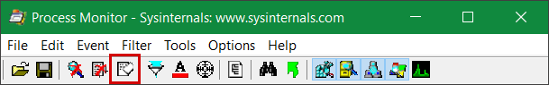
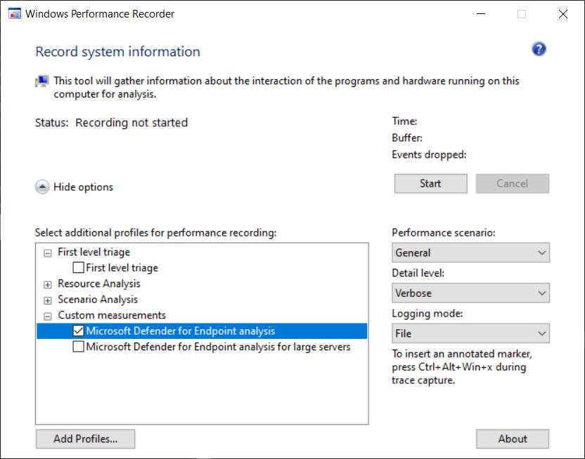

# <a name="troubleshoot-performance-issues-related-to-real-time-protection"></a><span data-ttu-id="a50b1-104">Problemen met prestaties met betrekking tot realtimebeveiliging oplossen</span><span class="sxs-lookup"><span data-stu-id="a50b1-104">Troubleshoot performance issues related to real-time protection</span></span>


[!INCLUDE [Microsoft 365 Defender rebranding](../../includes/microsoft-defender.md)]


<span data-ttu-id="a50b1-105">**Van toepassing op:**</span><span class="sxs-lookup"><span data-stu-id="a50b1-105">**Applies to:**</span></span>

- [<span data-ttu-id="a50b1-106">Microsoft Defender voor Eindpunt</span><span class="sxs-lookup"><span data-stu-id="a50b1-106">Microsoft Defender for Endpoint</span></span>](https://go.microsoft.com/fwlink/p/?linkid=2146631)
 
<span data-ttu-id="a50b1-107">Als uw systeem een hoog CPU-gebruik of prestatieproblemen heeft met betrekking tot de realtimebeveiligingsservice in Microsoft Defender voor Eindpunt, kunt u een ticket indienen bij Microsoft-ondersteuning.</span><span class="sxs-lookup"><span data-stu-id="a50b1-107">If your system is having high CPU usage or performance issues related to the real-time protection service in Microsoft Defender for Endpoint, you can submit a ticket to Microsoft support.</span></span> <span data-ttu-id="a50b1-108">Volg de stappen in [Diagnostische gegevens van Microsoft Defender Antivirus verzamelen.](collect-diagnostic-data.md)</span><span class="sxs-lookup"><span data-stu-id="a50b1-108">Follow the steps in [Collect Microsoft Defender Antivirus diagnostic data](collect-diagnostic-data.md).</span></span>

<span data-ttu-id="a50b1-109">Als beheerder kunt u deze problemen ook zelf oplossen.</span><span class="sxs-lookup"><span data-stu-id="a50b1-109">As an admin, you can also troubleshoot these issues on your own.</span></span> 

<span data-ttu-id="a50b1-110">Misschien wilt u eerst controleren of het probleem wordt veroorzaakt door een andere software.</span><span class="sxs-lookup"><span data-stu-id="a50b1-110">First, you might want to check if the issue is being caused by another software.</span></span> <span data-ttu-id="a50b1-111">Lees [Check with vendor for antivirus exclusions](#check-with-vendor-for-antivirus-exclusions).</span><span class="sxs-lookup"><span data-stu-id="a50b1-111">Read [Check with vendor for antivirus exclusions](#check-with-vendor-for-antivirus-exclusions).</span></span>

<span data-ttu-id="a50b1-112">Anders kunt u bepalen welke software is gerelateerd aan het geïdentificeerde prestatieprobleem door de stappen in Het Microsoft Protection Log analyseren [te volgen.](#analyze-the-microsoft-protection-log)</span><span class="sxs-lookup"><span data-stu-id="a50b1-112">Otherwise, you can identify which software is related to the identified performance issue by following the steps in [Analyze the Microsoft Protection Log](#analyze-the-microsoft-protection-log).</span></span> 

<span data-ttu-id="a50b1-113">U kunt ook aanvullende logboeken voor uw inzending bij Microsoft-ondersteuning verstrekken door de volgende stappen uit te voeren:</span><span class="sxs-lookup"><span data-stu-id="a50b1-113">You can also provide additional logs to your submission to Microsoft support by following the steps in:</span></span>
- [<span data-ttu-id="a50b1-114">Proceslogboeken vastleggen met behulp van procesmonitor</span><span class="sxs-lookup"><span data-stu-id="a50b1-114">Capture process logs using Process Monitor</span></span>](#capture-process-logs-using-process-monitor)
- [<span data-ttu-id="a50b1-115">Prestatielogboeken vastleggen met Windows Performance Recorder</span><span class="sxs-lookup"><span data-stu-id="a50b1-115">Capture performance logs using Windows Performance Recorder</span></span>](#capture-performance-logs-using-windows-performance-recorder) 

## <a name="check-with-vendor-for-antivirus-exclusions"></a><span data-ttu-id="a50b1-116">Neem contact op met leverancier voor antivirusuitsluitingen</span><span class="sxs-lookup"><span data-stu-id="a50b1-116">Check with vendor for antivirus exclusions</span></span>

<span data-ttu-id="a50b1-117">Als u de software die van invloed is op de systeemprestaties gemakkelijk kunt identificeren, gaat u naar het kenniscentrum of ondersteuningscentrum van de softwareleverancier.</span><span class="sxs-lookup"><span data-stu-id="a50b1-117">If you can readily identify the software affecting system performance, go to the software vendor's knowledge base or support center.</span></span> <span data-ttu-id="a50b1-118">Zoek of ze aanbevelingen hebben over antivirusuitsluitingen.</span><span class="sxs-lookup"><span data-stu-id="a50b1-118">Search if they have recommendations about antivirus exclusions.</span></span> <span data-ttu-id="a50b1-119">Als de website van de leverancier deze niet heeft, kunt u een ondersteuningsticket met hen openen en hen vragen er een te publiceren.</span><span class="sxs-lookup"><span data-stu-id="a50b1-119">If the vendor's website does not have them, you can open a support ticket with them and ask them to publish one.</span></span> 

<span data-ttu-id="a50b1-120">Het is raadzaam dat softwareleveranciers voldoen aan de verschillende richtlijnen in Samenwerking met de [industrie om fout-positieven te minimaliseren.](https://www.microsoft.com/security/blog/2018/08/16/partnering-with-the-industry-to-minimize-false-positives/)</span><span class="sxs-lookup"><span data-stu-id="a50b1-120">We recommend that software vendors follow the various guidelines in [Partnering with the industry to minimize false positives](https://www.microsoft.com/security/blog/2018/08/16/partnering-with-the-industry-to-minimize-false-positives/).</span></span> <span data-ttu-id="a50b1-121">De leverancier kan de software indienen via de [Microsoft Defender Security Intelligence Portal (MDSI).](https://www.microsoft.com/wdsi/filesubmission?persona=SoftwareDeveloper)</span><span class="sxs-lookup"><span data-stu-id="a50b1-121">The vendor can submit their software through the [Microsoft Defender Security Intelligence portal (MDSI)](https://www.microsoft.com/wdsi/filesubmission?persona=SoftwareDeveloper).</span></span>


## <a name="analyze-the-microsoft-protection-log"></a><span data-ttu-id="a50b1-122">Het Microsoft Protection Log analyseren</span><span class="sxs-lookup"><span data-stu-id="a50b1-122">Analyze the Microsoft Protection Log</span></span>

<span data-ttu-id="a50b1-123">In **MPLog-xxxxxxxx-xxxxxx.log** vindt u de geschatte prestatie-impactinformatie van de hardloopsoftware als *EstimatedImpact:*</span><span class="sxs-lookup"><span data-stu-id="a50b1-123">In **MPLog-xxxxxxxx-xxxxxx.log**, you can find the estimated performance impact information of running software as *EstimatedImpact*:</span></span>
    
`Per-process counts:ProcessImageName: smsswd.exe, TotalTime: 6597, Count: 1406, MaxTime: 609, MaxTimeFile: \Device\HarddiskVolume3\_SMSTaskSequence\Packages\WQ1008E9\Files\FramePkg.exe, EstimatedImpact: 65%`

| <span data-ttu-id="a50b1-124">Veldnaam</span><span class="sxs-lookup"><span data-stu-id="a50b1-124">Field name</span></span> | <span data-ttu-id="a50b1-125">Beschrijving</span><span class="sxs-lookup"><span data-stu-id="a50b1-125">Description</span></span> |
|---|---|
|<span data-ttu-id="a50b1-126">ProcessImageName</span><span class="sxs-lookup"><span data-stu-id="a50b1-126">ProcessImageName</span></span> | <span data-ttu-id="a50b1-127">Naam van afbeelding verwerken</span><span class="sxs-lookup"><span data-stu-id="a50b1-127">Process image name</span></span> |
| <span data-ttu-id="a50b1-128">TotalTime</span><span class="sxs-lookup"><span data-stu-id="a50b1-128">TotalTime</span></span> | <span data-ttu-id="a50b1-129">De cumulatieve duur in milliseconden die zijn besteed aan scans van bestanden die door dit proces worden gebruikt</span><span class="sxs-lookup"><span data-stu-id="a50b1-129">The cumulative duration in milliseconds spent in scans of files accessed by this process</span></span> |
|<span data-ttu-id="a50b1-130">Aantal</span><span class="sxs-lookup"><span data-stu-id="a50b1-130">Count</span></span> | <span data-ttu-id="a50b1-131">Het aantal gescande bestanden dat door dit proces wordt gebruikt</span><span class="sxs-lookup"><span data-stu-id="a50b1-131">The number of scanned files accessed by this process</span></span> |
|<span data-ttu-id="a50b1-132">MaxTime</span><span class="sxs-lookup"><span data-stu-id="a50b1-132">MaxTime</span></span> |  <span data-ttu-id="a50b1-133">De duur in milliseconden in de langste scan van een bestand dat door dit proces wordt gebruikt</span><span class="sxs-lookup"><span data-stu-id="a50b1-133">The duration in milliseconds in the longest single scan of a file accessed by this process</span></span> |
| <span data-ttu-id="a50b1-134">MaxTimeFile</span><span class="sxs-lookup"><span data-stu-id="a50b1-134">MaxTimeFile</span></span> | <span data-ttu-id="a50b1-135">Het pad van het bestand dat door dit proces is gebruikt waarvoor de langste scan van de `MaxTime` duur is opgenomen</span><span class="sxs-lookup"><span data-stu-id="a50b1-135">The path of the file accessed by this process for which the longest scan of `MaxTime` duration was recorded</span></span> |
| <span data-ttu-id="a50b1-136">EstimatedImpact</span><span class="sxs-lookup"><span data-stu-id="a50b1-136">EstimatedImpact</span></span> | <span data-ttu-id="a50b1-137">Het percentage tijd dat is besteed aan scans voor bestanden die door dit proces zijn gebruikt buiten de periode waarin dit proces scanactiviteit heeft ervaren</span><span class="sxs-lookup"><span data-stu-id="a50b1-137">The percentage of time spent in scans for files accessed by this process out of the period in which this process experienced scan activity</span></span> |

<span data-ttu-id="a50b1-138">Als de prestatie-impact groot is, kunt u het proces toevoegen aan de uitsluitingen voor pad/proces door de stappen in Uitsluitingen configureren en valideren voor [Microsoft Defender Antivirusscans te volgen.](collect-diagnostic-data.md)</span><span class="sxs-lookup"><span data-stu-id="a50b1-138">If the performance impact is high, try adding the process to the Path/Process exclusions by following the steps in [Configure and validate exclusions for Microsoft Defender Antivirus scans](collect-diagnostic-data.md).</span></span>

<span data-ttu-id="a50b1-139">Als het probleem niet is opgelost met de vorige [](#capture-process-logs-using-process-monitor) stap, kunt u meer informatie verzamelen via de procesmonitor of de [Windows Performance Recorder](#capture-performance-logs-using-windows-performance-recorder) in de volgende secties.</span><span class="sxs-lookup"><span data-stu-id="a50b1-139">If the previous step doesn't solve the problem, you can collect more information through the [Process Monitor](#capture-process-logs-using-process-monitor) or the [Windows Performance Recorder](#capture-performance-logs-using-windows-performance-recorder) in the following sections.</span></span>
     
## <a name="capture-process-logs-using-process-monitor"></a><span data-ttu-id="a50b1-140">Proceslogboeken vastleggen met behulp van procesmonitor</span><span class="sxs-lookup"><span data-stu-id="a50b1-140">Capture process logs using Process Monitor</span></span>

<span data-ttu-id="a50b1-141">Procesmonitor (ProcMon) is een geavanceerd monitoringprogramma waarmee realtime-processen kunnen worden gebruikt.</span><span class="sxs-lookup"><span data-stu-id="a50b1-141">Process Monitor (ProcMon) is an advanced monitoring tool that can show real-time processes.</span></span> <span data-ttu-id="a50b1-142">U kunt dit gebruiken om het prestatieprobleem vast te leggen terwijl het zich voordoet.</span><span class="sxs-lookup"><span data-stu-id="a50b1-142">You can use this to capture the performance issue as it is occurring.</span></span>

1. <span data-ttu-id="a50b1-143">Download [Procesmonitor v3.60](/sysinternals/downloads/procmon) naar een map als `C:\temp` .</span><span class="sxs-lookup"><span data-stu-id="a50b1-143">Download [Process Monitor v3.60](/sysinternals/downloads/procmon) to a folder like `C:\temp`.</span></span>

2. <span data-ttu-id="a50b1-144">Het webmerk van het bestand verwijderen:</span><span class="sxs-lookup"><span data-stu-id="a50b1-144">To remove the file's mark of the web:</span></span>
    1. <span data-ttu-id="a50b1-145">Klik met de **rechtermuisknopProcessMonitor.zip** en selecteer **Eigenschappen.**</span><span class="sxs-lookup"><span data-stu-id="a50b1-145">Right-click **ProcessMonitor.zip** and select **Properties**.</span></span>
    1. <span data-ttu-id="a50b1-146">Zoek onder *het* tabblad Algemeen naar *Beveiliging.*</span><span class="sxs-lookup"><span data-stu-id="a50b1-146">Under the *General* tab, look for *Security*.</span></span>
    1. <span data-ttu-id="a50b1-147">Het selectievakje naast **Blokkering opheffen in.**</span><span class="sxs-lookup"><span data-stu-id="a50b1-147">Check the box beside **Unblock**.</span></span>
    1. <span data-ttu-id="a50b1-148">Selecteer **Toepassen.**</span><span class="sxs-lookup"><span data-stu-id="a50b1-148">Select **Apply**.</span></span>
    
     

3. <span data-ttu-id="a50b1-150">Los het bestand op zodat `C:\temp` het mappad wordt `C:\temp\ProcessMonitor` .</span><span class="sxs-lookup"><span data-stu-id="a50b1-150">Unzip the file in `C:\temp` so that the folder path will be `C:\temp\ProcessMonitor`.</span></span> 

4. <span data-ttu-id="a50b1-151">Kopieer **ProcMon.exe**  naar de Windows-client of Windows-server die u probleemoplossing aan het oplossen bent.</span><span class="sxs-lookup"><span data-stu-id="a50b1-151">Copy **ProcMon.exe**  to the Windows client or Windows server you're troubleshooting.</span></span>  

5. <span data-ttu-id="a50b1-152">Voordat u ProcMon gaat uitvoeren, moet u ervoor zorgen dat alle andere toepassingen die niet gerelateerd zijn aan het probleem met het hoge CPU-gebruik, zijn gesloten.</span><span class="sxs-lookup"><span data-stu-id="a50b1-152">Before running ProcMon, make sure all other applications not related to the high CPU usage issue are closed.</span></span> <span data-ttu-id="a50b1-153">Als u dit doet, wordt het aantal te controleren processen geminimaliseerd.</span><span class="sxs-lookup"><span data-stu-id="a50b1-153">Doing this will minimize the number of processes to check.</span></span>

6. <span data-ttu-id="a50b1-154">U kunt ProcMon op twee manieren starten.</span><span class="sxs-lookup"><span data-stu-id="a50b1-154">You can launch ProcMon in two ways.</span></span>
    1. <span data-ttu-id="a50b1-155">Klik met de **rechtermuisknopProcMon.exe** en selecteer Uitvoeren **als beheerder.**</span><span class="sxs-lookup"><span data-stu-id="a50b1-155">Right-click **ProcMon.exe** and select **Run as administrator**.</span></span> 
    

        <span data-ttu-id="a50b1-156">Aangezien logboekregistratie automatisch wordt gestart, selecteert u het vergrootglaspictogram om de huidige opname te stoppen of gebruikt u de sneltoets **Ctrl+E.**</span><span class="sxs-lookup"><span data-stu-id="a50b1-156">Since logging starts automatically, select the magnifying glass icon  to stop the current capture or use the keyboard shortcut **Ctrl+E**.</span></span>
 
        

        <span data-ttu-id="a50b1-158">Als u wilt controleren of u de opname hebt gestopt, controleert u of het vergrootglaspictogram nu wordt weergegeven met een rode X.</span><span class="sxs-lookup"><span data-stu-id="a50b1-158">To verify that you have stopped the capture, check if the magnifying glass icon now appears with a red X.</span></span>

                 

        <span data-ttu-id="a50b1-160">Als u vervolgens de eerdere opname wilt wissen, selecteert u het pictogram Gum.</span><span class="sxs-lookup"><span data-stu-id="a50b1-160">Next, to clear the earlier capture, select the eraser icon.</span></span>

        

        <span data-ttu-id="a50b1-162">Of gebruik de sneltoets **Ctrl+X.**</span><span class="sxs-lookup"><span data-stu-id="a50b1-162">Or use the keyboard shortcut **Ctrl+X**.</span></span>

    2. <span data-ttu-id="a50b1-163">De tweede manier is om de **opdrachtregel** als beheerder uit te voeren en vervolgens vanuit het pad Procesmonitor de opdracht uit te voeren:</span><span class="sxs-lookup"><span data-stu-id="a50b1-163">The second way is to run the **command line** as admin, then from the Process Monitor path, run:</span></span>

        
 
        ```console
        Procmon.exe /AcceptEula /Noconnect /Profiling
        ```
        
        >[!TIP] 
        ><span data-ttu-id="a50b1-165">Maak het ProcMon-venster zo klein mogelijk bij het vastleggen van gegevens, zodat u de trace eenvoudig kunt starten en stoppen.</span><span class="sxs-lookup"><span data-stu-id="a50b1-165">Make the ProcMon window as small as possible when capturing data so you can easily start and stop the trace.</span></span>
        > 
        >
    
7. <span data-ttu-id="a50b1-167">Nadat u een van de procedures in stap 6 hebt gevolgd, ziet u de volgende optie om filters in te stellen.</span><span class="sxs-lookup"><span data-stu-id="a50b1-167">After following one of the procedures in step 6, you'll next see an option to set filters.</span></span> <span data-ttu-id="a50b1-168">Selecteer **OK**.</span><span class="sxs-lookup"><span data-stu-id="a50b1-168">Select **OK**.</span></span> <span data-ttu-id="a50b1-169">U kunt de resultaten altijd filteren nadat de opname is voltooid.</span><span class="sxs-lookup"><span data-stu-id="a50b1-169">You can always filter the results after the capture is completed.</span></span>
 
     

8. <span data-ttu-id="a50b1-171">Als u de opname wilt starten, selecteert u het vergrootglaspictogram opnieuw.</span><span class="sxs-lookup"><span data-stu-id="a50b1-171">To start the capture, select the magnifying glass icon again.</span></span>
     
9. <span data-ttu-id="a50b1-172">Reproduceer het probleem.</span><span class="sxs-lookup"><span data-stu-id="a50b1-172">Reproduce the problem.</span></span>
 
    >[!TIP] 
    ><span data-ttu-id="a50b1-173">Wacht totdat het probleem volledig is gereproduceerd en noteer de tijdstempel wanneer de trace is gestart.</span><span class="sxs-lookup"><span data-stu-id="a50b1-173">Wait for the problem to be fully reproduced, then take note of the timestamp when the trace started.</span></span>

10. <span data-ttu-id="a50b1-174">Als u twee tot vier minuten procesactiviteit hebt tijdens de hoge cpu-gebruiksvoorwaarde, stopt u de opname door het vergrootglaspictogram te selecteren.</span><span class="sxs-lookup"><span data-stu-id="a50b1-174">Once you have two to four minutes of process activity during the high CPU usage condition, stop the capture by selecting the magnifying glass icon.</span></span>

11. <span data-ttu-id="a50b1-175">Als u de opname wilt opslaan met een unieke naam en met de .pml-indeling, **selecteert** u Bestand en selecteert u **Opslaan...**. Zorg ervoor dat u de keuzerondjes **Alle gebeurtenissen en** De indeling van de native process monitor **(PML) selecteert.**</span><span class="sxs-lookup"><span data-stu-id="a50b1-175">To save the capture with a unique name and with the .pml format, select **File** then select **Save...**. Make sure to select the radio buttons **All events** and **Native Process Monitor Format (PML)**.</span></span>

    

12. <span data-ttu-id="a50b1-177">Voor een betere tracering wijzigt u het standaardpad `C:\temp\ProcessMonitor\LogFile.PML` van `C:\temp\ProcessMonitor\%ComputerName%_LogFile_MMDDYEAR_Repro_of_issue.PML` waar:</span><span class="sxs-lookup"><span data-stu-id="a50b1-177">For better tracking, change the default path from `C:\temp\ProcessMonitor\LogFile.PML` to `C:\temp\ProcessMonitor\%ComputerName%_LogFile_MMDDYEAR_Repro_of_issue.PML` where:</span></span>
    - <span data-ttu-id="a50b1-178">`%ComputerName%` is de naam van het apparaat</span><span class="sxs-lookup"><span data-stu-id="a50b1-178">`%ComputerName%` is the device name</span></span>
    - <span data-ttu-id="a50b1-179">`MMDDYEAR` is de maand, dag en jaar</span><span class="sxs-lookup"><span data-stu-id="a50b1-179">`MMDDYEAR` is the month, day, and year</span></span>
    -  <span data-ttu-id="a50b1-180">`Repro_of_issue` is de naam van het probleem dat u probeert te reproduceren</span><span class="sxs-lookup"><span data-stu-id="a50b1-180">`Repro_of_issue` is the name of the issue you're trying to reproduce</span></span>

    >[!TIP] 
    > <span data-ttu-id="a50b1-181">Als u een werkend systeem hebt, kunt u een voorbeeldlogboek krijgen om te vergelijken.</span><span class="sxs-lookup"><span data-stu-id="a50b1-181">If you have a working system, you might want to get a sample log to compare.</span></span>

13. <span data-ttu-id="a50b1-182">Zip het .pml-bestand en stuur het naar Microsoft-ondersteuning.</span><span class="sxs-lookup"><span data-stu-id="a50b1-182">Zip the .pml file and submit it to Microsoft support.</span></span>


## <a name="capture-performance-logs-using-windows-performance-recorder"></a><span data-ttu-id="a50b1-183">Prestatielogboeken vastleggen met Windows Performance Recorder</span><span class="sxs-lookup"><span data-stu-id="a50b1-183">Capture performance logs using Windows Performance Recorder</span></span>

<span data-ttu-id="a50b1-184">U kunt Windows Performance Recorder (WPR) gebruiken om aanvullende informatie in uw inzending bij Microsoft-ondersteuning op te nemen.</span><span class="sxs-lookup"><span data-stu-id="a50b1-184">You can use Windows Performance Recorder (WPR) to include additional information in your submission to Microsoft support.</span></span> <span data-ttu-id="a50b1-185">WPR is een krachtig opnamehulpmiddel waarmee Event Tracing voor Windows-opnamen wordt gemaakt.</span><span class="sxs-lookup"><span data-stu-id="a50b1-185">WPR is a powerful recording tool that creates Event Tracing for Windows recordings.</span></span> 

<span data-ttu-id="a50b1-186">WPR maakt deel uit van de Windows Assessment and Deployment Kit (Windows ADK) en kan worden gedownload van De [Windows ADK downloaden](/windows-hardware/get-started/adk-install)en installeren.</span><span class="sxs-lookup"><span data-stu-id="a50b1-186">WPR is part of the Windows Assessment and Deployment Kit (Windows ADK) and can be downloaded from [Download and install the Windows ADK](/windows-hardware/get-started/adk-install).</span></span> <span data-ttu-id="a50b1-187">U kunt deze ook downloaden als onderdeel van de Windows 10 Software Development Kit bij [Windows 10 SDK.](https://developer.microsoft.com/windows/downloads/windows-10-sdk/)</span><span class="sxs-lookup"><span data-stu-id="a50b1-187">You can also download it as part of the Windows 10 Software Development Kit at [Windows 10 SDK](https://developer.microsoft.com/windows/downloads/windows-10-sdk/).</span></span>

<span data-ttu-id="a50b1-188">U kunt de wpr-gebruikersinterface gebruiken door de stappen in Prestatielogboeken vastleggen te volgen [met behulp van de WPR-gebruikersinterface.](#capture-performance-logs-using-the-wpr-ui)</span><span class="sxs-lookup"><span data-stu-id="a50b1-188">You can use the WPR user interface by following the steps in [Capture performance logs using the WPR UI](#capture-performance-logs-using-the-wpr-ui).</span></span> 

<span data-ttu-id="a50b1-189">U kunt ook het opdrachtregelprogramma *wpr.exegebruiken,* dat beschikbaar is in Windows 8 en latere versies door de stappen in Prestatielogboeken vastleggen te volgen met behulp van de [WPR CLI.](#capture-performance-logs-using-the-wpr-cli)</span><span class="sxs-lookup"><span data-stu-id="a50b1-189">Alternatively, you can also use the command-line tool *wpr.exe*, which is available in Windows 8 and later versions  by following the steps in [Capture performance logs using the WPR CLI](#capture-performance-logs-using-the-wpr-cli).</span></span>


### <a name="capture-performance-logs-using-the-wpr-ui"></a><span data-ttu-id="a50b1-190">Prestatielogboeken vastleggen met de WPR-gebruikersinterface</span><span class="sxs-lookup"><span data-stu-id="a50b1-190">Capture performance logs using the WPR UI</span></span>

>[!TIP]
><span data-ttu-id="a50b1-191">Als u meerdere apparaten hebt waar het probleem zich voordoet, gebruikt u het apparaat met de meeste RAM-geheugen.</span><span class="sxs-lookup"><span data-stu-id="a50b1-191">If you have multiple devices where the issue is occurring, use the one which has the most amount of RAM.</span></span>

1. <span data-ttu-id="a50b1-192">Download en installeer WPR.</span><span class="sxs-lookup"><span data-stu-id="a50b1-192">Download and install WPR.</span></span>

2. <span data-ttu-id="a50b1-193">Klik *onder Windows Kits* met de rechtermuisknop op Windows Performance **Recorder.**</span><span class="sxs-lookup"><span data-stu-id="a50b1-193">Under *Windows Kits*, right-click **Windows Performance Recorder**.</span></span> 

    

    <span data-ttu-id="a50b1-195">Selecteer **Meer**.</span><span class="sxs-lookup"><span data-stu-id="a50b1-195">Select **More**.</span></span> <span data-ttu-id="a50b1-196">Selecteer **Uitvoeren als beheerder.**</span><span class="sxs-lookup"><span data-stu-id="a50b1-196">Select **Run as administrator**.</span></span>

3. <span data-ttu-id="a50b1-197">Wanneer het dialoogvenster Gebruikersaccountbeheer wordt weergegeven, selecteert u **Ja.**</span><span class="sxs-lookup"><span data-stu-id="a50b1-197">When the User Account Control dialog box appears, select **Yes**.</span></span>

    

4. <span data-ttu-id="a50b1-199">Download vervolgens het [analyseprofiel van Microsoft Defender voor eindpunten](https://github.com/YongRhee-MDE/Scripts/blob/master/MDAV.wprp) en sla het op `WD.wprp` in een map zoals `C:\temp` .</span><span class="sxs-lookup"><span data-stu-id="a50b1-199">Next, download the [Microsoft Defender for Endpoint analysis](https://github.com/YongRhee-MDE/Scripts/blob/master/MDAV.wprp) profile and save as `WD.wprp` to a folder like `C:\temp`.</span></span> 
     
5. <span data-ttu-id="a50b1-200">Selecteer meer opties in het dialoogvenster WPR.</span><span class="sxs-lookup"><span data-stu-id="a50b1-200">On the WPR dialog box, select **More options**.</span></span>

    

6. <span data-ttu-id="a50b1-202">Selecteer **Profielen toevoegen...** en blader naar het pad van het `WD.wprp` bestand.</span><span class="sxs-lookup"><span data-stu-id="a50b1-202">Select **Add Profiles...** and browse to the path of the `WD.wprp` file.</span></span>

7. <span data-ttu-id="a50b1-203">Daarna ziet u een nieuw profiel dat is ingesteld onder Aangepaste *afmetingen* met de naam *Microsoft Defender voor eindpuntanalyse* eronder.</span><span class="sxs-lookup"><span data-stu-id="a50b1-203">After that, you should see a new profile set under *Custom measurements* named *Microsoft Defender for Endpoint analysis* underneath it.</span></span>

    

    >[!WARNING]
    ><span data-ttu-id="a50b1-205">Als uw Windows Server 64 GB RAM-geheugen of meer heeft, gebruikt u de aangepaste maat `Microsoft Defender for Endpoint analysis for large servers` in plaats van `Microsoft Defender for Endpoint analysis` .</span><span class="sxs-lookup"><span data-stu-id="a50b1-205">If your Windows Server has 64 GB of RAM or more, use the custom measurement `Microsoft Defender for Endpoint analysis for large servers` instead of `Microsoft Defender for Endpoint analysis`.</span></span> <span data-ttu-id="a50b1-206">Anders kan uw systeem een grote hoeveelheid niet-pagina's poolgeheugen of buffers verbruiken, wat kan leiden tot systeeminstabiliteit.</span><span class="sxs-lookup"><span data-stu-id="a50b1-206">Otherwise, your system could consume a high amount of non-paged pool memory or buffers which can lead to system instability.</span></span> <span data-ttu-id="a50b1-207">U kunt kiezen welke profielen u wilt toevoegen door Resourceanalyse **uit te breiden.**</span><span class="sxs-lookup"><span data-stu-id="a50b1-207">You can choose which profiles to add by expanding **Resource Analysis**.</span></span> <span data-ttu-id="a50b1-208">Dit aangepaste profiel biedt de benodigde context voor een uitgebreide prestatieanalyse.</span><span class="sxs-lookup"><span data-stu-id="a50b1-208">This custom profile provides the necessary context for in-depth performance analysis.</span></span>
 
8. <span data-ttu-id="a50b1-209">De aangepaste meting van Microsoft Defender voor eindpunt verbose analyseprofiel gebruiken in de WPR-gebruikersinterface:</span><span class="sxs-lookup"><span data-stu-id="a50b1-209">To use the custom measurement Microsoft Defender for Endpoint verbose analysis profile in the WPR UI:</span></span>

    1. <span data-ttu-id="a50b1-210">Zorg ervoor dat er geen profielen zijn geselecteerd onder de groepen *Triage* op het eerste niveau, *Resourceanalyse* en *Scenarioanalyse.*</span><span class="sxs-lookup"><span data-stu-id="a50b1-210">Ensure no profiles are selected under the *First-level triage*, *Resource Analysis* and *Scenario Analysis* groups.</span></span>
    2. <span data-ttu-id="a50b1-211">Selecteer **Aangepaste afmetingen.**</span><span class="sxs-lookup"><span data-stu-id="a50b1-211">Select **Custom measurements**.</span></span>
    3. <span data-ttu-id="a50b1-212">Selecteer **Microsoft Defender voor eindpuntanalyse.**</span><span class="sxs-lookup"><span data-stu-id="a50b1-212">Select **Microsoft Defender for Endpoint analysis**.</span></span>
    4. <span data-ttu-id="a50b1-213">Selecteer **Verbose** onder *Detailniveau.*</span><span class="sxs-lookup"><span data-stu-id="a50b1-213">Select **Verbose** under *Detail* level.</span></span>
    1. <span data-ttu-id="a50b1-214">Selecteer **Bestand of** Geheugen **onder** logboekregistratiemodus.</span><span class="sxs-lookup"><span data-stu-id="a50b1-214">Select **File** or **Memory** under Logging mode.</span></span> 

    >[!important]
    ><span data-ttu-id="a50b1-215">Selecteer Bestand *om de* bestandsregistratiemodus te gebruiken als het prestatieprobleem rechtstreeks door de gebruiker kan worden gereproduceerd.</span><span class="sxs-lookup"><span data-stu-id="a50b1-215">You should select *File* to use the file logging mode if the performance issue can be reproduced directly by the user.</span></span> <span data-ttu-id="a50b1-216">De meeste problemen vallen onder deze categorie.</span><span class="sxs-lookup"><span data-stu-id="a50b1-216">Most issues fall under this category.</span></span> <span data-ttu-id="a50b1-217">Als de gebruiker het probleem echter niet rechtstreeks kan reproduceren, maar het  probleem gemakkelijk kan zien wanneer het probleem optreedt, moet de gebruiker Geheugen selecteren om de modus geheugenregistratie te gebruiken.</span><span class="sxs-lookup"><span data-stu-id="a50b1-217">However, if the user cannot directly reproduce the issue but can easily notice it once the issue occurs, the user should select *Memory* to use the memory logging mode.</span></span> <span data-ttu-id="a50b1-218">Dit zorgt ervoor dat het tracelogboek niet te hoog wordt vanwege de lange termijn.</span><span class="sxs-lookup"><span data-stu-id="a50b1-218">This ensures that the trace log will not inflate excessively due to the long run time.</span></span>

9. <span data-ttu-id="a50b1-219">U bent nu klaar om gegevens te verzamelen.</span><span class="sxs-lookup"><span data-stu-id="a50b1-219">Now you're ready to collect data.</span></span> <span data-ttu-id="a50b1-220">Sluit alle toepassingen af die niet relevant zijn voor het reproduceren van het prestatieprobleem.</span><span class="sxs-lookup"><span data-stu-id="a50b1-220">Exit all the applications that are not relevant to reproducing the performance issue.</span></span> <span data-ttu-id="a50b1-221">U kunt Opties **verbergen selecteren om** de ruimte die door het WPR-venster wordt bezet, klein te houden.</span><span class="sxs-lookup"><span data-stu-id="a50b1-221">You can select **Hide options** to keep the space occupied by the WPR window small.</span></span>

    

    >[!TIP]
    ><span data-ttu-id="a50b1-223">Probeer de trace op hele getalseconden te starten.</span><span class="sxs-lookup"><span data-stu-id="a50b1-223">Try starting the trace at whole number seconds.</span></span> <span data-ttu-id="a50b1-224">Bijvoorbeeld: 01:30:00.</span><span class="sxs-lookup"><span data-stu-id="a50b1-224">For instance, 01:30:00.</span></span> <span data-ttu-id="a50b1-225">Dit maakt het gemakkelijker om de gegevens te analyseren.</span><span class="sxs-lookup"><span data-stu-id="a50b1-225">This will make it easier to analyze the data.</span></span> <span data-ttu-id="a50b1-226">Probeer ook de tijdstempel bij te houden van precies wanneer het probleem wordt gereproduceerd.</span><span class="sxs-lookup"><span data-stu-id="a50b1-226">Also try to keep track of the timestamp of exactly when the issue is reproduced.</span></span>

10. <span data-ttu-id="a50b1-227">Selecteer **Start**.</span><span class="sxs-lookup"><span data-stu-id="a50b1-227">Select **Start**.</span></span>

    

11. <span data-ttu-id="a50b1-229">Reproduceer het probleem.</span><span class="sxs-lookup"><span data-stu-id="a50b1-229">Reproduce the issue.</span></span>

    >[!TIP]
    ><span data-ttu-id="a50b1-230">Houd de gegevensverzameling tot niet meer dan vijf minuten.</span><span class="sxs-lookup"><span data-stu-id="a50b1-230">Keep the data collection to no more than five minutes.</span></span> <span data-ttu-id="a50b1-231">Twee tot drie minuten is een goed bereik omdat er veel gegevens worden verzameld.</span><span class="sxs-lookup"><span data-stu-id="a50b1-231">Two to three minutes is a good range since a lot of data is being collected.</span></span>

12. <span data-ttu-id="a50b1-232">Selecteer **Opslaan**.</span><span class="sxs-lookup"><span data-stu-id="a50b1-232">Select **Save**.</span></span>

    

13. <span data-ttu-id="a50b1-234">Opvullen **Typ een gedetailleerde beschrijving van het probleem:** met informatie over het probleem en hoe u het probleem hebt gereproduceerd.</span><span class="sxs-lookup"><span data-stu-id="a50b1-234">Fill up **Type in a detailed description of the problem:** with information about the problem and how you reproduced the issue.</span></span>

    

    1. <span data-ttu-id="a50b1-236">Selecteer **Bestandsnaam:** om te bepalen waar het trace-bestand wordt opgeslagen.</span><span class="sxs-lookup"><span data-stu-id="a50b1-236">Select **File Name:** to determine where your trace file will be saved.</span></span> <span data-ttu-id="a50b1-237">Standaard wordt de 1.is opgeslagen in `%user%\Documents\WPR Files\` .</span><span class="sxs-lookup"><span data-stu-id="a50b1-237">By default, it 1.is saved to `%user%\Documents\WPR Files\`.</span></span>
    1. <span data-ttu-id="a50b1-238">Selecteer **Opslaan**.</span><span class="sxs-lookup"><span data-stu-id="a50b1-238">Select **Save**.</span></span>

14. <span data-ttu-id="a50b1-239">Wacht totdat de trace wordt samengevoegd.</span><span class="sxs-lookup"><span data-stu-id="a50b1-239">Wait while the trace is being merged.</span></span>

    

15. <span data-ttu-id="a50b1-241">Wanneer de trace is opgeslagen, selecteert u **Map openen.**</span><span class="sxs-lookup"><span data-stu-id="a50b1-241">Once the trace is saved, select **Open folder**.</span></span>

    

    <span data-ttu-id="a50b1-243">Neem zowel het bestand als de map op in uw inzending bij Microsoft-ondersteuning.</span><span class="sxs-lookup"><span data-stu-id="a50b1-243">Include both the file and the folder in your submission to Microsoft support.</span></span>

    

### <a name="capture-performance-logs-using-the-wpr-cli"></a><span data-ttu-id="a50b1-245">Prestatielogboeken vastleggen met de WPR CLI</span><span class="sxs-lookup"><span data-stu-id="a50b1-245">Capture performance logs using the WPR CLI</span></span>

<span data-ttu-id="a50b1-246">Het opdrachtregelprogramma *wpr.exe* maakt deel uit van het besturingssysteem dat begint met Windows 8.</span><span class="sxs-lookup"><span data-stu-id="a50b1-246">The command-line tool *wpr.exe* is part of the operating system starting with Windows 8.</span></span> <span data-ttu-id="a50b1-247">Een WPR-trace verzamelen met behulp van de opdrachtregelfunctie wpr.exe:</span><span class="sxs-lookup"><span data-stu-id="a50b1-247">To collect a WPR trace using the command-line tool wpr.exe:</span></span>

1. <span data-ttu-id="a50b1-248">Microsoft **[Defender voor endpoint-analyseprofiel](https://github.com/YongRhee-MDE/Scripts/blob/master/MDAV.wprp)** downloaden voor prestatiesporen naar een bestand met de naam `WD.wprp` in een lokale adreslijst, zoals `C:\traces` .</span><span class="sxs-lookup"><span data-stu-id="a50b1-248">Download **[Microsoft Defender for Endpoint analysis](https://github.com/YongRhee-MDE/Scripts/blob/master/MDAV.wprp)** profile for performance traces to a file named `WD.wprp` in a local directory such as `C:\traces`.</span></span>

3. <span data-ttu-id="a50b1-249">Klik met de rechtermuisknop op **het startmenupictogram** en selecteer **Windows PowerShell (beheerder)** of Opdrachtprompt **(beheerder)** om een opdrachtpromptvenster voor beheerders te openen.</span><span class="sxs-lookup"><span data-stu-id="a50b1-249">Right-click the **Start Menu** icon and select **Windows PowerShell (Admin)** or **Command Prompt (Admin)** to open an Admin command prompt window.</span></span>

4. <span data-ttu-id="a50b1-250">Wanneer het dialoogvenster Gebruikersaccountbeheer wordt weergegeven, selecteert u **Ja.**</span><span class="sxs-lookup"><span data-stu-id="a50b1-250">When the User Account Control dialog box appears, select **Yes**.</span></span>

5. <span data-ttu-id="a50b1-251">Voer bij de verhoogde prompt de volgende opdracht uit om een Prestatiespoor van Microsoft Defender voor eindpunt te starten:</span><span class="sxs-lookup"><span data-stu-id="a50b1-251">At the elevated prompt, run the following command to start a Microsoft Defender for Endpoint performance trace:</span></span>

    ```console
    wpr.exe -start C:\traces\WD.wprp!WD.Verbose -filemode
    ```
    
    >[!WARNING]
    ><span data-ttu-id="a50b1-252">Als uw Windows Server 64 GB of RAM-geheugen of meer heeft, gebruikt u profielen en in plaats van `WDForLargeServers.Light` `WDForLargeServers.Verbose` profielen en , `WD.Light` `WD.Verbose` respectievelijk.</span><span class="sxs-lookup"><span data-stu-id="a50b1-252">If your Windows Server has 64 GB or RAM or more, use profiles `WDForLargeServers.Light` and `WDForLargeServers.Verbose` instead of profiles `WD.Light` and `WD.Verbose`, respectively.</span></span> <span data-ttu-id="a50b1-253">Anders kan uw systeem een grote hoeveelheid niet-pagina's poolgeheugen of buffers verbruiken, wat kan leiden tot systeeminstabiliteit.</span><span class="sxs-lookup"><span data-stu-id="a50b1-253">Otherwise, your system could consume a high amount of non-paged pool memory or buffers which can lead to system instability.</span></span>

6. <span data-ttu-id="a50b1-254">Reproduceer het probleem.</span><span class="sxs-lookup"><span data-stu-id="a50b1-254">Reproduce the issue.</span></span>

    >[!TIP]
    ><span data-ttu-id="a50b1-255">Houd de gegevensverzameling niet langer dan vijf minuten.</span><span class="sxs-lookup"><span data-stu-id="a50b1-255">Keep the data collection no to more than five minutes.</span></span>  <span data-ttu-id="a50b1-256">Afhankelijk van het scenario is twee tot drie minuten een goed bereik omdat er veel gegevens worden verzameld.</span><span class="sxs-lookup"><span data-stu-id="a50b1-256">Depending on the scenario, two to three minutes is a good range since a lot of data is being collected.</span></span>

7. <span data-ttu-id="a50b1-257">Voer bij de verhoogde prompt de volgende opdracht uit om het prestatiespoor te stoppen en zorg ervoor dat u informatie geeft over het probleem en hoe u het probleem hebt gereproduceerd:</span><span class="sxs-lookup"><span data-stu-id="a50b1-257">At the elevated prompt, run the following command to stop the performance trace, making sure to provide information about the problem and how you reproduced the issue:</span></span>

    ```console
    wpr.exe -stop merged.etl "Timestamp when the issue was reproduced, in HH:MM:SS format" "Description of the issue" "Any error that popped up"
    ```

8. <span data-ttu-id="a50b1-258">Wacht totdat de trace is samengevoegd.</span><span class="sxs-lookup"><span data-stu-id="a50b1-258">Wait until the trace is merged.</span></span> 

9. <span data-ttu-id="a50b1-259">Neem zowel het bestand als de map op in uw inzending bij Microsoft-ondersteuning.</span><span class="sxs-lookup"><span data-stu-id="a50b1-259">Include both the file and the folder in your submission to Microsoft support.</span></span>

## <a name="see-also"></a><span data-ttu-id="a50b1-260">Zie ook</span><span class="sxs-lookup"><span data-stu-id="a50b1-260">See also</span></span>

- [<span data-ttu-id="a50b1-261">Diagnostische gegevens van Microsoft Defender Antivirus verzamelen</span><span class="sxs-lookup"><span data-stu-id="a50b1-261">Collect Microsoft Defender Antivirus diagnostic data</span></span>](collect-diagnostic-data.md)
- [<span data-ttu-id="a50b1-262">Uitsluitingen configureren en valideren voor Antivirusscans van Microsoft Defender</span><span class="sxs-lookup"><span data-stu-id="a50b1-262">Configure and validate exclusions for Microsoft Defender Antivirus scans</span></span>](configure-exclusions-microsoft-defender-antivirus.md)
