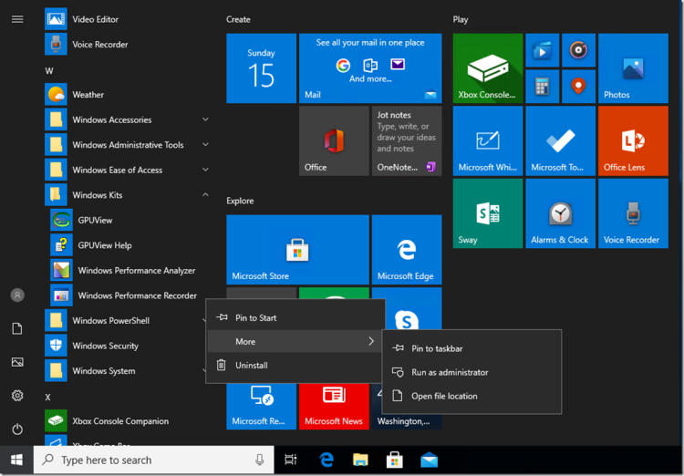
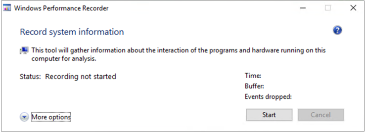

# <a name="troubleshoot-performance-issues-related-to-real-time-protection"></a>Problemen met prestaties met betrekking tot realtimebeveiliging oplossen


[!INCLUDE [Microsoft 365 Defender rebranding](../../includes/microsoft-defender.md)]


**Van toepassing op:**

- [Microsoft Defender voor Eindpunt](https://go.microsoft.com/fwlink/p/?linkid=2146631)
 
Als uw systeem een hoog CPU-gebruik of prestatieproblemen heeft met betrekking tot de realtimebeveiligingsservice in Microsoft Defender voor Eindpunt, kunt u een ticket indienen bij Microsoft-ondersteuning. Volg de stappen in [Diagnostische gegevens van Microsoft Defender Antivirus verzamelen.](collect-diagnostic-data.md)

Als beheerder kunt u deze problemen ook zelf oplossen. 

Misschien wilt u eerst controleren of het probleem wordt veroorzaakt door een andere software. Lees [Check with vendor for antivirus exclusions](#check-with-vendor-for-antivirus-exclusions).

Anders kunt u bepalen welke software is gerelateerd aan het geïdentificeerde prestatieprobleem door de stappen in Het Microsoft Protection Log analyseren [te volgen.](#analyze-the-microsoft-protection-log) 

U kunt ook aanvullende logboeken voor uw inzending bij Microsoft-ondersteuning verstrekken door de volgende stappen uit te voeren:
- [Proceslogboeken vastleggen met behulp van procesmonitor](#capture-process-logs-using-process-monitor)
- [Prestatielogboeken vastleggen met Windows Performance Recorder](#capture-performance-logs-using-windows-performance-recorder) 

## <a name="check-with-vendor-for-antivirus-exclusions"></a>Neem contact op met leverancier voor antivirusuitsluitingen

Als u de software die van invloed is op de systeemprestaties gemakkelijk kunt identificeren, gaat u naar het kenniscentrum of ondersteuningscentrum van de softwareleverancier. Zoek of ze aanbevelingen hebben over antivirusuitsluitingen. Als de website van de leverancier deze niet heeft, kunt u een ondersteuningsticket met hen openen en hen vragen er een te publiceren. 

Het is raadzaam dat softwareleveranciers voldoen aan de verschillende richtlijnen in Samenwerking met de [industrie om fout-positieven te minimaliseren.](https://www.microsoft.com/security/blog/2018/08/16/partnering-with-the-industry-to-minimize-false-positives/) De leverancier kan de software indienen via de [Microsoft Defender Security Intelligence Portal (MDSI).](https://www.microsoft.com/wdsi/filesubmission?persona=SoftwareDeveloper)


## <a name="analyze-the-microsoft-protection-log"></a>Het Microsoft Protection Log analyseren

In **MPLog-xxxxxxxx-xxxxxx.log** vindt u de geschatte prestatie-impactinformatie van de hardloopsoftware als *EstimatedImpact:*
    
`Per-process counts:ProcessImageName: smsswd.exe, TotalTime: 6597, Count: 1406, MaxTime: 609, MaxTimeFile: \Device\HarddiskVolume3\_SMSTaskSequence\Packages\WQ1008E9\Files\FramePkg.exe, EstimatedImpact: 65%`

| Veldnaam | Beschrijving |
|---|---|
|ProcessImageName | Naam van afbeelding verwerken |
| TotalTime | De cumulatieve duur in milliseconden die zijn besteed aan scans van bestanden die door dit proces worden gebruikt |
|Aantal | Het aantal gescande bestanden dat door dit proces wordt gebruikt |
|MaxTime |  De duur in milliseconden in de langste scan van een bestand dat door dit proces wordt gebruikt |
| MaxTimeFile | Het pad van het bestand dat door dit proces is gebruikt waarvoor de langste scan van de `MaxTime` duur is opgenomen |
| EstimatedImpact | Het percentage tijd dat is besteed aan scans voor bestanden die door dit proces zijn gebruikt buiten de periode waarin dit proces scanactiviteit heeft ervaren |

Als de prestatie-impact groot is, kunt u het proces toevoegen aan de uitsluitingen voor pad/proces door de stappen in Uitsluitingen configureren en valideren voor [Microsoft Defender Antivirusscans te volgen.](collect-diagnostic-data.md)

Als het probleem niet is opgelost met de vorige [](#capture-process-logs-using-process-monitor) stap, kunt u meer informatie verzamelen via de procesmonitor of de [Windows Performance Recorder](#capture-performance-logs-using-windows-performance-recorder) in de volgende secties.
     
## <a name="capture-process-logs-using-process-monitor"></a>Proceslogboeken vastleggen met behulp van procesmonitor

Procesmonitor (ProcMon) is een geavanceerd monitoringprogramma waarmee realtime-processen kunnen worden gebruikt. U kunt dit gebruiken om het prestatieprobleem vast te leggen terwijl het zich voordoet.

1. Download [Procesmonitor v3.60](/sysinternals/downloads/procmon) naar een map als `C:\temp` .

2. Het webmerk van het bestand verwijderen:
    1. Klik met de **rechtermuisknopProcessMonitor.zip** en selecteer **Eigenschappen.**
    1. Zoek onder *het* tabblad Algemeen naar *Beveiliging.*
    1. Het selectievakje naast **Blokkering opheffen in.**
    1. Selecteer **Toepassen.**
    
     

3. Los het bestand op zodat `C:\temp` het mappad wordt `C:\temp\ProcessMonitor` . 

4. Kopieer **ProcMon.exe**  naar de Windows-client of Windows-server die u probleemoplossing aan het oplossen bent.  

5. Voordat u ProcMon gaat uitvoeren, moet u ervoor zorgen dat alle andere toepassingen die niet gerelateerd zijn aan het probleem met het hoge CPU-gebruik, zijn gesloten. Als u dit doet, wordt het aantal te controleren processen geminimaliseerd.

6. U kunt ProcMon op twee manieren starten.
    1. Klik met de **rechtermuisknopProcMon.exe** en selecteer Uitvoeren **als beheerder.** 
    

        Aangezien logboekregistratie automatisch wordt gestart, selecteert u het vergrootglaspictogram om de huidige opname te stoppen of gebruikt u de sneltoets **Ctrl+E.**
 
        

        Als u wilt controleren of u de opname hebt gestopt, controleert u of het vergrootglaspictogram nu wordt weergegeven met een rode X.

                 

        Als u vervolgens de eerdere opname wilt wissen, selecteert u het pictogram Gum.

        

        Of gebruik de sneltoets **Ctrl+X.**

    2. De tweede manier is om de **opdrachtregel** als beheerder uit te voeren en vervolgens vanuit het pad Procesmonitor de opdracht uit te voeren:

        
 
        ```console
        Procmon.exe /AcceptEula /Noconnect /Profiling
        ```
        
        >[!TIP] 
        >Maak het ProcMon-venster zo klein mogelijk bij het vastleggen van gegevens, zodat u de trace eenvoudig kunt starten en stoppen.
        > 
        >
    
7. Nadat u een van de procedures in stap 6 hebt gevolgd, ziet u de volgende optie om filters in te stellen. Selecteer **OK**. U kunt de resultaten altijd filteren nadat de opname is voltooid.
 
     

8. Als u de opname wilt starten, selecteert u het vergrootglaspictogram opnieuw.
     
9. Reproduceer het probleem.
 
    >[!TIP] 
    >Wacht totdat het probleem volledig is gereproduceerd en noteer de tijdstempel wanneer de trace is gestart.

10. Als u twee tot vier minuten procesactiviteit hebt tijdens de hoge cpu-gebruiksvoorwaarde, stopt u de opname door het vergrootglaspictogram te selecteren.

11. Als u de opname wilt opslaan met een unieke naam en met de .pml-indeling, **selecteert** u Bestand en selecteert u **Opslaan...**. Zorg ervoor dat u de keuzerondjes **Alle gebeurtenissen en** De indeling van de native process monitor **(PML) selecteert.**

    

12. Voor een betere tracering wijzigt u het standaardpad `C:\temp\ProcessMonitor\LogFile.PML` van `C:\temp\ProcessMonitor\%ComputerName%_LogFile_MMDDYEAR_Repro_of_issue.PML` waar:
    - `%ComputerName%` is de naam van het apparaat
    - `MMDDYEAR` is de maand, dag en jaar
    -  `Repro_of_issue` is de naam van het probleem dat u probeert te reproduceren

    >[!TIP] 
    > Als u een werkend systeem hebt, kunt u een voorbeeldlogboek krijgen om te vergelijken.

13. Zip het .pml-bestand en stuur het naar Microsoft-ondersteuning.


## <a name="capture-performance-logs-using-windows-performance-recorder"></a>Prestatielogboeken vastleggen met Windows Performance Recorder

U kunt Windows Performance Recorder (WPR) gebruiken om aanvullende informatie in uw inzending bij Microsoft-ondersteuning op te nemen. WPR is een krachtig opnamehulpmiddel waarmee Event Tracing voor Windows-opnamen wordt gemaakt. 

WPR maakt deel uit van de Windows Assessment and Deployment Kit (Windows ADK) en kan worden gedownload van De [Windows ADK downloaden](/windows-hardware/get-started/adk-install)en installeren. U kunt deze ook downloaden als onderdeel van de Windows 10 Software Development Kit bij [Windows 10 SDK.](https://developer.microsoft.com/windows/downloads/windows-10-sdk/)

U kunt de wpr-gebruikersinterface gebruiken door de stappen in Prestatielogboeken vastleggen te volgen [met behulp van de WPR-gebruikersinterface.](#capture-performance-logs-using-the-wpr-ui) 

U kunt ook het opdrachtregelprogramma *wpr.exegebruiken,* dat beschikbaar is in Windows 8 en latere versies door de stappen in Prestatielogboeken vastleggen te volgen met behulp van de [WPR CLI.](#capture-performance-logs-using-the-wpr-cli)


### <a name="capture-performance-logs-using-the-wpr-ui"></a>Prestatielogboeken vastleggen met de WPR-gebruikersinterface

>[!TIP]
>Als u meerdere apparaten hebt waar het probleem zich voordoet, gebruikt u het apparaat met de meeste RAM-geheugen.

1. Download en installeer WPR.

2. Klik *onder Windows Kits* met de rechtermuisknop op Windows Performance **Recorder.** 

    

    Selecteer **Meer**. Selecteer **Uitvoeren als beheerder.**

3. Wanneer het dialoogvenster Gebruikersaccountbeheer wordt weergegeven, selecteert u **Ja.**

    

4. Download vervolgens het [analyseprofiel van Microsoft Defender voor eindpunten](https://github.com/YongRhee-MDE/Scripts/blob/master/MDAV.wprp) en sla het op `WD.wprp` in een map zoals `C:\temp` . 
     
5. Selecteer meer opties in het dialoogvenster WPR.

    

6. Selecteer **Profielen toevoegen...** en blader naar het pad van het `WD.wprp` bestand.

7. Daarna ziet u een nieuw profiel dat is ingesteld onder Aangepaste *afmetingen* met de naam *Microsoft Defender voor eindpuntanalyse* eronder.

    

    >[!WARNING]
    >Als uw Windows Server 64 GB RAM-geheugen of meer heeft, gebruikt u de aangepaste maat `Microsoft Defender for Endpoint analysis for large servers` in plaats van `Microsoft Defender for Endpoint analysis` . Anders kan uw systeem een grote hoeveelheid niet-pagina's poolgeheugen of buffers verbruiken, wat kan leiden tot systeeminstabiliteit. U kunt kiezen welke profielen u wilt toevoegen door Resourceanalyse **uit te breiden.** Dit aangepaste profiel biedt de benodigde context voor een uitgebreide prestatieanalyse.
 
8. De aangepaste meting van Microsoft Defender voor eindpunt verbose analyseprofiel gebruiken in de WPR-gebruikersinterface:

    1. Zorg ervoor dat er geen profielen zijn geselecteerd onder de groepen *Triage* op het eerste niveau, *Resourceanalyse* en *Scenarioanalyse.*
    2. Selecteer **Aangepaste afmetingen.**
    3. Selecteer **Microsoft Defender voor eindpuntanalyse.**
    4. Selecteer **Verbose** onder *Detailniveau.*
    1. Selecteer **Bestand of** Geheugen **onder** logboekregistratiemodus. 

    >[!important]
    >Selecteer Bestand *om de* bestandsregistratiemodus te gebruiken als het prestatieprobleem rechtstreeks door de gebruiker kan worden gereproduceerd. De meeste problemen vallen onder deze categorie. Als de gebruiker het probleem echter niet rechtstreeks kan reproduceren, maar het  probleem gemakkelijk kan zien wanneer het probleem optreedt, moet de gebruiker Geheugen selecteren om de modus geheugenregistratie te gebruiken. Dit zorgt ervoor dat het tracelogboek niet te hoog wordt vanwege de lange termijn.

9. U bent nu klaar om gegevens te verzamelen. Sluit alle toepassingen af die niet relevant zijn voor het reproduceren van het prestatieprobleem. U kunt Opties **verbergen selecteren om** de ruimte die door het WPR-venster wordt bezet, klein te houden.

    

    >[!TIP]
    >Probeer de trace op hele getalseconden te starten. Bijvoorbeeld: 01:30:00. Dit maakt het gemakkelijker om de gegevens te analyseren. Probeer ook de tijdstempel bij te houden van precies wanneer het probleem wordt gereproduceerd.

10. Selecteer **Start**.

    

11. Reproduceer het probleem.

    >[!TIP]
    >Houd de gegevensverzameling tot niet meer dan vijf minuten. Twee tot drie minuten is een goed bereik omdat er veel gegevens worden verzameld.

12. Selecteer **Opslaan**.

    

13. Opvullen **Typ een gedetailleerde beschrijving van het probleem:** met informatie over het probleem en hoe u het probleem hebt gereproduceerd.

    

    1. Selecteer **Bestandsnaam:** om te bepalen waar het trace-bestand wordt opgeslagen. Standaard wordt de 1.is opgeslagen in `%user%\Documents\WPR Files\` .
    1. Selecteer **Opslaan**.

14. Wacht totdat de trace wordt samengevoegd.

    

15. Wanneer de trace is opgeslagen, selecteert u **Map openen.**

    

    Neem zowel het bestand als de map op in uw inzending bij Microsoft-ondersteuning.

    

### <a name="capture-performance-logs-using-the-wpr-cli"></a>Prestatielogboeken vastleggen met de WPR CLI

Het opdrachtregelprogramma *wpr.exe* maakt deel uit van het besturingssysteem dat begint met Windows 8. Een WPR-trace verzamelen met behulp van de opdrachtregelfunctie wpr.exe:

1. Microsoft **[Defender voor endpoint-analyseprofiel](https://github.com/YongRhee-MDE/Scripts/blob/master/MDAV.wprp)** downloaden voor prestatiesporen naar een bestand met de naam `WD.wprp` in een lokale adreslijst, zoals `C:\traces` .

3. Klik met de rechtermuisknop op **het startmenupictogram** en selecteer **Windows PowerShell (beheerder)** of Opdrachtprompt **(beheerder)** om een opdrachtpromptvenster voor beheerders te openen.

4. Wanneer het dialoogvenster Gebruikersaccountbeheer wordt weergegeven, selecteert u **Ja.**

5. Voer bij de verhoogde prompt de volgende opdracht uit om een Prestatiespoor van Microsoft Defender voor eindpunt te starten:

    ```console
    wpr.exe -start C:\traces\WD.wprp!WD.Verbose -filemode
    ```
    
    >[!WARNING]
    >Als uw Windows Server 64 GB of RAM-geheugen of meer heeft, gebruikt u profielen en in plaats van `WDForLargeServers.Light` `WDForLargeServers.Verbose` profielen en , `WD.Light` `WD.Verbose` respectievelijk. Anders kan uw systeem een grote hoeveelheid niet-pagina's poolgeheugen of buffers verbruiken, wat kan leiden tot systeeminstabiliteit.

6. Reproduceer het probleem.

    >[!TIP]
    >Houd de gegevensverzameling niet langer dan vijf minuten.  Afhankelijk van het scenario is twee tot drie minuten een goed bereik omdat er veel gegevens worden verzameld.

7. Voer bij de verhoogde prompt de volgende opdracht uit om het prestatiespoor te stoppen en zorg ervoor dat u informatie geeft over het probleem en hoe u het probleem hebt gereproduceerd:

    ```console
    wpr.exe -stop merged.etl "Timestamp when the issue was reproduced, in HH:MM:SS format" "Description of the issue" "Any error that popped up"
    ```

8. Wacht totdat de trace is samengevoegd. 

9. Neem zowel het bestand als de map op in uw inzending bij Microsoft-ondersteuning.

## <a name="see-also"></a>Zie ook

- [Diagnostische gegevens van Microsoft Defender Antivirus verzamelen](collect-diagnostic-data.md)
- [Uitsluitingen configureren en valideren voor Antivirusscans van Microsoft Defender](configure-exclusions-microsoft-defender-antivirus.md)
