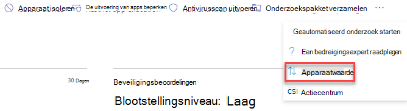
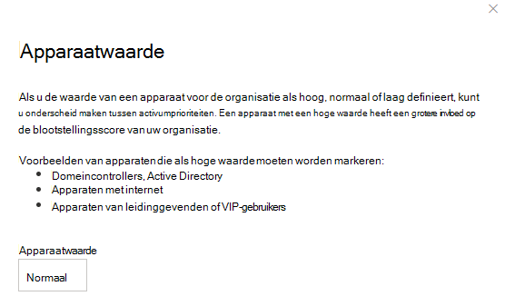

# Apparaatwaarde toewijzen - bedreigings- en kwetsbaarheidsbeheerAssign device value - threat and vulnerability management

[!INCLUDE [Microsoft 365 Defender rebranding](../../includes/microsoft-defender.md)]

**Van toepassing op:****Applies to:**

- [Microsoft Defender voor EindpuntMicrosoft Defender for Endpoint](https://go.microsoft.com/fwlink/?linkid=2154037)
- [Bedreigings- en kwetsbaarheidsbeheerThreat and vulnerability management](next-gen-threat-and-vuln-mgt.md)
- [Microsoft 365 DefenderMicrosoft 365 Defender](https://go.microsoft.com/fwlink/?linkid=2118804)

> Wilt u Microsoft Defender voor Eindpunt ervaren?Want to experience Microsoft Defender for Endpoint? [Meld u aan voor een gratis proefabonnement.Sign up for a free trial.](https://www.microsoft.com/microsoft-365/windows/microsoft-defender-atp?ocid=docs-wdatp-portaloverview-abovefoldlink)

[!include[Prerelease information](../../includes/prerelease.md)]

Als u de waarde van een apparaat definieert, kunt u onderscheid maken tussen activumprioriteiten.Defining a device’s value helps you differentiate between asset priorities. De apparaatwaarde wordt gebruikt om de risicobereidheid van een afzonderlijk activum op te nemen in de berekening van blootstellingsscores voor bedreigings- en kwetsbaarheidsbeheer.The device value is used to incorporate the risk appetite of an individual asset into the threat and vulnerability management exposure score calculation. Apparaten die zijn toegewezen als 'hoge waarde' krijgen meer gewicht.Devices assigned as “high value” will receive more weight.

U kunt ook de [set device value API gebruiken.](set-device-value.md)You can also use the [set device value API](set-device-value.md).

Opties voor apparaatwaarde:Device value options:

- LaagLow
- Normaal (standaard)Normal (Default)
- HoogHigh

Voorbeelden van apparaten die een hoge waarde moeten krijgen:Examples of devices that should be assigned a high value:

- Domeincontrollers, Active DirectoryDomain controllers, Active Directory
- Apparaten met internetInternet facing devices
- VIP-apparatenVIP devices
- Apparaten die interne/externe productieservices hostenDevices hosting internal/external production services

## Apparaatwaarde kiezenChoose device value

1. Navigeer naar een apparaatpagina, de eenvoudigste plaats is uit de apparaatvoorraad.Navigate to any device page, the easiest place is from the device inventory.

2. Selecteer **Apparaatwaarde** op drie puntjes naast de actiebalk boven aan de pagina.Select **Device value** from three dots next to the actions bar at the top of the page.

    

3. Er wordt een flyout weergegeven met de huidige apparaatwaarde en wat dit betekent.A flyout will appear with the current device value and what it means. Controleer de waarde van het apparaat en kies het apparaat dat het beste bij uw apparaat past.Review the value of the device and choose the one that best fits your device.

## Hoe de apparaatwaarde van invloed is op uw blootstellingsscoreHow device value impacts your exposure score

De blootstellingsscore is een gewogen gemiddelde op alle apparaten.The exposure score is a weighted average across all devices. Als u apparaatgroepen hebt, kunt u de score ook filteren op apparaatgroep.If you have device groups, you can also filter the score by device group.

- Normale apparaten hebben een gewicht van 1Normal devices have a weight of 1
- Apparaten met een lage waarde hebben een gewicht van 0,75Low value devices have a weight of 0.75
- Apparaten met een hoge waarde hebben een gewicht van NumberOfAssets / 10.High value devices have a weight of NumberOfAssets / 10.
    - Als u 100 apparaten hebt, heeft elk apparaat met een hoge waarde een gewicht van 10 (100-10)If you have 100 devices, each high value device will have a weight of 10 (100/10)

## Verwante onderwerpenRelated topics

- [Overzicht van bedreigings- en kwetsbaarheidsbeheerThreat and vulnerability management overview](next-gen-threat-and-vuln-mgt.md)
- [BlootstellingsscoreExposure Score](tvm-exposure-score.md)
- [API‘sAPIs](next-gen-threat-and-vuln-mgt.md#apis)