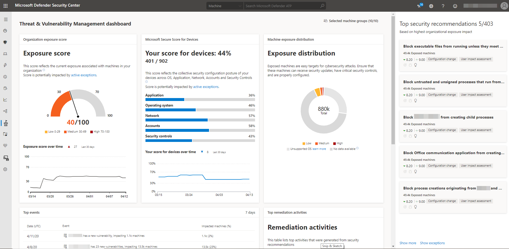

# Dashboardinzichten - Threat and Vulnerability Management

[!INCLUDE [Microsoft 365 Defender rebranding](../../includes/microsoft-defender.md)]

**Van toepassing op:**

- [Microsoft Defender voor Eindpunt](https://go.microsoft.com/fwlink/?linkid=2154037)
- [Bedreiging en vulnerability management](next-gen-threat-and-vuln-mgt.md)
- [Microsoft 365 Defender](https://go.microsoft.com/fwlink/?linkid=2118804)

> Wilt u Defender voor Eindpunt ervaren? [Meld u aan voor een gratis proefabonnement.](https://www.microsoft.com/microsoft-365/windows/microsoft-defender-atp?ocid=docs-wdatp-portaloverview-abovefoldlink)

Bedreiging en vulnerability management is een onderdeel van Defender voor Eindpunt en biedt zowel beveiligingsbeheerders als beveiligingsbewerkingsteams een unieke waarde, waaronder:

- Realtime-eindpuntdetectie en -respons (EDR) die zijn gecorreleerd met eindpuntproblemen
- Zeer waardevolle apparaatprobleemcontext tijdens incidentonderzoeken
- Ingebouwde herstelprocessen via Microsoft Intune en Microsoft Endpoint Configuration Manager  
  
U kunt de Threat and Vulnerability Management in Microsoft Defender-beveiligingscentrum [gebruiken](https://securitycenter.windows.com/) om:

- U blootstellingsscore en Microsoft Secure Score voor apparaten weergeven, samen met de beste beveiligingsaanbevelingen, softwareprobleem, herstelactiviteiten en blootgestelde apparaten
- Inzichten EDR met eindpuntproblemen correleren en verwerken
- Opties voor herstel selecteren om de hersteltaken te triageren en bij te houden
- Uitzonderingsopties selecteren en actieve uitzonderingen bijhouden

> [!NOTE]
> Apparaten die niet actief zijn in de afgelopen 30 dagen, worden niet mee rekening houden met de gegevens die de Threat and Vulnerability Management blootstellingsscore van uw organisatie en Microsoft Secure Score voor apparaten weerspiegelen.

Bekijk deze video voor een kort overzicht van wat er in het Threat and Vulnerability Management dashboard staat.

>[!VIDEO https://www.microsoft.com/en-us/videoplayer/embed/RE4r1nv]

## Bedreiging en vulnerability management dashboard

 

Gebied | Beschrijving
:---|:---
**Geselecteerde apparaatgroepen (#/#)**   | Filter de Threat and Vulnerability Management gegevens die u wilt zien in het dashboard en kaarten op apparaatgroepen. Wat u in het filter selecteert, is van toepassing op de Threat and Vulnerability Management pagina's.
[**Blootstellingsscore**](tvm-exposure-score.md)   | Bekijk de huidige status van de blootstelling van uw organisatie aan bedreigingen en beveiligingsproblemen. Verschillende factoren zijn van invloed op de blootstellingsscore van uw organisatie: zwakke punten die zijn ontdekt op uw apparaten, de kans dat uw apparaten worden geschonden, de waarde van de apparaten voor uw organisatie en relevante waarschuwingen die met uw apparaten zijn gevonden. Het doel is om de blootstellingsscore van uw organisatie te verlagen om veiliger te zijn. Als u de score wilt verlagen, moet u de gerelateerde beveiligingsconfiguratieproblemen oplossen die in de beveiligingsaanbevelingen worden vermeld.
[**Microsoft Secure Score voor apparaten**](tvm-microsoft-secure-score-devices.md) | Bekijk de beveiligingsstatus van het besturingssysteem, de toepassingen, het netwerk, de accounts en de beveiligingsbesturingselementen van uw organisatie. Het doel is om de gerelateerde beveiligingsconfiguratieproblemen op te lossen om uw score voor apparaten te verhogen. Als u de balken selecteert, gaat u naar de **pagina Beveiligingsaanbeveling.**
**Verdeling van apparaatblootstelling** | Bekijk hoeveel apparaten worden blootgesteld op basis van hun blootstellingsniveau. Selecteer een sectie in het ringdiagram om naar de lijstpagina Apparaten te gaan en de namen van het betreffende apparaat, blootstellingsniveau, risiconiveau en andere details weer te geven, zoals domein, besturingssysteemplatform, de status ervan, wanneer deze voor het laatst is gezien en de tags. 
**Belangrijkste beveiligingsaanbevelingen** | Bekijk de gesorteerde beveiligingsaanbevelingen die zijn gesorteerd en geprioriteerd op basis van de risicoblootstelling van uw organisatie en de urgentie die hiervoor nodig is. Selecteer **Meer tonen** om de rest van de beveiligingsaanbevelingen in de lijst weer te geven. Selecteer **Uitzonderingen voor** de lijst met aanbevelingen met een uitzondering.
**Meest kwetsbare software** | Krijg realtime inzicht in de softwarevoorraad van uw organisatie met een lijst met kwetsbare software die op de apparaten van uw netwerk is geïnstalleerd en hoe deze van invloed zijn op de blootstellingsscore van uw organisatie. Selecteer een item voor meer informatie of **Meer bekijken** om de rest van de lijst met kwetsbare software op de **pagina Softwarevoorraad weer te** geven.
**Belangrijkste herstelactiviteiten** | Houd de herstelactiviteiten bij die zijn gegenereerd op basis van de beveiligingsaanbevelingen. U kunt elk item in de lijst  selecteren om de  details op de pagina Herstel weer te geven of selecteer Meer weergeven om de rest van de herstelactiviteiten en actieve uitzonderingen weer te geven.
**Best belichte apparaten** | Bekijk de namen van blootgestelde apparaten en hun blootstellingsniveau. Selecteer een apparaatnaam in de lijst om naar de apparaatpagina te gaan waar u de waarschuwingen, risico's, incidenten, beveiligingsaanbevelingen, geïnstalleerde software en gevonden beveiligingsproblemen kunt bekijken die zijn gekoppeld aan de blootgestelde apparaten. Selecteer **Meer tonen** om de rest van de lijst met blootgestelde apparaten weer te geven. In de lijst met apparaten kunt u tags beheren, geautomatiseerde onderzoeken starten, een livereactiesessie starten, een onderzoekspakket verzamelen, antivirusscans uitvoeren, de uitvoering van apps beperken en apparaat isoleren.

Zie [Microsoft Defender voor eindpuntpictogrammen](portal-overview.md#microsoft-defender-for-endpoint-icons)voor meer informatie over de pictogrammen die in de portal worden gebruikt.

## Verwante onderwerpen

- [Overzicht van bedreigingen en vulnerability management](next-gen-threat-and-vuln-mgt.md)
- [Blootstellingsscore](tvm-exposure-score.md)
- [Microsoft Secure Score voor apparaten](tvm-microsoft-secure-score-devices.md)
- [Beveiligingsaanbevelingen](tvm-security-recommendation.md)
- [Software-inventaris](tvm-software-inventory.md)
- [Tijdlijn van het evenement](threat-and-vuln-mgt-event-timeline.md)

