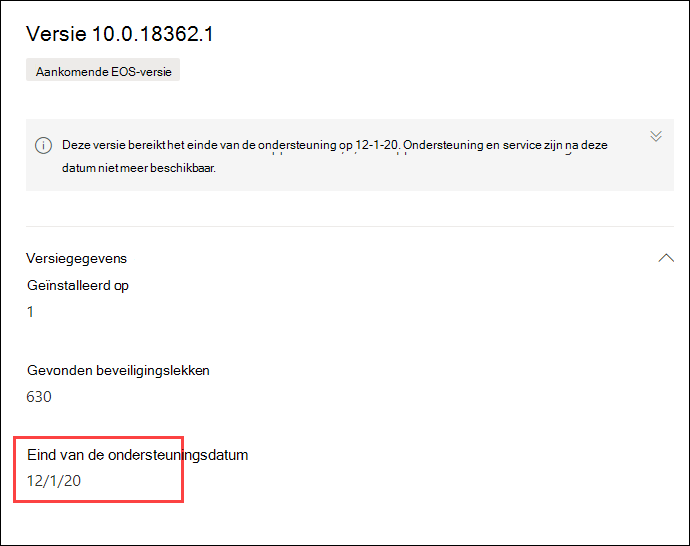

# Plan voor end-of-support software- en softwareversies met bedreigings- en kwetsbaarheidsbeheerPlan for end-of-support software and software versions with threat and vulnerability management

[!INCLUDE [Microsoft 365 Defender rebranding](../../includes/microsoft-defender.md)]

**Van toepassing op:****Applies to:**

- [Microsoft Defender voor EindpuntMicrosoft Defender for Endpoint](https://go.microsoft.com/fwlink/?linkid=2154037)
- [Bedreigings- en kwetsbaarheidsbeheerThreat and vulnerability management](next-gen-threat-and-vuln-mgt.md)
- [Microsoft 365 DefenderMicrosoft 365 Defender](https://go.microsoft.com/fwlink/?linkid=2118804)

>Wilt u Microsoft Defender voor Eindpunt ervaren?Want to experience Microsoft Defender for Endpoint? [Meld u aan voor een gratis proefabonnement.Sign up for a free trial.](https://www.microsoft.com/microsoft-365/windows/microsoft-defender-atp?ocid=docs-wdatp-portaloverview-abovefoldlink)

End-of-support (EOS), ook wel bekend als end-of-life (EOL), voor software- of softwareversies betekent dat ze niet meer worden ondersteund of geserviced en geen beveiligingsupdates ontvangen.End-of-support (EOS), otherwise known as end-of-life (EOL), for software or software versions means that they will no longer be supported or serviced, and will not receive security updates. Wanneer u software- of softwareversies met beëindigde ondersteuning gebruikt, wordt uw organisatie blootgelegd aan beveiligingsproblemen, juridische en financiële risico's.When you use software or software versions with ended support, you're exposing your organization to security vulnerabilities, legal, and financial risks.

Het is essentieel voor beveiligings- en IT-beheerders om samen te werken en ervoor te zorgen dat de softwarevoorraad van de organisatie is geconfigureerd voor optimale resultaten, naleving en een gezond netwerkecosysteem.It's crucial for Security and IT Administrators to work together and ensure that the organization's software inventory is configured for optimal results, compliance, and a healthy network ecosystem. Ze moeten de opties bekijken om apps te verwijderen of te vervangen die einde-of-ondersteunings- en updateversies hebben bereikt die niet meer worden ondersteund.They should examine the options to remove or replace apps that have reached end-of-support and update versions that are no longer supported. U kunt het beste een  plan maken en implementeren vóór het einde van de ondersteuningsdatum.It's best to create and implement a plan **before** the end of support dates.

## Software- of softwareversies zoeken die niet meer worden ondersteundFind software or software versions that are no longer supported

1. Ga in het menu Bedreigings- en kwetsbaarheidsbeheer naar [**Beveiligingsaanbevelingen.**](tvm-security-recommendation.md)From the threat and vulnerability management menu, navigate to [**Security recommendations**](tvm-security-recommendation.md).
2. Ga naar het **deelvenster Filters** en zoek naar de sectie Tags.Go to the **Filters** panel and look for the tags section. Selecteer een of meer van de EOS-tagopties.Select one or more of the EOS tag options. Vervolgens **toepassen.**Then **Apply**.

    

3. U ziet een lijst met aanbevelingen met betrekking tot software met beëindigde ondersteuning, softwareversies die het einde van de ondersteuning zijn of versies met een binnenkort einde van de ondersteuning.You'll see a list of recommendations related to software with ended support, software versions that are end of support, or versions with upcoming end of support. Deze tags zijn ook zichtbaar op de [pagina softwarevoorraad.](tvm-software-inventory.md)These tags are also visible in the [software inventory](tvm-software-inventory.md) page.

    

## Lijst met versies en datumsList of versions and dates

Als u een lijst wilt weergeven met versies die het einde van de ondersteuning hebben bereikt, of binnenkort eindigen of ondersteunen, en deze datums, volgt u de volgende stappen:To view a list of versions that have reached end of support, or end or support soon, and those dates, follow the below steps:

1. Er wordt een bericht weergegeven in de flyout beveiligingsaanbeveling voor software met versies die het einde van de ondersteuning hebben bereikt of binnenkort het einde van de ondersteuning bereiken.A message will appear in the security recommendation flyout for software with versions that have reached end of support, or will reach end of support soon.

    

2. Selecteer de **koppeling versiedistributie** om naar de inzoompagina van de software te gaan.Select the **version distribution** link to go to the software drill-down page. Daar ziet u een gefilterde lijst met versies met tags die deze identificeren als einde van de ondersteuning of het aanstaande einde van de ondersteuning.There, you can see a filtered list of versions with tags identifying them as end of support, or upcoming end of support.

    

3. Selecteer een van de versies in de tabel die u wilt openen.Select one of the versions in the table to open. Bijvoorbeeld versie 10.0.18362.1.For example, version 10.0.18362.1. Er wordt een flyout weergegeven met het einde van de ondersteuningsdatum.A flyout will appear with the end of support date.

    

Nadat u hebt bepaald welke software- en softwareversies kwetsbaar zijn vanwege de status van het einde van de ondersteuning, moet u beslissen of u deze wilt bijwerken of verwijderen uit uw organisatie.Once you identify which software and software versions are vulnerable due to their end-of-support status, you must decide whether to update or remove them from your organization. Hierdoor worden uw organisaties minder blootgesteld aan beveiligingslekken en geavanceerde permanente bedreigingen.Doing so will lower your organizations exposure to vulnerabilities and advanced persistent threats.

## Verwante onderwerpenRelated topics

- [Overzicht van bedreigings- en kwetsbaarheidsbeheerThreat and vulnerability management overview](next-gen-threat-and-vuln-mgt.md)
- [BeveiligingsaanbevelingenSecurity recommendations](tvm-security-recommendation.md)
- [Software-inventarisSoftware inventory](tvm-software-inventory.md)
