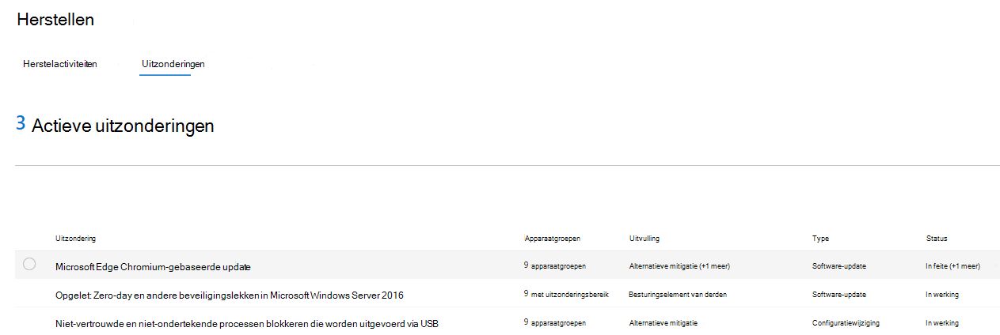

# Uitzonderingen maken en weergeven voor beveiligingsaanbevelingen - bedreigings- en kwetsbaarheidsbeheerCreate and view exceptions for security recommendations - threat and vulnerability management

[!INCLUDE [Microsoft 365 Defender rebranding](../../includes/microsoft-defender.md)]

**Van toepassing op:****Applies to:**

- [Microsoft Defender voor EindpuntMicrosoft Defender for Endpoint](https://go.microsoft.com/fwlink/?linkid=2154037)
- [Bedreigings- en kwetsbaarheidsbeheerThreat and vulnerability management](next-gen-threat-and-vuln-mgt.md)
- [Microsoft 365 DefenderMicrosoft 365 Defender](https://go.microsoft.com/fwlink/?linkid=2118804)

>Wilt u Microsoft Defender voor Eindpunt ervaren?Want to experience Microsoft Defender for Endpoint? [Meld u aan voor een gratis proefabonnement.Sign up for a free trial.](https://www.microsoft.com/microsoft-365/windows/microsoft-defender-atp?ocid=docs-wdatp-portaloverview-abovefoldlink)

Als alternatief voor een herstelaanvraag wanneer een aanbeveling op dit moment niet relevant is, kunt u uitzonderingen maken voor aanbevelingen.As an alternative to a remediation request when a recommendation is not relevant at the moment, you can create exceptions for recommendations. Als uw organisatie apparaatgroepen heeft, kunt u de uitzondering op specifieke apparaatgroepen bereiken.If your organization has device groups, you will be able to scope the exception to specific device groups. Uitzonderingen kunnen worden gemaakt voor geselecteerde apparaatgroepen, of voor alle apparaatgroepen van vroeger en nu.Exceptions can either be created for selected device groups, or for all device groups past and present.  

Wanneer een uitzondering wordt gemaakt voor een aanbeveling, is de aanbeveling pas actief na het einde van de duur van de uitzondering.When an exception is created for a recommendation, the recommendation will not be active until the end of the exception duration. De aanbevelingstoestand wordt gewijzigd in **Volledige uitzondering** of **Gedeeltelijke uitzondering** (per apparaatgroep).The recommendation state will change to **Full exception** or **Partial exception** (by device group).

## MachtigingenPermissions

Alleen gebruikers met machtigingen voor het verwerken van uitzonderingen kunnen uitzonderingen beheren (waaronder het maken of annuleren).Only users with “exceptions handling” permissions can manage exceptions (including creating or canceling). [Meer informatie over RBAC-rollen.](user-roles.md)[Learn more about RBAC roles](user-roles.md).

## Een uitzondering makenCreate an exception

Selecteer een beveiligingsaanbeveling voor wie u een uitzondering wilt maken en selecteer vervolgens **Opties** voor uitzondering en vul het formulier in.Select a security recommendation you would like create an exception for, and then select **Exception options** and fill out the form.  

### Uitzondering per apparaatgroepException by device group

Pas de uitzondering toe op alle huidige apparaatgroepen of kies specifieke apparaatgroepen.Apply the exception to all current device groups or choose specific device groups. Toekomstige apparaatgroepen worden niet opgenomen in de uitzondering.Future device groups won't be included in the exception. Apparaatgroepen die al een uitzondering hebben, worden niet weergegeven in de lijst.Device groups that already have an exception will not be displayed in the list. Als u alleen bepaalde apparaatgroepen selecteert, verandert de aanbevelingstoestand van 'actief' in 'gedeeltelijke uitzondering'.If you only select certain device groups, the recommendation state will change from “active” to “partial exception.” De status wordt gewijzigd in 'volledige uitzondering' als u alle apparaatgroepen selecteert.The state will change to “full exception” if you select all the device groups.

#### Gefilterde weergavenFiltered views

Als u op een van de pagina's voor bedreigings- en kwetsbaarheidsbeheer op apparaatgroep hebt gefilterd, worden alleen de gefilterde apparaatgroepen weergegeven als opties.If you have filtered by device group on any of the threat and vulnerability management pages, only your filtered device groups will appear as options.

Dit is de knop om te filteren op apparaatgroep op een van de pagina's voor bedreigings- en kwetsbaarheidsbeheer:This is the button to filter by device group on any of the threat and vulnerability management pages: 

Uitzonderingsweergave met gefilterde apparaatgroepen:Exception view with filtered device groups:

#### Groot aantal apparaatgroepenLarge number of device groups

Als uw organisatie meer dan 20 apparaatgroepen heeft, **selecteert** u Bewerken naast de optie gefilterde apparaatgroep.If your organization has more than 20 device groups, select **Edit** next to the filtered device group option.

Er wordt een flyout weergegeven waarin u apparaatgroepen kunt zoeken en kiezen die u wilt gebruiken.A flyout will appear where you can search and choose device groups you want included. Selecteer het vinkje onder Zoeken om alles te controleren/uit te checken.Select the check mark icon below Search to check/uncheck all.

### Globale uitzonderingenGlobal exceptions

Als u globale beheerdersmachtigingen hebt, kunt u een globale uitzondering maken en annuleren.If you have global administrator permissions, you will be able to create and cancel a global exception. Dit is van **invloed op** alle huidige en toekomstige apparaatgroepen in uw organisatie, en alleen een gebruiker met vergelijkbare machtigingen kan deze wijzigen.It affects **all** current and future device groups in your organization, and only a user with similar permission would be able to change it. De aanbevelingstoestand verandert van 'actief' in 'volledige uitzondering'.The recommendation state will change from “active” to “full exception.”

Enkele dingen waar u rekening mee moet houden:Some things to keep in mind:

- Als een aanbeveling een globale uitzondering is, worden nieuwe uitzonderingen voor apparaatgroepen opgeschort totdat de algemene uitzondering is verlopen of geannuleerd.If a recommendation is under global exception, then newly created exceptions for device groups will be suspended until the global exception has expired or been cancelled. Daarna worden de uitzonderingen voor de nieuwe apparaatgroep van kracht totdat ze verlopen.After that point, the new device group exceptions will go into effect until they expire.
- Als een aanbeveling al uitzonderingen voor specifieke apparaatgroepen heeft en er een algemene uitzondering wordt gemaakt, wordt de uitzondering voor de apparaatgroep opgeschort totdat deze verloopt of wordt de globale uitzondering geannuleerd voordat deze verloopt.If a recommendation already has exceptions for specific device groups and a global exception is created, then the device group exception will be suspended until it expires or the global exception is cancelled before it expires.

### UitvullingJustification

Selecteer uw rechtvaardiging voor de uitzondering die u moet indienen in plaats van de beveiligingsaanbeveling in kwestie te corrigeren.Select your justification for the exception you need to file instead of remediating the security recommendation in question. Vul de uitvullingscontext in en stel de duur van de uitzondering in.Fill out the justification context, then set the exception duration.

In de volgende lijst worden de argumenten achter de uitzonderingsopties begegevens weergegeven:The following list details the justifications behind the exception options:

- **Controle door derden** - Een product of software van derden heeft al een adres voor deze aanbeveling- Als u dit type uitvulling kiest, wordt uw blootstellingsscore lager en verhoogt u uw veilige score omdat uw risico is beperkt**Third party control** - A third party product or software already addresses this recommendation       - Choosing this justification type will lower your exposure score and increase your secure score because your risk is reduced
- **Alternatieve mitigatie** - Een intern hulpmiddel heeft al een oplossing voor deze aanbeveling: als u dit type rechtvaardiging kiest, wordt uw blootstellingsscore lager en verhoogt u de veilige score omdat uw risico is beperkt**Alternate mitigation** - An internal tool already addresses this recommendation       - Choosing this justification type will lower your exposure score and increase your secure score because your risk is reduced
- **Risico geaccepteerd:** een laag risico en/of het implementeren van de aanbeveling is te duur**Risk accepted** - Poses low risk and/or implementing the recommendation is too expensive
- **Geplande herstel (respijt)** - Al gepland, maar wacht op uitvoering of autorisatie**Planned remediation (grace)** - Already planned but is awaiting execution or authorization

## Alle uitzonderingen weergevenView all exceptions

Ga naar het **tabblad Uitzonderingen** op **de pagina** Herstel.Navigate to the **Exceptions** tab in the **Remediation** page. U kunt filteren op uitvulling, type en status.You can filter by justification, type, and status.

 Selecteer een uitzondering om een flyout te openen met meer informatie.Select an exception to open a flyout with more details. Uitzonderingen per apparatengroep hebben een lijst met elke apparaatgroep die de uitzonderingsdekking heeft, die u kunt exporteren.Exceptions per devices group will have a list of every device group the exception covers, which you can export. U kunt ook de gerelateerde aanbeveling bekijken of de uitzondering annuleren.You can also view the related recommendation or cancel the exception.

## Een uitzondering annulerenHow to cancel an exception

Als u een uitzondering wilt annuleren, gaat u naar het tabblad **Uitzonderingen** op de **pagina** Herstel.To cancel an exception, navigate to the **Exceptions** tab in the **Remediation** page. Selecteer de uitzondering.Select the exception.

Als u de uitzondering voor alle apparaatgroepen of voor een algemene uitzondering wilt annuleren, selecteert u de knop Uitzondering **annuleren voor alle apparaatgroepen.**To cancel the exception for all device groups or for a global exception, select the **Cancel exception for all device groups** button. U kunt alleen uitzonderingen annuleren voor apparaatgroepen waar u machtigingen voor hebt.You will only be able to cancel exceptions for device groups you have permissions for.

### De uitzondering voor een specifieke apparaatgroep annulerenCancel the exception for a specific device group

Selecteer de specifieke apparaatgroep om de uitzondering te annuleren.Select the specific device group to cancel the exception for it. Er wordt een flyout weergegeven voor de apparaatgroep en u kunt **Uitzondering annuleren selecteren.**A flyout will appear for the device group, and you can select **Cancel exception**.

## Impact weergeven nadat uitzonderingen zijn toegepastView impact after exceptions are applied

Selecteer op de pagina  Beveiligingsaanbevelingen de optie Kolommen aanpassen en schakel de selectievakjes Voor Blootgestelde apparaten **(na uitzonderingen)** en **Impact (na uitzonderingen) in.**In the Security Recommendations page, select **Customize columns** and check the boxes for **Exposed devices (after exceptions)** and **Impact (after exceptions)**.

In de kolom Blootgestelde apparaten (na uitzonderingen) worden de overige apparaten getoond die nog steeds aan beveiligingsproblemen worden blootgesteld nadat uitzonderingen zijn toegepast.The exposed devices (after exceptions) column shows the remaining devices that are still exposed to vulnerabilities after exceptions are applied. Uitzonderingsgronden die van invloed zijn op de blootstelling, zijn onder meer 'third party control' en 'alternate mitigation'.Exception justifications that affect the exposure include ‘third party control’ and ‘alternate mitigation’. Andere redenen beperken de blootstelling van een apparaat niet en worden nog steeds als blootgesteld beschouwd.Other justifications do not reduce the exposure of a device, and they are still considered exposed.

Het effect (na uitzonderingen) toont de resterende invloed op de blootstellingsscore of de veilige score nadat uitzonderingen zijn toegepast.The impact (after exceptions) shows remaining impact to exposure score or secure score after exceptions are applied. Uitzonderingsuitvullingen die van invloed zijn op de scores zijn 'third party control' en 'alternate mitigation'.Exception justifications that affect the scores include ‘third party control’ and ‘alternate mitigation.’ Andere rechtvaardigingen beperken de blootstelling van een apparaat niet, zodat de belichtingsscore en de veilige score niet veranderen.Other justifications do not reduce the exposure of a device, and so the exposure score and secure score do not change.

## Verwante onderwerpenRelated topics

- [Overzicht van bedreigings- en kwetsbaarheidsbeheerThreat and vulnerability management overview](next-gen-threat-and-vuln-mgt.md)
- [Beveiligingsproblemen verhelpenRemediate vulnerabilities](tvm-remediation.md)
- [BeveiligingsaanbevelingenSecurity recommendations](tvm-security-recommendation.md)
- [BlootstellingsscoreExposure score](tvm-exposure-score.md)
- [Microsoft Secure Score voor apparatenMicrosoft Secure Score for Devices](tvm-microsoft-secure-score-devices.md)
