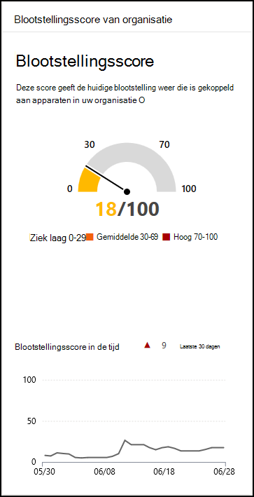

# Blootstellingsscore - Threat and Vulnerability Management

[!INCLUDE [Microsoft 365 Defender rebranding](../../includes/microsoft-defender.md)]

**Van toepassing op:**

- [Microsoft Defender voor Eindpunt](https://go.microsoft.com/fwlink/?linkid=2154037)
- [Bedreiging en vulnerability management](next-gen-threat-and-vuln-mgt.md)
- [Microsoft 365 Defender](https://go.microsoft.com/fwlink/?linkid=2118804)

>Wilt u Microsoft Defender voor Eindpunt ervaren? [Meld u aan voor een gratis proefabonnement.](https://www.microsoft.com/microsoft-365/windows/microsoft-defender-atp?ocid=docs-wdatp-portaloverview-abovefoldlink)

Uw blootstellingsscore is zichtbaar in het [dashboard Bedreiging en vulnerability management van](tvm-dashboard-insights.md) de Microsoft Defender-beveiligingscentrum. Het geeft aan hoe kwetsbaar uw organisatie is voor cyberbeveiligingsdreigingen. Lage blootstellingsscore betekent dat uw apparaten minder kwetsbaar zijn voor gebruik.

- Snel inzicht krijgen in en identificeren van take-aways op hoog niveau over de staat van beveiliging in uw organisatie.
- Detecteer en reageer op gebieden waarvoor onderzoek of actie moet worden ondernomen om de huidige status te verbeteren.
- Communiceer met collega's en management over de impact van beveiligingsinspanningen.

De kaart geeft u een hoog niveau van de trend van uw blootstellingsscore in de tijd. Eventuele pieken in de grafiek geven een visuele indicatie van een hoge blootstelling aan cyberbeveiligingsdreiging die u verder kunt onderzoeken.

## Hoe het werkt

De blootstellingsscore wordt onderverdeeld in de volgende niveaus:

- 0–29: lage blootstellingsscore
- 30–69: gemiddelde blootstellingsscore
- 70–100: hoge blootstellingsscore

U kunt de problemen oplossen op basis van beveiligingsaanbevelingen met prioriteit om de [blootstellingsscore](tvm-security-recommendation.md) te verlagen. Elke software heeft zwakke punten die worden omgezet in aanbevelingen en prioriteit krijgen op basis van risico's voor de organisatie.

## Uw blootstelling aan bedreigingen en kwetsbaarheid verminderen

Vererk de blootstelling aan bedreigingen en kwetsbaarheid door beveiligingsaanbevelingen [te corrigeren.](tvm-security-recommendation.md) Maak de meeste impact op uw blootstellingsscore door de belangrijkste beveiligingsaanbevelingen te corrigeren, die kunnen worden bekeken in [het Threat and Vulnerability Management dashboard.](tvm-dashboard-insights.md)

## Verwante onderwerpen

- [Overzicht van bedreigingen en vulnerability management](next-gen-threat-and-vuln-mgt.md)
- [Microsoft Secure Score voor apparaten](tvm-microsoft-secure-score-devices.md)
- [Beveiligingsaanbevelingen](tvm-security-recommendation.md)
- [Tijdlijn van het evenement](threat-and-vuln-mgt-event-timeline.md)
