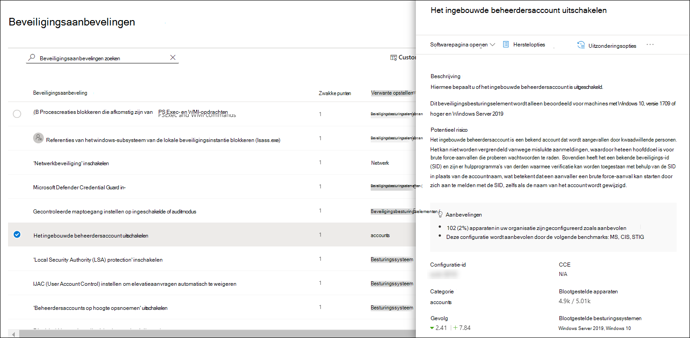
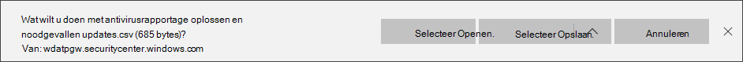

# Microsoft Secure Score voor apparaten

[!INCLUDE [Microsoft 365 Defender rebranding](../../includes/microsoft-defender.md)]

**Van toepassing op:**

- [Microsoft Defender voor Endpoint](https://go.microsoft.com/fwlink/?linkid=2154037)
- [Bedreigings- en kwetsbaarheidsbeheer](next-gen-threat-and-vuln-mgt.md)
- [Microsoft 365 Defender](https://go.microsoft.com/fwlink/?linkid=2118804)

> Wilt u Defender voor Eindpunt ervaren? [Meld u aan voor een gratis proefabonnement.](https://www.microsoft.com/microsoft-365/windows/microsoft-defender-atp?ocid=docs-wdatp-pullalerts-abovefoldlink) 

>[!NOTE]
> Configuratiescore maakt nu deel uit van bedreigings- en kwetsbaarheidsbeheer als Microsoft Secure Score voor apparaten.

Uw score voor apparaten is zichtbaar in het dashboard [bedreigings- en kwetsbaarheidsbeheer](tvm-dashboard-insights.md) van het Microsoft Defender-beveiligingscentrum. Een hogere Microsoft Secure Score voor apparaten betekent dat uw eindpunten beter bestand zijn tegen cyberbeveiligingsaanvallen. Het geeft de status van de collectieve beveiligingsconfiguratie van uw apparaten weer in de volgende categorieën:

- Toepassing
- Besturingssysteem
- Netwerk
- Accounts
- Beveiligingsbesturingselementen

Selecteer een categorie om naar de pagina [**Beveiligingsaanbevelingen te**](tvm-security-recommendation.md) gaan en de relevante aanbevelingen weer te geven.

## De Microsoft Secure Score-connector in-

Doorsturen van Microsoft Defender voor eindpuntsignalen, zodat Microsoft Secure Score inzicht krijgt in de beveiligingsstatus van het apparaat. Doorgestuurde gegevens worden opgeslagen en verwerkt op dezelfde locatie als uw Microsoft Secure Score-gegevens.

Het kan enkele uren duren voordat wijzigingen worden doorgevoerd in het dashboard.

1. Ga in het navigatiedeelvenster naar **Geavanceerde**  >  **functies instellingen** 

2. Schuif omlaag naar **Microsoft Secure Score** en zet de instelling in op **Aan.**

3. Selecteer **Voorkeuren opslaan.**

## Hoe het werkt

>[!NOTE]
> Microsoft Secure Score for Devices ondersteunt momenteel configuraties die zijn ingesteld via groepsbeleid. Vanwege de huidige gedeeltelijke Intune-ondersteuning kunnen configuraties die mogelijk zijn ingesteld via Intune, als onjuist geconfigureerd worden gebruikt. Neem contact op met uw IT-beheerder om de werkelijke configuratiestatus te controleren voor het geval uw organisatie Intune gebruikt voor veilig configuratiebeheer.

De gegevens in de Kaart Microsoft Secure Score voor apparaten zijn het product van een zorgvuldig en voortdurend detectieproces voor beveiligingsleed. Het wordt samengevoegd met configuratiedetectiebeoordelingen die continu:

- Verzamelde configuraties vergelijken met de verzamelde benchmarks om verkeerd geconfigureerde assets te ontdekken
- Configuraties in kaart brengen aan beveiligingslekken die kunnen worden gesaneerd of gedeeltelijk kunnen worden gesaneerd (risicobeperking)
- Benchmarks voor best practice-configuratie verzamelen en onderhouden (leveranciers, beveiligingsfeeds, interne onderzoeksteams)
- Wijzigingen van de configuratietoestand voor beveiligingsbesturingselementen verzamelen en controleren op basis van alle assets

## Uw beveiligingsconfiguratie verbeteren

Verbeter uw beveiligingsconfiguratie door problemen op te lossen vanuit de lijst met beveiligingsaanbevelingen. Terwijl u dit doet, verbetert uw Microsoft Secure Score voor apparaten en wordt uw organisatie beter bestand tegen cyberbeveiligingsdreigingen en -beveiligingslekken.

1. Selecteer in de kaart Microsoft Secure Score voor apparaten in het dashboard bedreigings- en kwetsbaarheidsbeheer de categorieën. U ziet de lijst met aanbevelingen die betrekking hebben op die categorie. U gaat naar de pagina [**Beveiligingsaanbevelingen.**](tvm-security-recommendation.md) Als u alle beveiligingsaanbevelingen wilt zien, kunt u het zoekveld verwijderen zodra u bij de pagina Beveiligingsaanbevelingen bent.

2. Selecteer een item in de lijst. Het flyout-deelvenster wordt geopend met informatie over de aanbeveling. Selecteer **Herstelopties.**

   

3. Lees de beschrijving om de context van het probleem te begrijpen en wat u daarna moet doen. Selecteer een einddatum, voeg notities toe en selecteer Alle herstelactiviteitsgegevens exporteren naar **CSV,** zodat u deze kunt toevoegen aan een e-mail voor opvolging.

4. **Aanvraag indienen**. U ziet een bevestigingsbericht dat de hersteltaak is gemaakt.
   

5. Sla uw CSV-bestand op.
   

6. Stuur een follow-up-e-mail naar uw IT-beheerder en laat de tijd die u hebt toegewezen om de hersteltijd in het systeem door te geven.

7. Controleer nogmaals **de Microsoft Secure Score for Devices-kaart** op het dashboard. Het aantal aanbevelingen voor beveiligingsbesturingselementen neemt af. Wanneer u **Beveiligingsbesturingselementen** selecteert om terug te gaan naar de pagina Beveiligingsaanbevelingen, wordt het item dat u hebt geadresseerd daar niet meer weergegeven.  Uw Microsoft Secure Score voor apparaten moet toenemen.

>[!IMPORTANT]
>Download de volgende verplichte beveiligingsupdates en implementeer deze in uw netwerk om de detectiepercentages voor beveiligingsrisico's te verhogen:
>- 19H1-klanten | [KB 4512941](https://support.microsoft.com/help/4512941/windows-10-update-kb4512941)
>- RS5-klanten | [KB 4516077](https://support.microsoft.com/help/4516077/windows-10-update-kb4516077)
>- RS4-klanten | [KB 4516045](https://support.microsoft.com/help/4516045/windows-10-update-kb4516045)
>- RS3-klanten | [KB 4516071](https://support.microsoft.com/help/4516071/windows-10-update-kb4516071)
>
>De beveiligingsupdates downloaden:
>1. Ga naar [Microsoft Update Catalog](https://www.catalog.update.microsoft.com/home.aspx).
>2. Key-in the security update KB number that you need to download, then click **Search**.  

## Verwante onderwerpen

- [Overzicht van bedreigings- en kwetsbaarheidsbeheer](next-gen-threat-and-vuln-mgt.md)
- [Dashboard](tvm-dashboard-insights.md)
- [Blootstellingsscore](tvm-exposure-score.md)
- [Beveiligingsaanbevelingen](tvm-security-recommendation.md)
