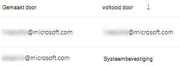
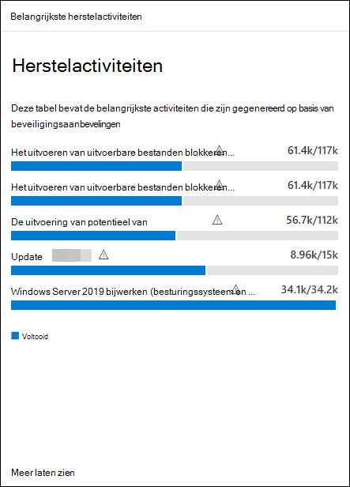

# Beveiligingslekken herstellen met bedreigings- en kwetsbaarheidsbeheer

[!INCLUDE [Microsoft 365 Defender rebranding](../../includes/microsoft-defender.md)]

**Van toepassing op:**
- [Microsoft Defender voor Eindpunt](https://go.microsoft.com/fwlink/?linkid=2154037)
- [Bedreigings- en kwetsbaarheidsbeheer](next-gen-threat-and-vuln-mgt.md)
- [Microsoft 365 Defender](https://go.microsoft.com/fwlink/?linkid=2118804)

>Wilt u Microsoft Defender voor Eindpunt ervaren? [Meld u aan voor een gratis proefabonnement.](https://www.microsoft.com/microsoft-365/windows/microsoft-defender-atp?ocid=docs-wdatp-portaloverview-abovefoldlink)

## Herstelverzoeken

De mogelijkheid voor bedreigings- en kwetsbaarheidsbeheer in Microsoft Defender voor Eindpunt overbrugt de kloof tussen beveiligings- en IT-beheerders via de werkstroom voor herstelverzoeken. Beveiligingsbeheerders zoals u kunnen de IT-beheerder vragen om  een beveiligingsprobleem op te verhelpen van de pagina's met beveiligingsaanbevelingen naar Intune.

### Microsoft Intune-verbinding inschakelen

Als u deze mogelijkheid wilt gebruiken, moet u uw Microsoft Intune-verbindingen inschakelen. Ga in het Microsoft Defender-beveiligingscentrum naar **Algemene** geavanceerde functies  >    >  **instellingen.** Schuif omlaag en zoek naar **Microsoft Intune-verbinding.** De schakelknop is standaard uitgeschakeld. Schakel uw **Microsoft Intune-verbinding** **in.**

**Opmerking:** Als de Intune-verbinding is ingeschakeld, krijgt u een optie om een Intune-beveiligingstaak te maken wanneer u een herstelaanvraag maakt. Deze optie wordt niet weergegeven als de verbinding niet is ingesteld.

Zie [Intune gebruiken om beveiligingslekken](https://docs.microsoft.com/intune/atp-manage-vulnerabilities) te verhelpen die zijn geïdentificeerd door Microsoft Defender voor Eindpunt voor meer informatie.

### Stappen voor herstelverzoeken

1. Ga naar het navigatiemenu bedreigings- en kwetsbaarheidsbeheer in het Microsoft Defender-beveiligingscentrum en selecteer [**Beveiligingsaanbevelingen.**](tvm-security-recommendation.md)

2. Selecteer een beveiligingsaanbeveling voor wie u herstel wilt aanvragen en selecteer vervolgens **Herstelopties.**

3. Vul het formulier in, inclusief waar u herstel voor aanvraagt, toepasselijke apparaatgroepen, prioriteit, einddatum en optionele notities.
    1. Als u de optie 'aandacht vereist' kiest, is het selecteren van een einddatum niet beschikbaar omdat er geen specifieke actie is.

4. Selecteer **Aanvraag indienen.** Als u een herstelaanvraag indient, wordt er een herstelactiviteitsitem gemaakt binnen bedreigings- en kwetsbaarheidsbeheer, dat kan worden gebruikt voor het bewaken van de herstel voortgang voor deze aanbeveling. Hiermee wordt geen herstel veroorzaakt of worden er geen wijzigingen toegepast op apparaten.

5. Informeer uw IT-beheerder over de nieuwe aanvraag en laat deze zich aanmelden bij Intune om de aanvraag goed te keuren of te weigeren en een pakketimplementatie te starten.

6. Ga naar de [**pagina Herstel om**](tvm-remediation.md) de status van uw herstelaanvraag weer te geven.

Als u wilt controleren hoe het ticket in Intune wordt aangegeven, raadpleegt u [Intune](https://docs.microsoft.com/intune/atp-manage-vulnerabilities) gebruiken om beveiligingslekken te verhelpen die zijn geïdentificeerd door Microsoft Defender voor Eindpunt voor meer informatie.

>[!NOTE]
>Als uw aanvraag betrekking heeft op het herstellen van meer dan 10.000 apparaten, kunnen we slechts 10.000 apparaten voor herstel naar Intune verzenden.

Nadat de zwakke punten van uw organisatie op het gebied van cyberbeveiliging zijn geïdentificeerd en in kaart zijn gebracht aan actiebare beveiligingsaanbevelingen, begint u met het maken van beveiligingstaken. U kunt taken maken via de integratie met Microsoft Intune, waar hersteltickets worden gemaakt.

Verhoog de blootstelling van uw organisatie door beveiligingsproblemen en verhoog de beveiligingsconfiguratie door de beveiligingsaanbevelingen te corrigeren.

## Uw herstelactiviteiten weergeven

Wanneer u een herstelaanvraag vanaf de pagina Beveiligingsaanbevelingen indient, wordt een herstelactiviteit afgetrapt. Er wordt een beveiligingstaak gemaakt die kan worden  bijgemaakt op de pagina Herstel van bedreigings- en kwetsbaarheidsbeheer en er wordt een herstelticket gemaakt in Microsoft Intune.

Als u de optie 'aandacht vereist' kiest, is er geen voortgangsbalk, ticketstatus of einddatum omdat er geen werkelijke actie is die we kunnen controleren.

Wanneer u zich op de pagina Herstel hebt geplaatst, selecteert u de herstelactiviteit die u wilt weergeven. U kunt de herstelstappen volgen, de voortgang bijhouden, de gerelateerde aanbeveling bekijken, exporteren naar CSV of markeren als voltooid.

>[!NOTE]
> Er is een bewaarperiode van 180 dagen voor voltooide herstelactiviteiten. Als u de herstelpagina optimaal wilt laten functioneren, wordt de herstelactiviteit zes maanden na voltooiing verwijderd.

### Voltooid per kolom

Houd bij wie de herstelactiviteit heeft gesloten met de kolom Voltooid door op de pagina Herstel.

- **E-mailadres:** het e-mailadres van de persoon die de taak handmatig heeft voltooid
- **Systeembevestiging:** de taak is automatisch voltooid (alle apparaten zijn gesaneerd)
- **N/B:** Informatie is niet beschikbaar omdat we niet weten hoe deze oudere taak is voltooid

### Belangrijkste herstelactiviteiten in het dashboard

Bekijk **de belangrijkste herstelactiviteiten** in het [dashboard bedreigings- en kwetsbaarheidsbeheer.](tvm-dashboard-insights.md) Selecteer een van de items om naar de pagina **Herstel te** gaan. U kunt de herstelactiviteit markeren als voltooid nadat het IT-beheerteam de taak heeft gesaneerd.

## Verwante artikelen

- [Overzicht van bedreigings- en kwetsbaarheidsbeheer](next-gen-threat-and-vuln-mgt.md)
- [Dashboard](tvm-dashboard-insights.md)
- [Beveiligingsaanbevelingen](tvm-security-recommendation.md)