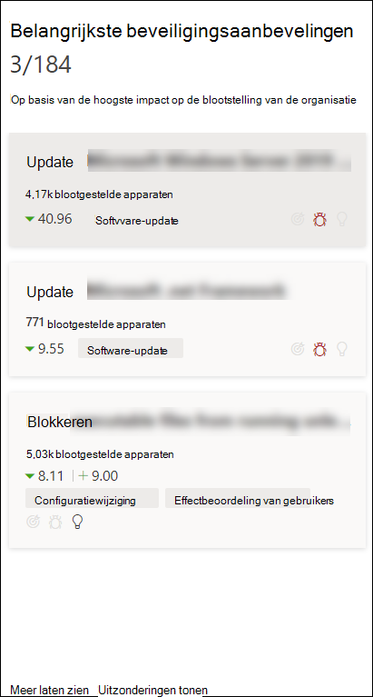
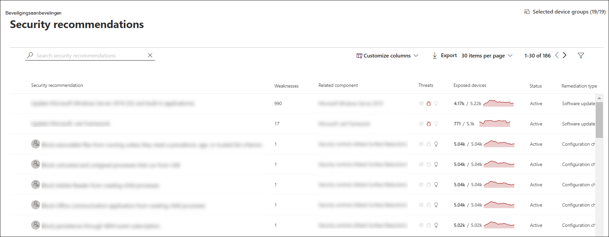
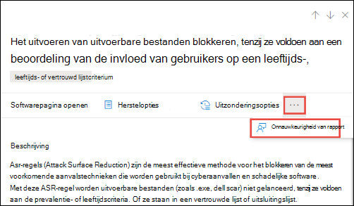

# Beveiligingsaanbevelingen - bedreigings- en kwetsbaarheidsbeheer

[!INCLUDE [Microsoft 365 Defender rebranding](../../includes/microsoft-defender.md)]

**Van toepassing op:**

- [Microsoft Defender voor Eindpunt](https://go.microsoft.com/fwlink/?linkid=2154037)
- [Bedreigings- en kwetsbaarheidsbeheer](next-gen-threat-and-vuln-mgt.md)
- [Microsoft 365 Defender](https://go.microsoft.com/fwlink/?linkid=2118804)

>Wilt u Microsoft Defender voor Eindpunt ervaren? [Meld u aan voor een gratis proefabonnement.](https://www.microsoft.com/microsoft-365/windows/microsoft-defender-atp?ocid=docs-wdatp-portaloverview-abovefoldlink)

Zwakke punten in de cyberbeveiliging die in uw organisatie zijn geïdentificeerd, worden in kaart gebracht aan actiebare beveiligingsaanbevelingen en worden geprioriteerd op basis van hun impact. Met prioriteitsaanbevelingen kunt u de tijd verkorten om beveiligingsproblemen te beperken of te verhelpen en naleving te verbeteren.

Elke beveiligingsaanbeveling bevat actiestappen voor herstel. Voor hulp bij taakbeheer kan de aanbeveling ook worden verzonden met Microsoft Intune en Microsoft Endpoint Configuration Manager. Wanneer het bedreigingslandschap verandert, wordt de aanbeveling ook gewijzigd terwijl er continu gegevens uit uw omgeving worden verzameld.

>[!TIP]
>Zie E-mailmeldingen voor kwetsbaarheid configureren in Microsoft Defender voor Eindpunt voor e-mailberichten over [nieuwe beveiligingsprobleemgebeurtenissen](configure-vulnerability-email-notifications.md)

## Hoe het werkt

Elk apparaat in de organisatie wordt gescored op basis van drie belangrijke factoren om klanten te helpen zich op het juiste moment op de juiste dingen te concentreren.

- **Bedreiging:** kenmerken van de beveiligingslekken en exploits in de apparaten en inbreukgeschiedenis van uw organisatie. Op basis van deze factoren worden in de beveiligingsaanbevelingen de bijbehorende koppelingen naar actieve waarschuwingen, lopende bedreigingscampagnes en bijbehorende analyserapporten voor bedreigingen weergeven.

- **Kans op inbreuk** : de beveiligingsstatus en tolerantie van uw organisatie tegen bedreigingen

- **Bedrijfswaarde:** de activa, kritieke processen en intellectuele eigenschappen van uw organisatie

## Naar de pagina Beveiligingsaanbevelingen gaan

Toegang tot de pagina Beveiligingsaanbevelingen op verschillende manieren:

- Navigatiemenu bedreigings- en kwetsbaarheidsbeheer in [het Microsoft Defender-beveiligingscentrum](portal-overview.md)
- Belangrijkste beveiligingsaanbevelingen in het [dashboard bedreigings- en kwetsbaarheidsbeheer](tvm-dashboard-insights.md)

Verwante beveiligingsaanbevelingen weergeven op de volgende plaatsen:

- Softwarepagina
- Apparaatpagina

### Navigatiemenu

Ga naar het navigatiemenu voor bedreigings- en kwetsbaarheidsbeheer en selecteer **Beveiligingsaanbevelingen.** De pagina bevat een lijst met beveiligingsaanbevelingen voor de bedreigingen en beveiligingsproblemen in uw organisatie.

### Belangrijkste beveiligingsaanbevelingen in het dashboard bedreigings- en kwetsbaarheidsbeheer

Op een bepaalde dag als beveiligingsbeheerder kunt u het [dashboard](tvm-dashboard-insights.md) bedreigings-  en kwetsbaarheidsbeheer bekijken om uw blootstellingsscore naast uw Microsoft Secure Score voor apparaten [te zien.](tvm-microsoft-secure-score-devices.md) Het doel is **om** de blootstelling van uw  organisatie aan beveiligingsproblemen te verlagen en de apparaatbeveiliging van uw organisatie te verhogen om beter bestand te zijn tegen cyberbeveiligingsaanvallen. De lijst met beste beveiligingsaanbevelingen kan u helpen dat doel te bereiken.

In de belangrijkste beveiligingsaanbevelingen worden de verbeterkansen vermeld die zijn geprioriteerd op basis van de belangrijke factoren die in de vorige sectie worden genoemd: bedreiging, kans op inbreuk en waarde. Als u een aanbeveling selecteert, gaat u naar de pagina met beveiligingsaanbevelingen met meer informatie.

## Overzicht van beveiligingsaanbevelingen

Bekijk aanbevelingen, het aantal gevonden zwakke punten, gerelateerde onderdelen, bedreigingsinzichten, aantal blootgestelde apparaten, status, hersteltype, herstelactiviteiten, invloed op uw blootstellingsscore en Microsoft Secure Score voor apparaten en bijbehorende tags.

De kleur van de **grafiek Exposed-apparaten** wordt gewijzigd naarmate de trend verandert. Als het aantal blootgestelde apparaten toe neemt, verandert de kleur in rood. Als het aantal blootgestelde apparaten afneemt, verandert de kleur van de grafiek in groen.

>[!NOTE]
>Bedreigings- en kwetsbaarheidsbeheer toont apparaten die tot **30** dagen geleden werden gebruikt. Dit is anders dan de rest van Microsoft Defender voor Eindpunt, waarbij een apparaat dat langer dan 7 dagen niet in gebruik is, een inactieve status heeft.

### Pictogrammen

Met handige pictogrammen kunt u ook snel de aandacht vestigen op:
-  mogelijke actieve waarschuwingen
-  bijbehorende openbare exploits
-  aanbevelingen

### Opties voor beveiligingsaanbeveling verkennen

Selecteer de beveiligingsaanbeveling die u wilt onderzoeken of verwerken.

In het flyout kunt u een van de volgende opties kiezen:

- **Open de softwarepagina:** open de softwarepagina om meer context te krijgen over de software en hoe deze wordt gedistribueerd. De informatie kan bedreigingscontext, bijbehorende aanbevelingen, gevonden zwakke punten, het aantal blootgestelde apparaten, gevonden beveiligingslekken, namen en gedetailleerde apparaten met de geïnstalleerde software en de distributie van versies omvatten.

- [**Herstelopties:**](tvm-remediation.md) verzend een herstelaanvraag om een ticket te openen in Microsoft Intune, waar uw IT-beheerder deze kan ophalen en adresseren. Houd de herstelactiviteit bij op de pagina Herstel.

- [**Uitzonderingsopties:**](tvm-exception.md) verzend een uitzondering, geef rechtvaardiging en stel de duur van de uitzondering in als u het probleem nog niet kunt verhelpen.

>[!NOTE]
>Wanneer een softwarewijziging wordt aangebracht op een apparaat, duurt het meestal 2 uur voordat de gegevens worden weergegeven in de beveiligingsportal. Het kan echter soms langer duren. Configuratiewijzigingen kunnen 4 tot 24 uur duren.

### Wijzigingen in apparaatblootstelling of -impact onderzoeken

Als er een grote sprong is gemaakt in het aantal blootgestelde apparaten of als het effect op de blootstellingsscore van uw organisatie en Microsoft Secure Score voor apparaten sterk is toegenomen, is deze beveiligingsaanbeveling het onderzoeken waard.

1. Selecteer de aanbevelingspagina en **de pagina Software openen**
2. Selecteer het **tabblad Tijdlijn** van gebeurtenis om alle impactvolle gebeurtenissen met betrekking tot die software weer te geven, zoals nieuwe beveiligingslekken of nieuwe openbare exploits. [Meer informatie over de tijdlijn van gebeurtenissen](threat-and-vuln-mgt-event-timeline.md)
3. Bepaal hoe u de toename of de blootstelling van uw organisatie kunt aanpakken, zoals het indienen van een herstelaanvraag

## Herstelverzoeken

De herstelfunctie voor bedreigings- en kwetsbaarheidsbeheer overbrugt de kloof tussen beveiligings- en IT-beheerders via de werkstroom voor herstelverzoeken. Beveiligingsbeheerders zoals u kunnen de IT-beheerder vragen om een beveiligingsprobleem op te verhelpen vanaf de pagina **Beveiligingsaanbeveling** naar Intune. [Meer informatie over herstelopties](tvm-remediation.md)

### Herstel aanvragen

Selecteer een beveiligingsaanbeveling voor wie u herstel wilt aanvragen en selecteer vervolgens **Herstelopties.** Vul het formulier in en selecteer **Aanvraag indienen.** Ga naar de [**pagina Herstel om**](tvm-remediation.md) de status van uw herstelaanvraag weer te geven. [Meer informatie over het aanvragen van herstel](tvm-remediation.md#request-remediation)

## Bestand voor uitzondering

Als alternatief voor een herstelaanvraag wanneer een aanbeveling op dit moment niet relevant is, kunt u uitzonderingen maken voor aanbevelingen. [Meer informatie over uitzonderingen](tvm-exception.md)

Alleen gebruikers met machtigingen voor het verwerken van uitzonderingen kunnen uitzondering toevoegen. [Meer informatie over RBAC-rollen.](user-roles.md)

Wanneer er een uitzondering wordt gemaakt voor een aanbeveling, is de aanbeveling niet meer actief. De aanbevelingstoestand wordt gewijzigd in **Volledige uitzondering** of **Gedeeltelijke uitzondering** (per apparaatgroep).

### Een uitzondering maken

Selecteer een beveiligingsaanbeveling voor wie u een uitzondering wilt maken en selecteer vervolgens **Uitzonderingsopties.**  

Vul het formulier in en verzend het. Als u al uw uitzonderingen (huidig  en verleden) wilt weergeven, gaat u naar  de pagina Herstel onder het menu Beveiligingsprobleembeheer bedreiging **&** en selecteert u het tabblad Uitzonderingen. Meer informatie over het maken van een [uitzondering](tvm-exception.md#create-an-exception)

## Onnauwkeurigheid van rapport

U kunt een onwaar positief rapport rapporteren wanneer u vage, onnauwkeurige, onvolledige of al gesaneerde beveiligingsaanbevelingsgegevens ziet.

1. Open de beveiligingsaanbeveling.

2. Selecteer de drie puntjes naast de beveiligingsaanbeveling die u wilt rapporteren en selecteer vervolgens Onnauwkeurigheid **rapporteren.**

    

3. Selecteer in het deelvenster Flyout de onnauwkeurigheidscategorie in de vervolgkeuzelijst, vul uw e-mailadres in en details over de onnauwkeurigheid.

4. Selecteer **Verzenden**. Uw feedback wordt onmiddellijk verzonden naar de experts voor bedreigings- en kwetsbaarheidsbeheer.

## Verwante artikelen

- [Overzicht van bedreigings- en kwetsbaarheidsbeheer](next-gen-threat-and-vuln-mgt.md)
- [Dashboard](tvm-dashboard-insights.md)
- [Blootstellingsscore](tvm-exposure-score.md)
- [Microsoft Secure Score voor apparaten](tvm-microsoft-secure-score-devices.md)
- [Beveiligingsproblemen verhelpen](tvm-remediation.md)
- [Uitzonderingen maken en weergeven voor beveiligingsaanbevelingen](tvm-exception.md)
- [Tijdlijn van het evenement](threat-and-vuln-mgt-event-timeline.md)
