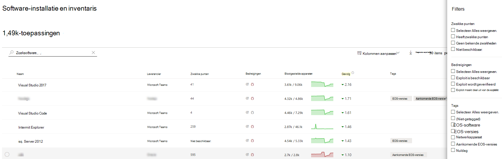
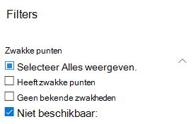
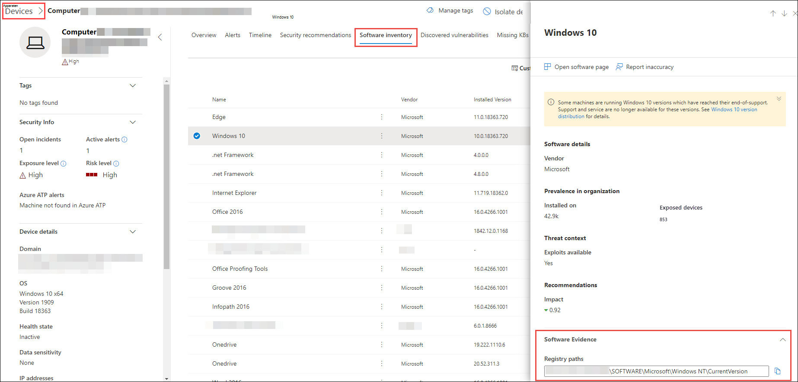

# Softwarevoorraad - Threat and Vulnerability Management

[!INCLUDE [Microsoft 365 Defender rebranding](../../includes/microsoft-defender.md)]

**Van toepassing op:**
- [Microsoft Defender voor Eindpunt](https://go.microsoft.com/fwlink/?linkid=2154037)
- [Bedreiging en vulnerability management](next-gen-threat-and-vuln-mgt.md)
- [Microsoft 365 Defender](https://go.microsoft.com/fwlink/?linkid=2118804)

>Wilt u Defender voor Eindpunt ervaren? [Meld u aan voor een gratis proefabonnement.](https://www.microsoft.com/microsoft-365/windows/microsoft-defender-atp?ocid=docs-wdatp-portaloverview-abovefoldlink)

De softwarevoorraad in Threat and Vulnerability Management is een lijst met bekende software in uw organisatie met officiële Algemene Platform-opsommingen [(CPE).](https://nvd.nist.gov/products/cpe) Softwareproducten zonder een officiële CPE hebben geen beveiligingslekken gepubliceerd. Het bevat ook details, zoals de naam van de leverancier, het aantal zwakke punten, bedreigingen en het aantal blootgestelde apparaten.

## Hoe het werkt

Op het gebied van detectie maken we gebruik van dezelfde reeks signalen die verantwoordelijk zijn voor detectie en kwetsbaarheidsanalyse in Microsoft Defender voor de detectie- en antwoordmogelijkheden voor [eindpunten.](overview-endpoint-detection-response.md)

Aangezien het in realtime is, ziet u binnen enkele minuten informatie over de kwetsbaarheid wanneer deze worden ontdekt. De engine neemt automatisch informatie op uit meerdere beveiligingsfeeds. In feite ziet u of een bepaalde software is verbonden met een live-bedreigingscampagne. Het rapport bevat ook een koppeling naar een Threat Analytics-rapport zodra het beschikbaar is.

## Ga naar de pagina Softwarevoorraad

Toegang tot de pagina Softwarevoorraad door **Softwarevoorraad** te selecteren in het Threat and Vulnerability Management navigatiemenu in [de Microsoft Defender-beveiligingscentrum.](portal-overview.md)

Bekijk software op specifieke apparaten op de pagina's met afzonderlijke apparaten in [de lijst met apparaten.](machines-view-overview.md)

>[!NOTE]
>Als u zoekt naar software met behulp van de globale zoekactie van Microsoft Defender voor Eindpunt, moet u een onderstrepingsteken in plaats van een spatie zetten. Voor de beste zoekresultaten schrijft u bijvoorbeeld 'windows_10' in plaats van 'Windows 10'.

## Overzicht van softwarevoorraad

De **pagina Softwarevoorraad** wordt geopend met een lijst met software die in uw netwerk is geïnstalleerd, inclusief de naam van de leverancier, gevonden zwakke punten, bijbehorende bedreigingen, blootgestelde apparaten, invloed op de blootstellingsscore en tags.

U kunt de lijstweergave filteren op basis van zwakke punten in de software, bedreigingen die aan de lijst zijn gekoppeld en tags, zoals of de software het einde van de ondersteuning heeft bereikt.

Selecteer de software die u wilt onderzoeken. Er wordt een flyoutvenster geopend met een compactere weergave van de informatie op de pagina. U kunt dieper in het onderzoek duiken en softwarepagina openen selecteren of eventuele technische inconsistenties markeren door Onnauwkeurigheid van rapport **te selecteren.**

### Software die niet wordt ondersteund

Software die momenteel niet wordt ondersteund door bedreigingen & vulnerability management kan aanwezig zijn op de inventarispagina software. Omdat deze niet wordt ondersteund, zijn er slechts beperkte gegevens beschikbaar. Filter op niet-ondersteunde software met de optie 'Niet beschikbaar' in de sectie 'Zwakheid'.

Het volgende geeft aan dat een software niet wordt ondersteund:

- Het veld Zwakke punten toont 'Niet beschikbaar'
- Veld Blootgestelde apparaten toont een streepje
- Informatie over tekst die is toegevoegd in het zijpaneel en op de softwarepagina
- De softwarepagina heeft geen beveiligingsaanbevelingen, gevonden beveiligingsproblemen of tijdlijnsecties voor gebeurtenissen

Momenteel worden producten zonder CPE niet weergegeven op de pagina softwarevoorraad, alleen in de softwarevoorraad op apparaatniveau.

## Softwarevoorraad op apparaten

Ga vanuit Microsoft Defender-beveiligingscentrum navigatiescherm naar de lijst **[Apparaten.](machines-view-overview.md)** Selecteer de naam van een apparaat om de apparaatpagina te openen (zoals Computer1) en selecteer vervolgens het tabblad **Softwarevoorraad** om een lijst weer te geven met alle bekende software die op het apparaat aanwezig is. Selecteer een specifieke software-vermelding om de flyout te openen met meer informatie.

Software is mogelijk zichtbaar op apparaatniveau, zelfs als deze momenteel niet wordt ondersteund door Threat and Vulnerability Management. Er zijn echter slechts beperkte gegevens beschikbaar. U weet of software niet wordt ondersteund, omdat er 'Niet beschikbaar' wordt gezegd in de kolom 'Zwakheid'.

Software zonder CPE kan ook worden gebruikt onder deze apparaatspecifieke softwarevoorraad.

### Software-bewijs

Bekijk waar we een specifieke software op een apparaat hebben gedetecteerd vanuit het register, de schijf of beide. U vindt het op elk apparaat in de inventaris van de apparaatsoftware.

Selecteer een softwarenaam om de flyout te openen en zoek naar de sectie 'Software evidence'.

## Softwarepagina's

U kunt softwarepagina's op verschillende manieren bekijken:

- Pagina softwarevoorraad > Selecteer een softwarenaam > Selecteer **Softwarepagina openen** in de flyout
- [Pagina Met beveiligingsaanbevelingen](tvm-security-recommendation.md) > Selecteer een aanbeveling > Selecteer **Softwarepagina openen** in de flyout
- [Pagina tijdlijn](threat-and-vuln-mgt-event-timeline.md) van gebeurtenis > Selecteer een gebeurtenis > Selecteer de softwarenaam met hyperlinks (zoals Visual Studio 2017) in de sectie 'Gerelateerd onderdeel' in het flyout

 Er wordt een volledige pagina weergegeven met alle details van een specifieke software en de volgende informatie:

- Zijpaneel met leveranciersgegevens, de aanwezigheid van de software in de organisatie (inclusief het aantal apparaten dat is geïnstalleerd op en blootgestelde apparaten die niet zijn gepatcht), of en welke exploit beschikbaar is, en van invloed zijn op uw blootstellingsscore.
- Gegevensvisualisaties met het aantal en de ernst van, beveiligingslekken en onjuiste configuraties. Ook grafieken met het aantal blootgestelde apparaten.
- Tabbladen met informatie zoals:
    - Bijbehorende beveiligingsaanbevelingen voor de vastgestelde zwakke punten en beveiligingsproblemen.
    - Benoemde CVE's van gevonden beveiligingslekken.
    - Apparaten die de software hebben geïnstalleerd (samen met de naam van het apparaat, domein, besturingssysteem en meer).
    - Lijst met softwareversies (inclusief het aantal apparaten waar de versie op is geïnstalleerd, het aantal gevonden beveiligingslekken en de namen van de geïnstalleerde apparaten).

    

## Onnauwkeurigheid van rapport

Meld een onwaar positief wanneer u vage, onnauwkeurige of onvolledige informatie ziet. U kunt ook rapporteren over beveiligingsaanbevelingen die al zijn gesaneerd.

1. Open de software flyout op de pagina Softwarevoorraad.
2. Selecteer **Onnauwkeurigheid van rapport**.
3. Selecteer in het deelvenster Flyout de onnauwkeurigheidscategorie in de vervolgkeuzelijst, vul uw e-mailadres in en details over de onnauwkeurigheid.
4. Selecteer **Verzenden**. Uw feedback wordt onmiddellijk verzonden naar de Threat and Vulnerability Management experts.

## Aanverwante artikelen

- [Overzicht van bedreigingen en vulnerability management](next-gen-threat-and-vuln-mgt.md)
- [Beveiligingsaanbevelingen](tvm-security-recommendation.md)
- [Tijdlijn van het evenement](threat-and-vuln-mgt-event-timeline.md)
- [De lijst Met Microsoft Defender voor eindpuntapparaten weergeven en organiseren](machines-view-overview.md)
