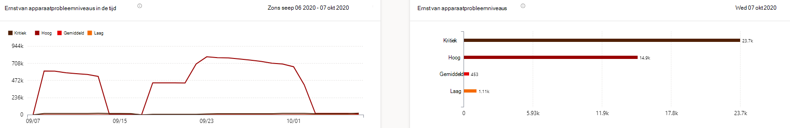
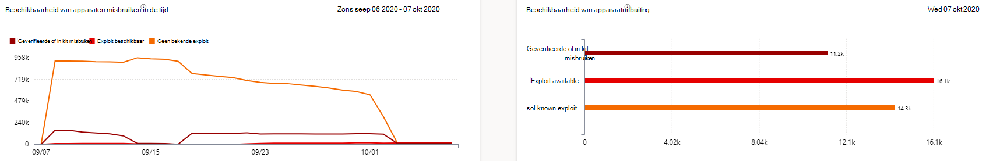
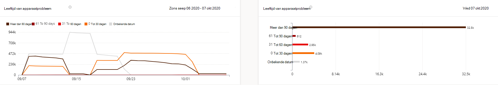
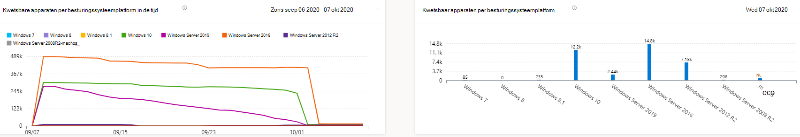
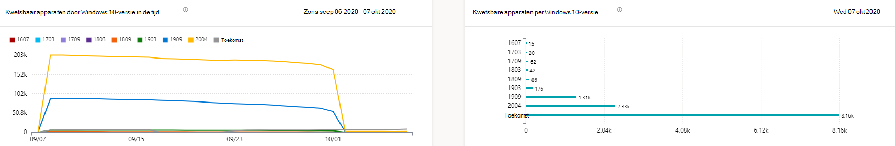

# Rapport Kwetsbare apparaten - Threat and Vulnerability ManagementVulnerable devices report - threat and vulnerability management

[!INCLUDE [Microsoft 365 Defender rebranding](../../includes/microsoft-defender.md)]

**Van toepassing op:****Applies to:**

- [Microsoft Defender voor EindpuntMicrosoft Defender for Endpoint](https://go.microsoft.com/fwlink/?linkid=2154037)
- [Bedreiging en vulnerability managementThreat and vulnerability management](next-gen-threat-and-vuln-mgt.md)
- [Microsoft 365 DefenderMicrosoft 365 Defender](https://go.microsoft.com/fwlink/?linkid=2118804)

>Wilt u Microsoft Defender voor Eindpunt ervaren?Want to experience Microsoft Defender for Endpoint? [Meld u aan voor een gratis proefabonnement.Sign up for a free trial.](https://www.microsoft.com/microsoft-365/windows/microsoft-defender-atp?ocid=docs-wdatp-portaloverview-abovefoldlink)

Het rapport bevat grafieken en staafdiagrammen met kwetsbare apparaattrends en huidige statistieken.The report shows graphs and bar charts with vulnerable device trends and current statistics. Het doel is dat u de adem en het bereik van de blootstelling van uw apparaat begrijpt.The goal is for you to understand the breath and scope of your device exposure.

Toegang tot het rapport in de Microsoft Defender-beveiligingscentrum door naar **Rapporten > Kwetsbare apparaten**Access the report in the Microsoft Defender Security Center by going to **Reports > Vulnerable devices**

Er zijn twee kolommen:There are two columns:

- Trends (in de tijd).Trends (over time). Kan de afgelopen 30 dagen, 3 maanden, 6 maanden of een aangepast datumbereik laten zien.Can show the past 30 days, 3 months, 6 months, or a custom date range.
- Vandaag (huidige informatie)Today (current information)

**Filter:** U kunt de gegevens filteren op ernst van de kwetsbaarheid, misbruik maken van beschikbaarheid, leeftijd van kwetsbaarheid, besturingssysteemplatform, Windows 10 versie of apparaatgroep.**Filter**: You can filter the data by vulnerability severity levels, exploit availability, vulnerability age, operating system platform, Windows 10 version, or device group.

**Inzoomen:** Als er een inzicht is dat u verder wilt verkennen, selecteert u het relevante staafdiagram om een gefilterde lijst met apparaten weer te geven op de pagina Apparaatvoorraad.**Drill down**: If there is an insight you want to explore further, select the relevant bar chart to view a filtered list of devices in the Device inventory page. Van hieruit kunt u de lijst exporteren.From there, you can export the list.

## ErnstniveaugrafiekenSeverity level graphs

Elk apparaat wordt slechts eenmaal geteld op basis van het ernstigste beveiligingsprobleem dat op dat apparaat is gevonden.Each device is counted only once according to the most severe vulnerability found on that device.

## Beschikbaarheidsgrafieken benuttenExploit availability graphs

Elk apparaat wordt slechts eenmaal geteld op basis van het hoogste niveau van bekende exploit.Each device is counted only once based on the highest level of known exploit.

## Leeftijdsgrafieken van kwetsbaarheidVulnerability age graphs

Elk apparaat wordt slechts eenmaal geteld onder de oudste publicatiedatum van het beveiligingsprobleem.Each device is counted only once under the oldest vulnerability publication date. Oudere beveiligingslekken hebben een grotere kans op misbruik.Older vulnerabilities have a higher chance of being exploited.

## Kwetsbare apparaten per besturingssysteemplatformgrafiekenVulnerable devices by operating system platform graphs

Het aantal apparaten op elk besturingssysteem dat wordt blootgesteld als gevolg van softwareproblemen.The number of devices on each operating system that are exposed due to software vulnerabilities.

## Kwetsbare apparaten op Windows 10 versiegrafiekenVulnerable devices by Windows 10 version graphs

Het aantal apparaten op elke Windows 10 versie die worden blootgesteld aan kwetsbare toepassingen of besturingssysteem.The number of devices on each Windows 10 version that are exposed due to vulnerable applications or OS.

## Verwante onderwerpenRelated topics

- [Overzicht van bedreigingen en vulnerability managementThreat and vulnerability management overview](next-gen-threat-and-vuln-mgt.md)
- [BeveiligingsaanbevelingenSecurity recommendations](tvm-security-recommendation.md)
