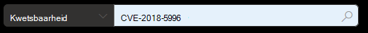
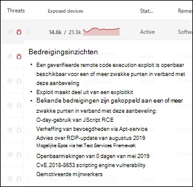
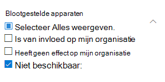
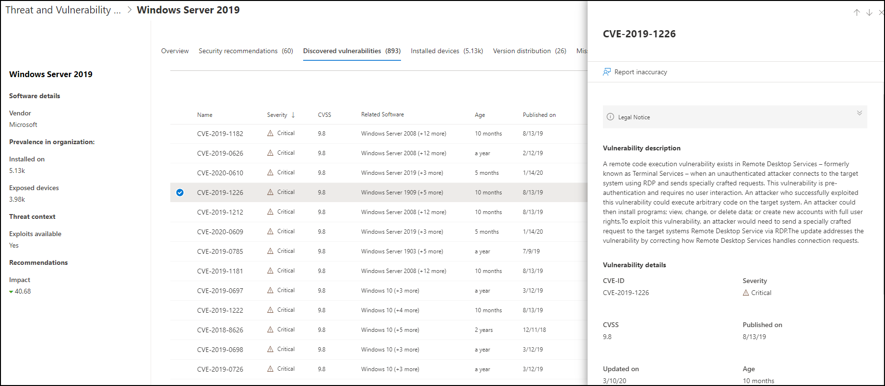
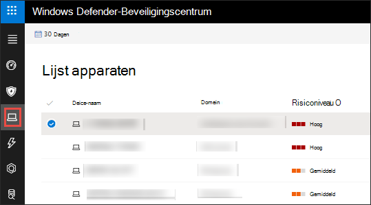
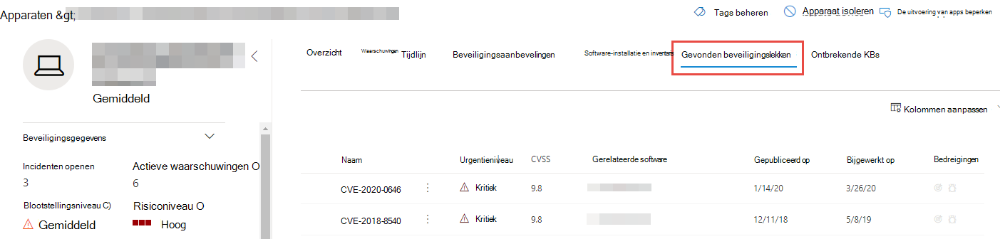
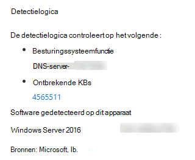

# Beveiligingslekken in mijn organisatie : bedreigings- en kwetsbaarheidsbeheerVulnerabilities in my organization - threat and vulnerability management

[!INCLUDE [Microsoft 365 Defender rebranding](../../includes/microsoft-defender.md)]

**Van toepassing op:****Applies to:**
- [Microsoft Defender voor EindpuntMicrosoft Defender for Endpoint](https://go.microsoft.com/fwlink/?linkid=2154037)
- [Bedreigings- en kwetsbaarheidsbeheerThreat and vulnerability management](next-gen-threat-and-vuln-mgt.md)
- [Microsoft 365 DefenderMicrosoft 365 Defender](https://go.microsoft.com/fwlink/?linkid=2118804)

>Wilt u Microsoft Defender voor Eindpunt ervaren?Want to experience Microsoft Defender for Endpoint? [Meld u aan voor een gratis proefabonnement.Sign up for a free trial.](https://www.microsoft.com/microsoft-365/windows/microsoft-defender-atp?ocid=docs-wdatp-portaloverview-abovefoldlink)

Bedreigings- en kwetsbaarheidsbeheer gebruikt dezelfde signalen in de endpointbeveiliging van Defender voor eindpuntbeveiliging om beveiligingsproblemen te scannen en op te sporen.Threat and vulnerability management uses the same signals in Defender for Endpoint's endpoint protection to scan and detect vulnerabilities.

Op **de pagina Zwakke** punten worden de beveiligingslekken vermeld waar uw apparaten aan worden blootgesteld door de CVE-id (Common Vulnerabilities and Exposures) te noteren.The **Weaknesses** page lists the software vulnerabilities your devices are exposed to by listing the Common Vulnerabilities and Exposures (CVE) ID. U kunt ook de ernst, cvss-classificatie (Common Vulnerability Scoring System), de prevalentie in uw organisatie, de bijbehorende inbreuk, bedreigingsinzichten en meer bekijken.You can also view the severity, Common Vulnerability Scoring System (CVSS) rating, prevalence in your organization, corresponding breach, threat insights, and more.

>[!NOTE]
>Als er geen officiële CVE-ID is toegewezen aan een beveiligingsprobleem, wordt de naam van de kwetsbaarheid toegewezen door bedreigings- en kwetsbaarheidsbeheer.If there is no official CVE-ID assigned to a vulnerability, the vulnerability name is assigned by threat and vulnerability management.

>[!TIP]
>Zie E-mailmeldingen voor kwetsbaarheid configureren in Microsoft Defender voor Eindpunt voor e-mailberichten over [nieuwe beveiligingsprobleemgebeurtenissen](configure-vulnerability-email-notifications.md)To get emails about new vulnerability events, see [Configure vulnerability email notifications in Microsoft Defender for Endpoint](configure-vulnerability-email-notifications.md)

## Naar de pagina Zwakke punten gaanNavigate to the Weaknesses page

Toegang tot de pagina Zwakheden op een aantal verschillende manieren:Access the Weaknesses page a few different ways:

- Zwakke **punten selecteren** in het navigatiemenu bedreigings- en kwetsbaarheidsbeheer in het Microsoft [Defender-beveiligingscentrum](portal-overview.md)Selecting **Weaknesses** from the threat and vulnerability management navigation menu in the [Microsoft Defender Security Center](portal-overview.md)
- Algemene zoekactieGlobal search

### NavigatiemenuNavigation menu

Ga naar het navigatiemenu bedreigings- en beveiligingsprobleembeheer en selecteer **Zwakke punten om** de lijst met CVE's te openen.Go to the threat and vulnerability management navigation menu and select **Weaknesses** to open the list of CVEs.

### Beveiligingslekken in globale zoekopdrachtenVulnerabilities in global search

1. Ga naar de vervolgkeuzelijst Voor algemene zoekopdrachten.Go to the global search drop-down menu.
2. Selecteer **Kwetsbaarheid** en selecteer de CVE-id (Common Vulnerabilities and Exposures) die u zoekt en selecteer vervolgens het zoekpictogram.Select **Vulnerability** and key-in the Common Vulnerabilities and Exposures (CVE) ID that you're looking for, then select the search icon. De **pagina Zwakheden** wordt geopend met de CVE-informatie die u zoekt.The **Weaknesses** page opens with the CVE information that you're looking for.

3. Selecteer de CVE om een flyout-paneel te openen met meer informatie, zoals de beschrijving van de kwetsbaarheid, details, bedreigingsinzichten en blootgestelde apparaten.Select the CVE to open a flyout panel with more information, including the vulnerability description, details, threat insights, and exposed devices.

Als u de rest van de beveiligingslekken op de pagina **Zwakke** punten wilt zien, typt u CVE en selecteert u zoeken.To see the rest of the vulnerabilities in the **Weaknesses** page, type CVE, then select search.

## Overzicht van zwakke puntenWeaknesses overview

Herstel de beveiligingslekken in blootgestelde apparaten om het risico voor uw activa en organisatie te beperken.Remediate the vulnerabilities in exposed devices to reduce the risk to your assets and organization. Als in **de kolom Blootgestelde** apparaten 0 wordt getoond, betekent dit dat u geen risico loopt.If the **Exposed Devices** column shows 0, that means you aren't at risk.

### Inzichten in inbreuken en bedreigingenBreach and threat insights

Bekijk eventuele gerelateerde inbreuk- en bedreigingsinzichten in de kolom **Bedreiging** wanneer de pictogrammen rood zijn gekleurd.View any related breach and threat insights in the **Threat** column when the icons are colored red.

 >[!NOTE]
 > Geef altijd prioriteit aan aanbevelingen die zijn gekoppeld aan lopende bedreigingen.Always prioritize recommendations that are associated with ongoing threats. Deze aanbevelingen zijn gemarkeerd met het pictogram Bedreigingsinzicht These recommendations are marked with the threat insight icon  en inzichtspictogram inbreuk  raakt. .and breach insight icon .  

Het pictogram Inbreukinzichten wordt gemarkeerd als er een beveiligingsprobleem is gevonden in uw organisatie.The breach insights icon is highlighted if there's a vulnerability found in your organization.

Het pictogram Bedreigingsinzichten wordt gemarkeerd als er gekoppelde exploits zijn in de kwetsbaarheid die in uw organisatie wordt gevonden.The threat insights icon is highlighted if there are associated exploits in the vulnerability found in your organization. Wanneer u de muisaanwijzer boven het pictogram houdt, wordt weergegeven of de bedreiging deel uitmaakt van een exploitkit of verbonden is met specifieke geavanceerde permanente campagnes of activiteitsgroepen.Hovering over the icon shows whether the threat is a part of an exploit kit, or connected to specific advanced persistent campaigns or activity groups. Wanneer deze beschikbaar zijn, is er een koppeling naar een Threat Analytics-rapport met zero-day misbruiknieuws, openbaarmakingen of gerelateerde beveiligingsadviseurs.When available, there's a link to a Threat Analytics report with zero-day exploitation news, disclosures, or related security advisories.  

### Inzicht krijgen in kwetsbaarheidGain vulnerability insights

Als u een CVE selecteert, wordt er een flyoutvenster geopend met meer informatie, zoals de beschrijving van de kwetsbaarheid, details, bedreigingsinzichten en blootgestelde apparaten.If you select a CVE, a flyout panel will open with more information such as the vulnerability description, details, threat insights, and exposed devices.

- De categorie 'OS-functie' wordt weergegeven in relevante scenario'sThe "OS Feature" category is shown in relevant scenarios
- U kunt naar de bijbehorende beveiligingsaanbeveling voor elke CVE met een blootgesteld apparaat gaanYou can go to the related security recommendation for every CVE with exposed device

 

### Software die niet wordt ondersteundSoftware that isn't supported

CVE's voor software die momenteel niet wordt ondersteund door & kwetsbaarheidsbeheer is nog steeds aanwezig op de pagina Zwakke punten.CVEs for software that isn't currently supported by threat & vulnerability management is still present in the Weaknesses page. Omdat de software niet wordt ondersteund, zijn er slechts beperkte gegevens beschikbaar.Because the software is not supported, only limited data will be available.

Blootgestelde apparaatgegevens zijn niet beschikbaar voor CVE's met niet-ondersteunde software.Exposed device information will not be available for CVEs with unsupported software. Filter op niet-ondersteunde software door de optie 'Niet beschikbaar' te selecteren in de sectie 'Blootgestelde apparaten'.Filter by unsupported software by selecting the "Not available" option in the "Exposed devices" section.

 

## CvE-vermeldingen (Common Vulnerabilities and Exposures) weergeven op andere plaatsenView Common Vulnerabilities and Exposures (CVE) entries in other places

### Meest kwetsbare software in het dashboardTop vulnerable software in the dashboard

1. Ga naar het [dashboard bedreigings- en kwetsbaarheidsbeheer](tvm-dashboard-insights.md) en schuif omlaag naar de widget Top vulnerable **software.**Go to the [threat and vulnerability management dashboard](tvm-dashboard-insights.md) and scroll down to the **Top vulnerable software** widget. U ziet het aantal beveiligingsproblemen in elke software, samen met bedreigingsgegevens en een weergave op hoog niveau van blootstelling aan apparaten in de tijd.You will see the number of vulnerabilities found in each software, along with threat information and a high-level view of device exposure over time.

    

2. Selecteer de software die u wilt onderzoeken om naar een inzoompagina te gaan.Select the software you want to investigate to go to a drilldown page.
3. Selecteer het **tabblad Gevonden beveiligingslekken.**Select the **Discovered vulnerabilities** tab.
4. Selecteer het beveiligingsprobleem dat u wilt onderzoeken voor meer informatie over beveiligingsdetailsSelect the vulnerability you want to investigate for more information on vulnerability details

    

### Beveiligingslekken ontdekken op de apparaatpaginaDiscover vulnerabilities in the device page

Informatie over gerelateerde zwakke punten weergeven op de apparaatpagina.View related weaknesses information in the device page.

1. Ga naar de navigatiemenubalk van het Microsoft Defender-beveiligingscentrum en selecteer vervolgens het apparaatpictogram.Go to the Microsoft Defender Security Center navigation menu bar, then select the device icon. De **lijstpagina Apparaten** wordt geopend.The **Devices list** page opens.
2. Selecteer op **de pagina Apparatenlijst** de apparaatnaam die u wilt onderzoeken.In the **Devices list** page, select the device name that you want to investigate.

    

3. De apparaatpagina wordt geopend met details en antwoordopties voor het apparaat dat u wilt onderzoeken.The device page will open with details and response options for the device you want to investigate.
4. Selecteer **Gevonden beveiligingslekken.**Select **Discovered vulnerabilities**.

    

5. Selecteer het beveiligingsprobleem dat u wilt onderzoeken om een flyoutvenster te openen met de CVE-details, zoals: beschrijving van kwetsbaarheid, bedreigingsinzichten en detectielogica.Select the vulnerability that you want to investigate to open up a flyout panel with the CVE details, such as: vulnerability description, threat insights, and detection logic.

#### CVE-detectielogicaCVE Detection logic

Net als bij de software wordt nu de detectielogica we toegepast op een apparaat om aan te geven dat het kwetsbaar is.Similar to the software evidence, we now show the detection logic we applied on a device in order to state that it's vulnerable. De nieuwe sectie heet 'Detectielogica' (in een gedetecteerd beveiligingsprobleem op de apparaatpagina) en toont de detectielogica en -bron.The new section is called "Detection Logic" (in any discovered vulnerability in the device page) and shows the detection logic and source.

De categorie 'OS-functie' wordt ook weergegeven in relevante scenario's.The "OS Feature" category is also shown in relevant scenarios. Een CVE is alleen van invloed op apparaten met een kwetsbaar besturingssysteem als een specifiek besturingssysteemonderdeel is ingeschakeld.A CVE would affect devices that run a vulnerable OS only if a specific OS component is enabled. Stel dat Windows Server 2019 een kwetsbaarheid heeft in het DNS-onderdeel.Let's say Windows Server 2019 has vulnerability in its DNS component. Met deze nieuwe mogelijkheid voegen we deze CVE alleen toe aan de Windows Server 2019-apparaten met de DNS-mogelijkheid die is ingeschakeld in het besturingssysteem.With this new capability, we’ll only attach this CVE to the Windows Server 2019 devices with the DNS capability enabled in their OS.

## Onnauwkeurigheid van rapportReport inaccuracy

Meld een onwaar positief wanneer u vage, onnauwkeurige of onvolledige informatie ziet.Report a false positive when you see any vague, inaccurate, or incomplete information. U kunt ook rapporteren over beveiligingsaanbevelingen die al zijn gesaneerd.You can also report on security recommendations that have already been remediated.

1. Open de CVE op de pagina Zwakke punten.Open the CVE on the Weaknesses page.
2. Selecteer **Onnauwkeurigheid melden en** er wordt een flyoutvenster geopend.Select **Report inaccuracy** and a flyout pane will open.
3. Selecteer de onnauwkeurigheidscategorie in de vervolgkeuzelijst en vul uw e-mailadres en onnauwkeurigheidsdetails in.Select the inaccuracy category from the drop-down menu and fill in your email address and inaccuracy details.
4. Selecteer **Verzenden**.Select **Submit**. Uw feedback wordt onmiddellijk verzonden naar de experts voor bedreigings- en kwetsbaarheidsbeheer.Your feedback is immediately sent to the threat and vulnerability management experts.

## Verwante artikelenRelated articles

- [Overzicht van bedreigings- en kwetsbaarheidsbeheerThreat and vulnerability management overview](next-gen-threat-and-vuln-mgt.md)
- [BeveiligingsaanbevelingenSecurity recommendations](tvm-security-recommendation.md)
- [Software-inventarisSoftware inventory](tvm-software-inventory.md)
- [DashboardinzichtenDashboard insights](tvm-dashboard-insights.md)
- [De lijst Met Microsoft Defender voor eindpuntapparaten weergeven en organiserenView and organize the Microsoft Defender for Endpoint Devices list](machines-view-overview.md)
