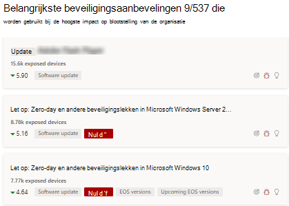
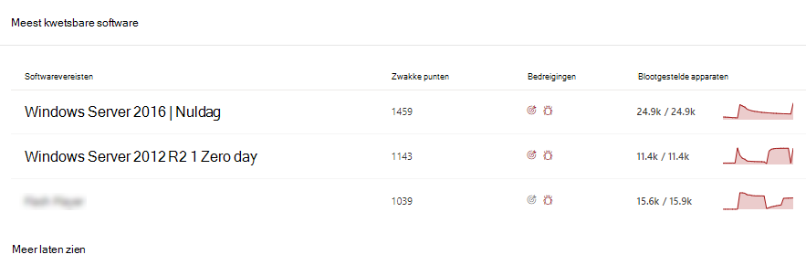
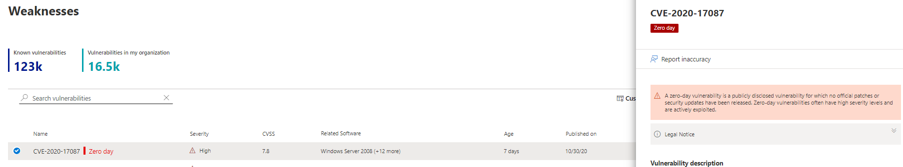
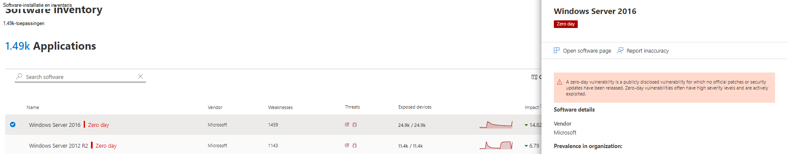
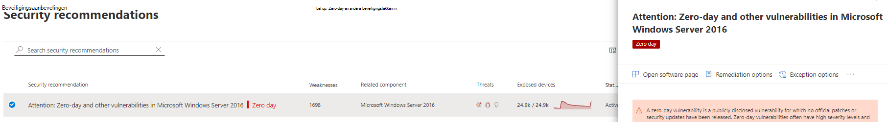
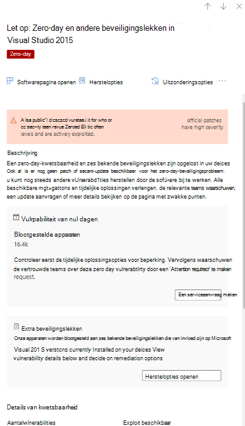
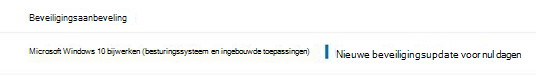

# Zero-day-beveiligingslekken beperken - bedreigings- en kwetsbaarheidsbeheer

[!INCLUDE [Microsoft 365 Defender rebranding](../../includes/microsoft-defender.md)]

**Van toepassing op:**

- [Microsoft Defender voor Eindpunt](https://go.microsoft.com/fwlink/?linkid=2154037)
- [Bedreigings- en kwetsbaarheidsbeheer](next-gen-threat-and-vuln-mgt.md)
- [Microsoft 365 Defender](https://go.microsoft.com/fwlink/?linkid=2118804)

>Wilt u Microsoft Defender voor Eindpunt ervaren? [Meld u aan voor een gratis proefabonnement.](https://www.microsoft.com/microsoft-365/windows/microsoft-defender-atp?ocid=docs-wdatp-portaloverview-abovefoldlink)

Een zero-day-kwetsbaarheid is een openbaar openbaar gemaakt beveiligingsprobleem waarvoor geen officiële patches of beveiligingsupdates zijn uitgebracht. Zero-day-beveiligingslekken hebben vaak hoge ernstniveaus en worden actief benut.

Bedreigings- en kwetsbaarheidsbeheer geeft alleen zero-day-beveiligingslekken weer waar het informatie over heeft.

## Informatie over zero-day-beveiligingslekken zoeken

Wanneer er een zero-day-kwetsbaarheid is gevonden, wordt informatie over het probleem overgebracht via de volgende ervaringen in het Microsoft Defender-beveiligingscentrum.

### Dashboard Bedreigings- en kwetsbaarheidsbeheer

Zoek naar aanbevelingen met een zero-day tag in de kaart 'Top security recommendations'.

Zoek de beste software met de zero-day tag in de kaart 'Top vulnerable software'.

### Pagina Zwakke punten

Zoek naar het benoemde zero-day-beveiligingsprobleem, samen met een beschrijving en details.

- Als aan dit beveiligingsprobleem een CVE-ID is toegewezen, ziet u het zero-day label naast de CVE-naam.

- Als aan dit beveiligingsprobleem geen CVE-ID is toegewezen, vindt u deze onder een interne, tijdelijke naam die eruitziet als 'TVM-XXXX-XXXX'. De naam wordt bijgewerkt zodra een officiële CVE-ID is toegewezen, maar de vorige interne naam kan nog steeds worden doorzocht en in het zijpaneel worden gevonden.

### Pagina Softwarevoorraad

Zoek naar software met de zero-day tag. Filter op de tag 'zero day' om alleen software te zien met zero-day-beveiligingslekken.

### Softwarepagina

Zoek naar een zero-day-tag voor elke software die is beïnvloed door het zero-day-beveiligingsprobleem.

### Pagina Met beveiligingsaanbevelingen

Bekijk duidelijke suggesties over herstel- en mitigatieopties, inclusief tijdelijke oplossingen als deze bestaan. Filter op de tag 'zero day' om alleen beveiligingsaanbevelingen te zien voor het oplossen van zero-day-beveiligingsproblemen.

Als er software is met een zero-day-kwetsbaarheid en extra beveiligingslekken, krijgt u één aanbeveling over alle beveiligingslekken.

## Zero-day-beveiligingslekken oplossen

Ga naar de pagina met beveiligingsaanbevelingen en selecteer een aanbeveling met een nuldag. Er wordt een flyout geopend met informatie over de zero-day en andere beveiligingslekken voor die software.

Er wordt een koppeling gemaakt naar opties voor beperking en tijdelijke oplossingen als deze beschikbaar zijn. Tijdelijke oplossingen kunnen het risico van dit zero-day-beveiligingsprobleem beperken totdat een patch of beveiligingsupdate kan worden geïmplementeerd.

Open herstelopties en kies het type aandacht. Een 'aandacht vereist' hersteloptie wordt aanbevolen voor de zero-day-beveiligingslekken, omdat er nog geen update is uitgebracht. U kunt geen einddatum selecteren, omdat er geen specifieke actie moet worden ondernomen. Als er oudere beveiligingsproblemen zijn voor deze software die u wilt herstellen, kunt u de hersteloptie 'aandacht vereist' overschrijven en 'bijwerken' kiezen.

## Herstelactiviteiten van nul dagen bijhouden

Ga naar de pagina Herstel van bedreigings- en [kwetsbaarheidsbeheer](tvm-remediation.md) om het item herstelactiviteit weer te geven. Als u de optie 'aandacht vereist' kiest, is er geen voortgangsbalk, ticketstatus of einddatum omdat er geen werkelijke actie is die we kunnen controleren. U kunt filteren op hersteltype, zoals 'software-update' of 'aandacht vereist', om alle activiteitenitems in dezelfde categorie weer te geven.

## Beveiligingslekken van nul dagen verhelpen

Wanneer er een patch wordt uitgebracht voor de zero-day, wordt de aanbeveling gewijzigd in 'Update' en een blauw label er naast met de naam 'Nieuwe beveiligingsupdate voor nuldag'. Het wordt niet langer gezien als een zero-day-tag, de zero-day tag wordt van alle pagina's verwijderd.

## Verwante artikelen

- [Overzicht van bedreigings- en kwetsbaarheidsbeheer](next-gen-threat-and-vuln-mgt.md)
- [Dashboard](tvm-dashboard-insights.md)
- [Beveiligingsaanbevelingen](tvm-security-recommendation.md)
- [Software-inventaris](tvm-software-inventory.md)
- [Beveiligingsproblemen in mijn organisatie](tvm-weaknesses.md)
