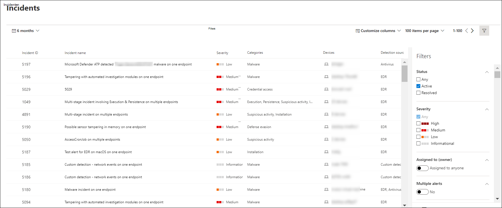

# De wachtrij Microsoft Defender voor eindpuntincidenten weergeven en organiseren

[!INCLUDE [Microsoft 365 Defender rebranding](../../includes/microsoft-defender.md)]

**Van toepassing op:**
- [Microsoft Defender voor Eindpunt](https://go.microsoft.com/fwlink/?linkid=2154037)
- [Microsoft 365 Defender](https://go.microsoft.com/fwlink/?linkid=2118804)

> Wilt u Defender voor Eindpunt ervaren? [Meld u aan voor een gratis proefabonnement.](https://www.microsoft.com/microsoft-365/windows/microsoft-defender-atp?ocid=docs-wdatp-pullalerts-abovefoldlink) 

De **wachtrij Incidenten** toont een verzameling incidenten die zijn gemarkeerd vanaf apparaten in uw netwerk. Het helpt u incidenten te sorteren om prioriteit te geven en een weloverwogen antwoordbesluit voor cyberbeveiliging te maken.

Standaard worden in de wachtrij incidenten weergegeven die de afgelopen 30 dagen zijn gezien, waarbij het meest recente incident boven aan de lijst wordt weergegeven, zodat u de meest recente incidenten als eerste kunt zien.

Er zijn verschillende opties waar u uit kunt kiezen om de wachtrijweergave Incidenten aan te passen. 

Op de bovenste navigatie kunt u:
- Kolommen aanpassen om kolommen toe te voegen of te verwijderen 
- Het aantal items wijzigen dat per pagina moet worden weergegeven
- De items selecteren die per pagina moeten worden weergegeven
- Batch-select the incidents to assign 
- Navigeren tussen pagina's
- Filters toepassen

## De wachtrij voor incidenten sorteren en filteren
U kunt de volgende filters toepassen om de lijst met incidenten te beperken en een meer gerichte weergave te krijgen.

### Ernst

Ernst van incident | Omschrijving
:---|:---
Hoog  (Rood) | Bedreigingen die vaak worden gekoppeld aan geavanceerde permanente bedreigingen (APT). Deze incidenten geven een hoog risico aan vanwege de ernst van de schade die ze kunnen toebrengen aan apparaten.
Gemiddeld  (Oranje) | Bedreigingen die zelden worden waargenomen in de organisatie, zoals afwijkende registerwijziging, uitvoering van verdachte bestanden en waargenomen gedrag dat typisch is voor aanvalsfasen.
Laag  (Geel) | Bedreigingen die zijn gekoppeld aan voorkomende malware en hackprogramma's die niet noodzakelijkerwijs een geavanceerde bedreiging aangeven die is gericht op de organisatie.
Informatief  (Grijs) | Informatie-incidenten worden mogelijk niet beschouwd als schadelijk voor het netwerk, maar kunnen wel goed zijn om bij te houden.

## Toegewezen aan
U kunt ervoor kiezen om de lijst te filteren door toegewezen aan iedereen of degenen te selecteren die aan u zijn toegewezen.

### Categorie
Incidenten worden gecategoriseerd op basis van de beschrijving van het stadium waarin de cyberbeveiligingsketen zich in de keten voor cyberbeveiligingsbeveiliging beveiligt. Deze weergave helpt de bedreigingsanalist om prioriteit, urgentie en bijbehorende antwoordstrategie te bepalen die moet worden geïmplementeerd op basis van context.

### Status
U kunt ervoor kiezen om de lijst met weergegeven incidenten te beperken op basis van hun status om te zien welke actief of opgelost zijn.

### Gegevensgevoeligheid
Gebruik dit filter om incidenten weer te geven die gevoeligheidslabels bevatten.

## Naamgeving voor incidenten

Als u het bereik van het incident in één oogopslag wilt begrijpen, worden incidentnamen automatisch gegenereerd op basis van waarschuwingskenmerken, zoals het aantal getroffen eindpunten, beïnvloede gebruikers, detectiebronnen of categorieën.

Bijvoorbeeld: *incident met meerdere fases op meerdere eindpunten die door meerdere bronnen zijn gerapporteerd.*

> [!NOTE]
> Incidenten die vóór de implementatie van automatische naamgeving voor incidenten hebben bestaan, behouden hun naam.

## Zie ook
- [Incidentenwachtrij](https://docs.microsoft.com/microsoft-365/security/defender-endpoint/view-incidents-queue)
- [Incidenten beheren](manage-incidents.md)
- [Incidenten onderzoeken](investigate-incidents.md)

