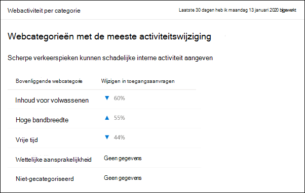
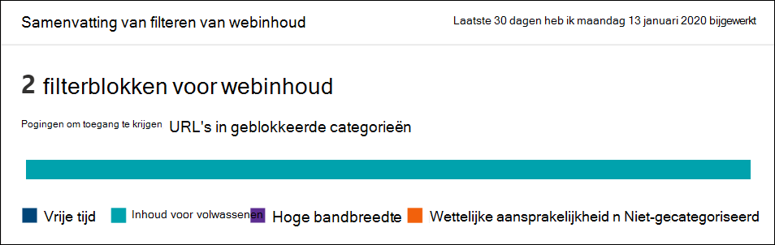
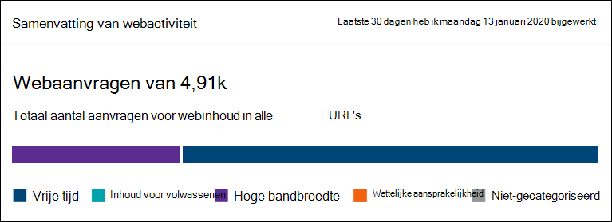

# Filteren van webinhoud

[!INCLUDE [Microsoft 365 Defender rebranding](../../includes/microsoft-defender.md)]

**Van toepassing op:**
- [Microsoft Defender voor Eindpunt](https://go.microsoft.com/fwlink/p/?linkid=2154037)
- [Microsoft 365 Defender](https://go.microsoft.com/fwlink/?linkid=2118804)

> [!IMPORTANT]
> **Filteren van webinhoud is momenteel beschikbaar in een openbare preview** 
> Deze preview-versie wordt geleverd zonder serviceovereenkomst en wordt niet aanbevolen voor productiebelastingen. Bepaalde functies worden mogelijk niet ondersteund of hebben mogelijk beperkte mogelijkheden.
> Zie De preview-functies [van Microsoft Defender voor Eindpunt voor meer informatie.](preview.md)

> [!TIP]
> Wilt u Microsoft Defender voor Eindpunt ervaren? [Meld u aan voor een gratis proefabonnement.](https://www.microsoft.com/microsoft-365/windows/microsoft-defender-atp?ocid=docs-wdatp-main-abovefoldlink&rtc=1)

Filteren van webinhoud maakt deel uit van de mogelijkheden voor [webbeveiliging](web-protection-overview.md) in Microsoft Defender voor Eindpunt. Hiermee kan uw organisatie de toegang tot websites bijhouden en reguleren op basis van hun inhoudscategorieën. Veel van deze websites, hoewel niet schadelijk, kunnen problematisch zijn vanwege nalevingsregels, bandbreedtegebruik of andere problemen.

Configureer beleidsregels voor uw apparaatgroepen om bepaalde categorieën te blokkeren. Als u een categorie blokkeert, wordt voorkomen dat gebruikers binnen bepaalde apparaatgroepen toegang krijgen tot URL's die aan de categorie zijn gekoppeld. Voor elke categorie die niet is geblokkeerd, worden de URL's automatisch gecontroleerd. Uw gebruikers hebben zonder onderbreking toegang tot de URL's en u verzamelt toegangsstatistieken om een meer aangepaste beleidsbeslissing te maken. Uw gebruikers zien een blokkeringsmelding als een element op de pagina die ze bekijken oproepen doet naar een geblokkeerde resource.

Filteren van webinhoud is beschikbaar in de belangrijkste webbrowsers, met blokken die worden uitgevoerd door Windows Defender SmartScreen (Microsoft Edge) en Netwerkbeveiliging (Chrome, Firefox, Moedig en Opera). Zie de sectie Vereisten voor meer informatie over browserondersteuning.

Een overzicht van de voordelen:

- Gebruikers kunnen geen toegang krijgen tot websites in geblokkeerde categorieën, ongeacht of ze on-premises of weg browsen
- Uw beveiligingsteam kan eenvoudig beleid implementeren voor groepen gebruikers die apparaatgroepen gebruiken die zijn gedefinieerd in instellingen voor [toegangscontrole](/microsoft-365/security/defender-endpoint/rbac) op basis van rollen van Microsoft Defender voor Eindpunt
- Uw beveiligingsteam heeft toegang tot webrapporten op dezelfde centrale locatie, met zichtbaarheid over werkelijke blokken en webgebruik

## Gebruikerservaring

De blokkeringservaring voor ondersteunde browsers van derden wordt geleverd door Netwerkbeveiliging, waarmee de gebruiker op systeemniveau wordt op de hoogte gesteld van een geblokkeerde verbinding. Voor een gebruiksvriendelijkere, in-browserervaring kunt u overwegen om de Microsoft Edge.

## Vereisten

Voordat u deze functie uit probeert, moet u aan de volgende vereisten voldoen:

- Windows 10 Enterprise E5, Microsoft 365 E5, Microsoft 365 E5 Security, Microsoft 365 E3 + Microsoft 365 E5 Security of de zelfstandige licentie van Microsoft Defender voor Eindpunt. 
- Toegang tot Microsoft Defender-beveiligingscentrum portal ( https://securitycenter.windows.com) .
- Apparaten met Windows 10 jubileumupdate (versie 1607) of hoger met de nieuwste MoCAMP-update.
- Windows Defender SmartScreen- en netwerkbeveiliging ingeschakeld.

## Gegevensverwerking

Gegevens worden opgeslagen in de regio die is geselecteerd als onderdeel van de instellingen voor gegevensafhandeling van Microsoft Defender voor [eindpunten.](data-storage-privacy.md) Uw gegevens verlaten het datacenter niet in die regio. Bovendien worden uw gegevens niet gedeeld met derden, inclusief onze gegevensproviders.

## Filteren van webinhoud inschakelen

Selecteer in het linkernavigatiemenu **Instellingen**  >  **Algemene**  >  **geavanceerde functies.** Schuif omlaag totdat u de vermelding voor filteren **van webinhoud ziet.** Schakel de wisselknop in **op Voorkeuren voor Aan** en **Opslaan.**

### Filterbeleid voor webinhoud configureren

Filterbeleid voor webinhoud geeft aan welke sitecategorieën worden geblokkeerd op welke apparaatgroepen. Als u het beleid wilt beheren, gaat u **naar Instellingen**  >    >  **Webinhoud filteren.**

Gebruik het filter om beleid te zoeken dat bepaalde geblokkeerde categorieën bevat of die worden toegepast op specifieke apparaatgroepen.

### Een beleid maken

Een nieuw beleid toevoegen:

1. Selecteer **Beleid toevoegen** op de **filterpagina voor** webinhoud in **Instellingen.**

2. Geef een naam op.

3. Selecteer de categorieën die u wilt blokkeren. Gebruik het pictogram Uitv om elke bovenliggende categorie volledig uit te vouwen en specifieke webinhoudscategorieën te selecteren.

4. Geef het beleidsbereik op. Selecteer de apparaatgroepen om op te geven waar u het beleid wilt toepassen. Alleen apparaten in de geselecteerde apparaatgroepen kunnen geen toegang krijgen tot websites in de geselecteerde categorieën.

5. Bekijk de samenvatting en sla het beleid op. Het kan maximaal 2 uur duren voordat de beleidsvernieuwing van toepassing is op de geselecteerde apparaten.

> [!NOTE]
> - U kunt een beleid implementeren zonder een categorie in een apparaatgroep te selecteren. Met deze actie wordt een beleid voor alleen controle uitgevoerd, om u te helpen het gedrag van gebruikers te begrijpen voordat u een blokbeleid maakt.
> - Als u een beleid verwijdert of tegelijkertijd apparaatgroepen verandert, kan dit leiden tot vertraging bij de beleidsimplementatie.
> - Het blokkeren van de categorie 'Niet-gecategoriseerd' kan leiden tot onverwachte en ongewenste resultaten.  

### Specifieke websites toestaan

U kunt de geblokkeerde categorie in het filteren van webinhoud overschrijven om één site toe te staan door een aangepast indicatorbeleid te maken. Het aangepaste indicatorbeleid zal het filterbeleid voor webinhoud overbodig maken wanneer dit wordt toegepast op de apparaatgroep in kwestie.

1. Maak een aangepaste indicator in de Microsoft Defender-beveiligingscentrum door naar Instellingen  >    >  **URL/domeinitem**  >  **toevoegen te gaan.**

2. Voer het domein van de site in.

3. Stel de beleidsactie in op **Toestaan.**  

### Onnauwkeurigheden rapporteren

Als u een domein tegenkomt dat onjuist is gecategoriseerd, kunt u onnauwkeurigheden rechtstreeks aan ons rapporteren via de pagina Rapporten van webinhoudsfilters. Deze functie is alleen beschikbaar in het nieuwe Microsoft 365 beveiligingscentrum (security.microsoft.com).

Als u een onnauwkeurigheid wilt rapporteren, gaat u naar Webinhoudsfilterdomeinen met  >    >    >  **webbeveiligingsrapporten.** Op het tabblad Domeinen van onze rapporten voor het filteren van webinhoud ziet u een beletselteken naast elk van de domeinen. Plaats de muisaanwijzer op dit beletselteken en selecteer **Onnauwkeurigheid van rapport.**

Er wordt een deelvenster geopend waarin u de prioriteit kunt selecteren en aanvullende details kunt toevoegen, zoals de voorgestelde categorie voor hercategorisatie. Wanneer u het formulier hebt voltooid, selecteert u **Verzenden.** Ons team bekijkt de aanvraag binnen één werkdag. Als u de blokkering direct wilt opheffen, maakt u een [aangepaste indicator voor toestaan.](indicator-ip-domain.md)

## Filterkaarten en details voor webinhoud

Selecteer **Rapporten**  >  **webbeveiliging om** kaarten weer te geven met informatie over het filteren van webinhoud en beveiliging tegen webdreigingen. De volgende kaarten bevatten overzichtsinformatie over het filteren van webinhoud.

### Webactiviteit per categorie

Deze kaart bevat de bovenliggende webinhoudscategorieën met de grootste toename of afname van het aantal toegangspogingen. Inzicht in drastische wijzigingen in webactiviteitspatronen in uw organisatie van de afgelopen 30, 3 maanden of 6 maanden. Selecteer een categorienaam om meer informatie weer te geven.

In de eerste 30 dagen na het gebruik van deze functie heeft uw organisatie mogelijk niet genoeg gegevens om deze gegevens weer te geven.

### Overzichtskaart voor het filteren van webinhoud

Op deze kaart wordt de verdeling weergegeven van geblokkeerde toegangspogingen over de verschillende bovenliggende webinhoudscategorieën. Selecteer een van de gekleurde balken om meer informatie over een specifieke bovenliggende webcategorie weer te geven.

### Overzichtskaart voor webactiviteit

Op deze kaart wordt het totale aantal aanvragen voor webinhoud in alle URL's weergegeven.

### Kaartdetails weergeven

U kunt de details **van het rapport voor** elke kaart openen door een tabelrij of gekleurde balk te selecteren in de grafiek op de kaart. De pagina rapportdetails voor elke kaart bevat uitgebreide statistische gegevens over categorieën webinhoud, websitedomeinen en apparaatgroepen.

- **Webcategorieën:** bevat de categorieën webinhoud die toegangspogingen hebben gehad in uw organisatie. Selecteer een specifieke categorie om een samenvattings fly-out te openen.

- **Domeinen:** bevat de webdomeinen die zijn toegankelijk of geblokkeerd in uw organisatie. Selecteer een specifiek domein om gedetailleerde informatie over dat domein weer te geven.

- **Apparaatgroepen:** bevat alle apparaatgroepen die webactiviteit hebben gegenereerd in uw organisatie

Gebruik het tijdbereikfilter linksboven op de pagina om een periode te selecteren. U kunt de gegevens ook filteren of de kolommen aanpassen. Selecteer een rij om een flyoutvenster te openen met nog meer informatie over het geselecteerde item.

## Fouten en problemen

### Beperkingen en bekende problemen in dit voorbeeld

- Alleen Microsoft Edge wordt ondersteund als de besturingssysteemconfiguratie van uw apparaat Server **(cmd**  >  **Systeminfo**  >  **OS Configuration) is.** Netwerkbeveiliging wordt alleen ondersteund in de controlemodus op Serverapparaten, die verantwoordelijk is voor het beveiligen van verkeer in ondersteunde browsers van derden.

- Niet-toegewezen apparaten bevatten onjuiste gegevens in het rapport. In de **draaipunt Apparaatgroepen** Rapportgegevens ziet u mogelijk een rij  >   met een leeg veld Apparaatgroep. Deze groep bevat uw niet-toegewezen apparaten voordat ze in de opgegeven groep worden gezet. Het rapport voor deze rij bevat mogelijk geen nauwkeurig aantal apparaten of toegangstellingen.

- Rapporten voor webinhoudsfilters zijn momenteel beperkt tot het weergeven van de 5000 beste records. In het rapport Domeinen wordt bijvoorbeeld alleen een maximum van de bovenste 5000 domeinen voor een bepaalde filterquery, indien van toepassing, gegeven. 

- [Overzicht webbeveiliging](web-protection-overview.md)
- [Webbedreigingsbeveiliging](web-threat-protection.md)
- [Webbeveiliging monitoren](web-protection-monitoring.md)
- [Reageren op webbedreigingen](web-protection-response.md)
- [Vereisten voor netwerkbeveiliging](web-content-filtering.md)

