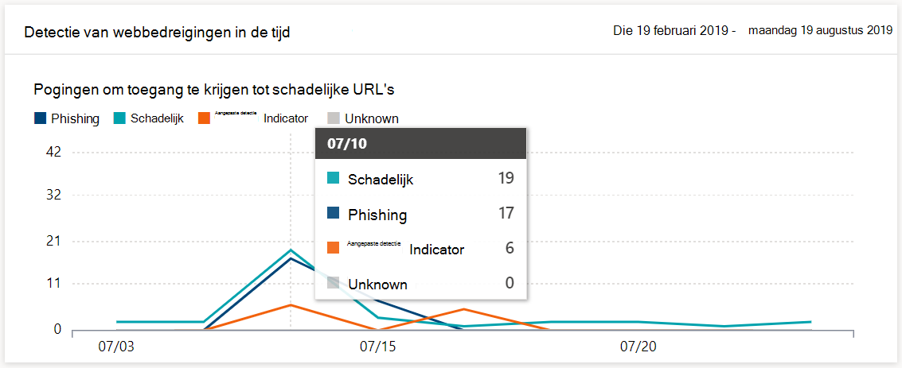
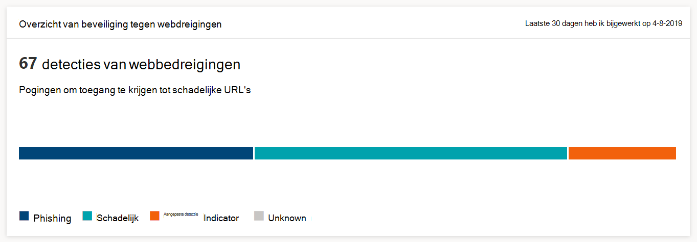

# Beveiliging voor surfen op het web controleren

[!INCLUDE [Microsoft 365 Defender rebranding](../../includes/microsoft-defender.md)]

**Van toepassing op:**
- [Microsoft Defender voor Endpoint](https://go.microsoft.com/fwlink/p/?linkid=2154037)
- [Microsoft 365 Defender](https://go.microsoft.com/fwlink/?linkid=2118804)

>Wilt u Microsoft Defender voor Eindpunt ervaren? [Meld u aan voor een gratis proefabonnement.](https://www.microsoft.com/microsoft-365/windows/microsoft-defender-atp?ocid=docs-wdatp-main-abovefoldlink&rtc=1)

Met webbeveiliging kunt u de browsebeveiliging van uw organisatie controleren via rapporten onder **Rapporten > webbeveiliging** in het Microsoft Defender-beveiligingscentrum. Het rapport bevat kaarten die statistieken over detectie van bedreigingen voor het web bieden.

- **Detectie van webdreigingsbeveiliging** in de loop van de tijd: deze trending card geeft het aantal webbedreigingen weer dat tijdens de geselecteerde periode per type is gedetecteerd (Last 30 days, Last 3 months, Last 6 months)
 
    

- **Overzicht van webdreigingsbeveiliging:** op deze kaart worden de totale detecties van webdreigingen in de afgelopen 30 dagen weergegeven, met de verdeling over de verschillende typen webrisico's. Als u een segment selecteert, wordt de lijst geopend met de domeinen die zijn gevonden bij schadelijke of ongewenste websites.

    

>[!Note]
>Het kan tot 12 uur duren voordat een blok wordt weergegeven in de kaarten of de lijst met domeinen.

## Typen webbedreigingen

Webbeveiliging categoriseert schadelijke en ongewenste websites als:

- **Phishing** : websites met vervalste webformulieren en andere phishingmechanismen die zijn ontworpen om gebruikers te verleiden tot het openbaar maken van referenties en andere gevoelige informatie
- **Schadelijk** : websites die malware hosten en code misbruiken
- **Aangepaste indicator** : websites waarvan u URL's of domeinen hebt toegevoegd aan uw [aangepaste indicatorlijst](manage-indicators.md) voor het blokkeren

## De lijst met domeinen weergeven

Selecteer een specifieke categorie voor webbedreigingen in de **overzichtskaart voor webdreigingsbeveiliging** om de pagina **Domeinen te** openen. Op deze pagina wordt de lijst weergegeven met de domeinen onder die bedreigingscategorie. De pagina bevat de volgende informatie voor elk domein:

- **Aantal access-** het aantal aanvragen voor URL's in het domein
- **Blokken** : aantal keren dat aanvragen zijn geblokkeerd
- **Access-trend:** het aantal toegangspogingen wijzigen
- **Bedreigingscategorie** - type webdreiging
- **Apparaten** - aantal apparaten met toegangspogingen

Selecteer een domein om de lijst met apparaten weer te geven die hebben geprobeerd url's in dat domein en de lijst met URL's te openen.

## Verwante onderwerpen

- [Overzicht van webbeveiliging](web-protection-overview.md)
- [Filteren van webinhoud](web-content-filtering.md)
- [Beveiliging tegen bedreigingen op het web](web-threat-protection.md)
- [Reageren op webbedreigingen](web-protection-response.md)
