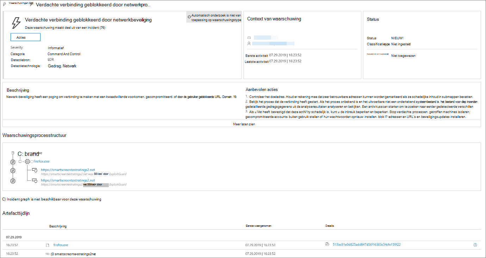
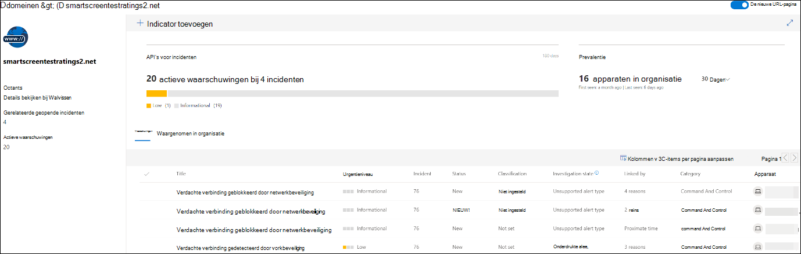
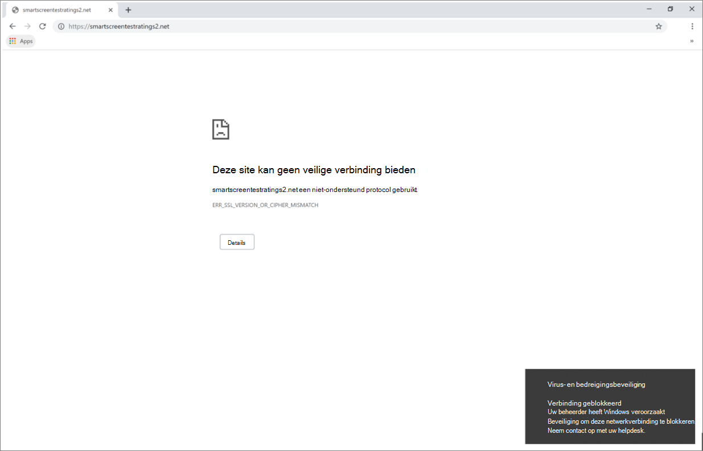

# Reageren op webbedreigingen

[!INCLUDE [Microsoft 365 Defender rebranding](../../includes/microsoft-defender.md)]

**Van toepassing op:**
- [Microsoft Defender voor Endpoint](https://go.microsoft.com/fwlink/p/?linkid=2154037)
- [Microsoft 365 Defender](https://go.microsoft.com/fwlink/?linkid=2118804)

>Wilt u Microsoft Defender voor Eindpunt ervaren? [Meld u aan voor een gratis proefabonnement.](https://www.microsoft.com/microsoft-365/windows/microsoft-defender-atp?ocid=docs-wdatp-main-abovefoldlink&rtc=1)

Met webbeveiliging in Microsoft Defender voor Eindpunt kunt u waarschuwingen met betrekking tot schadelijke websites en websites in uw aangepaste indicatorlijst efficiënt onderzoeken en beantwoorden.

## Waarschuwingen voor webbedreigingen weergeven
Microsoft Defender voor Eindpunt genereert de volgende [waarschuwingen voor](manage-alerts.md) schadelijke of verdachte webactiviteit:
- **Verdachte verbinding geblokkeerd door netwerkbeveiliging:** deze waarschuwing wordt gegenereerd wanneer een poging om toegang  te krijgen tot een schadelijke website of een website in uw aangepaste indicatorlijst wordt gestopt door netwerkbeveiliging in de *blokmodus*
- **Verdachte verbinding gedetecteerd** door netwerkbeveiliging: deze waarschuwing wordt gegenereerd wanneer een poging om toegang te krijgen tot een schadelijke website of een website in uw aangepaste indicatorlijst wordt gedetecteerd door netwerkbeveiliging *in* de modus Alleen controleren

Elke waarschuwing bevat de volgende informatie: 
- Apparaat dat heeft geprobeerd toegang te krijgen tot de geblokkeerde website
- Toepassing of programma dat wordt gebruikt om de webaanvraag te verzenden
- Schadelijke URL of URL in de lijst met aangepaste indicatoren
- Aanbevolen acties voor responders

>[!Note]
>Als u het aantal waarschuwingen wilt beperken, worden detecties van webdreigingen voor hetzelfde domein op hetzelfde apparaat elke dag samengevoegd tot één waarschuwing. Er wordt slechts één waarschuwing gegenereerd en geteld in het [webbeveiligingsrapport.](web-protection-monitoring.md)

## Websitedetails controleren
U kunt verder gaan door de URL of het domein van de website in de waarschuwing te selecteren. Hiermee opent u een pagina over die specifieke URL of domein met diverse informatie, waaronder:
- Apparaten die hebben geprobeerd toegang te krijgen tot de website
- Incidenten en waarschuwingen met betrekking tot de website
- Hoe vaak de website is gezien in gebeurtenissen in uw organisatie

    

[Meer informatie over url- of domeinentiteitspagina's](investigate-domain.md)

## Het apparaat controleren
U kunt ook het apparaat controleren dat heeft geprobeerd toegang te krijgen tot een geblokkeerde URL. Als u de naam van het apparaat op de waarschuwingspagina selecteert, wordt er een pagina geopend met uitgebreide informatie over het apparaat.

[Meer informatie over pagina's met apparaatentiteit](investigate-machines.md)

## Webbrowser en Windows-meldingen voor eindgebruikers

Met webbeveiliging in Microsoft Defender voor Eindpunt kunnen uw eindgebruikers geen schadelijke of ongewenste websites bezoeken met Microsoft Edge of andere browsers. Omdat blokkeren wordt uitgevoerd door [netwerkbeveiliging,](network-protection.md)zien ze een algemene fout in de webbrowser. Ze zien ook een melding van Windows.

 *Windows-meldingswebdreiging geblokkeerd op Microsoft Edge*

 *Windows-meldingswebdreiging geblokkeerd in Chrome*

## Verwante onderwerpen
- [Overzicht van webbeveiliging](web-protection-overview.md)
- [Filteren van webinhoud](web-content-filtering.md)
- [Beveiliging tegen bedreigingen op het web](web-threat-protection.md)
- [Webbeveiliging controleren](web-protection-monitoring.md)
