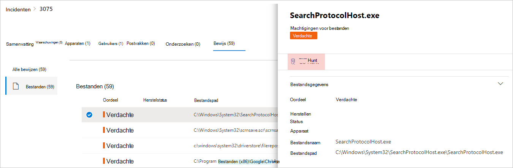

# <a name="quickly-hunt-for-entity-or-event-information-with-go-hunt"></a>Snel zoeken naar entiteits- of gebeurtenisgegevens met go hunt

[!INCLUDE [Microsoft 365 Defender rebranding](../includes/microsoft-defender.md)]


**Van toepassing op:**
- Microsoft 365 Defender
- Microsoft Defender voor Eindpunt

Met de *actie Ga opzoeken* kunt u snel gebeurtenissen en [](advanced-hunting-overview.md) verschillende entiteitstypen onderzoeken met krachtige geavanceerde zoekmogelijkheden op basis van query's. Met deze actie wordt automatisch een geavanceerde query uitgevoerd om relevante informatie over de geselecteerde gebeurtenis of entiteit te vinden.

De *actie Ga opzoeken* is beschikbaar in verschillende secties van het beveiligingscentrum wanneer gebeurtenis- of entiteitsgegevens worden weergegeven. U kunt bijvoorbeeld zoeken *in de* volgende secties gebruiken:

- Op de [pagina met incidenten](investigate-incidents.md#summary)kunt u details bekijken over gebruikers, apparaten en vele andere entiteiten die zijn gekoppeld aan een incident. Wanneer u een entiteit selecteert, krijgt u aanvullende informatie en verschillende acties die u op die entiteit kunt uitvoeren. In het onderstaande voorbeeld is een postvak geselecteerd, met informatie over het postvak en de optie om te zoeken naar meer informatie over het postvak.

    

- Op de pagina met incidenten hebt u ook toegang tot een lijst met entiteiten onder het tabblad Bewijs. Als u een van deze entiteiten selecteert, kunt u snel zoeken naar informatie over die entiteit.

    


- Wanneer u de tijdlijn voor een apparaat bekijkt, kunt u een gebeurtenis in de tijdlijn selecteren om aanvullende informatie over die gebeurtenis weer te geven. Wanneer een gebeurtenis is geselecteerd, krijgt u de optie om te zoeken naar andere relevante gebeurtenissen in geavanceerde jacht.

    

Als **u Zoeken naar** of Zoeken naar gerelateerde gebeurtenissen **selecteert,** worden verschillende query's door de query's geselecteerd, afhankelijk van of u een entiteit of een gebeurtenis hebt geselecteerd.

## <a name="query-for-entity-information"></a>Query voor entiteitsgegevens
Wanneer u *ga zoeken naar* query's gebruikt voor informatie over een gebruiker, apparaat of een ander type entiteit, worden in de query alle relevante schematabellen gecontroleerd op gebeurtenissen met die entiteit. Om de resultaten beheersbaar te houden, is de query beperkt tot ongeveer dezelfde periode als de vroegste activiteit in de afgelopen 30 dagen waarbij de entiteit betrokken is en die is gekoppeld aan het incident.

Hier is een voorbeeld van de zoekquery voor een apparaat:

```kusto
let selectedTimestamp = datetime(2020-06-02T02:06:47.1167157Z);
let deviceName = "fv-az770.example.com";
let deviceId = "device-guid";
search in (DeviceLogonEvents, DeviceProcessEvents, DeviceNetworkEvents, DeviceFileEvents, DeviceRegistryEvents, DeviceImageLoadEvents, DeviceEvents, DeviceImageLoadEvents, IdentityLogonEvents, IdentityQueryEvents)
Timestamp between ((selectedTimestamp - 1h) .. (selectedTimestamp + 1h))
and DeviceName == deviceName
// or RemoteDeviceName == deviceName
// or DeviceId == deviceId
| take 100
```
### <a name="supported-entity-types"></a>Ondersteunde entiteitstypen
U kunt gaan *zoeken gebruiken nadat* u een van deze entiteitstypen hebt geselecteerd:

- Bestanden
- E-mailberichten
- E-mailclusters
- Postvakken
- Gebruikers
- Apparaten
- IP-adressen
- URL's

## <a name="query-for-event-information"></a>Query voor gebeurtenisgegevens
Wanneer u *ga zoeken naar* query's gebruikt voor informatie over een tijdlijngebeurtenis, worden met de query alle relevante schematabellen gecontroleerd op andere gebeurtenissen rond de tijd van de geselecteerde gebeurtenis. In de volgende query worden bijvoorbeeld gebeurtenissen in verschillende schematabellen weergegeven die zich rond dezelfde periode op hetzelfde apparaat hebben voorgedaan:

```kusto
// List relevant events 30 minutes before and after selected LogonAttempted event
let selectedEventTimestamp = datetime(2020-06-04T01:29:09.2496688Z);
search in (DeviceFileEvents, DeviceProcessEvents, DeviceEvents, DeviceRegistryEvents, DeviceNetworkEvents, DeviceImageLoadEvents, DeviceLogonEvents)
    Timestamp between ((selectedEventTimestamp - 30m) .. (selectedEventTimestamp + 30m))
    and DeviceId == "079ecf9c5798d249128817619606c1c47369eb3e"
| sort by Timestamp desc
| extend Relevance = iff(Timestamp == selectedEventTimestamp, "Selected event", iff(Timestamp < selectedEventTimestamp, "Earlier event", "Later event"))
| project-reorder Relevance
```

## <a name="adjust-the-query"></a>De query aanpassen
Met enige kennis van de [querytaal](advanced-hunting-query-language.md)kunt u de query aanpassen aan uw voorkeur. U kunt bijvoorbeeld deze regel aanpassen, waardoor de grootte van het tijdvenster wordt bepaald:

```kusto
Timestamp between ((selectedTimestamp - 1h) .. (selectedTimestamp + 1h))
```

U kunt de query niet alleen wijzigen om relevantere resultaten te krijgen, maar ook:
- [De resultaten weergeven als grafieken](advanced-hunting-query-results.md#view-query-results-as-a-table-or-chart)
- [Een aangepaste detectieregel maken](custom-detection-rules.md)

>[!NOTE]
>Sommige tabellen in dit artikel zijn mogelijk niet beschikbaar in Microsoft Defender voor Eindpunt. [Schakel de Microsoft 365 Defender in om](m365d-enable.md) te zoeken naar bedreigingen met behulp van meer gegevensbronnen. U kunt uw geavanceerde zoekwerkstromen verplaatsen van Microsoft Defender voor Eindpunt naar Microsoft 365 Defender door de stappen in Geavanceerde zoekquery's migreren uit [Microsoft Defender voor Eindpunt te volgen.](advanced-hunting-migrate-from-mde.md)

## <a name="related-topics"></a>Verwante onderwerpen
- [Overzicht van geavanceerd opsporen](advanced-hunting-overview.md)
- [De querytaal leren](advanced-hunting-query-language.md)
- [Werken met queryresultaten](advanced-hunting-query-results.md)
- [Aangepaste regels voor detectie](custom-detection-rules.md)
