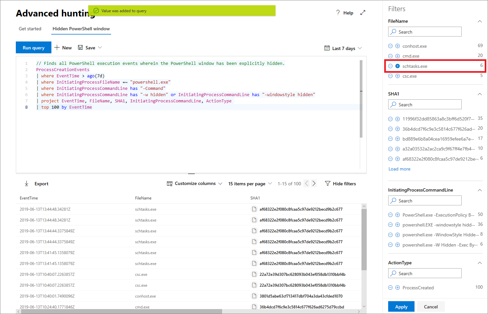

# <a name="work-with-advanced-hunting-query-results"></a><span data-ttu-id="05585-104">Werken met geavanceerde resultaten van query's</span><span class="sxs-lookup"><span data-stu-id="05585-104">Work with advanced hunting query results</span></span>

[!INCLUDE [Microsoft 365 Defender rebranding](../includes/microsoft-defender.md)]


<span data-ttu-id="05585-105">**Van toepassing op:**</span><span class="sxs-lookup"><span data-stu-id="05585-105">**Applies to:**</span></span>
- <span data-ttu-id="05585-106">Microsoft 365 Defender</span><span class="sxs-lookup"><span data-stu-id="05585-106">Microsoft 365 Defender</span></span>
- <span data-ttu-id="05585-107">Microsoft Defender voor Eindpunt</span><span class="sxs-lookup"><span data-stu-id="05585-107">Microsoft Defender for Endpoint</span></span>

[!INCLUDE [Prerelease information](../includes/prerelease.md)]

<span data-ttu-id="05585-108">Hoewel u geavanceerde [](advanced-hunting-overview.md) zoekquery's kunt maken om zeer nauwkeurige informatie te retourneren, kunt u ook met de queryresultaten werken om meer inzicht te krijgen en specifieke activiteiten en indicatoren te onderzoeken.</span><span class="sxs-lookup"><span data-stu-id="05585-108">While you can construct your [advanced hunting](advanced-hunting-overview.md) queries to return very precise information, you can also work with the query results to gain further insight and investigate specific activities and indicators.</span></span> <span data-ttu-id="05585-109">U kunt de volgende acties uitvoeren voor de queryresultaten:</span><span class="sxs-lookup"><span data-stu-id="05585-109">You can take the following actions on your query results:</span></span>

- <span data-ttu-id="05585-110">Resultaten weergeven als een tabel of grafiek</span><span class="sxs-lookup"><span data-stu-id="05585-110">View results as a table or chart</span></span>
- <span data-ttu-id="05585-111">Tabellen en grafieken exporteren</span><span class="sxs-lookup"><span data-stu-id="05585-111">Export tables and charts</span></span>
- <span data-ttu-id="05585-112">Inzoomen op gedetailleerde entiteitsgegevens</span><span class="sxs-lookup"><span data-stu-id="05585-112">Drill down to detailed entity information</span></span>
- <span data-ttu-id="05585-113">Uw query's rechtstreeks aanpassen aan de resultaten of filters toepassen</span><span class="sxs-lookup"><span data-stu-id="05585-113">Tweak your queries directly from the results or apply filters</span></span>

## <a name="view-query-results-as-a-table-or-chart"></a><span data-ttu-id="05585-114">Queryresultaten weergeven als een tabel of grafiek</span><span class="sxs-lookup"><span data-stu-id="05585-114">View query results as a table or chart</span></span>
<span data-ttu-id="05585-115">Standaard worden queryresultaten in geavanceerde query's weergegeven als tabelgegevens.</span><span class="sxs-lookup"><span data-stu-id="05585-115">By default, advanced hunting displays query results as tabular data.</span></span> <span data-ttu-id="05585-116">U kunt ook dezelfde gegevens als een grafiek weergeven.</span><span class="sxs-lookup"><span data-stu-id="05585-116">You can also display the same data as a chart.</span></span> <span data-ttu-id="05585-117">Geavanceerde jacht ondersteunt de volgende weergaven:</span><span class="sxs-lookup"><span data-stu-id="05585-117">Advanced hunting supports the following views:</span></span>

| <span data-ttu-id="05585-118">Weergavetype</span><span class="sxs-lookup"><span data-stu-id="05585-118">View type</span></span> | <span data-ttu-id="05585-119">Beschrijving</span><span class="sxs-lookup"><span data-stu-id="05585-119">Description</span></span> |
| -- | -- |
| <span data-ttu-id="05585-120">**Tabel**</span><span class="sxs-lookup"><span data-stu-id="05585-120">**Table**</span></span> | <span data-ttu-id="05585-121">Geeft de queryresultaten weer in tabelvorm</span><span class="sxs-lookup"><span data-stu-id="05585-121">Displays the query results in tabular format</span></span> |
| <span data-ttu-id="05585-122">**Kolomdiagram**</span><span class="sxs-lookup"><span data-stu-id="05585-122">**Column chart**</span></span> | <span data-ttu-id="05585-123">Geeft een reeks unieke items op de x-as weer als verticale balken waarvan de hoogten numerieke waarden uit een ander veld vertegenwoordigen</span><span class="sxs-lookup"><span data-stu-id="05585-123">Renders a series of unique items on the x-axis as vertical bars whose heights represent numeric values from another field</span></span> |
| <span data-ttu-id="05585-124">**Gestapeld kolomdiagram**</span><span class="sxs-lookup"><span data-stu-id="05585-124">**Stacked column chart**</span></span> | <span data-ttu-id="05585-125">Geeft een reeks unieke items op de x-as weer als gestapelde verticale balken waarvan de hoogten numerieke waarden uit een of meer andere velden vertegenwoordigen</span><span class="sxs-lookup"><span data-stu-id="05585-125">Renders a series of unique items on the x-axis as stacked vertical bars whose heights represent numeric values from one or more other fields</span></span> |
| <span data-ttu-id="05585-126">**Cirkeldiagram**</span><span class="sxs-lookup"><span data-stu-id="05585-126">**Pie chart**</span></span> | <span data-ttu-id="05585-127">Hiermee worden sectie-cirkels weergegeven die unieke items vertegenwoordigen.</span><span class="sxs-lookup"><span data-stu-id="05585-127">Renders sectional pies representing unique items.</span></span> <span data-ttu-id="05585-128">De grootte van elke cirkel vertegenwoordigt numerieke waarden uit een ander veld.</span><span class="sxs-lookup"><span data-stu-id="05585-128">The size of each pie represents numeric values from another field.</span></span> |
| <span data-ttu-id="05585-129">**Donut-diagram**</span><span class="sxs-lookup"><span data-stu-id="05585-129">**Donut chart**</span></span> | <span data-ttu-id="05585-130">Hiermee worden sectiebogen weergegeven die unieke items vertegenwoordigen.</span><span class="sxs-lookup"><span data-stu-id="05585-130">Renders sectional arcs representing unique items.</span></span> <span data-ttu-id="05585-131">De lengte van elke boog vertegenwoordigt numerieke waarden uit een ander veld.</span><span class="sxs-lookup"><span data-stu-id="05585-131">The length of each arc represents numeric values from another field.</span></span> |
| <span data-ttu-id="05585-132">**Lijndiagram**</span><span class="sxs-lookup"><span data-stu-id="05585-132">**Line chart**</span></span> | <span data-ttu-id="05585-133">Plots numerieke waarden voor een reeks unieke items en verbindt de uitgezete waarden</span><span class="sxs-lookup"><span data-stu-id="05585-133">Plots numeric values for a series of unique items and connects the plotted values</span></span> |
| <span data-ttu-id="05585-134">**Spreidingsdiagram**</span><span class="sxs-lookup"><span data-stu-id="05585-134">**Scatter chart**</span></span> | <span data-ttu-id="05585-135">Numerieke waarden voor een reeks unieke items plots</span><span class="sxs-lookup"><span data-stu-id="05585-135">Plots numeric values for a series of unique items</span></span> |
| <span data-ttu-id="05585-136">**Vlakdiagram**</span><span class="sxs-lookup"><span data-stu-id="05585-136">**Area chart**</span></span> | <span data-ttu-id="05585-137">Plots numerieke waarden voor een reeks unieke items en vult de secties onder de uitgezete waarden</span><span class="sxs-lookup"><span data-stu-id="05585-137">Plots numeric values for a series of unique items and fills the sections below the plotted values</span></span> |

### <a name="construct-queries-for-effective-charts"></a><span data-ttu-id="05585-138">Query's maken voor effectieve grafieken</span><span class="sxs-lookup"><span data-stu-id="05585-138">Construct queries for effective charts</span></span>
<span data-ttu-id="05585-139">Bij het weergeven van grafieken worden met geavanceerde jacht automatisch de kolommen met interesse en de numerieke waarden geïdentificeerd die moeten worden samengevoegd.</span><span class="sxs-lookup"><span data-stu-id="05585-139">When rendering charts, advanced hunting automatically identifies columns of interest and the numeric values to aggregate.</span></span> <span data-ttu-id="05585-140">Als u zinvolle grafieken wilt krijgen, maakt u uw query's om de specifieke waarden te retourneren die u wilt visualiseren.</span><span class="sxs-lookup"><span data-stu-id="05585-140">To get meaningful charts, construct your queries to return the specific values you want to see visualized.</span></span> <span data-ttu-id="05585-141">Hier zijn enkele voorbeeldquery's en de resulterende grafieken.</span><span class="sxs-lookup"><span data-stu-id="05585-141">Here are some sample queries and the resulting charts.</span></span>

#### <a name="alerts-by-severity"></a><span data-ttu-id="05585-142">Waarschuwingen op ernst</span><span class="sxs-lookup"><span data-stu-id="05585-142">Alerts by severity</span></span>
<span data-ttu-id="05585-143">Gebruik de operator om een numeriek aantal waarden te verkrijgen dat `summarize` u wilt grafieken.</span><span class="sxs-lookup"><span data-stu-id="05585-143">Use the `summarize` operator to obtain a numeric count of the values you want to chart.</span></span> <span data-ttu-id="05585-144">In de onderstaande query wordt `summarize` de operator gebruikt om het aantal waarschuwingen op ernst te krijgen.</span><span class="sxs-lookup"><span data-stu-id="05585-144">The query below uses the `summarize` operator to get the number of alerts by severity.</span></span>

```kusto
AlertInfo
| summarize Total = count() by Severity
```
<span data-ttu-id="05585-145">Bij het weergeven van de resultaten wordt in een kolomdiagram elke ernstwaarde weergegeven als een afzonderlijke kolom:</span><span class="sxs-lookup"><span data-stu-id="05585-145">When rendering the results, a column chart displays each severity value as a separate column:</span></span>

<span data-ttu-id="05585-146">
 *kolomdiagram worden weergegeven*</span><span class="sxs-lookup"><span data-stu-id="05585-146">
*Query results for alerts by severity displayed as a column chart*</span></span>

#### <a name="alert-severity-by-operating-system"></a><span data-ttu-id="05585-147">Ernst van waarschuwing per besturingssysteem</span><span class="sxs-lookup"><span data-stu-id="05585-147">Alert severity by operating system</span></span>
<span data-ttu-id="05585-148">U kunt de operator ook `summarize` gebruiken om resultaten voor te bereiden voor het in kaart brengen van waarden uit meerdere velden.</span><span class="sxs-lookup"><span data-stu-id="05585-148">You could also use the `summarize` operator to prepare results for charting values from multiple fields.</span></span> <span data-ttu-id="05585-149">U wilt bijvoorbeeld weten hoe de ernst van waarschuwingen wordt verdeeld over besturingssystemen (OS).</span><span class="sxs-lookup"><span data-stu-id="05585-149">For example, you might want to understand how alert severities are distributed across operating systems (OS).</span></span> 

<span data-ttu-id="05585-150">In de onderstaande query wordt een operator gebruikt om besturingssysteemgegevens uit de tabel te halen en vervolgens waarden in zowel de tabel als `join` `DeviceInfo` de kolommen te `summarize` `OSPlatform` `Severity` tellen:</span><span class="sxs-lookup"><span data-stu-id="05585-150">The query below uses a `join` operator to pull in OS information from the `DeviceInfo` table, and then uses `summarize` to count values in both the `OSPlatform` and `Severity` columns:</span></span>

```kusto
AlertInfo
| join AlertEvidence on AlertId
| join DeviceInfo on DeviceId
| summarize Count = count() by OSPlatform, Severity 
```
<span data-ttu-id="05585-151">Deze resultaten worden het best gevisualiseerd met behulp van een gestapeld kolomdiagram:</span><span class="sxs-lookup"><span data-stu-id="05585-151">These results are best visualized using a stacked column chart:</span></span>

<span data-ttu-id="05585-152">
 *als een gestapelde grafiek*</span><span class="sxs-lookup"><span data-stu-id="05585-152">
*Query results for alerts by OS and severity displayed as a stacked chart*</span></span>

#### <a name="phishing-emails-across-top-ten-sender-domains"></a><span data-ttu-id="05585-153">Phishing-e-mailberichten in top tien afzenderdomeinen</span><span class="sxs-lookup"><span data-stu-id="05585-153">Phishing emails across top ten sender domains</span></span>
<span data-ttu-id="05585-154">Als u te maken hebt met een lijst met waarden die niet eindig is, kunt u de operator gebruiken om alleen de waarden met de meeste `Top` exemplaren in kaart te brengen.</span><span class="sxs-lookup"><span data-stu-id="05585-154">If you're dealing with a list of values that isn’t finite, you can use the `Top` operator to chart only the values with the most instances.</span></span> <span data-ttu-id="05585-155">Als u bijvoorbeeld de tien top tien afzenderdomeinen met de meeste phishing-e-mailberichten wilt krijgen, gebruikt u de onderstaande query:</span><span class="sxs-lookup"><span data-stu-id="05585-155">For example, to get the top ten sender domains with the most phishing emails, use the query below:</span></span>

```kusto
EmailEvents
| where ThreatTypes has "Phish" 
| summarize Count = count() by SenderFromDomain 
| top 10 by Count
```
<span data-ttu-id="05585-156">Gebruik de cirkeldiagramweergave om de verdeling over de bovenste domeinen effectief weer te geven:</span><span class="sxs-lookup"><span data-stu-id="05585-156">Use the pie chart view to effectively show distribution across the top domains:</span></span>

<span data-ttu-id="05585-157">
 *phishing-e-mailberichten over domeinen met de belangrijkste afzender*</span><span class="sxs-lookup"><span data-stu-id="05585-157">
*Pie chart showing distribution of phishing emails across top sender domains*</span></span>

#### <a name="file-activities-over-time"></a><span data-ttu-id="05585-158">Bestandsactiviteiten in de tijd</span><span class="sxs-lookup"><span data-stu-id="05585-158">File activities over time</span></span>
<span data-ttu-id="05585-159">Met behulp `summarize` van de operator met de functie kunt u controleren op gebeurtenissen met een bepaalde indicator in de `bin()` tijd.</span><span class="sxs-lookup"><span data-stu-id="05585-159">Using the `summarize` operator with the `bin()` function, you can check for events involving a particular indicator over time.</span></span> <span data-ttu-id="05585-160">In de onderstaande query worden gebeurtenissen met het bestand geteld met intervallen van 30 minuten om pieken in activiteit met betrekking `invoice.doc` tot dat bestand weer te geven:</span><span class="sxs-lookup"><span data-stu-id="05585-160">The query below counts events involving the file `invoice.doc` at 30 minute intervals to show spikes in activity related to that file:</span></span>

```kusto
AppFileEvents
| union DeviceFileEvents
| where FileName == "invoice.doc"
| summarize FileCount = count() by bin(Timestamp, 30m)
```
<span data-ttu-id="05585-161">In het onderstaande lijndiagram worden duidelijk perioden met meer activiteiten met betrekking tot `invoice.doc` :</span><span class="sxs-lookup"><span data-stu-id="05585-161">The line chart below clearly highlights time periods with more activity involving `invoice.doc`:</span></span> 

<span data-ttu-id="05585-162">
 *een bestand in de tijd*</span><span class="sxs-lookup"><span data-stu-id="05585-162">
*Line chart showing the number of events involving a file over time*</span></span>


## <a name="export-tables-and-charts"></a><span data-ttu-id="05585-163">Tabellen en grafieken exporteren</span><span class="sxs-lookup"><span data-stu-id="05585-163">Export tables and charts</span></span>
<span data-ttu-id="05585-164">Nadat u een query hebt uitgevoerd, **selecteert u Exporteren om** de resultaten op te slaan in een lokaal bestand.</span><span class="sxs-lookup"><span data-stu-id="05585-164">After running a query, select **Export** to save the results to local file.</span></span> <span data-ttu-id="05585-165">De gekozen weergave bepaalt hoe de resultaten worden geëxporteerd:</span><span class="sxs-lookup"><span data-stu-id="05585-165">Your chosen view determines how the results are exported:</span></span>

- <span data-ttu-id="05585-166">**Tabelweergave:** de queryresultaten worden in tabelvorm geëxporteerd als een Microsoft Excel-werkmap</span><span class="sxs-lookup"><span data-stu-id="05585-166">**Table view** — the query results are exported in tabular form as a Microsoft Excel workbook</span></span>
- <span data-ttu-id="05585-167">**Een grafiek:** de queryresultaten worden geëxporteerd als EEN JPEG-afbeelding van de weergegeven grafiek</span><span class="sxs-lookup"><span data-stu-id="05585-167">**Any chart** — the query results are exported as a JPEG image of the rendered chart</span></span>

## <a name="drill-down-from-query-results"></a><span data-ttu-id="05585-168">Inzoomen op queryresultaten</span><span class="sxs-lookup"><span data-stu-id="05585-168">Drill down from query results</span></span>
<span data-ttu-id="05585-169">Als u snel een record in de queryresultaten wilt controleren, selecteert u de bijbehorende rij om het **deelvenster Record** controleren te openen.</span><span class="sxs-lookup"><span data-stu-id="05585-169">To quickly inspect a record in your query results, select the corresponding row to open the **Inspect record** panel.</span></span> <span data-ttu-id="05585-170">Het deelvenster bevat de volgende informatie op basis van de geselecteerde record:</span><span class="sxs-lookup"><span data-stu-id="05585-170">The panel provides the following information based on the selected record:</span></span>

- <span data-ttu-id="05585-171">**Activa:** een overzicht van de belangrijkste activa (postvakken, apparaten en gebruikers) die in de record zijn gevonden, aangevuld met beschikbare informatie, zoals risico- en blootstellingsniveaus</span><span class="sxs-lookup"><span data-stu-id="05585-171">**Assets** — summarized view of the main assets (mailboxes, devices, and users) found in the record, enriched with available information, such as risk and exposure levels</span></span>
- <span data-ttu-id="05585-172">**Processtructuur:** gegenereerd voor records met procesgegevens en uitgebreid met behulp van beschikbare contextuele informatie; Query's die meer kolommen retourneren, kunnen over het algemeen leiden tot rijkere procesbomen.</span><span class="sxs-lookup"><span data-stu-id="05585-172">**Process tree** — generated for records with process information and enriched using available contextual information; in general, queries that return more columns can result in richer process trees.</span></span>
- <span data-ttu-id="05585-173">**Alle details:** alle waarden uit de kolommen in de record</span><span class="sxs-lookup"><span data-stu-id="05585-173">**All details** — all the values from the columns in the record</span></span>  


<span data-ttu-id="05585-175">Als u meer informatie wilt weergeven over een specifieke entiteit in de queryresultaten, zoals een computer, bestand, gebruiker, IP-adres of URL, selecteert u de entiteit-id om een gedetailleerde profielpagina voor die entiteit te openen.</span><span class="sxs-lookup"><span data-stu-id="05585-175">To view more information about a specific entity in your query results, such as a machine, file, user, IP address, or URL, select the entity identifier to open a detailed profile page for that entity.</span></span>

## <a name="tweak-your-queries-from-the-results"></a><span data-ttu-id="05585-176">Uw query's aanpassen aan de hand van de resultaten</span><span class="sxs-lookup"><span data-stu-id="05585-176">Tweak your queries from the results</span></span>
<span data-ttu-id="05585-177">Klik met de rechtermuisknop op een waarde in de resultatenset om de query snel te verbeteren.</span><span class="sxs-lookup"><span data-stu-id="05585-177">Right-click a value in the result set to quickly enhance your query.</span></span> <span data-ttu-id="05585-178">U kunt de opties gebruiken om:</span><span class="sxs-lookup"><span data-stu-id="05585-178">You can use the options to:</span></span>

- <span data-ttu-id="05585-179">Zoek expliciet naar de geselecteerde waarde ( `==` )</span><span class="sxs-lookup"><span data-stu-id="05585-179">Explicitly look for the selected value (`==`)</span></span>
- <span data-ttu-id="05585-180">De geselecteerde waarde uitsluiten van de query ( `!=` )</span><span class="sxs-lookup"><span data-stu-id="05585-180">Exclude the selected value from the query (`!=`)</span></span>
- <span data-ttu-id="05585-181">Meer geavanceerde operatoren voor het toevoegen van de waarde aan uw query, zoals `contains` , `starts with` en `ends with`</span><span class="sxs-lookup"><span data-stu-id="05585-181">Get more advanced operators for adding the value to your query, such as `contains`, `starts with` and `ends with`</span></span> 


## <a name="filter-the-query-results"></a><span data-ttu-id="05585-183">De queryresultaten filteren</span><span class="sxs-lookup"><span data-stu-id="05585-183">Filter the query results</span></span>
<span data-ttu-id="05585-184">De filters die aan de rechterkant worden weergegeven, geven een overzicht van de resultatenset.</span><span class="sxs-lookup"><span data-stu-id="05585-184">The filters displayed to the right provide a summary of the result set.</span></span> <span data-ttu-id="05585-185">Elke kolom heeft een eigen sectie met de verschillende waarden die voor die kolom zijn gevonden en het aantal exemplaren.</span><span class="sxs-lookup"><span data-stu-id="05585-185">Each column has its own section that lists the distinct values found for that column and the number of instances.</span></span>

<span data-ttu-id="05585-186">Verfijn de query door de of knoppen te selecteren op de waarden die u wilt opnemen of uitsluiten en selecteer `+` `-` vervolgens Query **uitvoeren.**</span><span class="sxs-lookup"><span data-stu-id="05585-186">Refine your query by selecting the `+` or `-` buttons on the values that you want to include or exclude and then selecting **Run query**.</span></span>



<span data-ttu-id="05585-188">Nadat u het filter hebt toegepast om de query te wijzigen en de query vervolgens uit te voeren, worden de resultaten dienovereenkomstig bijgewerkt.</span><span class="sxs-lookup"><span data-stu-id="05585-188">Once you apply the filter to modify the query and then run the query, the results are updated accordingly.</span></span>

>[!NOTE]
><span data-ttu-id="05585-189">Sommige tabellen in dit artikel zijn mogelijk niet beschikbaar in Microsoft Defender voor Eindpunt.</span><span class="sxs-lookup"><span data-stu-id="05585-189">Some tables in this article might not be available in Microsoft Defender for Endpoint.</span></span> <span data-ttu-id="05585-190">[Schakel Microsoft 365 Defender in om](m365d-enable.md) te zoeken naar bedreigingen met meer gegevensbronnen.</span><span class="sxs-lookup"><span data-stu-id="05585-190">[Turn on Microsoft 365 Defender](m365d-enable.md) to hunt for threats using more data sources.</span></span> <span data-ttu-id="05585-191">U kunt uw geavanceerde zoekwerkstromen verplaatsen van Microsoft Defender voor Eindpunt naar Microsoft 365 Defender door de stappen te volgen in Geavanceerde zoekquery's migreren van [Microsoft Defender voor Eindpunt.](advanced-hunting-migrate-from-mde.md)</span><span class="sxs-lookup"><span data-stu-id="05585-191">You can move your advanced hunting workflows from Microsoft Defender for Endpoint to Microsoft 365 Defender by following the steps in [Migrate advanced hunting queries from Microsoft Defender for Endpoint](advanced-hunting-migrate-from-mde.md).</span></span>

## <a name="related-topics"></a><span data-ttu-id="05585-192">Verwante onderwerpen</span><span class="sxs-lookup"><span data-stu-id="05585-192">Related topics</span></span>
- [<span data-ttu-id="05585-193">Overzicht van geavanceerd opsporen</span><span class="sxs-lookup"><span data-stu-id="05585-193">Advanced hunting overview</span></span>](advanced-hunting-overview.md)
- [<span data-ttu-id="05585-194">De querytaal leren</span><span class="sxs-lookup"><span data-stu-id="05585-194">Learn the query language</span></span>](advanced-hunting-query-language.md)
- [<span data-ttu-id="05585-195">Gedeelde query's gebruiken</span><span class="sxs-lookup"><span data-stu-id="05585-195">Use shared queries</span></span>](advanced-hunting-shared-queries.md)
- [<span data-ttu-id="05585-196">Opsporen op apparaten en in e-mailberichten, apps en identiteiten</span><span class="sxs-lookup"><span data-stu-id="05585-196">Hunt across devices, emails, apps, and identities</span></span>](advanced-hunting-query-emails-devices.md)
- [<span data-ttu-id="05585-197">Meer informatie over het schema</span><span class="sxs-lookup"><span data-stu-id="05585-197">Understand the schema</span></span>](advanced-hunting-schema-tables.md)
- [<span data-ttu-id="05585-198">Aanbevolen procedures voor query's toepassen</span><span class="sxs-lookup"><span data-stu-id="05585-198">Apply query best practices</span></span>](advanced-hunting-best-practices.md)
- [<span data-ttu-id="05585-199">Overzicht van aangepaste detectie</span><span class="sxs-lookup"><span data-stu-id="05585-199">Custom detections overview</span></span>](custom-detections-overview.md)
