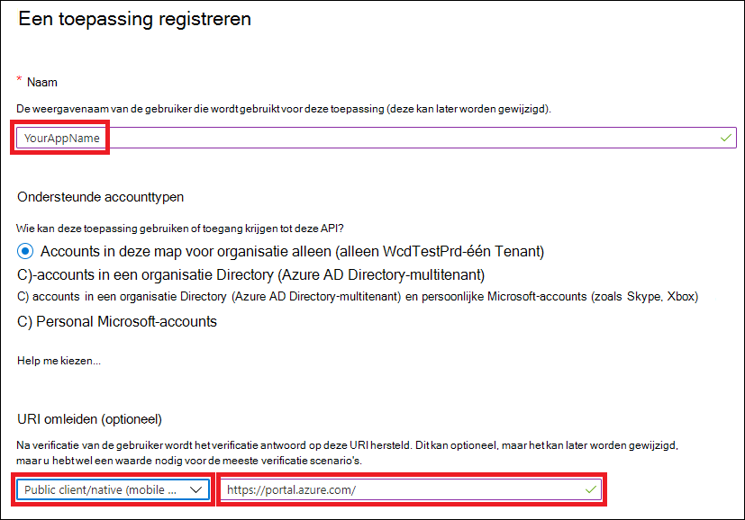
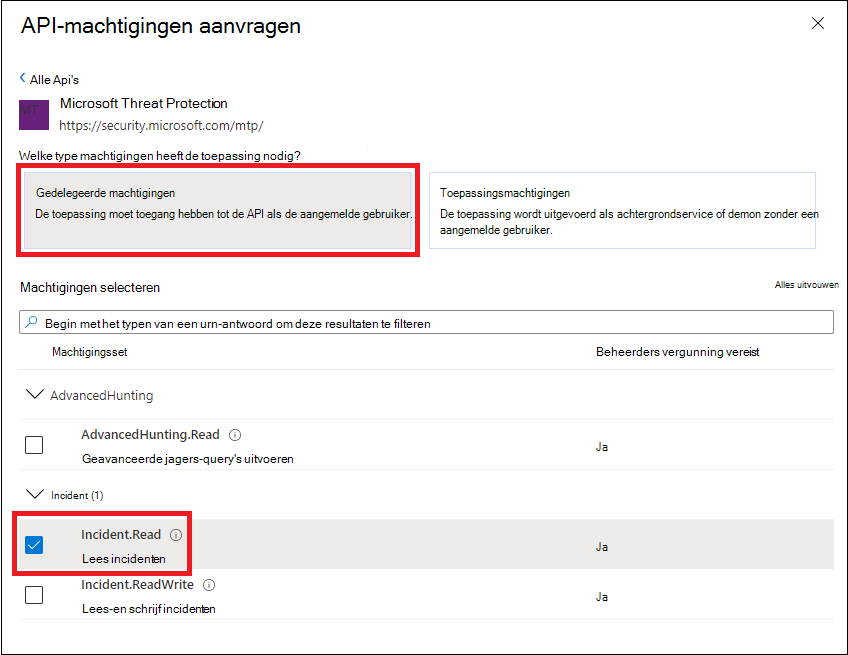

# <a name="create-an-app-to-access-microsoft-365-defender-apis-on-behalf-of-a-user"></a>Een app maken voor toegang tot Microsoft 365 Defender-API's namens een gebruiker

[!INCLUDE [Microsoft 365 Defender rebranding](../includes/microsoft-defender.md)]

**Van toepassing op:**

- Microsoft 365 Defender

> [!IMPORTANT]
> Sommige informatie is gerelateerd aan voorlopige productversies die mogelijk aanzienlijk gewijzigd worden voordat ze commercieel gepubliceerd worden. Microsoft geeft geen garantie, uitdrukkelijk of impliciet, met betrekking tot de informatie die hier wordt beschreven.

Op deze pagina wordt beschreven hoe u een toepassing maakt voor programmatische toegang tot Microsoft 365 Defender namens één gebruiker.

Als u programmatische toegang nodig hebt tot Microsoft 365 Defender zonder een gedefinieerde gebruiker (bijvoorbeeld als u een achtergrond-app of daemon schrijft), zie Een app maken voor toegang tot [Microsoft 365 Defender](api-create-app-web.md)zonder een gebruiker. Zie Een app maken met partnertoegang tot [Microsoft 365 Defender API's](api-partner-access.md)als u toegang wilt bieden voor meerdere tenants, bijvoorbeeld als u een grote organisatie of een groep klanten dient. Zie Aan de slag als u niet zeker weet welk type toegang u nodig [hebt.](api-access.md)

Microsoft 365 Defender toont een groot deel van de gegevens en acties via een set programmatische API's. Met deze API's kunt u werkstromen automatiseren en gebruikmaken van de mogelijkheden van Microsoft 365 Defender. Voor deze API-toegang is OAuth2.0-verificatie vereist. Zie [OAuth 2.0 Autorisatiecodestroom](/azure/active-directory/develop/active-directory-v2-protocols-oauth-code)voor meer informatie.

Over het algemeen moet u de volgende stappen nemen om deze API's te gebruiken:

- Een Azure Active Directory-toepassing (Azure AD) maken.
- Een toegangs token krijgen met deze toepassing.
- Gebruik het token om toegang te krijgen tot de Microsoft 365 Defender-API.

In dit artikel wordt uitgelegd hoe u:

- Een Azure AD-toepassing maken
- Een toegangs token voor Microsoft 365 Defender
- Het token valideren

> [!NOTE]
> Wanneer u namens een gebruiker toegang hebt tot de Microsoft 365 Defender-API, hebt u de juiste machtigingen en gebruikersmachtigingen nodig.

> [!TIP]
> Als u de machtiging hebt om een actie uit te voeren in de portal, hebt u de machtiging om de actie uit te voeren in de API.

## <a name="create-an-app"></a>Een app maken

1. Meld u aan [bij Azure](https://portal.azure.com) als gebruiker met de **rol Globale** beheerder.

2. **Navigeer naar Azure Active Directory**  >  **App-registraties** Nieuwe  >  **registratie**.

   

3. Kies in het formulier een naam voor uw toepassing en voer de volgende gegevens in voor de omleidings-URI en selecteer **register.**

   

   - **Toepassingstype:** Openbare client
   - **Redirect URI:**https://portal.azure.com

4. Selecteer op uw **toepassingspagina API-machtigingen** Machtigingen toevoegen Machtiging-API's die mijn organisatie gebruikt  >    >   >, typ **Microsoft Threat Protection** en selecteer Microsoft **Threat Protection.** Uw app heeft nu toegang tot Microsoft 365 Defender.

   > [!TIP]
   > *Microsoft Threat Protection* is een voormalige naam voor Microsoft 365 Defender en wordt niet weergegeven in de oorspronkelijke lijst. U moet beginnen met het schrijven van de naam in het tekstvak om deze weer te geven.

   

   - Kies **Gedelegeerde machtigingen.** Kies de relevante machtigingen voor uw scenario (bijvoorbeeld **Incident.Read)** en selecteer **vervolgens Machtigingen toevoegen.**

   

    > [!NOTE]
    > U moet de relevante machtigingen voor uw scenario selecteren. *Alle incidenten lezen* is slechts een voorbeeld. Als u wilt bepalen welke machtiging u nodig hebt, kijkt u naar **de sectie** Machtigingen in de API die u wilt bellen.
    >
    > Als u bijvoorbeeld geavanceerde [query's wilt uitvoeren,](api-advanced-hunting.md)selecteert u de machtiging Geavanceerde query's uitvoeren. als [u een apparaat wilt isoleren,](/windows/security/threat-protection/microsoft-defender-atp/isolate-machine)selecteert u de machtiging 'Machine isoleren'.

5. Selecteer **Beheerdersmachtiging verlenen.** Telkens wanneer u een machtiging toevoegt, moet u Toestemming van beheerder **verlenen selecteren** om deze van kracht te laten worden.

   

6. Neem uw toepassings-id en uw tenant-id op een veilige plaats op. Ze worden weergegeven onder **Overzicht** op uw toepassingspagina.

   

## <a name="get-an-access-token"></a>Een toegangs token krijgen

Zie de [zelfstudie Azure AD](/azure/active-directory/develop/active-directory-v2-protocols-oauth-client-creds)voor meer informatie over Azure Active Directory-tokens.

### <a name="get-an-access-token-using-powershell"></a>Toegangs token krijgen met PowerShell

```PowerShell
if(!(Get-Package adal.ps)) { Install-Package -Name adal.ps } # Install the ADAL.PS package in case it's not already present

$tenantId = '' # Paste your directory (tenant) ID here.
$clientId = '' # Paste your application (client) ID here.
$redirectUri = '' # Paste your app's redirection URI

$authority = "https://login.windows.net/$tenantId"
$resourceUrl = 'https://api.security.microsoft.com'

$response = Get-ADALToken -Resource $resourceUrl -ClientId $cleintId -RedirectUri $redirectUri -Authority $authority -PromptBehavior:Always
$response.AccessToken | clip

$response.AccessToken
```

## <a name="validate-the-token"></a>Het token valideren

1. Kopieer en plak het token in [JWT om](https://jwt.ms) het te decoderen.
1. Zorg ervoor dat de *claim rollen* in het gedecodeerde token de gewenste machtigingen bevat.

In de volgende afbeelding ziet u een gedecodeerd token dat is verkregen van een app, met ```Incidents.Read.All``` ```Incidents.ReadWrite.All``` , en ```AdvancedHunting.Read.All``` machtigingen:


## <a name="use-the-token-to-access-the-microsoft-365-defender-api"></a>Het token gebruiken om toegang te krijgen tot de Microsoft 365 Defender-API

1. Kies de API die u wilt gebruiken (incidenten of geavanceerd zoeken). Zie Ondersteunde [Microsoft 365 Defender-API's](api-supported.md)voor meer informatie.
2. Stel in de http-aanvraag die u gaat verzenden de autorisatiekop in op , Bearer is het autorisatieschema en het `"Bearer" <token>` *token*  dat uw gevalideerde token is.
3. Het token verloopt binnen een uur. U kunt in deze periode meerdere aanvragen met hetzelfde token verzenden.

In het volgende voorbeeld ziet u hoe u een aanvraag verzendt om een lijst met incidenten te krijgen **met C#**.

```C#
    var httpClient = new HttpClient();
    var request = new HttpRequestMessage(HttpMethod.Get, "https://api.security.microsoft.com/api/incidents");

    request.Headers.Authorization = new AuthenticationHeaderValue("Bearer", token);

    var response = httpClient.SendAsync(request).GetAwaiter().GetResult();
```

## <a name="related-articles"></a>Verwante artikelen

- [Overzicht van Microsoft 365 Defender-API's](api-overview.md)
- [De Microsoft 365 Defender-API's openen](api-access.md)
- [Een 'Hello world' app maken](api-hello-world.md)
- [Een app maken voor toegang tot Microsoft 365 Defender zonder een gebruiker](api-create-app-web.md)
- [Een app maken met partnertoegang voor meerdere tenants tot Microsoft 365 Defender-API's](api-partner-access.md)
- [Meer informatie over API-limieten en -licenties](api-terms.md)
- [Foutcodes begrijpen](api-error-codes.md)
- [OAuth 2.0-autorisatie voor gebruikers aanmelden en API-toegang](/azure/active-directory/develop/active-directory-v2-protocols-oauth-code)