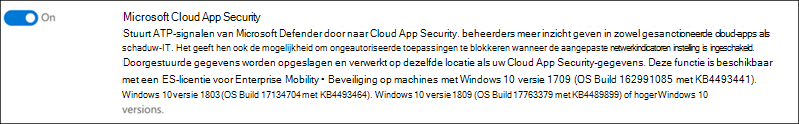

# Microsoft 365 Defender-pilaren configureren voor uw proeflaboratorium of testomgeving

[!INCLUDE [Microsoft 365 Defender rebranding](../includes/microsoft-defender.md)]

**Van toepassing op:**
- Microsoft 365 Defender

Het maken van een proeflaboratorium of testomgeving van Microsoft 365 Defender en de implementatie ervan is een proces in drie fasen:

| [Fase 1: Voorbereiden](prepare-m365d-eval.md) | [Fase 2: Instellen](setup-m365deval.md) | Fase 3: Onboard |  [Terug naar pilot playbook](m365d-pilot.md) |
|--|--|--|--|
|| |*U bent er!* | |

U bent momenteel in de configuratiefase.

Voorbereiding is essentieel voor een geslaagde implementatie. In dit artikel wordt u begeleid over de punten die u moet overwegen terwijl u zich voorbereidt op de implementatie van Microsoft Defender voor Eindpunt.

## Microsoft 365 Defender-pilaren
Microsoft 365 Defender bestaat uit vier pilaren. Hoewel één pijler al waarde kan bieden voor de beveiliging van uw netwerkorganisatie, geeft het inschakelen van de vier Microsoft 365 Defender-pijlers uw organisatie de meeste waarde.

In deze sectie wordt u begeleid bij het configureren:
-   Microsoft Defender voor Office 365
-   Microsoft Defender for Identity 
-   Microsoft Cloud App Security
-   Microsoft Defender for Endpoint

## Microsoft Defender configureren voor Office 365

>[!NOTE]
>Sla deze stap over als u Defender voor Office 365 al hebt ingeschakeld. 

Er is een PowerShell-module genaamd *de Office 365 Advanced Threat Protection Recommended Configuration Analyzer (ORCA)* waarmee u bepaalde van deze instellingen kunt bepalen. Wanneer u wordt uitgevoerd als een beheerder in uw tenant, helpt get-ORCAReport bij het genereren van een beoordeling van de instellingen voor antispam, anti-phish en andere berichthygiëne. U kunt deze module downloaden van https://www.powershellgallery.com/packages/ORCA/ . 

1. Navigeer naar het beveiligingsbeleid van [Office 365 & Compliance Center](https://protection.office.com/homepage)Threat  >  **Management**  >  **Policy**.

   
 
2. Klik **op Anti-phishing,** selecteer **Maken** en vul de naam en beschrijving van het beleid in. Klik op **Volgende**.

   

   > [!NOTE]
   > Bewerk uw geavanceerde anti-phishingbeleid in Microsoft Defender voor Office 365. Geavanceerde **phishingdrempel wijzigen** in **2 - Agressief.**

3. Klik op **de vervolgkeuzelijst** Een voorwaarde toevoegen en selecteer uw domein(en) als geadresseerdedomein. Klik op **Volgende**.

   
 
4. Controleer uw instellingen. Klik **op Dit beleid maken om** dit te bevestigen. 

   
 
5. Selecteer **Veilige bijlagen en** selecteer de optie **ATP voor SharePoint, OneDrive en Microsoft Teams** in- en uit.

   

6. Klik op het pictogram + om een nieuw beleid voor veilige bijlagen te maken en pas dit toe als geadresseerdedomein op uw domeinen. Klik op **Opslaan**.

   
 
7. Selecteer vervolgens het beleid **voor veilige** koppelingen en klik vervolgens op het potloodpictogram om het standaardbeleid te bewerken.

8. Zorg ervoor dat de optie **Niet bijhouden wanneer gebruikers op** veilige koppelingen klikken niet is geselecteerd, terwijl de overige opties zijn geselecteerd. Zie [Instellingen voor veilige koppelingen](/microsoft-365/security/defender-365-security/recommended-settings-for-eop-and-office365) voor meer informatie. Klik op **Opslaan**. 

   

9. Selecteer vervolgens het **anti-malwarebeleid,** selecteer de standaardinstelling en kies het potloodpictogram.

10. Klik **op Instellingen** en selecteer Ja en gebruik de **standaardmeldingstekst** om reactie op **malwaredetectie in te stellen.** Schakel het **filter Algemene bijlagetypen** in. Klik op **Opslaan**.

    
  
11. Ga naar [Office 365 Security & Search](https://protection.office.com/homepage)Audit log search and turn  >    >   Auditing on.

    

12. Integreer Microsoft Defender voor Office 365 met Microsoft Defender voor Eindpunt. Ga naar [Office 365 Security & Compliance Center](https://protection.office.com/homepage)Threat Management Explorer en selecteer Microsoft Defender voor Eindpuntinstellingen in de rechterbovenhoek van het  >    >   scherm.  Schakel in het dialoogvenster Verbinding tussen Defender voor eindpunten **Verbinding maken met Microsoft Defender voor Eindpunt in.**

    

## Microsoft Defender configureren voor identiteit

>[!NOTE]
>Sla deze stap over als u Microsoft Defender voor identiteit al hebt ingeschakeld

1. Ga naar [het Microsoft 365-beveiligingscentrum >](https://security.microsoft.com/info) selecteer Meer **resources** Microsoft Defender  >  **voor identiteit.**

   

2. Klik **op Maken** om de wizard Microsoft Defender voor identiteit te starten. 

   

3. Kies **Een gebruikersnaam en wachtwoord opgeven om verbinding te maken met uw Active Directory-forest.**  

   

4. Voer uw on-premises Active Directory-referenties in. Dit kan elk gebruikersaccount zijn dat leestoegang heeft tot Active Directory.

   

5. Kies vervolgens **Sensor instellen downloaden en** bestand overbrengen naar uw domeincontroller.

   

6. Voer de installatie van de Microsoft Defender voor identiteits sensor uit en begin de wizard te volgen.

   
 
7. Klik **op Volgende** bij het type sensorimplementatie.

   
 
8. Kopieer de toegangssleutel omdat u deze vervolgens moet invoeren in de wizard.

   
 
9. Kopieer de toegangssleutel naar de wizard en klik op **Installeren.** 

   

10. Gefeliciteerd, u hebt Microsoft Defender voor identiteit geconfigureerd op uw domeincontroller.

    
 
11. Selecteer onder [de sectie Instellingen](https://go.microsoft.com/fwlink/?linkid=2040449) voor Microsoft Defender voor identiteit de optie **Microsoft Defender voor Eindpunt **, en schakel de schakelaar in. Klik op **Opslaan**. 

    

> [!NOTE]
> Windows Defender ATP is hernoemd als Microsoft Defender voor Eindpunt. Wijzigingen wijzigen in al onze portals worden uitgerold voor consistentie.

## Microsoft Cloud App-beveiliging configureren

> [!NOTE]
> Sla deze stap over als u Microsoft Cloud App-beveiliging al hebt ingeschakeld. 

1. Ga naar [Microsoft 365 Security Center](https://security.microsoft.com/info)More  >  **Resources** Microsoft Cloud  >  **App Security**.

   

2. Selecteer Microsoft Defender inschakelen voor **identiteitsgegevensintegratie** bij de informatieprompt voor het integreren van Microsoft Defender voor identiteit.
  
   

   > [!NOTE]
   > Als u deze prompt niet ziet, kan dit betekenen dat uw Microsoft Defender voor identiteitsgegevensintegratie al is ingeschakeld. Als u het echter niet zeker weet, neem dan contact op met uw IT-beheerder om dit te bevestigen. 

3. Ga naar **Instellingen,** schakel de schakelknop **Microsoft Defender voor identiteitsintegratie** in en klik op **Opslaan.** 

   
   
   > [!NOTE]
   > Voor nieuwe Microsoft Defender voor identiteits-exemplaren wordt deze schakelknop voor integratie automatisch ingeschakeld. Controleer of uw Microsoft Defender voor identiteitsintegratie is ingeschakeld voordat u verdergaat met de volgende stap.
 
4. Selecteer onder de instellingen voor clouddetectie de optie **Microsoft Defender voor endpoint-integratie** en schakel de integratie in. Klik op **Opslaan**.

   

5. Selecteer onder Instellingen voor clouddetectie de optie **Gebruikersverrijking** en schakel vervolgens de integratie met Azure Active Directory in.

   

## Microsoft Defender configureren voor eindpunt

>[!NOTE]
>Sla deze stap over als u Microsoft Defender voor Eindpunt al hebt ingeschakeld.

1. Ga naar [Microsoft 365 Security Center](https://security.microsoft.com/info)More  >  **Resources** Microsoft Defender  >  **Security Center**. Klik **op Openen.**

   
 
2. Volg de wizard Microsoft Defender voor eindpunt. Klik op **Volgende**. 

   

3. Kies op basis van uw voorkeurslocatie voor gegevensopslag, beleid voor gegevensretentie, organisatiegrootte en opt-in voor voorbeeldfuncties.

   
   
   > [!NOTE]
   > U kunt sommige instellingen, zoals de locatie voor gegevensopslag, achteraf niet wijzigen. 

   Klik op **Volgende**. 

4. Klik **op Doorgaan** en de Microsoft Defender voor Eindpunt-tenant wordt ingericht.

   

5. Onboard your endpoints through Group Policies, Microsoft Endpoint Manager or by running a local script to Microsoft Defender for Endpoint. Voor de eenvoud wordt in deze handleiding het lokale script gebruikt.

6. Klik **op Pakket downloaden** en kopieer het onboarding-script naar uw eindpunten.

   

7. Voer op het eindpunt het onboarding-script uit als beheerder en kies Y. 

   

8. Gefeliciteerd, u hebt uw eerste eindpunt aan boord.

   

9. Kopieer de detectietest vanuit de wizard Microsoft Defender voor eindpunt.

   

10. Kopieer het PowerShell-script naar een opdrachtprompt met verhoogde opdracht en voer het uit. 

    

11. Selecteer **Start using Microsoft Defender for Endpoint from** the Wizard.

    
 
12. Ga naar [het Microsoft Defender-beveiligingscentrum.](https://securitycenter.windows.com/) Ga naar **Instellingen** en selecteer geavanceerde **functies.** 

    

13. Schakel de integratie met **Microsoft Defender voor identiteit in.**  

    

14. Schakel de integratie met **Office 365 Threat Intelligence in.**

    

15. Schakel integratie in met **Microsoft Cloud App Security.**

    

16. Schuif omlaag en klik **op Voorkeuren opslaan om** de nieuwe integraties te bevestigen.

    

## De Microsoft 365 Defender-service starten

>[!NOTE]
>Vanaf 1 juni 2020 worden microsoft 365 Defender-functies automatisch in gebruik gemaakt voor alle in aanmerking komende tenants. Zie dit [Artikel van de Microsoft Tech Community over het in aanmerking komen voor](https://techcommunity.microsoft.com/t5/security-privacy-and-compliance/microsoft-threat-protection-will-automatically-turn-on-for/ba-p/1345426) licenties voor meer informatie. 

Ga naar [het Microsoft 365-beveiligingscentrum.](https://security.microsoft.com/homepage) Ga naar **Instellingen** en selecteer **microsoft 365 Defender.**

  

Zie [Microsoft 365 Defender in- en in- en uit- zetten voor uitgebreidere richtlijnen.](m365d-enable.md) 

Gefeliciteerd! U hebt zojuist uw proeflaboratorium of testomgeving voor Microsoft 365 Defender gemaakt. Nu kunt u vertrouwd raken met de gebruikersinterface van Microsoft 365 Defender! Bekijk wat u kunt leren van de volgende interactieve Microsoft 365 Defender-handleiding en weet hoe u elk dashboard kunt gebruiken voor uw dagelijkse beveiligingstaken.

>[!VIDEO https://aka.ms/MTP-Interactive-Guide]

Vervolgens kunt u een aanval simuleren en zien hoe de verschillende productmogelijkheden waarschuwingen detecteren, maken en automatisch reageren op een bestandloze aanval op een eindpunt.

## Volgende stap

- [Een testwaarschuwing genereren:](generate-test-alert.md) voer een aanvalssimulatie uit in uw Proeflab van Microsoft 365 Defender.