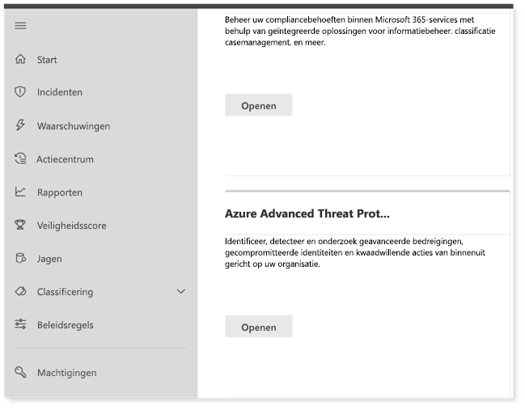
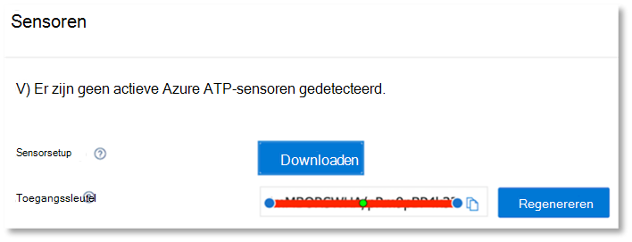

# De Microsoft 365 Defender-pilaren configureren voor uw proeflaboratorium of testomgevingConfigure Microsoft 365 Defender pillars for your trial lab or pilot environment

[!INCLUDE [Microsoft 365 Defender rebranding](../includes/microsoft-defender.md)]

**Van toepassing op:****Applies to:**
- Microsoft 365 DefenderMicrosoft 365 Defender

Het maken Microsoft 365 proeflaboratorium of testomgeving van Defender en deze implementeren is een proces in drie fasen:Creating a Microsoft 365 Defender trial lab or pilot environment and deploying it is a three-phase process:

| [Fase 1: VoorbereidenPhase 1: Prepare](prepare-m365d-eval.md) | [Fase 2: InstellenPhase 2: Set up](setup-m365deval.md) | Fase 3: OnboardenPhase 3: Onboard |  [Terug naar pilot playbookBack to pilot playbook](m365d-pilot.md) |
|--|--|--|--|
|| |*U bent er!**You are here!* | |

U bent momenteel in de configuratiefase.You're currently in the configuration phase.

Voorbereiding is essentieel voor een geslaagde implementatie.Preparation is key to any successful deployment. In dit artikel wordt u begeleid over de punten die u moet overwegen terwijl u zich voorbereidt op de implementatie van Microsoft Defender voor Eindpunt.In this article, you'll be guided on the points you'll need to consider as you prepare to deploy Microsoft Defender for Endpoint.

## Microsoft 365 Defender-pilarenMicrosoft 365 Defender pillars
Microsoft 365 Defender bestaat uit vier pilaren.Microsoft 365 Defender consists of four pillars. Hoewel één pijler al waarde kan bieden voor de beveiliging van uw netwerkorganisatie, biedt het inschakelen van de vier Microsoft 365 Defender-pijlers de meeste waarde voor uw organisatie.Although one pillar can already provide value to your network organization's security, enabling the four Microsoft 365 Defender pillars will give your organization the most value.

In deze sectie wordt u begeleid bij het configureren:This section will guide you to configure:
-   Microsoft Defender voor Office 365Microsoft Defender for Office 365
-   Microsoft Defender for IdentityMicrosoft Defender for Identity 
-   Microsoft Cloud App SecurityMicrosoft Cloud App Security
-   Microsoft Defender voor EindpuntMicrosoft Defender for Endpoint

## Microsoft Defender configureren voor Office 365Configure Microsoft Defender for Office 365

>[!NOTE]
>Sla deze stap over als u Defender al hebt ingeschakeld voor Office 365.Skip this step if you've already enabled Defender for Office 365. 

Er is een PowerShell-module genaamd *de Office 365 Advanced Threat Protection Recommended Configuration Analyzer (ORCA)* waarmee u bepaalde van deze instellingen kunt bepalen.There's a PowerShell Module called the *Office 365 Advanced Threat Protection Recommended Configuration Analyzer (ORCA)* that helps determine some of these settings. Wanneer u wordt uitgevoerd als een beheerder in uw tenant, helpt get-ORCAReport bij het genereren van een beoordeling van de instellingen voor antispam, anti-phish en andere berichthygiëne.When run as an administrator in your tenant, get-ORCAReport will help generate an assessment of the anti-spam, anti-phish, and other message hygiene settings. U kunt deze module downloaden van https://www.powershellgallery.com/packages/ORCA/ .You can download this module from https://www.powershellgallery.com/packages/ORCA/. 

1. Navigeer [naar Office 365 beveiligingsbeleid & Compliance Center](https://protection.office.com/homepage)Threat  >  **Management**  >  **Policy**.Navigate to [Office 365 Security & Compliance Center](https://protection.office.com/homepage) > **Threat management** > **Policy**.

   
 
2. Klik **op Anti-phishing,** selecteer **Maken** en vul de naam en beschrijving van het beleid in.Click **Anti-phishing**, select **Create** and fill in the policy name and description. Klik op **Volgende**.Click **Next**.

   

   > [!NOTE]
   > Bewerk uw geavanceerde anti-phishingbeleid in Microsoft Defender voor Office 365.Edit your Advanced anti-phishing policy in Microsoft Defender for Office 365. Geavanceerde **phishingdrempel wijzigen** in **2 - Agressief.**Change **Advanced Phishing Threshold** to **2 - Aggressive**.

3. Klik op **de vervolgkeuzelijst** Een voorwaarde toevoegen en selecteer uw domein(en) als geadresseerdedomein.Click the **Add a condition** drop-down menu and select your domain(s) as recipient domain. Klik op **Volgende**.Click **Next**.

   
 
4. Controleer uw instellingen.Review your settings. Klik **op Dit beleid maken om** dit te bevestigen.Click **Create this policy** to confirm. 

   
 
5. Selecteer **Safe bijlagen en** selecteer de optie ATP in **SharePoint, OneDrive en Microsoft Teams** in.Select **Safe Attachments** and select the **Turn on ATP for SharePoint, OneDrive, and Microsoft Teams** option.

   

6. Klik op het pictogram + om een nieuw beleid voor veilige bijlagen te maken en pas dit toe als geadresseerdedomein op uw domeinen.Click the + icon to create a new safe attachment policy, apply it as recipient domain to your domains. Klik op **Opslaan**.Click **Save**.

   
 
7. Selecteer vervolgens het Safe **koppelingenbeleid** en klik vervolgens op het potloodpictogram om het standaardbeleid te bewerken.Next, select the **Safe Links** policy, then click the pencil icon to edit the default policy.

8. Zorg ervoor dat de optie **Niet bijhouden wanneer gebruikers op** veilige koppelingen klikken niet is geselecteerd, terwijl de overige opties zijn geselecteerd.Make sure that the **Do not track when users click safe links** option is not selected, while the rest of the options are selected. Zie [Safe Instellingen voor koppelingen](/microsoft-365/security/office-365-security/recommended-settings-for-eop-and-office365) voor meer informatie.See [Safe Links settings](/microsoft-365/security/office-365-security/recommended-settings-for-eop-and-office365) for details. Klik op **Opslaan**.Click **Save**. 

   

9. Selecteer vervolgens het **anti-malwarebeleid,** selecteer de standaardinstelling en kies het potloodpictogram.Next select the **Anti-malware** policy, select the default, and choose the pencil icon.

10. Klik **Instellingen** en selecteer **Ja en gebruik de standaardmeldingstekst om** Reactie op **malwaredetectie in te stellen.**Click **Settings** and select **Yes and use the default notification text** to enable **Malware Detection Response**. Schakel het **filter Algemene bijlagetypen** in.Turn the **Common Attachment Types Filter** on. Klik op **Opslaan**.Click **Save**.

    
  
11. [Navigeer naar Office 365 beveiligingscentrum & zoeken](https://protection.office.com/homepage)in het zoeklogboek van het compliancecentrum en schakel  >    >   Auditing in.Navigate to [Office 365 Security & Compliance Center](https://protection.office.com/homepage) > **Search** > **Audit log search** and turn Auditing on.

    

12. Integreer Microsoft Defender voor Office 365 met Microsoft Defender voor Eindpunt.Integrate Microsoft Defender for Office 365 with Microsoft Defender for Endpoint. [Navigeer naar Office 365 Security & Compliance Center](https://protection.office.com/homepage)Threat Management Explorer en selecteer Microsoft Defender voor Eindpunt Instellingen in de rechterbovenhoek van het  >    >   scherm. Navigate to [Office 365 Security & Compliance Center](https://protection.office.com/homepage) > **Threat management** > **Explorer** and select **Microsoft Defender for Endpoint Settings** on the upper right corner of the screen. Schakel in het dialoogvenster Verbinding met Defender voor eindpunt de Verbinding maken **microsoft Defender voor eindpunt in.**In the Defender for Endpoint connection dialog box, turn on **Connect to Microsoft Defender for Endpoint**.

    

## Microsoft Defender configureren voor identiteitConfigure Microsoft Defender for Identity

>[!NOTE]
>Sla deze stap over als u Microsoft Defender voor identiteit al hebt ingeschakeldSkip this step if you've already enabled Microsoft Defender for Identity

1. Ga naar [Microsoft 365 beveiligingscentrum >](https://security.microsoft.com/info) selecteer **Meer resources** Microsoft Defender voor  >  **identiteit.**Navigate to [Microsoft 365 Security Center](https://security.microsoft.com/info) > select **More Resources** > **Microsoft Defender for Identity**.

   

2. Klik **op Maken** om de wizard Microsoft Defender voor identiteit te starten.Click **Create** to start the Microsoft Defender for Identity wizard. 

   

3. Kies **Een gebruikersnaam en wachtwoord opgeven om verbinding te maken met uw Active Directory-forest.**Choose **Provide a username and password to connect to your Active Directory forest**.  

   

4. Voer uw on-premises Active Directory-referenties in.Enter your Active Directory on-premises credentials. Dit kan elk gebruikersaccount zijn dat leestoegang heeft tot Active Directory.This can be any user account that has read access to Active Directory.

   

5. Kies vervolgens **Sensor instellen downloaden en** bestand overbrengen naar uw domeincontroller.Next, choose **Download Sensor Setup** and transfer file to your domain controller.

   

6. Voer de installatie van de Microsoft Defender voor identiteits sensor uit en begin de wizard te volgen.Execute the Microsoft Defender for Identity Sensor Setup and begin following the wizard.

   
 
7. Klik **op Volgende** bij het type sensorimplementatie.Click **Next** at the sensor deployment type.

   
 
8. Kopieer de toegangssleutel omdat u deze vervolgens moet invoeren in de wizard.Copy the access key because you need to enter it next in the Wizard.

   
 
9. Kopieer de toegangssleutel naar de wizard en klik op **Installeren.**Copy the access key into the Wizard and click **Install**. 

   

10. Gefeliciteerd, u hebt Microsoft Defender voor identiteit geconfigureerd op uw domeincontroller.Congratulations, you've successfully configured Microsoft Defender for Identity on your domain controller.

    
 
11. Selecteer onder [de sectie Instellingen](https://go.microsoft.com/fwlink/?linkid=2040449) voor Microsoft Defender voor identiteit de optie \*\*Microsoft Defender voor Eindpunt \*\*, en schakel de schakelaar in.Under the [Microsoft Defender for Identity](https://go.microsoft.com/fwlink/?linkid=2040449) settings section, select \*\*Microsoft Defender for Endpoint \*\*, then turn on the toggle. Klik op **Opslaan**.Click **Save**. 

    

## Microsoft Cloud App SecurityConfigure Microsoft Cloud App Security

> [!NOTE]
> Sla deze stap over als u deze stap al hebt Microsoft Cloud App Security.Skip this step if you've already enabled Microsoft Cloud App Security. 

1. Ga naar [Microsoft 365 Beveiligingscentrum](https://security.microsoft.com/info)  >  **Meer resources Microsoft Cloud App Security.**  >  Navigate to [Microsoft 365 Security Center](https://security.microsoft.com/info) > **More Resources** > **Microsoft Cloud App Security**.

   

2. Selecteer Microsoft Defender inschakelen voor **identiteitsgegevensintegratie** bij de informatieprompt voor het integreren van Microsoft Defender voor identiteit.At the information prompt to integrate Microsoft Defender for Identity, select **Enable Microsoft Defender for Identity data integration**.
  
   

   > [!NOTE]
   > Als u deze prompt niet ziet, kan dit betekenen dat uw Microsoft Defender voor identiteitsgegevensintegratie al is ingeschakeld.If you don’t see this prompt, it might mean that your Microsoft Defender for Identity data integration has already been enabled. Als u het echter niet zeker weet, neem dan contact op met uw IT-beheerder om dit te bevestigen.However, if you are not sure, contact your IT Administrator to confirm. 

3. Ga naar **Instellingen,** schakel de schakelknop **Microsoft Defender voor identiteitsintegratie** in en klik op **Opslaan.**Go to **Settings**, turn on the **Microsoft Defender for Identity integration** toggle, then click **Save**. 

   
   
   > [!NOTE]
   > Voor nieuwe Microsoft Defender voor identiteits-exemplaren wordt deze schakelknop voor integratie automatisch ingeschakeld.For new Microsoft Defender for Identity instances, this integration toggle is automatically turned on. Controleer of uw Microsoft Defender voor identiteitsintegratie is ingeschakeld voordat u verdergaat met de volgende stap.Confirm that your Microsoft Defender for Identity integration has been enabled before you proceed to the next step.
 
4. Selecteer onder de instellingen voor clouddetectie de optie **Microsoft Defender voor endpoint-integratie** en schakel de integratie in.Under the Cloud discovery settings, select **Microsoft Defender for Endpoint integration**, then enable the integration. Klik op **Opslaan**.Click **Save**.

   

5. Selecteer onder Instellingen voor clouddetectie de optie **Gebruikersverrijking** en schakel vervolgens de integratie met Azure Active Directory.Under Cloud discovery settings, select **User enrichment**, then enable the integration with Azure Active Directory.

   

## Microsoft Defender configureren voor eindpuntConfigure Microsoft Defender for Endpoint

>[!NOTE]
>Sla deze stap over als u Microsoft Defender voor Eindpunt al hebt ingeschakeld.Skip this step if you've already enabled Microsoft Defender for Endpoint.

1. Ga naar [Microsoft 365 Beveiligingscentrum](https://security.microsoft.com/info)  >  **Meer resources**  >  **Microsoft Defender-beveiligingscentrum.**Navigate to [Microsoft 365 Security Center](https://security.microsoft.com/info) > **More Resources** > **Microsoft Defender Security Center**. Klik **op Openen.**Click **Open**.

   
 
2. Volg de wizard Microsoft Defender voor eindpunt.Follow the Microsoft Defender for Endpoint wizard. Klik op **Volgende**.Click **Next**. 

   

3. Kies op basis van uw voorkeurslocatie voor gegevensopslag, beleid voor gegevensretentie, organisatiegrootte en opt-in voor voorbeeldfuncties.Choose based on your preferred data storage location, data retention policy, organization size, and opt-in for preview features.

   
   
   > [!NOTE]
   > U kunt sommige instellingen, zoals de locatie voor gegevensopslag, achteraf niet wijzigen.You cannot change some of the settings, like data storage location, afterwards. 

   Klik op **Volgende**.Click **Next**. 

4. Klik **op Doorgaan** en de Microsoft Defender voor Eindpunt-tenant wordt ingericht.Click **Continue** and it will provision your Microsoft Defender for Endpoint tenant.

   

5. Onboard your endpoints through Group Policies, Microsoft Endpoint Manager or by running a local script to Microsoft Defender for Endpoint.Onboard your endpoints through Group Policies, Microsoft Endpoint Manager or by running a local script to Microsoft Defender for Endpoint. Voor de eenvoud wordt in deze handleiding het lokale script gebruikt.For simplicity, this guide uses the local script.

6. Klik **op Pakket downloaden** en kopieer het onboarding-script naar uw eindpunten.Click **Download package** and copy the onboarding script to your endpoint(s).

   

7. Voer op het eindpunt het onboarding-script uit als beheerder en kies Y.On your endpoint, run the onboarding script as Administrator and choose Y. 

   

8. Gefeliciteerd, u hebt uw eerste eindpunt aan boord.Congratulations, you've onboarded your first endpoint.

   

9. Kopieer de detectietest vanuit de wizard Microsoft Defender voor eindpunt.Copy-paste the detection test from the Microsoft Defender for Endpoint wizard.

   

10. Kopieer het PowerShell-script naar een opdrachtprompt met verhoogde opdracht en voer het uit.Copy the PowerShell script to an elevated command prompt and run it. 

    

11. Selecteer **Start using Microsoft Defender for Endpoint from** the Wizard.Select **Start using Microsoft Defender for Endpoint** from the Wizard.

    
 
12. Ga naar de [Microsoft Defender-beveiligingscentrum.](https://securitycenter.windows.com/)Visit the [Microsoft Defender Security Center](https://securitycenter.windows.com/). Ga naar **Instellingen** en selecteer geavanceerde **functies.**Go to **Settings** and then select **Advanced features**. 

    

13. Schakel de integratie met **Microsoft Defender voor identiteit in.**Turn on the integration with **Microsoft Defender for Identity**.  

    

14. Schakel de integratie in met **Office 365 Threat Intelligence.**Turn on the integration with **Office 365 Threat Intelligence**.

    

15. Schakel integratie met **Microsoft Cloud App Security.**Turn on integration with **Microsoft Cloud App Security**.

    

16. Schuif omlaag en klik **op Voorkeuren opslaan om** de nieuwe integraties te bevestigen.Scroll down and click **Save preferences** to confirm the new integrations.

    

## De Microsoft 365 Defender-service startenStart the Microsoft 365 Defender service

>[!NOTE]
>Vanaf 1 juni 2020 worden door Microsoft automatisch Microsoft 365 Defender-functies voor alle in aanmerking komende tenants.Starting June 1, 2020, Microsoft automatically enables Microsoft 365 Defender features for all eligible tenants. Zie dit [Artikel van de Microsoft Tech Community over het in aanmerking komen voor](https://techcommunity.microsoft.com/t5/security-privacy-and-compliance/microsoft-threat-protection-will-automatically-turn-on-for/ba-p/1345426) licenties voor meer informatie.See this [Microsoft Tech Community article on license eligibility](https://techcommunity.microsoft.com/t5/security-privacy-and-compliance/microsoft-threat-protection-will-automatically-turn-on-for/ba-p/1345426) for details. 

Ga naar [Microsoft 365 Beveiligingscentrum.](https://security.microsoft.com/homepage)Go to [Microsoft 365 Security Center](https://security.microsoft.com/homepage). Navigeer **naar Instellingen** en selecteer Microsoft 365 **Defender.**Navigate to **Settings** and then select **Microsoft 365 Defender**.

  

Zie De Microsoft 365 [Defender in- Microsoft 365 voor een uitgebreidere richtlijn.](m365d-enable.md)For a more comprehensive guidance, see [Turn on Microsoft 365 Defender](m365d-enable.md). 

Gefeliciteerd!Congratulations! U hebt zojuist uw Microsoft 365 proeflaboratorium of testomgeving van Defender gemaakt.You've just created your Microsoft 365 Defender trial lab or pilot environment! Nu kunt u vertrouwd raken met de Microsoft 365 Defender-gebruikersinterface.Now you can familiarize yourself with the Microsoft 365 Defender user interface! Bekijk wat u kunt leren van de volgende Microsoft 365 interactieve handleiding van Defender en weet hoe u elk dashboard kunt gebruiken voor uw dagelijkse beveiligingstaken.See what you can learn from the following Microsoft 365 Defender interactive guide and know how to use each dashboard for your day-to-day security operation tasks.

[Bekijk de interactieve handleidingCheck out the interactive guide](https://aka.ms/MTP-Interactive-Guide)

Vervolgens kunt u een aanval simuleren en zien hoe de verschillende productmogelijkheden waarschuwingen detecteren, maken en automatisch reageren op een bestandloze aanval op een eindpunt.Next, you can simulate an attack and see how the cross product capabilities detect, create alerts, and automatically respond to a fileless attack on an endpoint.

## Volgende stapNext step

- [Een testwaarschuwing genereren:](generate-test-alert.md) voer een aanvalssimulatie uit in Microsoft 365 Defender-proeflaboratorium.[Generate a test alert](generate-test-alert.md) - Run an attack simulation in your Microsoft 365 Defender trial lab.