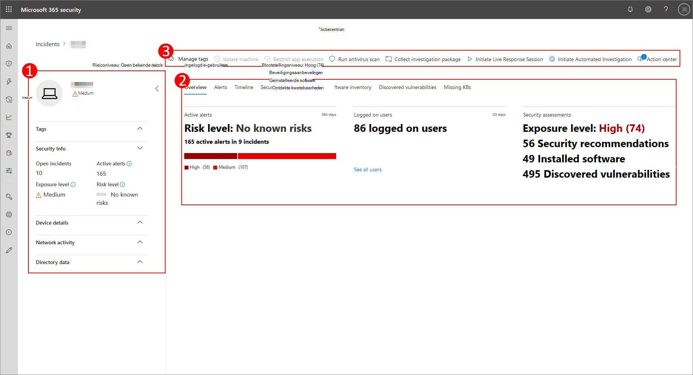
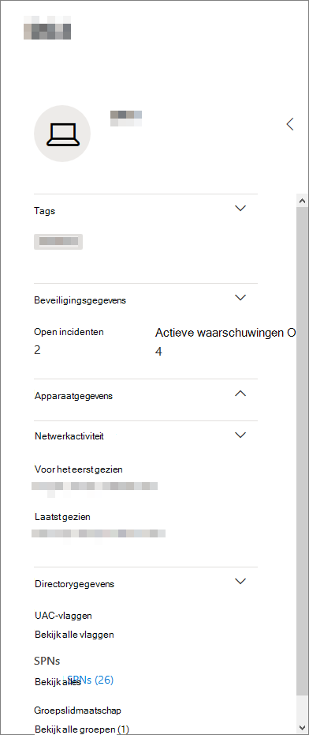
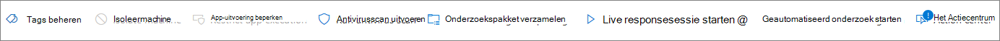
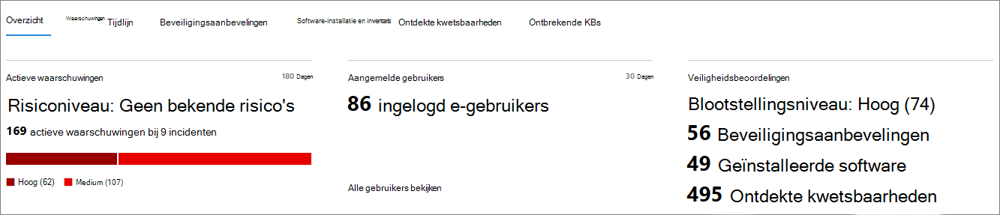
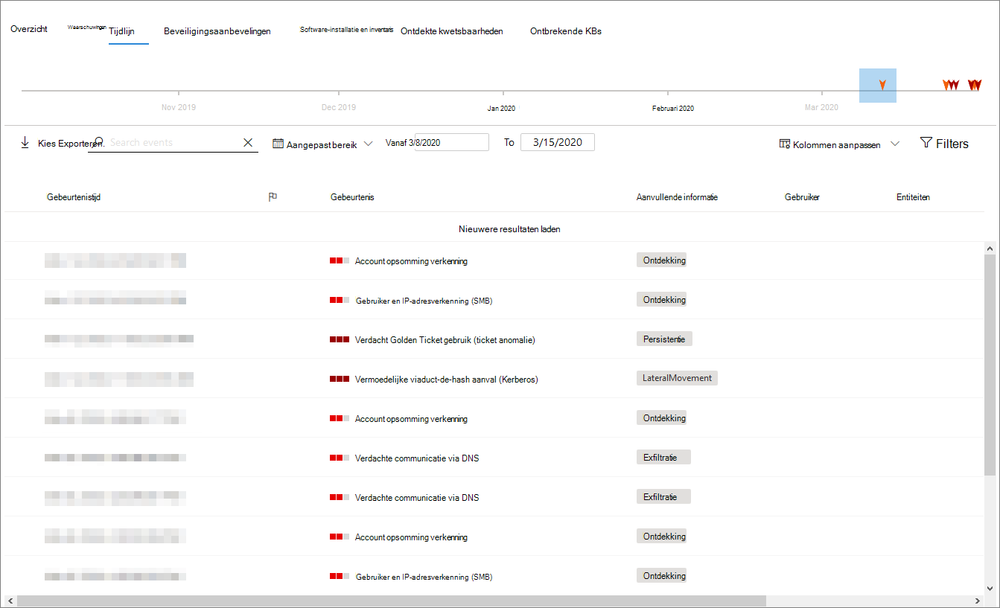
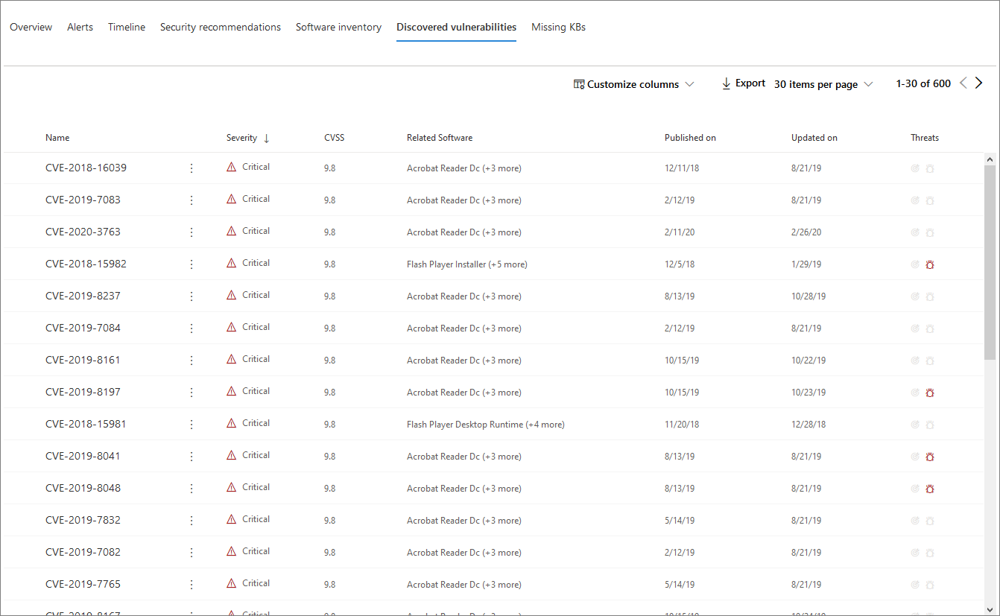

# Pagina Apparaatprofiel

[!INCLUDE [Microsoft 365 Defender rebranding](../includes/microsoft-defender.md)]

De beveiligingsportal van Microsoft 365 biedt u apparaatprofielpagina's, zodat u snel de status en status van apparaten in uw netwerk kunt beoordelen.

> [!IMPORTANT]
> De pagina apparaatprofiel ziet er mogelijk iets anders uit, afhankelijk van of het apparaat is geregistreerd bij Microsoft Defender voor Eindpunt, Microsoft Defender voor identiteit of beide.

Als het apparaat is geregistreerd bij Microsoft Defender voor Eindpunt, kunt u ook de profielpagina van het apparaat gebruiken om enkele algemene beveiligingstaken uit te voeren.

## Navigeren op de pagina apparaatprofiel

De profielpagina is onderverdeeld in verschillende brede secties.

De zijbalk (1) bevat basisgegevens over het apparaat.

Het gebied met de hoofdinhoud (2) bevat tabbladen waar u doorheen kunt schakelen om verschillende soorten informatie over het apparaat weer te geven.

Als het apparaat is geregistreerd bij Microsoft Defender voor Eindpunt, ziet u ook een lijst met antwoordacties (3). Met antwoordacties kunt u algemene beveiligingstaken uitvoeren.

## Zijbalk

Naast het hoofdinhoudsgebied van de pagina apparaatprofiel staat de zijbalk.

De zijbalk bevat de volledige naam en het blootstellingsniveau van het apparaat. Het bevat ook enkele belangrijke basisinformatie in kleine subsecties die u kunt openen of sluiten, zoals:

* **Tags:** alle Microsoft Defender voor eindpunten, Microsoft Defender voor identiteit of aangepaste tags die aan het apparaat zijn gekoppeld. Tags van Microsoft Defender voor identiteit kunnen niet worden bewerkt.
* **Beveiligingsgegevens:** open incidenten en actieve waarschuwingen. Apparaten die zijn geregistreerd in Microsoft Defender voor Eindpunt, worden ook blootstellingsniveau en risiconiveau weergegeven.

> [!TIP]
> Blootstellingsniveau heeft betrekking op hoeveel het apparaat voldoet aan beveiligingsaanbevelingen, terwijl het risiconiveau wordt berekend op basis van een aantal factoren, waaronder de typen en ernst van actieve waarschuwingen.

* **Apparaatgegevens:** domein, besturingssysteem, tijdstempel voor wanneer het apparaat voor het eerst werd gezien, IP-adressen, resources. Apparaten die zijn geregistreerd in Microsoft Defender voor Eindpunt, geven ook de status status weer. Apparaten die zijn geregistreerd bij Microsoft Defender voor identiteit, geven de SAM-naam en een tijdstempel weer voor wanneer het apparaat voor het eerst is gemaakt.
* **Netwerkactiviteit:** timestamps voor de eerste keer en de laatste keer dat het apparaat op het netwerk is gezien.
* **Adreslijstgegevens** ( alleen voor apparaten die zijn geregistreerd *bij Microsoft Defender voor* identiteit) - [UAC-vlaggen,](/windows/security/identity-protection/user-account-control/user-account-control-overview) [SPN's](/windows/win32/ad/service-principal-names)en groepslidmaatschap.

## Reactieacties

Reactieacties bieden een snelle manier om bedreigingen te beschermen en te analyseren.

> [!IMPORTANT]
> * [Antwoordacties](/windows/security/threat-protection/microsoft-defender-atp/respond-machine-alerts) zijn alleen beschikbaar als het apparaat is geregistreerd bij Microsoft Defender voor Eindpunt.
> * Apparaten die zijn geregistreerd in Microsoft Defender voor Eindpunt, kunnen verschillende aantallen antwoordacties weergeven, op basis van het besturingssysteem en versienummer van het apparaat.

Acties die beschikbaar zijn op de pagina apparaatprofiel zijn:

* **Tags beheren:** hiermee worden aangepaste tags bijgewerkt die u op dit apparaat hebt toegepast.
* **Apparaat isoleren:** isoleert het apparaat van het netwerk van uw organisatie terwijl het verbonden blijft met Microsoft Defender voor Eindpunt. U kunt ervoor kiezen outlook, Teams en Skype voor Bedrijven uit te voeren terwijl het apparaat is geïsoleerd, voor communicatiedoeleinden.
* **Actiecentrum:** de status van ingediende acties weergeven. Alleen beschikbaar als er al een andere actie is geselecteerd.
* **De uitvoering van apps beperken:** voorkomt dat toepassingen die niet door Microsoft zijn ondertekend, worden uitgevoerd.
* **Antivirusscan uitvoeren-** Updates Windows Defender Antivirusdefinities en voert onmiddellijk een antivirusscan uit. Kies tussen Snel scannen of Volledige scan.
* **Onderzoekspakket verzamelen:** verzamelt informatie over het apparaat. Wanneer het onderzoek is voltooid, kunt u het downloaden.
* **Live-antwoordsessie starten:** laadt een externe shell op het apparaat voor [uitgebreide beveiligingsonderzoeken.](/microsoft-365/security/defender-endpoint/live-response)
* **Automatisch onderzoek starten:** automatisch bedreigingen onderzoeken en [corrigeren.](../office-365-security/office-365-air.md) Hoewel u handmatig automatische onderzoeken kunt activeren om vanaf deze pagina uit te [voeren,](../../compliance/alert-policies.md?view=o365-worldwide#default-alert-policies) worden bepaalde waarschuwingsbeleidsregels automatisch uitgevoerd.
* **Actiecentrum:** geeft informatie weer over alle antwoordacties die momenteel worden uitgevoerd.

## Sectie Tabbladen

Met de tabbladen van het apparaatprofiel kunt u door een overzicht schakelen van beveiligingsdetails over het apparaat en tabellen met een lijst met waarschuwingen.

Apparaten die zijn geregistreerd in Microsoft Defender voor Eindpunt, bevatten ook tabbladen met een tijdlijn, een lijst met beveiligingsaanbevelingen, een softwarevoorraad, een lijst met gevonden beveiligingsproblemen en ontbrekende KBs (beveiligingsupdates).

### Tabblad Overzicht

Het standaardtabblad is **Overzicht.** Het biedt een beknopt overzicht van het belangrijkste beveiligings feit over het apparaat.

Hier kunt u de actieve waarschuwingen van het apparaat en alle gebruikers die momenteel zijn aangemeld, snel bekijken.

Als het apparaat is geregistreerd bij Microsoft Defender voor Eindpunt, ziet u ook het risiconiveau van het apparaat en alle beschikbare gegevens over beveiligingsbeoordelingen. In de beveiligingsbeoordelingen wordt het blootstellingsniveau van het apparaat beschreven, worden beveiligingsaanbevelingen gegeven en worden getroffen software vermeld en zijn beveiligingsproblemen ontdekt.

### Tabblad Waarschuwingen

Het **tabblad** Waarschuwingen bevat een lijst met waarschuwingen die zijn opgeheven op het apparaat, van zowel Microsoft Defender voor identiteit als Microsoft Defender voor Eindpunt.

U kunt het aantal weergegeven items aanpassen, evenals welke kolommen voor elk item worden weergegeven. Het standaardgedrag is om dertig items per pagina op te geven.

De kolommen op dit tabblad bevatten informatie over de ernst van de bedreiging die de waarschuwing heeft geactiveerd, evenals de status, de onderzoeksstatus en aan wie de waarschuwing is toegewezen.

De *kolom beïnvloede entiteiten* verwijst naar het apparaat (entiteit) waarvan u momenteel het profiel bekijkt, plus alle andere apparaten in uw netwerk die van invloed zijn.

Als u een item selecteert in deze lijst, wordt er een flyout geopend met nog meer informatie over de geselecteerde waarschuwing.

Deze lijst kan worden gefilterd op ernst, status of aan wie de waarschuwing is toegewezen.

### Tabblad Tijdlijn

Het **tabblad** Tijdlijn bevat een interactief, chronologisch diagram met alle gebeurtenissen die op het apparaat worden weergegeven. Door het gemarkeerde gebied van de grafiek naar links of rechts te verplaatsen, kunt u gebeurtenissen over verschillende perioden bekijken. U kunt ook een aangepast datumbereik kiezen in de vervolgkeuzelijst tussen de interactieve grafiek en de lijst met gebeurtenissen.

Onder de grafiek staat een lijst met gebeurtenissen voor het geselecteerde datumbereik.

Het aantal weergegeven items en de kolommen in de lijst kunnen beide worden aangepast. De standaardkolommen bevatten de gebeurtenistijd, actieve gebruiker, actietype, entiteiten (processen) en aanvullende informatie over de gebeurtenis.

Als u een item selecteert in deze lijst, wordt een flyout geopend waarin een grafiek met gebeurtenis-entiteiten wordt weergegeven, met de bovenliggende en onderliggende processen die betrokken zijn bij de gebeurtenis.

De lijst kan worden gefilterd op het specifieke type gebeurtenis. bijvoorbeeld registergebeurtenissen of Smart Screen-gebeurtenissen.

De lijst kan ook worden geëxporteerd naar een CSV-bestand, om deze te downloaden. Hoewel het bestand niet wordt beperkt door het aantal gebeurtenissen, is het maximale tijdsbereik dat u kunt kiezen om te exporteren zeven dagen.

### Tabblad Beveiligingsaanbevelingen

Het **tabblad Beveiligingsaanbevelingen** bevat acties die u kunt uitvoeren om het apparaat te beveiligen. Als u een item in deze lijst selecteert, wordt een flyout geopend waarin u instructies kunt krijgen over het toepassen van de aanbeveling.

Net als bij de vorige tabbladen kan het aantal items dat per pagina wordt weergegeven en welke kolommen zichtbaar zijn, worden aangepast.

De standaardweergave bevat kolommen met details over de beveiligingszwakheden die zijn aangepakt, de bijbehorende bedreiging, het gerelateerde onderdeel of de software die door de bedreiging wordt beïnvloed, en meer. Items kunnen worden gefilterd op de status van de aanbeveling.

### Software-inventaris

Op **het tabblad Softwarevoorraad** wordt software weergegeven die op het apparaat is geïnstalleerd.

In de standaardweergave worden de softwareleverancier, het geïnstalleerde versienummer, het aantal bekende softwarezwaktes, bedreigingsinzichten, productcode en tags weergegeven. Het aantal weergegeven items en welke kolommen worden weergegeven, kunnen beide worden aangepast.

Als u een item selecteert in deze lijst, wordt een flyout geopend met meer informatie over de geselecteerde software, evenals het pad en de tijdstempel voor de laatste keer dat de software is gevonden.

Deze lijst kan worden gefilterd op productcode.

### Tabblad Gevonden beveiligingslekken

Het **tabblad Gevonden beveiligingslekken** bevat algemene beveiligingslekken en exploits (CVE's) die van invloed kunnen zijn op het apparaat.

De standaardweergave bevat de ernst van de CVE, de Common Vulnerability Score (CVS), de software die betrekking heeft op de CVE, wanneer de CVE is gepubliceerd, wanneer de CVE voor het laatst is bijgewerkt, en bedreigingen die zijn gekoppeld aan de CVE.

Net als bij de vorige tabbladen kan het aantal items dat wordt weergegeven en welke kolommen zichtbaar zijn, worden aangepast.

Als u een item selecteert in deze lijst, wordt een fly-out geopend met een beschrijving van de CVE.

### Ontbrekende KBs

Het **tabblad Ontbrekende KBs** bevat alle Microsoft-updates die nog moeten worden toegepast op het apparaat. De KBs in kwestie zijn [Knowledge Base-artikelen](https://support.microsoft.com/help/242450/how-to-query-the-microsoft-knowledge-base-by-using-keywords-and-query) waarin deze updates worden beschreven. bijvoorbeeld [KB4551762](https://support.microsoft.com/help/4551762/windows-10-update-kb4551762).

In de standaardweergave wordt het bulletin weergegeven met de updates, de besturingssysteemversie, de betreffende producten, de geadresseerde CVE's, het KB-nummer en de tags.

Het aantal items dat per pagina wordt weergegeven en welke kolommen worden weergegeven, kan worden aangepast.

Als u een item selecteert, wordt een flyout geopend die naar de update wordt koppelingen.

## Verwante onderwerpen

* [Overzicht van Microsoft 365 Defender](microsoft-365-defender.md)
* [Microsoft 365 Defender inschakelen](m365d-enable.md)
* [Entiteiten op apparaten onderzoeken met livereactie](../defender-endpoint/live-response.md)
* [Automatisch onderzoek en antwoord (AIR) in Office 365](../office-365-security/office-365-air.md)
