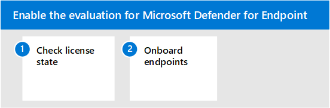

# Microsoft Defender voor endpoint-evaluatieomgeving inschakelen

In dit artikel wordt u begeleid bij de stappen voor het instellen van de evaluatieomgeving voor Microsoft Defender voor Eindpunt met behulp van productieapparaten. 

>[!TIP]
>Microsoft Defender voor Eindpunt wordt ook geleverd met een evaluatielaboratorium voor in-product, waar u vooraf geconfigureerde apparaten kunt toevoegen en simulaties kunt uitvoeren om de mogelijkheden van het platform te evalueren. Het lab wordt geleverd met een vereenvoudigde set-upervaring die u snel de waarde van Microsoft Defender voor Enpdoint kan laten zien, inclusief richtlijnen voor veel functies, zoals geavanceerde zoek- en bedreigingsanalyses. Zie Mogelijkheden evalueren voor [meer informatie.](/defender-endpoint/evaluation-lab.md)   Het belangrijkste verschil tussen de richtlijnen in dit artikel en het evaluatielaboratorium is dat in de evaluatieomgeving productieapparaten worden gebruikt, terwijl in het evaluatielaboratorium niet-productieapparaten worden gebruikt. 

Gebruik de volgende stappen om de evaluatie voor Microsoft Defender voor Eindpunt in te stellen.

- [Stap 1. Licentiestaat controleren](#step-1-check-license-state)
- [Stap 2. Eindpunten aan boord](#step-2-onboard-endpoints-using-any-of-the-supported-management-tools)

## Stap 1. Licentiestaat controleren

U moet eerst de licentiestaat controleren om te controleren of deze correct is ingericht. U kunt dit doen via het beheercentrum of via de **Microsoft Azure portal.**

1. Als u uw licenties wilt bekijken, gaat u naar de **Microsoft Azure portal** en gaat u naar de [Microsoft Azure portallicentiesectie.](https://portal.azure.com/#blade/Microsoft_AAD_IAM/LicensesMenuBlade/Products)

   

1. U kunt ook in het beheercentrum naar  >  **Factureringsabonnementen gaan.**

    Op het scherm ziet u alle inrichtende licenties en de huidige **status.**

    

## Stap 2. Onboard-eindpunten met behulp van een van de ondersteunde beheerhulpmiddelen

Nadat u hebt gecontroleerd of de licentiestaat correct is ingericht, kunt u beginnen met het onboarden van apparaten voor de service. 

Voor het evalueren van Microsoft Defender voor Eindpunt raden we u aan een aantal apparaten Windows 10 om de evaluatie uit te voeren op. 

Het [implementatieonderwerp](../defender-endpoint/deployment-strategy.md) Plannen bevat een overzicht van de algemene stappen die u moet ondernemen om Defender voor Eindpunt te implementeren.  

Bekijk deze video voor een kort overzicht van het onboardingproces en lees meer over de beschikbare hulpprogramma's en methoden.

> [!VIDEO https://www.microsoft.com/videoplayer/embed/RE4bGqr]

### Opties voor onboarding-hulpprogramma's

In de volgende tabel ziet u de beschikbare hulpprogramma's op basis van het eindpunt dat u nodig hebt om aan boord te gaan.

Eindpunt | Opties voor hulpprogramma's
:---|:---
**Windows** | [Lokaal script (maximaal 10 apparaten)](../defender-endpoint/configure-endpoints-script.md) [,](../defender-endpoint/configure-endpoints-gp.md)Groepsbeleid , [Microsoft Endpoint Manager/ Mobile Device Manager](../defender-endpoint/configure-endpoints-mdm.md), Microsoft Endpoint Configuration Manager , [VDI-scripts](../defender-endpoint/configure-endpoints-vdi.md), [Integratie met Azure Defender](../defender-endpoint/configure-server-endpoints.md#integration-with-azure-defender) 
**macOS** | [Lokale scripts](../defender-endpoint/mac-install-manually.md), [Microsoft Endpoint Manager](../defender-endpoint/mac-install-with-intune.md), [JAMF Pro](../defender-endpoint/mac-install-with-jamf.md), Mobile [Device Management](../defender-endpoint/mac-install-with-other-mdm.md)
**Linux Server** | [Lokaal script](../defender-endpoint/linux-install-manually.md),  [Pop ,](../defender-endpoint/linux-install-with-puppet.md)  [Ansible](../defender-endpoint/linux-install-with-ansible.md)
**iOS** | [App-gebaseerde](../defender-endpoint/ios-install.md)
**Android** | [Microsoft Endpoint Manager](../defender-endpoint/android-intune.md)

## Volgende stap
[De pilot voor Microsoft Defender voor Eindpunt instellen](eval-defender-endpoint-pilot.md)
 
Terug naar het overzicht voor [Microsoft Defender evalueren voor eindpunt](eval-defender-endpoint-overview.md)

Ga terug naar het overzicht voor [Evalueren en Microsoft 365 Defender](eval-overview.md)