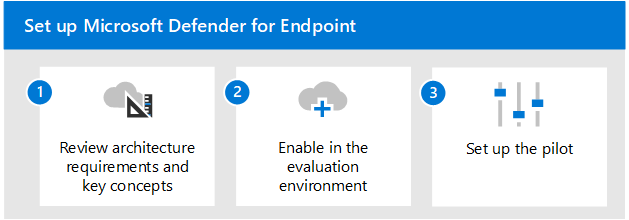

# Overzicht van Microsoft Defender voor eindpunt evaluerenEvaluate Microsoft Defender for Endpoint overview

**Van toepassing op:****Applies to:**

- Microsoft 365 DefenderMicrosoft 365 Defender

In dit artikel wordt het proces beschreven voor het inschakelen en piloten van Microsoft Defender voor Eindpunt.This article outlines the process to enable and pilot Microsoft Defender for Endpoint. Voordat u dit proces start, moet u  het algemene proces voor het evalueren van Microsoft 365 Defender hebben bekeken en de Microsoft 365 Defender [evaluatieomgeving hebben gemaakt.](eval-create-eval-environment.md)Before starting this process, be sure you've reviewed the overall process for [evaluating Microsoft 365 Defender](eval-overview.md) and you have [created the Microsoft 365 Defender evaluation environment](eval-create-eval-environment.md). 
 

Gebruik de volgende stappen om Microsoft Defender voor Eindpunt in te stellen en te piloten.Use the following steps to enable and pilot Microsoft Defender for Endpoint.

In de volgende tabel worden de stappen in de afbeelding beschreven.The following table describes the steps in the illustration.

 |StapStep   |OmschrijvingDescription
|---------|---------|
| [Stap 1. Architectuurvereisten en belangrijke concepten bekijkenStep 1. Review architecture requirements and key concepts](eval-defender-endpoint-architecture.md)    | Meer informatie over de Architectuur van Defender voor eindpunten en de mogelijkheden die voor u beschikbaar zijn.Understand the Defender for Endpoint architecture and the capabilities available to you.       |
|[Stap 2. De evaluatieomgeving inschakelenStep 2. Enable the evaluation environment](eval-defender-office-365-enable-eval.md)     |   Volg de stappen om de evaluatieomgeving in te stellen.Follow the steps to setup the evaluation environment.      |
|[Stap 3. De pilot instellen Step 3. Set up the pilot ](eval-defender-office-365-pilot.md)    |    Controleer uw testgroep, voer simulaties uit en vertrouwd raken met belangrijke functies en dashboards.Verify your pilot group, run simulations, and become familiar with key features and dashboards.     |

