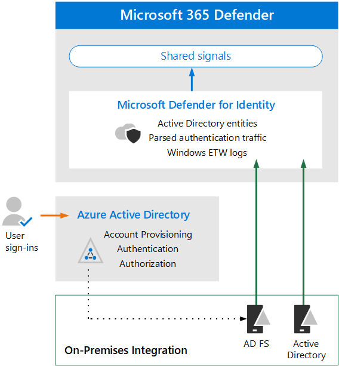

# Architectuurvereisten en belangrijke concepten voor Microsoft Defender voor identiteit bekijken

**Van toepassing op:**
- Microsoft 365 Defender

Dit artikel is [stap 1 van 3](eval-defender-identity-overview.md) in het proces voor het instellen van de evaluatieomgeving voor Microsoft Defender voor identiteit. Zie het [overzichtsartikel](eval-defender-identity-overview.md)voor meer informatie over dit proces.

Voordat u Microsoft Defender voor identiteit inschakelen, moet u de architectuur begrijpen en aan de vereisten voldoen.

Microsoft Defender voor identiteit gebruikt machine learning en gedragsanalyse om aanvallen in uw on-premises netwerk te identificeren, samen met het detecteren en proactief voorkomen van aanmeldingsrisico's van gebruikers die zijn gekoppeld aan cloudidentiteiten. Zie Wat [is Microsoft Defender voor identiteit? voor meer informatie.](/defender-for-identity/what-is)

Defender voor identiteit beschermt uw on-premises Active Directory-gebruikers en/of gebruikers die zijn gesynchroniseerd met uw Azure Active Directory (Azure AD). Zie [Azure AD Identity Protection (Azure AD Identity Protection)](/azure/active-directory/identity-protection/overview-identity-protection)als u een omgeving wilt beveiligen die alleen bestaat uit Azure AD-gebruikers.

## De architectuur begrijpen

In het volgende diagram ziet u de basislijnarchitectuur voor Defender voor identiteit. 

In deze afbeelding:
- Sensoren die zijn geïnstalleerd op AD-domeincontrollers parseren logboeken en netwerkverkeer en verzenden deze naar Microsoft Defender voor identiteit voor analyse en rapportage.
-  Sensoren kunnen ook Active Directory Federation Services (AD FS) parseren wanneer Azure AD is geconfigureerd voor het gebruik van federatief verificatie (stippellijn in afbeelding). 
- Microsoft Defender voor identiteit deelt signalen naar Microsoft 365 Defender voor uitgebreide detectie en respons (XDR).

Defender for Identity-sensoren kunnen rechtstreeks op de volgende servers worden geïnstalleerd:

- Domeincontrollers: Met de sensor wordt het verkeer van domeincontrollers rechtstreeks bewaakt, zonder dat er een speciale server of poortspiegeling moet worden ingesteld.
- AD FS: Met de sensor worden netwerkverkeers- en verificatiegebeurtenissen rechtstreeks bewaakt.

Zie Microsoft [Defender](/defender-for-identity/architecture)voor identiteitsarchitectuur voor meer informatie over de architectuur van Defender voor identiteit, inclusief integratie met Cloud App Security.

## Belangrijke concepten begrijpen

In de volgende tabel worden belangrijke concepten geïdentificeerd die belangrijk zijn om te begrijpen bij het evalueren, configureren en implementeren van Microsoft Defender voor identiteit.

|Concept  |Omschrijving |Meer informatie  |
|---------|---------|---------|
| Bewaakte activiteiten | Defender voor identiteit bewaakt signalen die binnen uw organisatie worden gegenereerd om verdachte of schadelijke activiteiten te detecteren en helpt u de geldigheid van elke potentiële bedreiging te bepalen, zodat u effectief kunt triagen en reageren.  |  [Activiteiten van Microsoft Defender voor identiteitsmonitoring](/defender-for-identity/monitored-activities)       |
| Beveiligingswaarschuwingen    | In beveiligingswaarschuwingen voor Defender voor identiteit worden de verdachte activiteiten uitgelegd die zijn gedetecteerd door sensoren in uw netwerk, samen met de spelers en computers die betrokken zijn bij elke bedreiging.   | [Waarschuwingen voor identiteitsbeveiliging van Microsoft Defender](/defender-for-identity/suspicious-activity-guide?tabs=external)    |
| Entiteitsprofielen    | Entiteitsprofielen bieden een uitgebreid diepgaand onderzoek naar gebruikers, computers, apparaten en bronnen, samen met hun toegangsgeschiedenis.   | [Entiteitsprofielen begrijpen](/defender-for-identity/entity-profiles)  |
| Zijbewegingspaden    | Een belangrijk onderdeel van MDI-beveiligingsinzichten is het identificeren van zijbewegingenpaden waarin een aanvaller niet-gevoelige accounts gebruikt om toegang te krijgen tot gevoelige accounts of machines in uw netwerk.  | [Microsoft Defender for Identity Lateral Movement Paths (LLMPs)](/defender-for-identity/use-case-lateral-movement-path)  |
| Netwerknaamresolutie    |  Netwerknaamresolutie (NNR) is een onderdeel van de MDI-functionaliteit waarmee activiteiten worden vastleggen op basis van netwerkverkeer, Windows-gebeurtenissen, ETW, enzovoort en deze onbewerkte gegevens correleren met de relevante computers die betrokken zijn bij elke activiteit.       | [Wat is netwerknaamresolutie?](/defender-for-identity/nnr-policy)      |
| Rapporten    | Met Defender voor identiteitsrapporten kunt u rapporten met systeem- en entiteitstatusgegevens plannen of direct genereren en downloaden.  U kunt rapporten maken over de systeemtoestand, beveiligingswaarschuwingen en mogelijke laterale verplaatsingspaden die zijn gedetecteerd in uw omgeving.   | [Microsoft Defender voor identiteitsrapporten ](/defender-for-identity/reports)       |
| Rollengroepen    | Defender for Identity biedt op rollen gebaseerde groepen en gedelegeerde toegang om gegevens te beschermen op basis van de specifieke beveiligings- en compliancebehoeften van uw organisatie, waaronder Beheerders, Gebruikers en Kijkers.        |  [Microsoft Defender for Identity-rolgroepen](/defender-for-identity/role-groups)       |
| Beheerportal    |  Naast het Microsoft 365 beveiligingscentrum, wordt de defender voor identiteitsportal gebruikt om verdachte activiteiten te controleren en te beantwoorden.      | [Werken met de Microsoft Defender for Identity-portal](/defender-for-identity/workspace-portal)        |
| Microsoft Cloud App Security integratie   | Microsoft Cloud App Security is geïntegreerd met Microsoft Defender voor identiteit om gedragsanalyse van gebruikersentiteit (UEBA) te bieden in een hybride omgeving, zowel in de cloud-app als in de on-premises omgeving   | Microsoft Defender voor identiteitsintegratie  |
| | | |

## Vereisten controleren

Voor Defender voor identiteit is enige vereiste hoeveelheid werk vereist om ervoor te zorgen dat uw on-premises identiteits- en netwerkonderdelen aan minimale vereisten voldoen. Gebruik dit artikel als controlelijst om ervoor te zorgen dat uw omgeving gereed is: [Vereisten voor Microsoft Defender voor identiteit.](/defender-for-identity/prerequisites)

## Volgende stappen

Stap 2 van 3: [De evaluatieomgeving Defender voor identiteit inschakelen](eval-defender-identity-enable-eval.md)

Ga terug naar het overzicht voor [Microsoft Defender evalueren voor identiteit](eval-defender-identity-overview.md)

Ga terug naar het overzicht voor [Evalueren en Microsoft 365 Defender](eval-overview.md) 