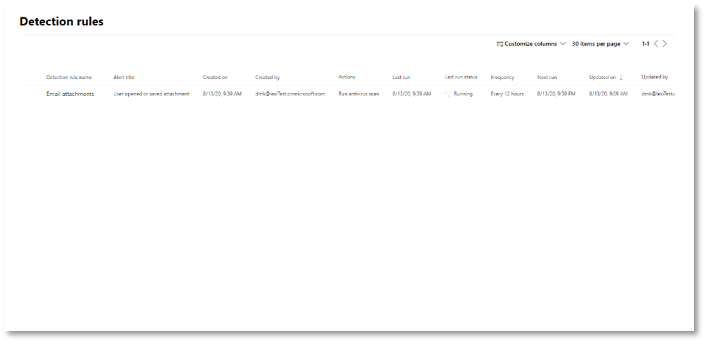

# <a name="try-microsoft-365-defender-incident-response-capabilities-in-a-pilot-environment"></a><span data-ttu-id="6b890-104">Probeer Microsoft 365 Defender mogelijkheden voor incidentrespons in een testomgeving</span><span class="sxs-lookup"><span data-stu-id="6b890-104">Try Microsoft 365 Defender incident response capabilities in a pilot environment</span></span>

<span data-ttu-id="6b890-105">**Van toepassing op:**</span><span class="sxs-lookup"><span data-stu-id="6b890-105">**Applies to:**</span></span>
- <span data-ttu-id="6b890-106">Microsoft 365 Defender</span><span class="sxs-lookup"><span data-stu-id="6b890-106">Microsoft 365 Defender</span></span>

<span data-ttu-id="6b890-107">Dit artikel is [stap 2 van 2](eval-defender-investigate-respond.md) in het proces van het uitvoeren van een onderzoek en de reactie van een incident in Microsoft 365 Defender met behulp van een testomgeving.</span><span class="sxs-lookup"><span data-stu-id="6b890-107">This article is [Step 2 of 2](eval-defender-investigate-respond.md) in the process of performing an investigation and response of an incident in Microsoft 365 Defender using a pilot environment.</span></span> <span data-ttu-id="6b890-108">Zie het [overzichtsartikel](eval-defender-investigate-respond.md) voor meer informatie over dit proces.</span><span class="sxs-lookup"><span data-stu-id="6b890-108">For more information about this process, see the [overview](eval-defender-investigate-respond.md) article.</span></span>

<span data-ttu-id="6b890-109">Nadat u een [incidentreactie voor](eval-defender-investigate-respond-simulate-attack.md)een gesimuleerde aanval hebt uitgevoerd, zijn hier enkele Microsoft 365 Defender mogelijkheden om te verkennen:</span><span class="sxs-lookup"><span data-stu-id="6b890-109">Once you have performed an [incident response for a simulated attack](eval-defender-investigate-respond-simulate-attack.md), here are some Microsoft 365 Defender capabilities to explore:</span></span>

|<span data-ttu-id="6b890-110">Mogelijkheid</span><span class="sxs-lookup"><span data-stu-id="6b890-110">Capability</span></span> |<span data-ttu-id="6b890-111">Beschrijving</span><span class="sxs-lookup"><span data-stu-id="6b890-111">Description</span></span> |
|:-------|:-----|
| [<span data-ttu-id="6b890-112">Prioriteit geven aan incidenten</span><span class="sxs-lookup"><span data-stu-id="6b890-112">Prioritize incidents</span></span>](#prioritize-incidents) | <span data-ttu-id="6b890-113">Gebruik het filteren en sorteren van de incidentenwachtrij om te bepalen welke incidenten u vervolgens moet adresseren.</span><span class="sxs-lookup"><span data-stu-id="6b890-113">Use filtering and sorting of the incidents queue to determine which incidents to address next.</span></span> |
| [<span data-ttu-id="6b890-114">Incidenten beheren</span><span class="sxs-lookup"><span data-stu-id="6b890-114">Manage incidents</span></span>](#manage-incidents) | <span data-ttu-id="6b890-115">Wijzig incidenteigenschappen om ervoor te zorgen dat de toewijzing correct is, voeg tags en opmerkingen toe en om een incident op te lossen.</span><span class="sxs-lookup"><span data-stu-id="6b890-115">Modify incident properties to ensure correct assignment, add tags and comments, and to resolve an incident.</span></span> |
| [<span data-ttu-id="6b890-116">Geautomatiseerd onderzoek en reactie</span><span class="sxs-lookup"><span data-stu-id="6b890-116">Automated investigation and response</span></span>](#examine-automated-investigation-and-response-with-the-action-center) | <span data-ttu-id="6b890-117">Geautomatiseerde onderzoeks- en antwoordmogelijkheden (AIR) die uw beveiligingsteam kunnen helpen om bedreigingen efficiënter en effectiever aan te pakken.</span><span class="sxs-lookup"><span data-stu-id="6b890-117">Automated investigation and response (AIR) capabilities that can help your security operations team address threats more efficiently and effectively.</span></span> <span data-ttu-id="6b890-118">Het actiecentrum is een 'enkel deelvenster met glas' voor incident- en waarschuwingstaken, zoals het goedkeuren van in behandeling zijnde herstelacties.</span><span class="sxs-lookup"><span data-stu-id="6b890-118">The Action center is a "single pane of glass" experience for incident and alert tasks such as approving pending remediation actions.</span></span> |
| [<span data-ttu-id="6b890-119">Geavanceerd opsporen</span><span class="sxs-lookup"><span data-stu-id="6b890-119">Advanced hunting</span></span>](#advanced-hunting) | <span data-ttu-id="6b890-120">Een op query's gebaseerd hulpprogramma voor het zoeken naar bedreigingen waarmee u gebeurtenissen in uw netwerk proactief kunt controleren en bedreigingsindicatoren en entiteiten kunt vinden.</span><span class="sxs-lookup"><span data-stu-id="6b890-120">A query-based threat-hunting tool that lets you proactively inspect events in your network and locate threat indicators and entities.</span></span> <span data-ttu-id="6b890-121">U gebruikt ook geavanceerde jacht tijdens het onderzoeken en herstellen van een incident.</span><span class="sxs-lookup"><span data-stu-id="6b890-121">You also use advanced hunting during the investigation and remediation of an incident.</span></span> |
||||

## <a name="prioritize-incidents"></a><span data-ttu-id="6b890-122">Prioriteit geven aan incidenten</span><span class="sxs-lookup"><span data-stu-id="6b890-122">Prioritize incidents</span></span>

<span data-ttu-id="6b890-123">U komt bij de incidentwachtrij van **Incidenten & waarschuwingen > Incidenten** op de snelle start van de Microsoft 365 Defender portal [(security.microsoft.com).](https://security.microsoft.com)</span><span class="sxs-lookup"><span data-stu-id="6b890-123">You get to the incident queue from **Incidents & alerts > Incidents** on the quick launch of the Microsoft 365 Defender portal ([security.microsoft.com](https://security.microsoft.com)).</span></span> <span data-ttu-id="6b890-124">Hier is een voorbeeld.</span><span class="sxs-lookup"><span data-stu-id="6b890-124">Here's an example.</span></span>

:::image type="content" source="../../media/incidents-queue/incidents-ss-incidents.png" alt-text="Voorbeeld van de incidentwachtrij":::

<span data-ttu-id="6b890-126">In **de sectie Meest recente incidenten en waarschuwingen** ziet u een grafiek van het aantal ontvangen waarschuwingen en incidenten die in de afgelopen 24 uur zijn gemaakt.</span><span class="sxs-lookup"><span data-stu-id="6b890-126">The **Most recent incidents and alerts** section shows a graph of the number of alerts received and incidents created in the last 24 hours.</span></span>

<span data-ttu-id="6b890-127">Als u de lijst met incidenten wilt bekijken en prioriteit wilt geven aan het belang ervan voor toewijzing en onderzoek, kunt u het volgende doen:</span><span class="sxs-lookup"><span data-stu-id="6b890-127">To examine the list of incidents and prioritize their importance for assignment and investigation, you can:</span></span> 

- <span data-ttu-id="6b890-128">Configureer aanpasbare kolommen (selecteer **Kolommen kiezen)** om u inzicht te geven in de verschillende kenmerken van het incident of de beïnvloede entiteiten.</span><span class="sxs-lookup"><span data-stu-id="6b890-128">Configure customizable columns (select **Choose columns**) to give you visibility into different characteristics of the incident or the impacted entities.</span></span> <span data-ttu-id="6b890-129">Op deze manier kunt u een weloverwogen beslissing nemen over de prioriteit van incidenten voor analyse.</span><span class="sxs-lookup"><span data-stu-id="6b890-129">This helps you make an informed decision regarding the prioritization of incidents for analysis.</span></span>

- <span data-ttu-id="6b890-130">Gebruik filtering om de focus te richten op een specifiek scenario of een bepaalde bedreiging.</span><span class="sxs-lookup"><span data-stu-id="6b890-130">Use filtering to focus on a specific scenario or threat.</span></span> <span data-ttu-id="6b890-131">Door filters toe te passen op de incidentenwachtrij, kunt u bepalen welke incidenten direct aandacht vereisen.</span><span class="sxs-lookup"><span data-stu-id="6b890-131">Applying filters on the incident queue can help determine which incidents require immediate attention.</span></span> 

<span data-ttu-id="6b890-132">Selecteer filters in de standaardwachtrij voor incidenten **om** een deelvenster **Filters** te zien, waaruit u een specifieke set incidenten kunt opgeven.</span><span class="sxs-lookup"><span data-stu-id="6b890-132">From the default incident queue, select **Filters** to see a **Filters** pane, from which you can specify a specific set of incidents.</span></span> <span data-ttu-id="6b890-133">Hier volgt een voorbeeld.</span><span class="sxs-lookup"><span data-stu-id="6b890-133">Here is an example.</span></span>

:::image type="content" source="../../media/incidents-queue/incidents-ss-incidents-filters.png" alt-text="Voorbeeld van het filtervenster voor de incidentwachtrij":::

<span data-ttu-id="6b890-135">Zie Prioriteit geven aan incidenten voor meer [informatie.](incident-queue.md)</span><span class="sxs-lookup"><span data-stu-id="6b890-135">For more information, see [Prioritize incidents](incident-queue.md).</span></span>

## <a name="manage-incidents"></a><span data-ttu-id="6b890-136">Incidenten beheren</span><span class="sxs-lookup"><span data-stu-id="6b890-136">Manage incidents</span></span>

<span data-ttu-id="6b890-137">U kunt incidenten beheren vanuit het deelvenster **Incident beheren** voor een incident.</span><span class="sxs-lookup"><span data-stu-id="6b890-137">You can manage incidents from the **Manage incident** pane for an incident.</span></span> <span data-ttu-id="6b890-138">Hier is een voorbeeld.</span><span class="sxs-lookup"><span data-stu-id="6b890-138">Here's an example.</span></span>

:::image type="content" source="../../media/incidents-queue/incidents-ss-incidents-manage.png" alt-text="Voorbeeld van het deelvenster Incident beheren van een incident":::

<span data-ttu-id="6b890-140">U kunt dit deelvenster weergeven via de koppeling **Incident beheren** op het volgende:</span><span class="sxs-lookup"><span data-stu-id="6b890-140">You can display this pane from the **Manage incident** link on the:</span></span>

- <span data-ttu-id="6b890-141">Deelvenster Eigenschappen van een incident in de incidentwachtrij.</span><span class="sxs-lookup"><span data-stu-id="6b890-141">Properties pane of an incident in the incident queue.</span></span>
- <span data-ttu-id="6b890-142">**Overzichtspagina** van een incident.</span><span class="sxs-lookup"><span data-stu-id="6b890-142">**Summary** page of an incident.</span></span>

<span data-ttu-id="6b890-143">Dit zijn de manieren waarop u uw incidenten kunt beheren:</span><span class="sxs-lookup"><span data-stu-id="6b890-143">Here are the ways you can manage your incidents:</span></span>

- <span data-ttu-id="6b890-144">De naam van het incident bewerken</span><span class="sxs-lookup"><span data-stu-id="6b890-144">Edit the incident name</span></span>

  <span data-ttu-id="6b890-145">Wijzig de niet-automatisch toegewezen naam op basis van de best practices van uw beveiligingsteam.</span><span class="sxs-lookup"><span data-stu-id="6b890-145">Change the utomatically assigned name based on your security team best practices.</span></span>
  
- <span data-ttu-id="6b890-146">Incidentlabels toevoegen</span><span class="sxs-lookup"><span data-stu-id="6b890-146">Add incident tags</span></span>

  <span data-ttu-id="6b890-147">Voeg tags toe die uw beveiligingsteam gebruikt om incidenten te classificeren, die later kunnen worden gefilterd.</span><span class="sxs-lookup"><span data-stu-id="6b890-147">Add tags that your security team uses to classify incidents, which can be later filtered.</span></span>
  
- <span data-ttu-id="6b890-148">Het incident aan uzelf toewijzen</span><span class="sxs-lookup"><span data-stu-id="6b890-148">Assign the incident to yourself</span></span>

  <span data-ttu-id="6b890-149">Wijs deze toe aan de naam van uw gebruikersaccount, die later kan worden gefilterd.</span><span class="sxs-lookup"><span data-stu-id="6b890-149">Assign it to your user account name, which can be later filtered.</span></span>
  
- <span data-ttu-id="6b890-150">Een incident oplossen</span><span class="sxs-lookup"><span data-stu-id="6b890-150">Resolve an incident</span></span>

  <span data-ttu-id="6b890-151">Sluit het incident nadat het is gesaneerd.</span><span class="sxs-lookup"><span data-stu-id="6b890-151">Close the incident after it has been remediated.</span></span>
  
- <span data-ttu-id="6b890-152">De classificatie en bepaling ervan instellen</span><span class="sxs-lookup"><span data-stu-id="6b890-152">Set its classification and determination</span></span>

  <span data-ttu-id="6b890-153">Classificeer en selecteer het type bedreiging wanneer u een incident hebt opgelost.</span><span class="sxs-lookup"><span data-stu-id="6b890-153">Classify and select the threat type when you resolve an incident.</span></span>
  
- <span data-ttu-id="6b890-154">Opmerkingen toevoegen</span><span class="sxs-lookup"><span data-stu-id="6b890-154">Add comments</span></span>

  <span data-ttu-id="6b890-155">Gebruik opmerkingen voor voortgang, notities of andere informatie op basis van best practices van uw beveiligingsteam.</span><span class="sxs-lookup"><span data-stu-id="6b890-155">Use comments for progress, notes, or other information based on your security team best practices.</span></span> <span data-ttu-id="6b890-156">De volledige opmerkingsgeschiedenis is beschikbaar via de **optie Opmerkingen en geschiedenis** op de detailspagina van een incident.</span><span class="sxs-lookup"><span data-stu-id="6b890-156">The full comment history is available from the **Comments and history** option in the details page of an incident.</span></span>

<span data-ttu-id="6b890-157">Zie Incidenten beheren voor meer [informatie.](manage-incidents.md)</span><span class="sxs-lookup"><span data-stu-id="6b890-157">For more information, see [Manage incidents](manage-incidents.md).</span></span>

## <a name="examine-automated-investigation-and-response-with-the-action-center"></a><span data-ttu-id="6b890-158">Geautomatiseerde onderzoeken en antwoorden onderzoeken met het Actiecentrum</span><span class="sxs-lookup"><span data-stu-id="6b890-158">Examine automated investigation and response with the Action center</span></span>

<span data-ttu-id="6b890-159">Afhankelijk van hoe geautomatiseerde onderzoeks- en antwoordmogelijkheden voor uw organisatie zijn geconfigureerd, worden herstelacties automatisch of alleen uitgevoerd na goedkeuring door uw beveiligingsteam.</span><span class="sxs-lookup"><span data-stu-id="6b890-159">Depending on how automated investigation and response capabilities are configured for your organization, remediation actions are taken automatically or only upon approval by your security operations team.</span></span> <span data-ttu-id="6b890-160">Alle acties, in behandeling of voltooid, [](m365d-action-center.md)worden weergegeven in het Actiecentrum, waarin in behandeling zijnde en voltooide herstelacties voor uw apparaten, e-mail & samenwerkingsinhoud en identiteiten op één locatie worden vermeld.</span><span class="sxs-lookup"><span data-stu-id="6b890-160">All actions, whether pending or completed, are listed in the [Action center](m365d-action-center.md), which lists pending and completed remediation actions for your devices, email & collaboration content, and identities in one location.</span></span>

<span data-ttu-id="6b890-161">Hier is een voorbeeld.</span><span class="sxs-lookup"><span data-stu-id="6b890-161">Here's an example.</span></span>

:::image type="content" source="../../media/m3d-action-center-unified.png" alt-text="Unified Action center in Microsoft 365 Defender":::

<span data-ttu-id="6b890-163">In het actiecentrum kunt u acties in behandeling selecteren en deze vervolgens goedkeuren of weigeren in het deelvenster Flyout.</span><span class="sxs-lookup"><span data-stu-id="6b890-163">From the Action center, you can select pending actions and then approve or reject them in the flyout pane.</span></span> <span data-ttu-id="6b890-164">Hier is een voorbeeld.</span><span class="sxs-lookup"><span data-stu-id="6b890-164">Here's an example.</span></span>

:::image type="content" source="../../media/air-actioncenter-itemselected.png" alt-text="Een actie goedkeuren of weigeren":::

<span data-ttu-id="6b890-166">Hangende acties zo snel mogelijk goedkeuren (of weigeren), zodat uw geautomatiseerde onderzoeken tijdig kunnen worden uitgevoerd en voltooid.</span><span class="sxs-lookup"><span data-stu-id="6b890-166">Approve (or reject) pending actions as soon as possible so that your automated investigations can proceed and complete in a timely manner.</span></span>

<span data-ttu-id="6b890-167">Zie Geautomatiseerd onderzoek [](m365d-autoir.md) en antwoord en Actiecentrum voor [meer informatie.](m365d-action-center.md)</span><span class="sxs-lookup"><span data-stu-id="6b890-167">For more information, see [Automated investigation and response](m365d-autoir.md) and [Action center](m365d-action-center.md).</span></span>

## <a name="advanced-hunting"></a><span data-ttu-id="6b890-168">Geavanceerd opsporen</span><span class="sxs-lookup"><span data-stu-id="6b890-168">Advanced hunting</span></span>

> [!NOTE]
> <span data-ttu-id="6b890-169">Voordat we u door de geavanceerde jachtsimulatie leiden, bekijkt u de volgende video om geavanceerde zoekconcepten te begrijpen, te zien waar u deze kunt vinden in de portal en hoe deze u kan helpen bij uw beveiligingsbewerkingen.</span><span class="sxs-lookup"><span data-stu-id="6b890-169">Before we walk you through the advanced hunting simulation, watch the following video to understand advanced hunting concepts, see where you can find it in the portal, and know how it can help you in your security operations.</span></span>

<br>

> [!VIDEO https://www.microsoft.com/videoplayer/embed/RE4Bp7O]


<span data-ttu-id="6b890-170">Als [](eval-defender-investigate-respond-simulate-attack.md#simulate-an-attack-with-an-isolated-domain-controller-and-client-device-optional) de optionele powershell-aanvalssimulatie zonder bestand een echte aanval was die de toegangsfase voor referenties al had bereikt, kunt u op elk moment in het onderzoek geavanceerde zoekactie gebruiken om proactief door gebeurtenissen en records in het netwerk te zoeken met behulp van wat u al weet uit de gegenereerde waarschuwingen en betrokken entiteiten.</span><span class="sxs-lookup"><span data-stu-id="6b890-170">If the [optional fileless PowerShell attack simulation](eval-defender-investigate-respond-simulate-attack.md#simulate-an-attack-with-an-isolated-domain-controller-and-client-device-optional) were a real attack that had already reached the credential access stage, you can use advanced hunting at any point in the investigation to proactively search through events and records in the network using what you already know from the generated alerts and affected entities.</span></span> <span data-ttu-id="6b890-171">U kunt bijvoorbeeld zoeken naar eventuele verbindingen met het externe IP-adres in de afgelopen 30 dagen.</span><span class="sxs-lookup"><span data-stu-id="6b890-171">For instance, you can query for any connections to the external IP address in the past 30 days.</span></span>

### <a name="hunting-environment-requirements"></a><span data-ttu-id="6b890-172">Vereisten voor de jachtomgeving</span><span class="sxs-lookup"><span data-stu-id="6b890-172">Hunting environment requirements</span></span>

<span data-ttu-id="6b890-173">Er is één intern postvak en één apparaat vereist voor deze simulatie.</span><span class="sxs-lookup"><span data-stu-id="6b890-173">There's a single internal mailbox and device required for this simulation.</span></span> <span data-ttu-id="6b890-174">U hebt ook een extern e-mailaccount nodig om het testbericht te verzenden.</span><span class="sxs-lookup"><span data-stu-id="6b890-174">You'll also need an external email account to send the test message.</span></span>

1. <span data-ttu-id="6b890-175">Controleer of uw tenant [de](m365d-enable.md#confirm-that-the-service-is-on)Microsoft 365 Defender.</span><span class="sxs-lookup"><span data-stu-id="6b890-175">Verify that your tenant has [enabled Microsoft 365 Defender](m365d-enable.md#confirm-that-the-service-is-on).</span></span>
2. <span data-ttu-id="6b890-176">Identificeer een doelpostvak dat moet worden gebruikt voor het ontvangen van e-mail.</span><span class="sxs-lookup"><span data-stu-id="6b890-176">Identify a target mailbox to be used for receiving email.</span></span>

   - <span data-ttu-id="6b890-177">Dit postvak moet worden gecontroleerd door Microsoft Defender voor Office 365</span><span class="sxs-lookup"><span data-stu-id="6b890-177">This mailbox must be monitored by Microsoft Defender for Office 365</span></span>

   - <span data-ttu-id="6b890-178">Het apparaat van vereiste 3 moet toegang krijgen tot dit postvak</span><span class="sxs-lookup"><span data-stu-id="6b890-178">The device from requirement 3 needs to access this mailbox</span></span>

3. <span data-ttu-id="6b890-179">Een testapparaat configureren:</span><span class="sxs-lookup"><span data-stu-id="6b890-179">Configure a test device:</span></span>

    <span data-ttu-id="6b890-180">a.</span><span class="sxs-lookup"><span data-stu-id="6b890-180">a.</span></span> <span data-ttu-id="6b890-181">Zorg ervoor dat u de Windows 10 versie 1903 of hoger gebruikt.</span><span class="sxs-lookup"><span data-stu-id="6b890-181">Make sure you are using Windows 10 version 1903 or later version.</span></span>

    <span data-ttu-id="6b890-182">b.</span><span class="sxs-lookup"><span data-stu-id="6b890-182">b.</span></span> <span data-ttu-id="6b890-183">Ga met het testapparaat naar het testdomein.</span><span class="sxs-lookup"><span data-stu-id="6b890-183">Join the test device to the test domain.</span></span>

    <span data-ttu-id="6b890-184">c.</span><span class="sxs-lookup"><span data-stu-id="6b890-184">c.</span></span> <span data-ttu-id="6b890-185">[Schakel de Windows Defender Antivirus.](/windows/security/threat-protection/windows-defender-antivirus/configure-windows-defender-antivirus-features)</span><span class="sxs-lookup"><span data-stu-id="6b890-185">[Turn on Windows Defender Antivirus](/windows/security/threat-protection/windows-defender-antivirus/configure-windows-defender-antivirus-features).</span></span> <span data-ttu-id="6b890-186">Als u problemen hebt met het inschakelen van Windows Defender Antivirus, [bekijkt u dit probleemoplossingsonderwerp.](/windows/security/threat-protection/microsoft-defender-atp/troubleshoot-onboarding#ensure-that-windows-defender-antivirus-is-not-disabled-by-a-policy)</span><span class="sxs-lookup"><span data-stu-id="6b890-186">If you are having trouble enabling Windows Defender Antivirus, see [this troubleshooting topic](/windows/security/threat-protection/microsoft-defender-atp/troubleshoot-onboarding#ensure-that-windows-defender-antivirus-is-not-disabled-by-a-policy).</span></span>

    <span data-ttu-id="6b890-187">d.</span><span class="sxs-lookup"><span data-stu-id="6b890-187">d.</span></span> <span data-ttu-id="6b890-188">[Onboard to Microsoft Defender for Endpoint](/windows/security/threat-protection/microsoft-defender-atp/configure-endpoints).</span><span class="sxs-lookup"><span data-stu-id="6b890-188">[Onboard to Microsoft Defender for Endpoint](/windows/security/threat-protection/microsoft-defender-atp/configure-endpoints).</span></span>

### <a name="run-the-simulation"></a><span data-ttu-id="6b890-189">De simulatie uitvoeren</span><span class="sxs-lookup"><span data-stu-id="6b890-189">Run the simulation</span></span>

1. <span data-ttu-id="6b890-190">Verzend vanuit een extern e-mailaccount een e-mail naar het postvak dat is geïdentificeerd in stap 2 van de sectie vereisten voor de zoekomgeving.</span><span class="sxs-lookup"><span data-stu-id="6b890-190">From an external email account, send an email to the mailbox identified in step 2 of the hunting environment requirements section.</span></span> <span data-ttu-id="6b890-191">Voeg een bijlage toe die is toegestaan via een bestaand e-mailfilterbeleid.</span><span class="sxs-lookup"><span data-stu-id="6b890-191">Include an attachment that will be allowed through any existing email filter policies.</span></span> <span data-ttu-id="6b890-192">Dit bestand hoeft niet schadelijk of uitvoerbaar te zijn.</span><span class="sxs-lookup"><span data-stu-id="6b890-192">This file does not need to be malicious or an executable.</span></span> <span data-ttu-id="6b890-193">Voorgestelde <i>bestandstypen.pdf</i>, <i>.exe</i> (indien toegestaan) of een Office zoals een Word-bestand.</span><span class="sxs-lookup"><span data-stu-id="6b890-193">Suggested file types are <i>.pdf</i>, <i>.exe</i> (if allowed), or an Office document type such as a Word file.</span></span>

2. <span data-ttu-id="6b890-194">Open de verzonden e-mail vanaf het apparaat dat is geconfigureerd zoals gedefinieerd in stap 3 van de sectie vereisten voor de zoekomgeving.</span><span class="sxs-lookup"><span data-stu-id="6b890-194">Open the sent email from the device configured as defined in step 3 of the hunting environment requirements section.</span></span> <span data-ttu-id="6b890-195">Open de bijlage of sla het bestand op het apparaat op.</span><span class="sxs-lookup"><span data-stu-id="6b890-195">Either open the attachment or save the file to the device.</span></span>

#### <a name="go-hunting"></a><span data-ttu-id="6b890-196">Ga op zoek</span><span class="sxs-lookup"><span data-stu-id="6b890-196">Go hunting</span></span>

1. <span data-ttu-id="6b890-197">Open de [Microsoft 365 Defender portal](https://security.microsoft.com/).</span><span class="sxs-lookup"><span data-stu-id="6b890-197">Open the [Microsoft 365 Defender portal](https://security.microsoft.com/).</span></span>

2. <span data-ttu-id="6b890-198">Selecteer in het navigatiedeelvenster **de optie > Advanced hunting.**</span><span class="sxs-lookup"><span data-stu-id="6b890-198">From the navigation pane, select **Hunting > Advanced hunting**.</span></span>

3. <span data-ttu-id="6b890-199">Maak een query die begint met het verzamelen van e-mailgebeurtenissen.</span><span class="sxs-lookup"><span data-stu-id="6b890-199">Build a query that starts by gathering email events.</span></span>

   1. <span data-ttu-id="6b890-200">Selecteer **Query > Nieuw**.</span><span class="sxs-lookup"><span data-stu-id="6b890-200">Select **Query > New**.</span></span>

   1. <span data-ttu-id="6b890-201">Dubbelklik in **de e-mailgroepen** onder Geavanceerd **zoeken** op **E-mailEvents.**</span><span class="sxs-lookup"><span data-stu-id="6b890-201">In the **Email** groups under **Advanced hunting**, double-click **EmailEvents**.</span></span> <span data-ttu-id="6b890-202">U ziet dit in het queryvenster.</span><span class="sxs-lookup"><span data-stu-id="6b890-202">You should see this in the query window.</span></span>

      ```console
      EmailEvents
      ```

   1. <span data-ttu-id="6b890-203">Wijzig het tijdsbestek van de query in de laatste 24 uur.</span><span class="sxs-lookup"><span data-stu-id="6b890-203">Change the time frame of the query to the last 24 hours.</span></span> <span data-ttu-id="6b890-204">Ervan uitgaande dat de e-mail die u hebt verzonden toen u de bovenstaande simulatie hebt uitgevoerd, de afgelopen 24 uur was, wijzigt u anders de tijd zo nodig.</span><span class="sxs-lookup"><span data-stu-id="6b890-204">Assuming the email you sent when you ran the simulation above was in the past 24 hours, otherwise change the time frame as needed.</span></span>

   1. <span data-ttu-id="6b890-205">Selecteer **Query uitvoeren.**</span><span class="sxs-lookup"><span data-stu-id="6b890-205">Select **Run query**.</span></span> <span data-ttu-id="6b890-206">U hebt mogelijk verschillende resultaten, afhankelijk van uw testomgeving.</span><span class="sxs-lookup"><span data-stu-id="6b890-206">You may have differing results depending on your pilot environment.</span></span>

      > [!NOTE]
      > <span data-ttu-id="6b890-207">Zie de volgende stap voor filteropties om het retourneren van gegevens te beperken.</span><span class="sxs-lookup"><span data-stu-id="6b890-207">See the next step for filtering options to limit data return.</span></span>

      

        > [!NOTE]
        > <span data-ttu-id="6b890-209">Geavanceerde selectie geeft queryresultaten weer als tabelgegevens.</span><span class="sxs-lookup"><span data-stu-id="6b890-209">Advanced hunting displays query results as tabular data.</span></span> <span data-ttu-id="6b890-210">U kunt er ook voor kiezen om de gegevens weer te geven in andere notatietypen, zoals grafieken.</span><span class="sxs-lookup"><span data-stu-id="6b890-210">You can also opt to view the data in other format types such as charts.</span></span>

   1. <span data-ttu-id="6b890-211">Bekijk de resultaten en kijk of u de e-mail kunt identificeren die u hebt geopend.</span><span class="sxs-lookup"><span data-stu-id="6b890-211">Look at the results and see if you can identify the email you opened.</span></span> <span data-ttu-id="6b890-212">Het kan maximaal twee uur duren voordat het bericht wordt weergegeven in de geavanceerde jacht.</span><span class="sxs-lookup"><span data-stu-id="6b890-212">It may take up to two hours for the message to show up in advanced hunting.</span></span> <span data-ttu-id="6b890-213">Als u de resultaten wilt  beperken, kunt u de voorwaarde waar aan uw query toevoegen om alleen te zoeken naar e-mailberichten met 'yahoo.com' als afzenderMailFromDomain.</span><span class="sxs-lookup"><span data-stu-id="6b890-213">To narrow down the results, you can add the **where** condition to your query to only look for emails that have "yahoo.com" as their SenderMailFromDomain.</span></span> <span data-ttu-id="6b890-214">Hier volgt een voorbeeld.</span><span class="sxs-lookup"><span data-stu-id="6b890-214">Here is an example.</span></span>

      ```console
      EmailEvents
      | where SenderMailFromDomain == "yahoo.com"
      ```

   1. <span data-ttu-id="6b890-215">Klik op de resulterende rijen uit de query, zodat u de record kunt controleren.</span><span class="sxs-lookup"><span data-stu-id="6b890-215">Click the resulting rows from the query so you can inspect the record.</span></span>

      

4. <span data-ttu-id="6b890-217">Nu u hebt geverifieerd dat u het e-mailbericht kunt zien, voegt u een filter voor de bijlagen toe.</span><span class="sxs-lookup"><span data-stu-id="6b890-217">Now that you have verified that you can see the email, add a filter for the attachments.</span></span> <span data-ttu-id="6b890-218">Focus op alle e-mailberichten met bijlagen in de omgeving.</span><span class="sxs-lookup"><span data-stu-id="6b890-218">Focus on all emails with attachments in the environment.</span></span> <span data-ttu-id="6b890-219">Voor deze simulatie richt u zich op binnenkomende e-mailberichten, niet op de e-mailberichten die vanuit uw omgeving worden verzonden.</span><span class="sxs-lookup"><span data-stu-id="6b890-219">For this simulation, focus on inbound emails, not those that are being sent out from your environment.</span></span> <span data-ttu-id="6b890-220">Verwijder alle filters die u hebt toegevoegd om uw bericht te zoeken en voeg '| where **AttachmentCount > 0** and **EmailDirection**  ==  **"Inbound""**</span><span class="sxs-lookup"><span data-stu-id="6b890-220">Remove any filters you have added to locate your message and add "| where **AttachmentCount > 0** and **EmailDirection** == **"Inbound""**</span></span>

   <span data-ttu-id="6b890-221">In de volgende query ziet u het resultaat met een kortere lijst dan de eerste query voor alle e-mailgebeurtenissen:</span><span class="sxs-lookup"><span data-stu-id="6b890-221">The following query will show you the result with a shorter list than your initial query for all email events:</span></span>

   ```console
   EmailEvents
   | where AttachmentCount > 0 and EmailDirection == "Inbound"
   ```

5. <span data-ttu-id="6b890-222">Voeg vervolgens de informatie over de bijlage (zoals: bestandsnaam, hashes) toe aan uw resultatenset.</span><span class="sxs-lookup"><span data-stu-id="6b890-222">Next, include the information about the attachment (such as: file name, hashes) to your result set.</span></span> <span data-ttu-id="6b890-223">Neem deel aan de tabel **EmailAttachmentInfo** om dit te doen.</span><span class="sxs-lookup"><span data-stu-id="6b890-223">To do so, join the **EmailAttachmentInfo** table.</span></span> <span data-ttu-id="6b890-224">De veelgebruikte velden voor deelname zijn in dit geval **NetworkMessageId** **en RecipientObjectId.**</span><span class="sxs-lookup"><span data-stu-id="6b890-224">The common fields to use for joining, in this case are **NetworkMessageId** and **RecipientObjectId**.</span></span>

   <span data-ttu-id="6b890-225">De volgende query bevat ook een extra regel '| **project-rename EmailTimestamp=Timestamp**" that'll help identify which timestamp was related to the email versus timestamps related to file actions that you'll add in the next step.</span><span class="sxs-lookup"><span data-stu-id="6b890-225">The following query also includes an additional line "| **project-rename EmailTimestamp=Timestamp**" that'll help identify which timestamp was related to the email versus timestamps related to file actions that you'll add in the next step.</span></span>

   ```console
   EmailEvents
   | where AttachmentCount > 0 and EmailDirection == "Inbound"
   | project-rename EmailTimestamp=Timestamp
   | join EmailAttachmentInfo on NetworkMessageId, RecipientObjectId
   ```

6. <span data-ttu-id="6b890-226">Gebruik vervolgens de **SHA256-waarde** uit de tabel **EmailAttachmentInfo** om **DeviceFileEvents (bestandsacties** die zijn gebeurd op het eindpunt) te zoeken voor die hash.</span><span class="sxs-lookup"><span data-stu-id="6b890-226">Next, use the **SHA256** value from the **EmailAttachmentInfo** table to find **DeviceFileEvents** (file actions that happened on the endpoint) for that hash.</span></span> <span data-ttu-id="6b890-227">Het algemene veld hier is de SHA256-hash voor de bijlage.</span><span class="sxs-lookup"><span data-stu-id="6b890-227">The common field here will be the SHA256 hash for the attachment.</span></span>

   <span data-ttu-id="6b890-228">De resulterende tabel bevat nu details van het eindpunt (Microsoft Defender voor eindpunt), zoals de naam van het apparaat, welke actie is uitgevoerd (in dit geval gefilterd om alleen Bestandscreated-gebeurtenissen op te nemen) en waar het bestand is opgeslagen.</span><span class="sxs-lookup"><span data-stu-id="6b890-228">The resulting table now includes details from the endpoint (Microsoft Defender for Endpoint) such as device name, what action was done (in this case, filtered to only include FileCreated events), and where the file was stored.</span></span> <span data-ttu-id="6b890-229">De accountnaam die aan het proces is gekoppeld, wordt ook opgenomen.</span><span class="sxs-lookup"><span data-stu-id="6b890-229">The account name associated with the process will also be included.</span></span>

   ```console
   EmailEvents
   | where AttachmentCount > 0 and EmailDirection == "Inbound"
   | project-rename EmailTimestamp=Timestamp
   | join EmailAttachmentInfo on NetworkMessageId, RecipientObjectId
   | join DeviceFileEvents on SHA256
   | where ActionType == "FileCreated"
   ```

   <span data-ttu-id="6b890-230">U hebt nu een query gemaakt die alle binnenkomende e-mailberichten identificeert waarin de gebruiker de bijlage heeft geopend of opgeslagen.</span><span class="sxs-lookup"><span data-stu-id="6b890-230">You've now created a query that'll identify all inbound emails where the user opened or saved the attachment.</span></span> <span data-ttu-id="6b890-231">U kunt deze query ook verfijnen om te filteren op specifieke afzenderdomeinen, bestandsgrootten, bestandstypen, en ga zo maar door.</span><span class="sxs-lookup"><span data-stu-id="6b890-231">You can also refine this query to filter for specific sender domains, file sizes, file types, and so on.</span></span>

7. <span data-ttu-id="6b890-232">Functies zijn een speciaal type join, waarmee u meer TI-gegevens over een bestand kunt ophalen, zoals de aanwezigheidsgegevens, ondertekenaars en uitgevende e-mail. Gebruik de functie **FileProfile()** voor meer informatie over het bestand:</span><span class="sxs-lookup"><span data-stu-id="6b890-232">Functions are a special kind of join, which let you pull more TI data about a file like its prevalence, signer and issuer info, etc. To get more details on the file, use the **FileProfile()** function enrichment:</span></span>

    ```console
    EmailEvents
    | where AttachmentCount > 0 and EmailDirection == "Inbound"
    | project-rename EmailTimestamp=Timestamp
    | join EmailAttachmentInfo on NetworkMessageId, RecipientObjectId
    | join DeviceFileEvents on SHA256
    | where ActionType == "FileCreated"
    | distinct SHA1
    | invoke FileProfile()
    ```

#### <a name="create-a-detection"></a><span data-ttu-id="6b890-233">Een detectie maken</span><span class="sxs-lookup"><span data-stu-id="6b890-233">Create a detection</span></span>

<span data-ttu-id="6b890-234">Nadat u een query hebt gemaakt die informatie  identificeert die u wilt laten weten als ze in de toekomst worden uitgevoerd, kunt u een aangepaste detectie maken op de query.</span><span class="sxs-lookup"><span data-stu-id="6b890-234">Once you have created a query that identifies information that you'd like to **get alerted** about if they happen in the future, you can create a custom detection from the query.</span></span>

<span data-ttu-id="6b890-235">Met aangepaste detecties wordt de query uitgevoerd op basis van de frequentie die u hebt ingesteld. De resultaten van de query's maken beveiligingswaarschuwingen, op basis van de beïnvloede assets die u kiest.</span><span class="sxs-lookup"><span data-stu-id="6b890-235">Custom detections will run the query according to the frequency you set, and the results of the queries will create security alerts, based on the impacted assets you choose.</span></span> <span data-ttu-id="6b890-236">Deze waarschuwingen worden gecorreleerd aan incidenten en kunnen worden gekoppeld aan een andere beveiligingswaarschuwing die door een van de producten wordt gegenereerd.</span><span class="sxs-lookup"><span data-stu-id="6b890-236">Those alerts will be correlated to incidents and can be triaged as any other security alert generated by one of the products.</span></span>

1. <span data-ttu-id="6b890-237">Verwijder op de querypagina de regels 7 en 8 die zijn toegevoegd in stap 7 van de zoekinstructies gaan en klik op **Detectieregel maken.**</span><span class="sxs-lookup"><span data-stu-id="6b890-237">On the query page, remove lines 7 and 8 that were added in step 7 of the Go hunting instructions and click **Create detection rule**.</span></span>

   

   > [!NOTE]
   > <span data-ttu-id="6b890-239">Als u op **Detectieregel maken** klikt en u syntaxisfouten in de query hebt, wordt de detectieregel niet opgeslagen.</span><span class="sxs-lookup"><span data-stu-id="6b890-239">If you click **Create detection rule** and you have syntax errors in your query, your detection rule won't be saved.</span></span> <span data-ttu-id="6b890-240">Controleer de query om er zeker van te zijn dat er geen fouten zijn.</span><span class="sxs-lookup"><span data-stu-id="6b890-240">Double-check your query to ensure there's no errors.</span></span>

2. <span data-ttu-id="6b890-241">Vul de vereiste velden in met de gegevens waarmee het beveiligingsteam inzicht krijgt in de waarschuwing, waarom deze is gegenereerd en welke acties u verwacht dat ze uitvoeren.</span><span class="sxs-lookup"><span data-stu-id="6b890-241">Fill in the required fields with the  information that will allow the security team to understand the alert, why it was generated, and what actions you expect them to take.</span></span>

   

   <span data-ttu-id="6b890-243">Zorg ervoor dat u de velden helder invult om de volgende gebruiker een weloverwogen beslissing te geven over deze detectieregelwaarschuwing</span><span class="sxs-lookup"><span data-stu-id="6b890-243">Ensure that you fill out the fields with clarity to help give the next user an informed decision about this detection rule alert</span></span>

3. <span data-ttu-id="6b890-244">Selecteer in deze waarschuwing welke entiteiten van invloed zijn.</span><span class="sxs-lookup"><span data-stu-id="6b890-244">Select what entities are impacted in this alert.</span></span> <span data-ttu-id="6b890-245">Selecteer in dit geval **Apparaat** en **Postvak.**</span><span class="sxs-lookup"><span data-stu-id="6b890-245">In this case, select **Device** and **Mailbox**.</span></span>

   

4. <span data-ttu-id="6b890-247">Bepaal welke acties moeten plaatsvinden als de waarschuwing wordt geactiveerd.</span><span class="sxs-lookup"><span data-stu-id="6b890-247">Determine what actions should take place if the alert is triggered.</span></span> <span data-ttu-id="6b890-248">Voer in dit geval een antivirusscan uit, hoewel andere acties kunnen worden uitgevoerd.</span><span class="sxs-lookup"><span data-stu-id="6b890-248">In this case, run an antivirus scan, though other actions could be taken.</span></span>

   

5. <span data-ttu-id="6b890-250">Selecteer het bereik voor de waarschuwingsregel.</span><span class="sxs-lookup"><span data-stu-id="6b890-250">Select the scope for the alert rule.</span></span> <span data-ttu-id="6b890-251">Aangezien deze query apparaten omvat, zijn de apparaatgroepen relevant in deze aangepaste detectie volgens microsoft Defender voor eindpuntcontext.</span><span class="sxs-lookup"><span data-stu-id="6b890-251">Since this query involves devices, the device groups are relevant in this custom detection according to Microsoft Defender for Endpoint context.</span></span> <span data-ttu-id="6b890-252">Wanneer u een aangepaste detectie maakt die geen apparaten als beïnvloede entiteiten bevat, is het bereik niet van toepassing.</span><span class="sxs-lookup"><span data-stu-id="6b890-252">When creating a custom detection that does not include devices as impacted entities, scope does not apply.</span></span>

   

   <span data-ttu-id="6b890-254">Voor deze pilot kunt u deze regel beperken tot een subset testapparaten in uw productieomgeving.</span><span class="sxs-lookup"><span data-stu-id="6b890-254">For this pilot, you might want to limit this rule to a subset of testing devices in your production environment.</span></span>

6. <span data-ttu-id="6b890-255">Selecteer **Maken**.</span><span class="sxs-lookup"><span data-stu-id="6b890-255">Select **Create**.</span></span> <span data-ttu-id="6b890-256">Selecteer vervolgens **Aangepaste detectieregels** in het navigatiedeelvenster.</span><span class="sxs-lookup"><span data-stu-id="6b890-256">Then, select **Custom detection rules** from the navigation panel.</span></span>

   

   

   <span data-ttu-id="6b890-259">Op deze pagina kunt u de detectieregel selecteren, waarmee een detailpagina wordt geopend.</span><span class="sxs-lookup"><span data-stu-id="6b890-259">From this page, you can select the detection rule, which will open a details page.</span></span>

   

<!--

### Advanced hunting walk-through exercises

To learn more about advanced hunting, the following webcasts will walk you through the capabilities of advanced hunting within Microsoft 365 Defender to create cross-pillar queries, pivot to entities, and create custom detections and remediation actions.

> [!NOTE]
> Be prepared with your own GitHub account to run the hunting queries in your pilot test lab environment.

|Title|Description|Download MP4|Watch on YouTube|CSL file to use|
|---|---|---|---|---|
|Episode 1: KQL fundamentals|We'll cover the basics of advanced hunting capabilities in Microsoft 365 Defender. Learn about available advanced hunting data and basic KQL syntax and operators.|[MP4](https://aka.ms/MTP15JUL20_MP4)|[YouTube](https://youtu.be/0D9TkGjeJwM)|[Episode 1: CSL file in Git](https://github.com/microsoft/Microsoft-threat-protection-Hunting-Queries/blob/master/Webcasts/TrackingTheAdversary/Episode%201%20-%20KQL%20Fundamentals.csl)|
|Episode 2: Joins|We'll continue learning about data in advanced hunting and how to join tables together. Learn about inner, outer, unique, and semi joins, and the nuances of the default Kusto innerunique join.|[MP4](https://aka.ms/MTP22JUL20_MP4)|[YouTube](https://youtu.be/LMrO6K5TWOU)|[Episode 2: CSL file in Git](https://github.com/microsoft/Microsoft-threat-protection-Hunting-Queries/blob/master/Webcasts/TrackingTheAdversary/Episode%202%20-%20Joins.csl)|
|Episode 3: Summarizing, pivoting, and visualizing data|Now that we're able to filter, manipulate, and join data, it's time to start summarizing, quantifying, pivoting, and visualizing. In this episode, we'll cover the summarize operator and some of the calculations you can perform while diving into additional tables in the advanced hunting schema. We turn our datasets into charts that can help improve analysis.|[MP4](https://aka.ms/MTP29JUL20_MP4)|[YouTube](https://youtu.be/UKnk9U1NH6Y)|[Episode 3: CSL file in Git](https://github.com/microsoft/Microsoft-threat-protection-Hunting-Queries/blob/master/Webcasts/TrackingTheAdversary/Episode%203%20-%20Summarizing%2C%20Pivoting%2C%20and%20Joining.csl)|
|Episode 4: Let's hunt! Applying KQL to incident tracking|Time to track some attacker activity! In this episode, we'll use our improved understanding of KQL and advanced hunting in Microsoft 365 Defender to track an attack. Learn some of the tips and tricks used in the field to track attacker activity, including the ABCs of cybersecurity and how to apply them to incident response.|[MP4](https://aka.ms/MTP5AUG20_MP4)|[YouTube](https://youtu.be/2EUxOc_LNd8)|[Episode 4: CSL file in Git](https://github.com/microsoft/Microsoft-threat-protection-Hunting-Queries/blob/master/Webcasts/TrackingTheAdversary/Episode%204%20-%20Lets%20Hunt.csl)|
|

--> 

### <a name="expert-training-on-advanced-hunting"></a><span data-ttu-id="6b890-261">Deskundige training over geavanceerde jacht</span><span class="sxs-lookup"><span data-stu-id="6b890-261">Expert training on advanced hunting</span></span>

<span data-ttu-id="6b890-262">**Het bijhouden van de strijder** is een webcastreeks voor nieuwe beveiligingsanalisten en doorgevinterde bedreigingsjagers.</span><span class="sxs-lookup"><span data-stu-id="6b890-262">**Tracking the adversary** is a webcast series for new security analysts and seasoned threat hunters.</span></span> <span data-ttu-id="6b890-263">U wordt begeleid door de basisbeginselen van geavanceerd zoeken tot aan het maken van uw eigen geavanceerde query's.</span><span class="sxs-lookup"><span data-stu-id="6b890-263">It guides you through the basics of advanced hunting all the way to creating your own sophisticated queries.</span></span> 

<span data-ttu-id="6b890-264">Zie [Training van experts krijgen over geavanceerde jacht om](advanced-hunting-expert-training.md) aan de slag te gaan.</span><span class="sxs-lookup"><span data-stu-id="6b890-264">See [Get expert training on advanced hunting](advanced-hunting-expert-training.md) to get started.</span></span>

### <a name="navigation-you-may-need"></a><span data-ttu-id="6b890-265">Navigatie die u mogelijk nodig hebt</span><span class="sxs-lookup"><span data-stu-id="6b890-265">Navigation you may need</span></span>

[<span data-ttu-id="6b890-266">De Microsoft 365 Defender evaluatieomgeving maken</span><span class="sxs-lookup"><span data-stu-id="6b890-266">Create the Microsoft 365 Defender Evaluation Environment</span></span>](eval-create-eval-environment.md)
