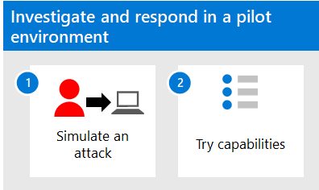

# Onderzoeken en reageren met Microsoft 365 Defender in een testomgevingInvestigate and respond using Microsoft 365 Defender in a pilot environment

**Van toepassing op:****Applies to:**
- Microsoft 365 DefenderMicrosoft 365 Defender

In dit artikel wordt het proces beschreven voor het maken van incidenten met aanvalssimulaties en zelfstudies en Microsoft 365 Defender gebruiken om te onderzoeken en te reageren.This article outlines the process to create incidents with attack simulations and tutorials and use Microsoft 365 Defender to investigate and respond. Voordat u dit proces start, moet u  het algemene proces voor het evalueren van Microsoft 365 Defender hebben bekeken en de Microsoft 365 Defender [evaluatieomgeving hebben gemaakt.](eval-create-eval-environment.md)Before starting this process, be sure you've reviewed the overall process for [evaluating Microsoft 365 Defender](eval-overview.md) and you have [created the Microsoft 365 Defender evaluation environment](eval-create-eval-environment.md).

Gebruik de volgende stappen.Use the following steps.

In de volgende tabel worden de stappen in de afbeelding beschreven.The following table describes the steps in the illustration.

| |StapStep  |OmschrijvingDescription  |
|---------|---------|---------|
|11|[Aanvallen simulerenSimulate attacks](eval-defender-investigate-respond-simulate-attack.md)     |   Simuleert aanvallen op uw evaluatieomgeving en gebruik de Microsoft 365 Defender portal om incidentrespons uit te voeren.Simulate attacks on your evaluation environment and use the Microsoft 365 Defender portal to perform incident response.      |
|22|[Mogelijkheden voor incidentrespons uitproberen Try incident response capabilities ](eval-defender-investigate-respond-additional.md)    |    Probeer functies en mogelijkheden in Microsoft 365 Defender.Try features and capabilities in Microsoft 365 Defender.     |
||||

### Navigatie die u mogelijk nodig hebtNavigation you may need

[De Microsoft 365 Defender evaluatieomgeving makenCreate the Microsoft 365 Defender Evaluation Environment](eval-create-eval-environment.md)
