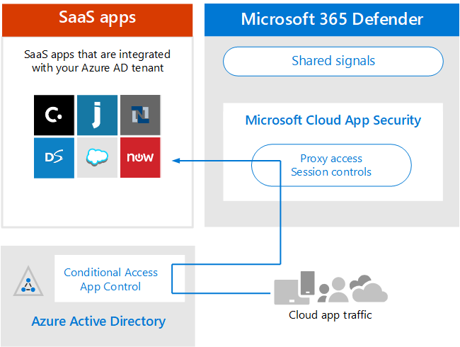

# Architectuurvereisten en belangrijke concepten voor Microsoft Cloud App SecurityReview architecture requirements and key concepts for Microsoft Cloud App Security

**Van toepassing op:****Applies to:**

- Microsoft 365 DefenderMicrosoft 365 Defender

Dit artikel is [stap 1 van 3](eval-defender-mcas-overview.md) in het proces van het instellen van de evaluatieomgeving voor Microsoft Cloud App Security naast Microsoft 365 Defender.This article is [Step 1 of 3](eval-defender-mcas-overview.md) in the process of setting up the evaluation environment for Microsoft Cloud App Security alongside Microsoft 365 Defender. Zie het [overzichtsartikel](eval-defender-identity-overview.md)voor meer informatie over dit proces.For more information about this process, see the [overview article](eval-defender-identity-overview.md).

Voordat u Microsoft Cloud App Security inschakelen, moet u de architectuur begrijpen en aan de vereisten voldoen.Before enabling Microsoft Cloud App Security, be sure you understand the architecture and can meet the requirements. 

## De architectuur begrijpenUnderstand the architecture

Microsoft Cloud App Security is een Cloud Access Security Broker (CASB).Microsoft Cloud App Security is a Cloud Access Security Broker (CASB). CASB's fungeren als poortwachter voor realtime toegang tot makelaars tussen uw zakelijke gebruikers en cloudbronnen die ze gebruiken, waar uw gebruikers zich ook bevinden en ongeacht het apparaat dat ze gebruiken.CASBs act a gatekeeper to broker access in real time between your enterprise users and cloud resources they use, wherever your users are located and regardless of the device they are using. Microsoft Cloud App Security is inheems geïntegreerd met microsoft-beveiligingsmogelijkheden, waaronder Microsoft 365 Defender.Microsoft Cloud App Security natively integrates with Microsoft security capabilities, including Microsoft 365 Defender. 

Zonder Cloud App Security zijn cloud-apps die door uw organisatie worden gebruikt, niet-beveiligd, zoals wordt geïllustreerd.Without Cloud App Security, cloud apps that are used by your organization are unmanaged and unprotected, as illustrated.

In de afbeelding:In the illustration:
- Het gebruik van cloud-apps door een organisatie wordt niet gecontroleerd en niet beveiligd.The use of cloud apps by an organization is unmonitored and unprotected. 
- Dit gebruik valt buiten de beveiligingen die binnen een beheerde organisatie zijn bereikt.This use falls outside the protections achieved within a managed organization. 

#### Cloud-apps ontdekkenDiscovering cloud apps

De eerste stap voor het beheren van het gebruik van cloud-apps is om te ontdekken welke cloud-apps door uw organisatie worden gebruikt.The first step to managing the use of cloud apps is to discover which cloud apps are used by your organization. In dit volgende diagram ziet u hoe clouddetectie werkt met Cloud App Security.This next diagram illustrates how cloud discovery works with Cloud App Security.

In deze afbeelding zijn er twee methoden die kunnen worden gebruikt om netwerkverkeer te controleren en cloud-apps te ontdekken die door uw organisatie worden gebruikt.In this illustration, there are two methods that can be used to monitor network traffic and discover cloud apps that are being used by your organization.
- A.A. Cloud App Discovery is inheems geïntegreerd met Microsoft Defender voor Endpoint.Cloud App Discovery integrates with Microsoft Defender for Endpoint natively. Defender voor Eindpunt meldt dat cloud-apps en -services worden gebruikt vanaf it-beheerde Windows 10 apparaten.Defender for Endpoint reports cloud apps and services being accessed from IT-managed Windows 10 devices. 
- B.B. Voor dekking op alle apparaten die zijn verbonden met een netwerk, wordt Cloud App Security logboekverzamelaar geïnstalleerd op firewalls en andere proxies om gegevens van eindpunten te verzamelen.For coverage on all devices connected to a network, the Cloud App Security log collector is installed on firewalls and other proxies to collect data from endpoints. Deze gegevens worden verzonden naar Cloud App Security voor analyse.This data is sent to Cloud App Security for analysis.

#### Cloud-apps beherenManaging cloud apps

Nadat u cloud-apps hebt ontdekt en het gedrag hebt geanalyseerd van hoe deze door uw organisatie worden gebruikt, kunt u beginnen met het beheren van cloud-apps die u kiest.After you discover cloud apps and analyze the behavior of how these are used by your organization, you can begin managing cloud apps that you choose. 

In deze afbeelding:In this illustration:
- Sommige apps worden gesanctioneerd voor gebruik.Some apps are sanctioned for use. Dit is een eenvoudige manier om apps te beheren.This is a simple way of beginning to manage apps.
- U kunt meer zichtbaarheid en controle inschakelen door apps te verbinden met app-connectors.You can enable greater visibility and control by connecting apps with app connectors. App-connectors gebruiken de API's van app-providers.App connectors use the APIs of app providers.

#### Sessiebesturingselementen toepassen op cloud-appsApplying session controls to cloud apps

Microsoft Cloud App Security fungeert als omgekeerde proxy en biedt proxytoegang tot goedgekeurde cloud-apps.Microsoft Cloud App Security serves as a reverse proxy, providing proxy access to sanctioned cloud apps. Hierdoor kunnen Cloud App Security sessiebesturingselementen toepassen die u configureert.This allows Cloud App Security to apply session controls that you configure. 

In deze afbeelding:In this illustration:
- Toegang tot goedgekeurde cloud-apps van gebruikers en apparaten in uw organisatie wordt doorgeleid via Cloud App Security.Access to sanctioned cloud apps from users and devices in your organization is routed through Cloud App Security.
- Met deze proxytoegang kunnen sessiebesturingselementen worden toegepast.This proxy access allows session controls to be applied.
- Cloud-apps die u niet hebt gesanctioneerd of expliciet niet hebt goedgekeurd, worden niet beïnvloed.Cloud apps that you have not sanctioned or explicitly unsanctioned are not affected.

Met sessiebesturingselementen kunt u parameters toepassen op de manier waarop cloud-apps door uw organisatie worden gebruikt.Session controls allow you to apply parameters to how cloud apps are used by your organization. Als uw organisatie bijvoorbeeld Salesforce gebruikt, kunt u een sessiebeleid configureren waarmee alleen beheerde apparaten toegang hebben tot de gegevens van uw organisatie in Salesforce.For example, if your organization is using Salesforce, you can configure a session policy that allows only managed devices to access your organization's data in Salesforce. Een eenvoudiger voorbeeld is het configureren van een beleid voor het controleren van verkeer vanaf niet-beheerbare apparaten, zodat u het risico van dit verkeer kunt analyseren voordat u strikter beleid kunt toepassen.A simpler example could be configuring a policy to monitor traffic from unmanaged devices so you can analyze the risk of this traffic before applying stricter policies.

#### Integratie met Azure AD met Voorwaardelijke toegang app-beheerIntegrating with Azure AD with Conditional Access App Control

Mogelijk hebt u al SaaS-apps toegevoegd aan uw Azure AD-tenant om meervoudige verificatie en ander beleid voor voorwaardelijke toegang af te dwingen.You might already have SaaS apps added to your Azure AD tenant to enforce multi-factor authentication and other conditional access policies. Microsoft Cloud App Security is inheems geïntegreerd met Azure AD.Microsoft Cloud App Security natively integrates with Azure AD. Het enige wat u hoeft te doen, is een beleid configureren in Azure AD om Voorwaardelijke toegangsbeheer voor apps te gebruiken in Cloud App Security.All you have to do is configure a policy in Azure AD to use Conditional Access App Control in Cloud App Security. Hiermee wordt netwerkverkeer voor deze beheerde SaaS-apps door Cloud App Security als proxy gerouteerd, zodat Cloud App Security dit verkeer kan controleren en sessiebesturingselementen kunt toepassen.This routes network traffic for these managed SaaS apps through Cloud App Security as a proxy, which allows Cloud App Security to monitor this traffic and to apply session controls. 

In deze afbeelding:In this illustration:
- SaaS-apps zijn geïntegreerd met de Azure AD-tenant.SaaS apps are integrated with the Azure AD tenant. Hierdoor kan Azure AD beleid voor voorwaardelijke toegang afdwingen, inclusief meervoudige verificatie.This allows Azure AD to enforce conditional access policies, including multi-factor authentication.
- Er wordt een beleid toegevoegd aan Azure Active Directory om het verkeer voor SaaS-apps te Cloud App Security.A policy is added to Azure Active Directory to direct traffic for SaaS apps to Cloud App Security. Het beleid geeft aan op welke SaaS-apps u dit beleid wilt toepassen.The policy specifies which SaaS apps to apply this policy to. Wanneer Azure AD dus beleid voor voorwaardelijke toegang afdwingt dat van toepassing is op deze SaaS-apps, wordt het sessieverkeer vervolgens door Azure AD door (proxies) door de Cloud App Security.Consequently, after Azure AD enforces any conditional access policies that apply to these SaaS apps, Azure AD then directs (proxies) the session traffic through Cloud App Security.
- Cloud App Security controleert dit verkeer en past alle beleidsregels voor sessiebeheer toe die zijn geconfigureerd door beheerders.Cloud App Security monitors this traffic and applies any session control policies that have been configured by administrators. 

Mogelijk hebt u cloud-apps ontdekt en gesanctioneerd met Cloud App Security die niet zijn toegevoegd aan Azure AD.You might have discovered and sanctioned cloud apps using Cloud App Security that have not been added to Azure AD. U kunt profiteren van Voorwaardelijke toegangsbeheer door deze cloud-apps toe te voegen aan uw Azure AD-tenant en het bereik van uw regels voor voorwaardelijke toegang.You can take advantage of Conditional Access App Control by adding these cloud apps to your Azure AD tenant and the scope of your conditional access rules.

#### Uw organisatie beschermen tegen hackersProtecting your organization from hackers

Cloud App Security biedt zelf krachtige beveiliging.Cloud App Security provides powerful protection on its own. Wanneer u dit echter combineert met de andere mogelijkheden van Microsoft 365 Defender, Cloud App Security gegevens in de gedeelde signalen, waarmee u samen aanvallen kunt stoppen.However, when combined with the other capabilities of Microsoft 365 Defender, Cloud App Security provides data into the shared signals which, together, helps stop attacks.

Het is de moeite waard om deze afbeelding te herhalen vanuit het overzicht naar deze Microsoft 365 Defender evaluatie- en pilothandleiding.It's worth repeating this illustration from the overview to this Microsoft 365 Defender evaluation and pilot guide. 

Aan de rechterkant van deze afbeelding ziet Microsoft Cloud App Security afwijkende gedragingen, zoals onmogelijk reizen, toegang tot referenties en ongebruikelijke download-, bestands delen- of e-mail doorsturen, en worden deze gemeld aan het beveiligingsteam.Focusing on the right side of this illustration, Microsoft Cloud App Security notices anomalous behavior like impossible-travel, credential access, and unusual download, file share, or mail forwarding activity and reports these to the security team. Daarom helpt Cloud App Security voorkomen dat hackers laterale bewegingen maken en gevoelige gegevens exfiltreren.Consequently, Cloud App Security helps prevent lateral movement by hackers and exfiltration of sensitive data. Microsoft 356 Defender correleert de signalen van alle onderdelen om het volledige aanvalsverhaal te bieden.Microsoft 356 Defender correlates the signals from all the components to provide the full attack story.

## Belangrijke concepten begrijpenUnderstand key concepts

In de volgende tabel worden belangrijke concepten geïdentificeerd die belangrijk zijn om te begrijpen bij het evalueren, configureren en implementeren van Microsoft Cloud App Security.The following table identified key concepts that are important to understand when evaluating, configuring, and deploying Microsoft Cloud App Security.

|ConceptConcept  |OmschrijvingDescription |Meer informatieMore information  |
|---------|---------|---------|
| Cloud App Security DashboardCloud App Security Dashboard | Geeft een overzicht van de belangrijkste informatie over uw organisatie en geeft koppelingen naar dieper onderzoek.Presents an overview of the most important information about your organization and gives links to deeper investigation.        | [Werken met het dashboard Working with the dashboard ](/cloud-app-security/daily-activities-to-protect-your-cloud-environment)       |
| App-beheer voor voorwaardelijke toegangConditional Access App Control    | Reverse proxyarchitectuur die is geïntegreerd met uw IdP (Identity Provider) om Beleid voor voorwaardelijke toegang van Azure AD te geven en selectief sessiebesturingselementen af te dwingen.Reverse proxy architecture that integrates with your Identity Provider (IdP) to give Azure AD conditional access policies and selectively enforce session controls.        |  [Apps beveiligen met Microsoft Cloud App Security Voorwaardelijke toegang app-besturingselementProtect apps with Microsoft Cloud App Security Conditional Access App Control](/cloud-app-security/proxy-intro-aad)       |
|  Cloud-app-catalogusCloud App Catalog   | De catalogus met cloud-apps geeft u een volledig beeld ten opzichte van de Microsoft-catalogus van meer dan 16.000 cloud-apps die worden gerangschikt en gescored op basis van meer dan 80 risicofactoren.The Cloud App Catalog gives you a full picture against Microsoft catalog of over 16,000 cloud apps that are ranked and scored based on more than 80 risk factors.    |  [Werken met app-risicoscoresWorking with App risk scores](/cloud-app-security/risk-score)       |
| Cloud Discovery DashboardCloud Discovery Dashboard    | Cloud Discovery analyseert uw verkeerslogboeken en is ontworpen om meer inzicht te geven in hoe cloud-apps in uw organisatie worden gebruikt en om waarschuwingen en risiconiveaus te geven.Cloud Discovery analyzes your traffic logs and is designed to give more insight into how cloud apps are being used in your organization as well as give alerts and risk levels.     |  [Werken met gevonden apps   Working with discovered apps   ](/cloud-app-security/discovered-apps)    |
|Verbonden appsConnected Apps |Cloud App Security biedt end-to-endbeveiliging voor verbonden apps met cloud-to-cloudintegratie, API-connectors en realtime toegangs- en sessiebesturingselementen die gebruikmaken van onze voorwaardelijke toegangsbesturingselementen voor apps.Cloud App Security provides end-to-end protection for connected apps using Cloud-to-Cloud integration, API connectors, and real-time access and session controls leveraging our Conditional App Access Controls. |[Verbonden apps beveiligenProtecting connected apps](/cloud-app-security/protect-connected-apps) |
| | | |

## Architectuurvereisten controlerenReview architecture requirements

### Cloud-apps ontdekkenDiscovering cloud apps

Als u cloud-apps wilt ontdekken die in uw omgeving worden gebruikt, kunt u een of beide van de volgende dingen doen:To discover cloud apps used in your environment, you can do one or both of the following:

- Ga snel aan de weg met Cloud Discovery door te integreren met Microsoft Defender voor Eindpunt.Get up and running quickly with Cloud Discovery by integrating with Microsoft Defender for Endpoint. Met deze native integratie kunt u direct beginnen met het verzamelen van gegevens over cloudverkeer op uw Windows 10 apparaten, in en uit uw netwerk.This native integration enables you to immediately start collecting data on cloud traffic across your Windows 10 devices, on and off your network.
- Als u alle cloud-apps wilt ontdekken die toegankelijk zijn voor alle apparaten die zijn verbonden met uw netwerk, implementeert u de Cloud App Security logboekverzamelaar op uw firewalls en andere proxies.To discover all cloud apps accessed by all devices connected to your network, deploy the Cloud App Security log collector on your firewalls and other proxies. Hiermee worden gegevens van uw eindpunten verzameld en naar Cloud App Security voor analyse.This collects data from your endpoints and sends it to Cloud App Security for analysis. Cloud App Security inheems geïntegreerd met sommige proxies van derden voor nog meer mogelijkheden.Cloud App Security natively integrates with some third-party proxies for even more capabilities.

Deze opties zijn opgenomen in [stap 2. Schakel de evaluatieomgeving in.](eval-defender-mcas-enable-eval.md)These options are included in [Step 2. Enable the evaluation environment](eval-defender-mcas-enable-eval.md). 

### Azure AD-beleid voor voorwaardelijke toegang toepassen op cloud-appsApplying Azure AD Conditional Access policies to cloud apps

Voorwaardelijke toegang App Control (de mogelijkheid om beleid voor voorwaardelijke toegang toe te passen op cloud-apps) vereist integratie met Azure AD.Conditional Access App Control (the ability to apply Conditional Access policies to cloud apps) requires integration with Azure AD. Dit is geen vereiste om aan de slag te gaan met Cloud App Security.This isn't a requirement for getting started with Cloud App Security. Het is een stap die we u aanmoedigen om het uit te proberen tijdens de testfase: [stap 3. Pilot Microsoft Cloud App Security.](eval-defender-mcas-pilot.md)It is a step we encourage you to try out during the pilot phase — [Step 3. Pilot Microsoft Cloud App Security](eval-defender-mcas-pilot.md).

## SIEM-integratieSIEM integration

U kunt uw Microsoft Cloud App Security met uw algemene SIEM-server of met Azure Sentinel integreren om gecentraliseerde monitoring van waarschuwingen en activiteiten vanuit verbonden apps in te stellen.You can integrate Microsoft Cloud App Security with your generic SIEM server or with Azure Sentinel to enable centralized monitoring of alerts and activities from connected apps. 

Daarnaast bevat Azure Sentinel een Microsoft Cloud App Security connector voor een diepere integratie met Azure Sentinel.Additionally, Azure Sentinel includes a Microsoft Cloud App Security connector to provide deeper integration with Azure Sentinel. Hierdoor kunt u niet alleen inzicht krijgen in uw cloud-apps, maar ook geavanceerde analyses krijgen om cyberaanvallen te identificeren en te bestrijden en om te bepalen hoe uw gegevens worden verplaatst.This enables you to not only gain visibility into your cloud apps but to also get sophisticated analytics to identify and combat cyberthreats and to control how your data travels.

- [Algemene SIEM-integratieGeneric SIEM integration](/cloud-app-security/siem)
- [Streamwaarschuwingen en Cloud Discovery-logboeken van MCAS naar Azure SentinelStream alerts and Cloud Discovery logs from MCAS into Azure Sentinel](/azure/sentinel/connect-cloud-app-security)

### Volgende stappenNext steps

Stap 2 van 3: [De evaluatieomgeving inschakelen voor Microsoft Cloud App Security](eval-defender-mcas-enable-eval.md)Step 2 of 3: [Enable the evaluation environment for Microsoft Cloud App Security](eval-defender-mcas-enable-eval.md)

Ga terug naar het overzicht voor [Evalueren Microsoft Cloud App Security](eval-defender-mcas-overview.md)Return to the overview for [Evaluate Microsoft Cloud App Security](eval-defender-mcas-overview.md)

Ga terug naar het overzicht voor [Evalueren en Microsoft 365 Defender](eval-overview.md)Return to the overview for [Evaluate and pilot Microsoft 365 Defender](eval-overview.md)