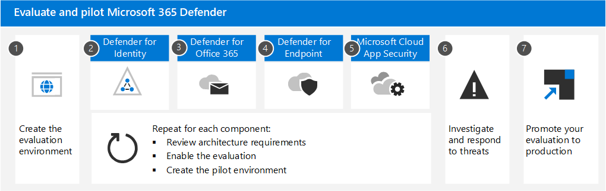

# Evaluatie en pilot Microsoft 365 Defender

**Van toepassing op:**

- Microsoft 365 Defender

Microsoft 365 Defender is een uitgebreide detectie- en antwoordoplossing (XDR) die automatisch signaal-, bedreigings- en waarschuwingsgegevens verzamelt, correleert en analyseert vanuit uw Microsoft 365-omgeving, inclusief eindpunten, e-mail, toepassingen en identiteiten. Het maakt gebruik van uitgebreide AI en automatisering om aanvallen automatisch te stoppen en getroffen activa te herstellen naar een veilige toestand. In de volgende artikelen wordt u door het proces van het instellen van een proefomgeving gestapt, zodat u de functies en mogelijkheden van de Microsoft 365 Defender. 

Terwijl u deze artikelen doorloop, wordt in de stappen be geïllustreerd hoe u elk onderdeel kunt inschakelen, instellingen kunt configureren en kunt beginnen met het controleren met een testgroep. Wanneer u klaar bent, kunt u het voltooien door uw evaluatieomgeving rechtstreeks in productie te brengen. 

Microsoft raadt u aan uw evaluatie te maken in een bestaand productieabonnement op Office 365. Op deze manier krijgt u direct inzichten in de echte wereld en kunt u instellingen afstemmen op de huidige bedreigingen in uw omgeving. Nadat u ervaring hebt opgedaan en vertrouwd bent met het platform, kunt u elk onderdeel één voor één promoveren tot productie. 

## De anatomie van een aanval

Microsoft 365 Defender is een cloudgebaseerde, geïntegreerde, pre- en post-breach enterprise defense suite. Het coördineert  *preventie,* *detectie,* onderzoek en *antwoord* tussen eindpunten, identiteiten, apps, e-mail, samenwerkingstoepassingen en al hun gegevens.

In deze afbeelding wordt een aanval gestart. Phishing-e-mail komt binnen in het Postvak IN van een werknemer in uw organisatie, die de e-mailbijlage zonder het te weten opent. Hiermee installeert u malware, wat leidt tot een reeks gebeurtenissen die kunnen eindigen met de diefstal van gevoelige gegevens. Maar in dit geval is Defender voor Office 365 in gebruik.

In de afbeelding:

- **Exchange Online Protection**, onderdeel van Microsoft Defender voor Office 365, kan de phishing-e-mail detecteren en e-mailstroomregels gebruiken om ervoor te zorgen dat deze nooit in het Postvak IN wordt binnenkomt.
- **Defender voor Office 365** veilige bijlagen test de bijlage en bepaalt dat deze schadelijk is, zodat de e-mail die binnenkomt, niet kan worden uitgevoerd door de gebruiker of dat het beleid verhindert dat de e-mail helemaal binnenkomt.
- **Defender voor Eindpunt beheert** apparaten die verbinding maken met het bedrijfsnetwerk en detecteert beveiligingslekken voor apparaten en netwerken die anders mogelijk worden misbruikt.
- **Defender for Identity neemt** kennis van plotse accountwijzigingen, zoals escalatie van bevoegdheden of een zijbeweging met een hoog risico. Het rapport rapporteert ook over gemakkelijk te misbruiken identiteitsproblemen, zoals ongeconstrainde Kerberos-delegatie, voor correctie door het beveiligingsteam.
- **Microsoft Cloud App Security** ziet afwijkende gedragingen zoals onmogelijk reizen, toegang tot referenties en ongebruikelijke download-, bestands delen- of e-mail doorsturen en rapporteert deze aan het beveiligingsteam.

### Microsoft 365 Defender onderdelen

Microsoft 365 Defender bestaat uit deze beveiligingstechnologieën, die samen worden gebruikt. U hebt niet al deze onderdelen nodig om te profiteren van de mogelijkheden van XDR en Microsoft 365 Defender. U realiseert winst en efficiëntie door er ook een of twee te gebruiken. 

|Onderdeel  |Omschrijving  |Referentiemateriaal  |
|---------|---------|---------|
|Microsoft Defender for Identity     |      Microsoft Defender voor identiteit gebruikt Active Directory-signalen om geavanceerde bedreigingen, gecompromitteerde identiteiten en kwaadaardige insideracties die zijn gericht op uw organisatie te identificeren, te detecteren en te onderzoeken.     |     [Wat is Microsoft Defender for Identity?](/defender-for-identity/what-is)   |
|Exchange Online Protection     |      Exchange Online Protection is de smtp-relay- en filterservice in de cloud die uw organisatie beschermt tegen spam en malware.      |   [Exchange Online Protection overzicht (EOP) - Office 365](../office-365-security/overview.md)     |
|Microsoft Defender voor Office 365     |     Microsoft Defender voor Office 365 beschermt uw organisatie tegen schadelijke bedreigingen die worden veroorzaakt door e-mailberichten, koppelingen (URL's) en samenwerkingshulpmiddelen.      |    [Microsoft Defender voor Office 365 - Office 365](../office-365-security/overview.md)    |
|Microsoft Defender voor Eindpunt     |     Microsoft Defender voor Eindpunt is een geïntegreerd platform voor apparaatbeveiliging, detectie na inbreuken, geautomatiseerd onderzoek en aanbevolen antwoorden.      |   [Microsoft Defender voor Eindpunt - Windows beveiliging](../defender-endpoint/microsoft-defender-endpoint.md)    |
|Microsoft Cloud App Security     |      Microsoft Cloud App-beveiliging is een uitgebreide saaS-oplossing met een uitgebreide zichtbaarheid, krachtige gegevensbesturingselementen en verbeterde bedreigingsbeveiliging voor uw cloud-apps.       |    [Wat is Cloud App Security?](/cloud-app-security/what-is-cloud-app-security)    |
|Azure AD Identity Protection|Azure AD Identity Protection evalueert risicogegevens van miljoenen aanmeldingspogingen en gebruikt deze gegevens om het risico van elke aanmelding bij uw omgeving te evalueren. Deze gegevens worden door Azure AD gebruikt om accounttoegang toe te staan of te voorkomen, afhankelijk van hoe beleid voor voorwaardelijke toegang is geconfigureerd. Azure AD Identity Protection wordt afzonderlijk gelicentieerd Microsoft 365 Defender. Deze is inbegrepen bij Azure Active Directory Premium P2.|[Wat is Identiteitsbeveiliging?](/azure/active-directory/identity-protection/overview-identity-protection)|
| | | |

## Microsoft 365 Defender architectuur

Het onderstaande diagram illustreert architectuur op hoog niveau voor belangrijke Microsoft 365 Defender onderdelen en integraties. *Gedetailleerde* architectuur voor elk Defender-onderdeel en scenario's voor gebruiksscenario's worden in deze reeks artikelen gegeven.

In deze afbeelding:

- Microsoft 365 Defender combineert de signalen van alle Defender-onderdelen om uitgebreide detectie en respons (XDR) te bieden in domeinen. Dit omvat een geïntegreerde incidentenwachtrij, geautomatiseerde reactie op het stoppen van aanvallen, zelfherstel (voor gecompromitteerde apparaten, gebruikersidentiteiten en postvakken), kruisbedreigingsjacht en bedreigingsanalyse.
- Microsoft Defender beschermt uw organisatie tegen schadelijke bedreigingen die worden veroorzaakt door e-mailberichten, koppelingen (URL's) en samenwerkingshulpmiddelen. Het deelt signalen die het resultaat zijn van deze activiteiten met Microsoft 365 Defender. Exchange Online Protection (EOP) is geïntegreerd om end-to-endbeveiliging te bieden voor inkomende e-mailberichten en bijlagen.
- Microsoft Defender voor identiteit verzamelt signalen van servers met Active Directory Federated Services (AD FS) en on-premises Active Directory Domain Services (AD DS). Deze signalen worden gebruikt om uw hybride identiteitsomgeving te beschermen, inclusief bescherming tegen hackers die gecompromitteerde accounts gebruiken om lateraal over werkstations in de on-premises omgeving te gaan.
- Microsoft Defender voor Eindpunt verzamelt signalen van en beschermt apparaten die door uw organisatie worden gebruikt.
- Microsoft Cloud App Security verzamelt signalen van het gebruik van cloud-apps van uw organisatie en beschermt gegevens die tussen uw omgeving en deze apps stromen, waaronder zowel goedgekeurde als niet-goedgekeurde cloud-apps.
- Azure AD Identity Protection evalueert risicogegevens van miljoenen aanmeldingspogingen en gebruikt deze gegevens om het risico van elke aanmelding bij uw omgeving te evalueren. Deze gegevens worden door Azure AD gebruikt om accounttoegang toe te staan of te voorkomen, afhankelijk van hoe beleid voor voorwaardelijke toegang is geconfigureerd. Azure AD Identity Protection wordt afzonderlijk gelicentieerd Microsoft 365 Defender. Deze is inbegrepen bij Azure Active Directory Premium P2.  

Aanvullende optionele architectuuronderdelen die niet in deze afbeelding zijn opgenomen:

- Gedetailleerde signaalgegevens van alle Microsoft Defender-onderdelen kunnen worden geïntegreerd in Azure Sentinel en worden gecombineerd met andere logboekregistratiebronnen om volledige SIEM- en SOAR-mogelijkheden en inzichten te bieden.

## Het evaluatieproces

Microsoft raadt aan om de onderdelen van Microsoft 365 in te stellen in de volgorde die wordt geïllustreerd:

In de volgende tabel wordt deze afbeelding beschreven.

|      |Stap  |Omschrijving  |
|------|---------|---------|
|1     | [De evaluatieomgeving maken](eval-create-eval-environment.md)       |Deze stap zorgt ervoor dat u over de proeflicentie voor Microsoft 365 Defender.         |
|2     | [Defender voor identiteit inschakelen](eval-defender-identity-overview.md)        | Bekijk de architectuurvereisten, schakel de evaluatie in en doorloop zelfstudies voor het identificeren en herstellen van verschillende aanvalstypen.   |
|3     | [Defender inschakelen voor Office 365](eval-defender-office-365-overview.md)       | Zorg ervoor dat u voldoet aan de architectuurvereisten, de evaluatie inschakelen en vervolgens de testomgeving maakt. Dit onderdeel bevat Exchange Online Protection en dus zult u beide *hier evalueren.*      |
|4     | [Defender voor eindpunt inschakelen ](eval-defender-endpoint-overview.md)       | Zorg ervoor dat u voldoet aan de architectuurvereisten, de evaluatie inschakelen en vervolgens de testomgeving maakt.         |
|5     | [Microsoft Cloud App Security](eval-defender-mcas-overview.md)        |  Zorg ervoor dat u voldoet aan de architectuurvereisten, de evaluatie inschakelen en vervolgens de testomgeving maakt.        |
|6     | [Bedreigingen onderzoeken en hierop reageren](eval-defender-investigate-respond.md)        |   Simuleert een aanval en gebruik de mogelijkheden voor incidentrespons.      |
|7     | [De proefversie promoveren naar productie](eval-defender-promote-to-production.md)        | Promoot de Microsoft 365 onderdelen één voor één te produceren.        |
| | | |

Dit is een veelgebruikte volgorde die is ontworpen om de waarde van de mogelijkheden snel te verkrijgen op basis van de hoeveelheid inspanning die gewoonlijk nodig is om de mogelijkheden te implementeren en te configureren. Defender voor Office 365 kan bijvoorbeeld veel sneller worden geconfigureerd dan nodig is om apparaten voor Defender voor Eindpunt in te schrijven. Natuurlijk kunt u prioriteit geven aan de onderdelen om aan uw zakelijke behoeften te voldoen en deze in een andere volgorde in te stellen.

## Volgende stappen

[De Microsoft 365 Defender evaluatieomgeving maken](eval-create-eval-environment.md)
