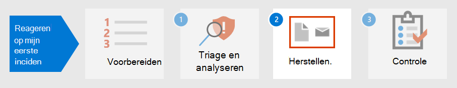

# Stap 1.Step 1. Triage en analyseer uw eerste incidentTriage and analyze your first incident

[!INCLUDE [Microsoft 365 Defender rebranding](../includes/microsoft-defender.md)]

**Van toepassing op:****Applies to:**
- Microsoft 365 DefenderMicrosoft 365 Defender

Terwijl u enige tijd besteedt aan het opstellen, implementeren en onderhouden van beveiligingsmaatregelen volgens de standaarden van de organisatie, kunt u beveiligingsoplossingen instellen waarmee u snel beveiligingsrisico's en bedreigingen kunt identificeren.As you spend some time establishing, implementing, and maintaining security measures according to the organization’s standards, you can set up security solutions to help you quickly identify security risks and threats. Microsoft 365 Met Defender kunt u incidenten opsporen, triagen en onderzoeken via de ervaring met één deelvenster-van-glas, waar u de informatie kunt vinden die u nodig hebt om tijdig beslissingen te nemen.Microsoft 365 Defender allows you to detect, triage, and investigate incidents through its single-pane-of-glass experience where you can find the information you need to make timely decisions. 

Wanneer een beveiligingsincident is gedetecteerd, Microsoft 365 Defender details die u nodig hebt om een incident of incidenten te triageeren of prioriteit te geven boven anderen.Once a security incident is detected, Microsoft 365 Defender presents details you will need to triage or prioritize an incident or incidents over others. Nadat de prioriteit is bepaald, kunnen analisten hun energie vervolgens richten op het onderzoeken van zaken die aan hen zijn toegewezen.After determining prioritization, analysts can then focus their energy on investigating cases assigned to them.

## Detectie door Microsoft 365 DefenderDetection by Microsoft 365 Defender

Microsoft 365 Defender ontvangt waarschuwingen en gebeurtenissen van meerdere Microsoft-beveiligingsplatforms als detectiebronnen om een holistisch beeld en context van schadelijke activiteiten te maken.Microsoft 365 Defender receives alerts and events from multiple Microsoft security platforms as detection sources to create a holistic picture and context of malicious activity. Dit zijn de mogelijke detectiebronnen:These are the possible detection sources:

- [Microsoft Defender for Endpoint](../defender-endpoint/microsoft-defender-endpoint.md) is een eindpuntdetectie en -respons-oplossing (EDR) die gebruikmaakt van Microsoft Defender-antivirussoftware en geavanceerde bedreigingsbeveiliging in de cloud met Microsoft Security Graph.[Microsoft Defender for Endpoint](../defender-endpoint/microsoft-defender-endpoint.md) is an endpoint detection and response solution (EDR) that uses Microsoft Defender antivirus as well as cloud-enabled advanced threat protection using Microsoft Security Graph. Defender for Endpoint is een geïntegreerd platform voor preventieve beveiliging, detectie na inbreuken, geautomatiseerd onderzoek en antwoord.Defender for Endpoint is a unified platform for preventative protection, post-breach detection, automated investigation, and response. Het beschermt eindpunten tegen cyberaanvallen, detecteert geavanceerde aanvallen en datalekken, automatiseert beveiligingsincidenten en verbetert de beveiliging.It protects endpoints from cyberthreats, detects advanced attacks and data breaches, automates security incidents, and improves security posture. 
- [Microsoft Defender voor](/defender-for-identity/what-is) identiteit is een cloudgebaseerde beveiligingsoplossing die uw on-premises Ad DS-signalen (Active Directory Domain Services) gebruikt om geavanceerde bedreigingen, gecompromitteerde identiteiten en kwaadaardige insideracties die zijn gericht op uw organisatie te identificeren, te detecteren en te onderzoeken.[Microsoft Defender for Identity](/defender-for-identity/what-is) is a cloud-based security solution that uses your on-premises Active Directory Domain Services (AD DS) signals to identify, detect, and investigate advanced threats, compromised identities, and malicious insider actions directed at your organization. 
- [Microsoft Cloud App Security](/cloud-app-security/) fungeert als poortwachter voor realtime toegang tussen uw zakelijke gebruikers en de cloudbronnen die ze gebruiken, waar uw gebruikers zich ook bevinden en ongeacht het apparaat dat ze gebruiken.[Microsoft Cloud App Security](/cloud-app-security/) acts as a gatekeeper to broker access in real time between your enterprise users and the cloud resources they use, wherever your users are located and regardless of the device they are using. 
- [Microsoft Defender voor Office 365](../office-365-security/overview.md) beschermt uw organisatie tegen schadelijke bedreigingen in e-mailberichten, koppelingen (URL's) en samenwerkingshulpmiddelen.[Microsoft Defender for Office 365](../office-365-security/overview.md) safeguards your organization against malicious threats in email messages, links (URLs), and collaboration tools. 
- [Azure Security Center](/azure/security-center/security-center-introduction) is een geïntegreerd beveiligingsbeheersysteem voor infrastructuur dat de beveiliging van uw datacenters verbetert en geavanceerde bedreigingsbeveiliging biedt voor uw hybride werkbelastingen in de cloud en on-premises.[Azure Security Center](/azure/security-center/security-center-introduction) is a unified infrastructure security management system that strengthens the security posture of your data centers and provides advanced threat protection across your hybrid workloads in the cloud as well as on premises. 

In Microsoft 365 Defender worden [incidenten](incidents-overview.md) geïdentificeerd door waarschuwingen van deze verschillende detectiebronnen te correeren.In Microsoft 365 Defender, [incidents](incidents-overview.md) are identified by correlating alerts from these different detection sources. In plaats van resources aan elkaar te rijgen of meerdere waarschuwingen te onderscheiden in hun respectieve incidenten, kunt u meteen beginnen met de wachtrij voor incidenten in Microsoft 365 Defender.Instead of spending resources stringing together or distinguishing multiple alerts into their respective incidents, you can start with the incident queue in Microsoft 365 Defender right away. Op deze manier kunt u incidenten op een efficiënte manier over eindpunten, identiteiten, e-mail en toepassingen triagen en de schade door een aanval beperken.This allows you to triage incidents in an efficient manner across endpoints, identities, email, and applications, and reduce the damage from an attack.

## Uw incidenten triageTriage your incidents

Incidentrespons in Microsoft 365 Defender wordt gestart nadat u de lijst met incidenten hebt ge triaged met de aanbevolen methode van prioriteit van uw organisatie.Incident response in Microsoft 365 Defender starts once you triage the list of incidents using your organization’s recommended method of prioritization. Triage betekent dat u een niveau van urgentie of urgentie toewijst aan incidenten, dat vervolgens bepaalt in welke volgorde ze worden onderzocht.To triage means to assign a level of importance or urgency to incidents, which then determines the order in which they will be investigated. 

Een handige voorbeeldhandleiding om te bepalen welk incident prioriteit moet krijgen in Microsoft 365 Defender kan worden samengevat met de formule: *Ernst + Impact = Prioriteit.*A useful sample guide for determining which incident to prioritize in Microsoft 365 Defender can be summarized by the formula: *Severity + Impact = Priority*. 

- **Ernst is** het niveau dat is aangewezen door Microsoft 365 Defender en de geïntegreerde beveiligingsonderdelen.**Severity** is the level designated by Microsoft 365 Defender and its integrated security components. 
- **De** impact wordt bepaald door de organisatie en omvat in het algemeen een drempelwaarde voor beïnvloede gebruikers, apparaten, services (of een combinatie daarvan) en zelfs het type waarschuwing.**Impact** is determined by the organization and generally includes, but not limited to, a threshold number of impacted users, devices, services affected (or a combination thereof), and even alert type. 

Analisten starten vervolgens onderzoeken op basis van **de** prioriteitscriteria die door de organisatie zijn ingesteld.Analysts then initiate investigations based on the **Priority** criteria set by the organization.

Incidentprioriteit kan variëren, afhankelijk van de organisatie.Incident prioritization might vary depending on the organization. NIST raadt ook aan rekening te houden met de functionele en informatie-impact van het incident en de herstelbaarheid.NIST recommends also considering the functional and informational impact of the incident, and recoverability.  

Het volgende is slechts één benadering van triage:The following is just one approach to triage: 

1. Ga naar de [pagina incidenten](incidents-overview.md) om triage te starten.Go to the [incidents](incidents-overview.md) page to initiate triage. Hier ziet u een lijst met incidenten die van invloed zijn op uw organisatie.Here you can see a list of incidents affecting your organization. Standaard worden ze gerangschikt van het meest recente naar het oudste incident.By default, they are arranged from the most recent to the oldest incident. Hier ziet u ook verschillende kolommen voor elk incident met onder andere de ernst, categorie, het aantal actieve waarschuwingen en beïnvloede entiteiten.From here, you can also see different columns for each incident showing their severity, category, number of active alerts, and impacted entities, among others. U kunt de set kolommen aanpassen en de incidentwachtrij sorteren op een aantal van deze kolommen door de kolomnaam te selecteren.You can customize the set of columns and sort the incident queue by some these columns by selecting the column name. U kunt de wachtrij voor incidenten ook filteren op basis van uw behoeften.You can also filter the incident queue according to your needs. Zie Prioriteit geven aan incidenten voor een volledige lijst met beschikbare [filters.](incident-queue.md#available-filters)For a full list of available filters, see [Prioritize incidents](incident-queue.md#available-filters).
  
   :::image type="content" source="../../media/first-incident-analyze/first-incident-analyze-queue.png" alt-text="Voorbeeld van de incidentwachtrij"::: 

    Een voorbeeld van hoe u triage voor deze reeks incidenten kunt uitvoeren, is het prioriteit geven aan incidenten die van invloed zijn op meer gebruikers en apparaten.One example of how you might perform triage for this set of incidents is to prioritize incidents that affected more users and devices. In dit voorbeeld kunt u prioriteit geven aan incident-id 6769 omdat dit van invloed was op het grootste aantal entiteiten: 7 apparaten, 6 gebruikers en 2 postvakken.In this example, you might prioritize incident ID 6769 because it affected the largest number of entities: 7 devices, 6 users, and 2 mailboxes. Bovendien lijkt het incident waarschuwingen van Microsoft Defender voor identiteit te bevatten die een melding op basis van identiteit en mogelijke diefstal van referenties aangeven.Furthermore, the incident appears to contain alerts from Microsoft Defender for Identity which indicate an identity-based alert and possible credential theft.

   :::image type="content" source="../../media/first-incident-analyze/first-incident-analyze-high-impact.png" alt-text="Voorbeeld van een incident met een hoge impact":::
 
2. Selecteer de cirkel naast de naam van het incident om de details te bekijken.Select the circle next to the incident name to review the details. Aan de rechterkant wordt een zijdeelvenster weergegeven, dat aanvullende informatie bevat die uw triage verder kan helpen.A side pane will appear on the right side, which contains additional information that can assist your triage further. 
 
   :::image type="content" source="../../media/first-incident-analyze/first-incident-analyze-incident-flyout.png" alt-text="Voorbeeld van een zijvenster voor incidenten"::: 

   Als u bijvoorbeeld kijkt welke [MITRE ATT&CK-tactieken](https://attack.mitre.org/) de aanvaller heeft gebruikt op basis van de categorieën van het incident, kunt u dit incident prioriteit geven omdat de aanvaller gestolen referenties heeft gebruikt, opdracht en controle heeft ingesteld, zijbewegingen heeft uitgevoerd en bepaalde gegevens heeft geëfiltreerd.For example, by looking at which [MITRE ATT&CK](https://attack.mitre.org/) tactics the attacker used based on the incident’s categories, you might prioritize this incident because the attacker used stolen credentials, established command and control, performed lateral movement, and exfiltrated some data. Dit suggereert dat de aanvaller al diep in het netwerk is gegaan en mogelijk vertrouwelijke informatie heeft gestolen.This suggests the attacker has already gone deep into the network and possibly stolen confidential information.

   Als uw organisatie het Zero Trust-framework heeft geïmplementeerd, zou u referentiestoegang bovendien beschouwen als een belangrijke beveiligingsovertreding die de moeite waard is om prioriteit te geven.Additionally, if your organization has implemented the Zero Trust framework, you would consider credential access as an important security violation worth prioritizing.
 
   Als u omlaag schuift in het zijvenster, ziet u de specifieke beïnvloede entiteiten, zoals gebruikers, apparaten en postvakken.Scrolling down the side pane, you will see the specific impacted entities such as users, devices, and mailboxes. U kunt het blootstellingsniveau van elk apparaat en de eigenaren van de betreffende postvakken controleren.You can check the exposure level of each device and the owners of affected mailboxes.

   :::image type="content" source="../../media/first-incident-analyze/first-incident-analyze-incident-flyout-details.png" alt-text="Voorbeeld van details van een zijvenster met incidenten"::: 
 
3. Verderop in het zijvenster vindt u de bijbehorende waarschuwingen.Further down the side pane, you can find the associated alerts. Microsoft 365 Defender heeft de correlatie van deze waarschuwingen al uitgevoerd in één incident, waardoor u tijd en resources bespaart die beter zijn besteed aan het herstellen van de aanval.Microsoft 365 Defender has already performed the correlation of said alerts into a single incident, saving you time and resources better spent remediating the attack. Waarschuwingen zijn verdachte en dus mogelijk schadelijke systeemgebeurtenissen die de aanwezigheid van een aanvaller in een netwerk suggereren.Alerts are suspicious and therefore possibly malicious system events that suggest the presence of an attacker on a network. 

   In dit voorbeeld is vastgesteld dat 87 afzonderlijke waarschuwingen deel uitmaken van één beveiligingsincident.In this example, 87 individual alerts were determined to be part of one security incident. U kunt alle waarschuwingen bekijken om snel te zien hoe de aanval is uitgevoerd.You can view all the alerts to get a quick view of how the attack played out.

   :::image type="content" source="../../media/first-incident-analyze/first-incident-analyze-incident-flyout-alerts.png" alt-text="Voorbeeld van waarschuwingen in een zijvenster voor incidenten"::: 
 
## Uw eerste incident analyserenAnalyze your first incident

Het is even belangrijk om de context rond waarschuwingen te begrijpen.Understanding the context surrounding alerts is equally important. Vaak is een waarschuwing geen afzonderlijke gebeurtenis.Often an alert is not a single independent event. Er is een keten van processen die zijn gemaakt, opdrachten en acties die mogelijk niet tegelijkertijd zijn opgetreden.There is a chain of processes created, commands, and actions that might not have occurred at the same time. Daarom moet een analist zoeken naar de eerste en laatste activiteiten van de verdachte entiteit in apparaattijdlijns om de context van de waarschuwingen te begrijpen.Therefore, an analyst must look for the first and last activities of the suspicious entity in device timelines to understand the context of the alerts.

Er zijn meerdere manieren om gegevens te lezen en te analyseren met Microsoft 365 Defender, maar het doel voor analisten is om zo snel mogelijk op incidenten te reageren.There are multiple ways to read and analyze data using Microsoft 365 Defender but the end goal for analysts is to respond to incidents as quickly as possible. Hoewel Microsoft 365 Defender de mean [time to Remediate (MTTR)](https://www.microsoft.com/security/blog/2020/05/04/lessons-learned-microsoft-soc-part-3c/) aanzienlijk  kan verminderen via de toonaangevende functie voor geautomatiseerd onderzoek en antwoord, zijn er altijd gevallen waarvoor handmatige analyse nodig is.While Microsoft 365 Defender can significantly reduce [Mean Time to Remediate (MTTR)](https://www.microsoft.com/security/blog/2020/05/04/lessons-learned-microsoft-soc-part-3c/) through the industry-leading [automated investigation and response](m365d-autoir.md) feature, there are always cases that require manual analysis. 

Hier volgt een voorbeeld:Here's an example:

1. Wanneer triageprioriteit is bepaald, begint een analist met een grondige analyse door de naam van het incident te selecteren.Once triage priority has been determined, an analyst begins an in-depth analysis by selecting the incident name. Op deze pagina wordt het **overzicht van incidenten weergegeven** waarin gegevens worden weergegeven op tabbladen om te helpen bij de analyse.This page brings up the **Incident Summary** where data is displayed in tabs to assist with the analysis. Onder het **tabblad** Waarschuwingen wordt het type waarschuwingen weergegeven.Under the **Alerts** tab the type of alerts are displayed. Analisten kunnen op elke waarschuwing klikken om in te zoomen op de betreffende detectiebron.Analysts can click on each alert to drill down into the respective detection source. 

    :::image type="content" source="../../media/first-incident-analyze/first-incident-analyze-summary-tab.png" alt-text="Voorbeeld van het tabblad Overzicht van een incident"::: 
 
    Voor een beknopte handleiding over welk domein elke detectiebron wordt beschreven, bekijkt u de [sectie](#detection-by-microsoft-365-defender) Detecteren van dit artikel.For a quick guide about which domain each detection source covers, review the [Detect](#detection-by-microsoft-365-defender) section of this article.

2.  Op het **tabblad Waarschuwingen** kan een analist naar de detectiebron draaien om een uitgebreider onderzoek en analyse uit te voeren.From the **Alerts** tab, an analyst can pivot to the detection source to conduct a more in-depth investigation and analysis. Selecteer bijvoorbeeld Malwaredetectie met Microsoft Cloud App Security als de detectiebron de analist naar de bijbehorende waarschuwingspagina brengt.For example, selecting Malware Detection with Microsoft Cloud App Security as the detection source takes the analyst to its corresponding alert page.
  
    :::image type="content" source="../../media/first-incident-analyze/first-incident-analyze-select-alert.png" alt-text="Voorbeeld van het selecteren van een waarschuwing van een incident"::: 
  
    :::image type="content" source="../../media/first-incident-analyze/first-incident-analyze-link-to-mcas.png" alt-text="Voorbeeld van een bijbehorende pagina in Microsoft Cloud App Security"::: 
  
3.  Als u ons voorbeeld verder wilt onderzoeken, schuift u naar de onderkant van de pagina om de getroffen **gebruikers weer te geven.**To investigate our example further, scrolling to the bottom of the page to view the **Users affected**. Als u de activiteit en context rond de detectie van malware wilt zien, selecteert u de gebruikerspagina van Annette Hill.To see the activity and context surrounding the malware detection, select Annette Hill’s user page . 
  
    :::image type="content" source="../../media/first-incident-analyze/first-incident-analyze-user-page.png" alt-text="Voorbeeld van een gebruikerspagina":::
  
4.  Op de gebruikerspagina staat een chronologische lijst met gebeurtenissen die beginnen met een risicovolle aanmelding vanuit een IP-adresmelding van het *TOR-netwerk.*On the user page is a chronological list of events starting with a *Risky Sign-in from a TOR network IP Address* alert. Hoewel de achterdochtigheid van een activiteit afhankelijk is van de aard van de manier waarop een organisatie haar bedrijfsactiviteiten doet, wordt in de meeste gevallen het gebruik van The Onion Router (TOR), een netwerk waarmee gebruikers anoniem kunnen surfen op het web, in een bedrijfsomgeving mogelijk zeer onwaarschijnlijk en overbodig geacht voor normale onlinebewerkingen.While the suspiciousness of an activity depends on the nature of how an organization conducts its business, in most cases the use of The Onion Router (TOR), a network that allows users to browse the web anonymously, in an enterprise environment might be considered highly unlikely and unnecessary for regular online operations.
  
    :::image type="content" source="../../media/first-incident-analyze/first-incident-analyze-user-event-list.png" alt-text="Voorbeeld van de chronologische lijst met gebeurtenissen voor een gebruiker":::
  
5.  Elke waarschuwing kan worden geselecteerd om meer informatie over de activiteit te verkrijgen.Each alert can be selected to obtain more information on the activity. Als u bijvoorbeeld Activiteit **selecteert in een IP-adresmelding voor tor,** gaat u naar de eigen pagina van die waarschuwing.For example, selecting **Activity from a Tor IP Address** alert leads you to that alert’s own page. Annette is een beheerder van Office 365, wat betekent dat ze verhoogde bevoegdheden heeft en dat het bronincident mogelijk heeft geleid tot toegang tot vertrouwelijke informatie.Annette is an Administrator of Office 365, which means she has elevated privileges and the source incident might have led to access to confidential information. 
  
    :::image type="content" source="../../media/first-incident-analyze/first-incident-analyze-mcas-alert.png" alt-text="Voorbeeld van waarschuwingendetails voor Microsoft Cloud App Security"::: 
 
6.  Door andere waarschuwingen te selecteren, kan een analist een volledig beeld van de aanval krijgen.By selecting other alerts, an analyst can get a complete picture of the attack.

## Volgende stapNext step

Lees hoe u [incidenten kunt verhelpen.](first-incident-remediate.md)Learn how to [remediate incidents](first-incident-remediate.md).

## Zie ookSee also

- [Overzicht van incidentenIncidents overview](incidents-overview.md)
- [Incidenten onderzoekenInvestigate incidents](investigate-incidents.md)
- [Incidenten beherenManage incidents](manage-incidents.md)
