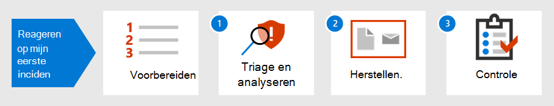

# Inleiding tot het reageren op uw eerste incidentIntroduction to responding to your first incident

[!INCLUDE [Microsoft 365 Defender rebranding](../includes/microsoft-defender.md)]

**Van toepassing op:****Applies to:**
- Microsoft 365 DefenderMicrosoft 365 Defender

De strategie voor incidentrespons van een organisatie bepaalt de mogelijkheid om te gaan met steeds meer storende beveiligingsincidenten en cybercriminaliteit.An organization's incident response strategy determines its ability to deal with increasingly disruptive security incidents and cybercrime. Hoewel het belangrijk is om preventieve maatregelen te nemen, kan de mogelijkheid om snel te handelen om gedetecteerde incidenten te beperken, uit te schakelen en te herstellen, schade en zakelijke verliezen minimaliseren.While taking preventative measures is important, the ability to act quickly to contain, eradicate, and recover from detected incidents can minimize damage and business losses.

In dit overzicht van incidentreacties ziet u hoe u, als onderdeel van een team voor beveiligingsbewerkingen, de meeste van de belangrijkste stappen voor het reageren op incidenten binnen Microsoft 365 Defender.This incident response walkthrough shows how you, as part of a security operations team, can perform most of the key incident response steps within Microsoft 365 Defender. Dit doet u als volgt:Here are the steps:

- Voorbereiding van uw beveiligingshoudingPreparation of your security posture
- Voor elk incident:For each incident:
  - Stap 1: Triage en analyseStep 1: Triage and analysis
  - Stap 2: Herstel (insluiting, uitbanning en herstel)Step 2: Remediation (containment, eradication, and recovery)
  - Stap 3: beoordeling na incidentStep 3: Post-incident review

Een beveiligingsincident wordt door het National Institute of Standards and Technology (NIST) gedefinieerd als 'een gebeurtenis die de vertrouwelijkheid, integriteit of beschikbaarheid van een informatiesysteem daadwerkelijk of mogelijk in gevaar brengt; of de informatie die het systeem verwerkt, op slaat of verzendt; of dat een schending of bedreiging vormt van schending van beveiligingsbeleid, beveiligingsprocedures of acceptabel gebruiksbeleid.A security incident is defined by National Institute of Standards and Technology (NIST) as "an occurrence that actually or potentially jeopardizes the confidentiality, integrity, or availability of an information system; or the information the system processes, stores, or transmits; or that constitutes a violation or imminent threat of violation of security policies, security procedures, or acceptable use policies."

Incidenten in Microsoft 365 Defender zijn de logische uitgangspunten voor analyse en incidentrespons.Incidents in Microsoft 365 Defender are the logical starting points for analysis and incident response. Het analyseren en herstellen van incidenten bestaat meestal uit de meeste taken van een beveiligingsteam.Analyzing and remediating incidents typically makes up most of a security operations team's tasks.

## Volgende stapNext step

Zorg ervoor dat uw organisatie en Microsoft 365 tenant voorbereid zijn [op incidentafhandeling.](first-incident-prepare.md)Make sure your organization and Microsoft 365 tenant is [prepared for incident handling](first-incident-prepare.md).

## Zie ookSee also

Incident response guidance for Microsoft 365 Defender:Incident response guidance for Microsoft 365 Defender:

- [Overzicht van incidentenIncidents overview](incidents-overview.md)
- [Incidenten onderzoekenInvestigate incidents](investigate-incidents.md)
- [Incidenten beherenManage incidents](manage-incidents.md)

Aanvullende voorbeelden van eerste incidentreacties:Additional examples of first incident responses:

- [Phishing-e-mailPhishing email](first-incident-path-phishing.md)
- [Identity-base attackIdentity-base attack](first-incident-path-identity.md)

[Gedetailleerde incidentrespons playbooksDetailed incident response playbooks](https://docs.microsoft.com/security/compass/incident-response-playbooks)

